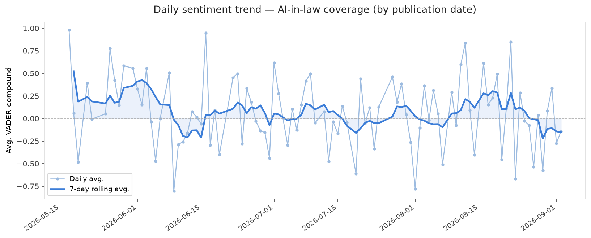
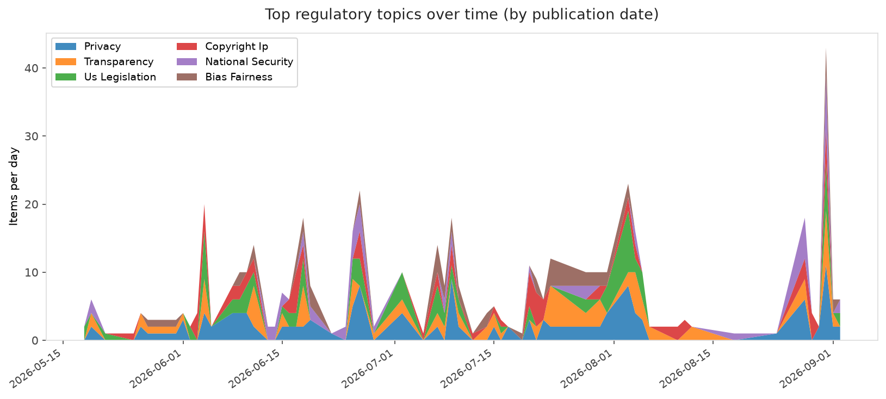
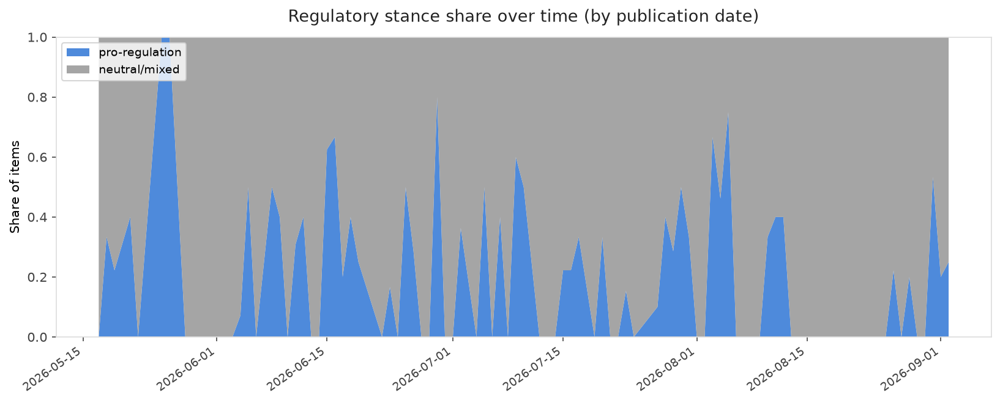

# AI in Law — Public Sentiment Analysis

> Automated daily tracking of public and academic sentiment toward AI regulation and law.
> Data collected from news outlets, arXiv, Reddit, and regulatory sources.
> Updated every day via GitHub Actions.

## Latest snapshot — 2026-09-02

| Metric | Value |
|--------|-------|
| Total items analyzed | 1,016 |
| Days with data       | 95 |
| Historical avg. VADER score | +0.2258 |
| Latest daily report  | [View report](reports/2026-09-02_report.md) |

## Trends Over Time

| Window | Items | Avg. sentiment |
|--------|-------|----------------|
| Last 7 days  | 82  | +0.030  |
| Last 30 days | 190 | +0.100 |
| All-time     | 622 | +0.066 |

**Most-discussed regulatory topics (last 30 days):** **Privacy** (39), **Transparency** (29), **Us Legislation** (24), **Copyright Ip** (20), **National Security** (19)

**Stance distribution (last 30 days):** Pro **27%** · Neutral **73%** · Anti **0%**





## Why this project?

Public opinion and academic discourse on AI regulation is evolving rapidly. This project
provides an open, reproducible dataset tracking sentiment across:

- 🗞️ **News**: Ars Technica, The Verge, MIT Tech Review, Wired, TechCrunch, LawFare, EFF, Brookings, Stanford HAI, AlgorithmWatch
- 📚 **Academic**: arXiv preprints on AI law and governance
- 💬 **Social**: Reddit (r/law, r/AIPolicy, r/MachineLearning, and others)
- 🏛️ **Regulatory**: Regulations.gov

## Data

- **Raw**: [`data/raw/`](data/raw/) — daily JSON snapshots
- **Processed**: [`data/processed/`](data/processed/) — enriched CSV with sentiment scores
- **Reports**: [`reports/`](reports/) — daily Markdown summaries + charts

## How to run locally

```bash
git clone https://github.com/Felipe-ML-Projects/AI-Law-Sentiment.git
cd AI-Law-Sentiment
pip install -r requirements.txt
python main.py
```

Optional environment variables for richer data:
```
REDDIT_CLIENT_ID=...
REDDIT_CLIENT_SECRET=...
REGULATIONS_API_KEY=...
LOOKBACK_DAYS=2          # how many days back to include (default 2)
```

## Techniques

- **VADER** — rule-based sentiment (fast, no GPU required)
- **FinBERT** — transformer-based sentiment (optional)
- **Topic tagging** — 12 AI-law sub-domains (bias, liability, privacy, etc.)
- **Stance detection** — pro/anti-regulation signal analysis
- **Word clouds** — discourse visualization
- **Date-aware filtering** — only items published in the look-back window are kept

## Citation

```
@misc{ai-law-sentiment,
  author = {Felipe-ML-Projects},
  title  = {AI in Law: Public Sentiment Analysis Dataset},
  year   = {2026},
  url    = {https://github.com/Felipe-ML-Projects/AI-Law-Sentiment}
}
```

## License

Data: [CC BY 4.0](https://creativecommons.org/licenses/by/4.0/) |
Code: [MIT](LICENSE)

---
_Updated automatically on 2026-09-02 15:01 UTC by GitHub Actions._
