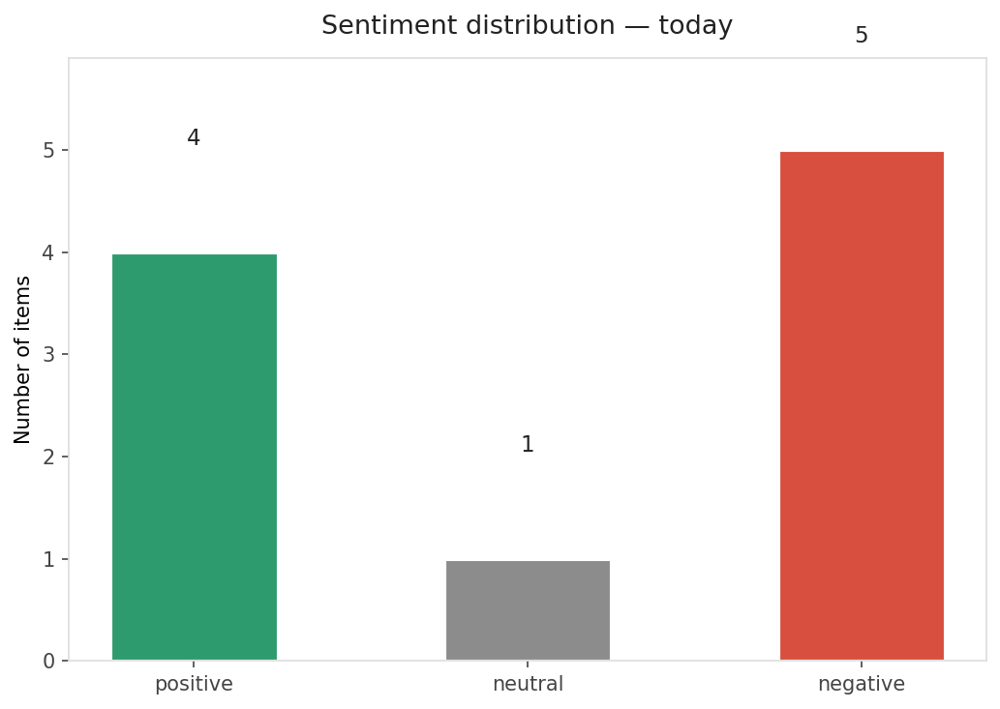
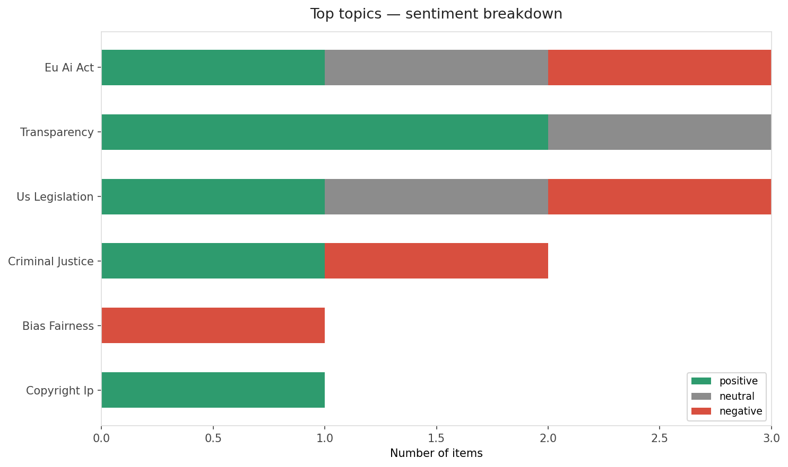
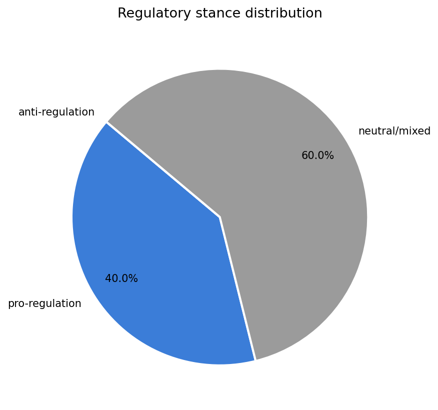
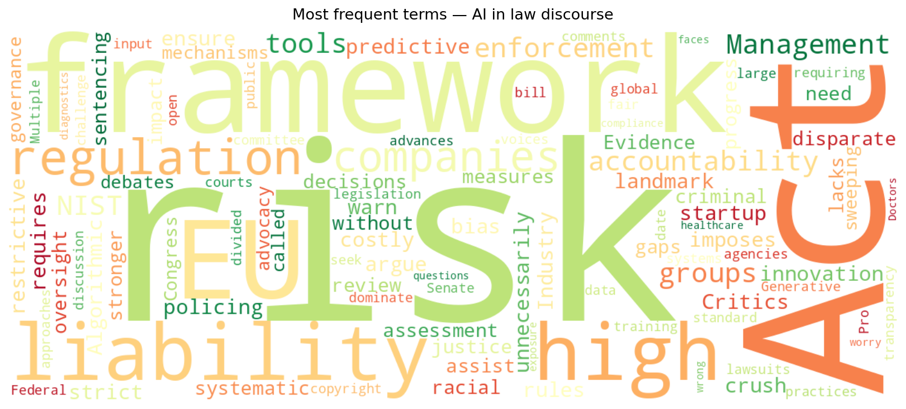

# AI in Law — Daily Sentiment Report
**Date:** 2026-05-11 | **Items analyzed:** 10 | **Overall:** 🔴 Mildly negative (-0.107)

---

## Summary

Today's collection covers **10** items from news outlets, academic preprints, Reddit, and regulatory sources.

| Metric | Value |
|--------|-------|
| Positive items | 4 (40.0%) |
| Neutral items  | 1 (10.0%) |
| Negative items | 5 (50.0%) |
| Avg. VADER compound | -0.1065 |
| Pro-regulation items | 4 |
| Anti-regulation items | 0 |

---

## Top Topics Today

- **Eu Ai Act** — 3 items
- **Transparency** — 3 items
- **Us Legislation** — 3 items
- **Criminal Justice** — 2 items
- **Bias Fairness** — 1 items

---

## Most Positive Coverage

- [Should AI assist in legal decisions without oversight?](https://example.com)  
  _Reddit/r/law_ — VADER: `+0.361`
- [Generative AI and copyright: courts divided on fair use](https://example.com)  
  _MIT Tech Review_ — VADER: `+0.250`
- [EU AI Act imposes strict liability on high-risk AI](https://example.com)  
  _Reuters Law_ — VADER: `+0.178`

---

## Most Critical / Negative Coverage

- [AI in healthcare faces liability questions](https://example.com)  
  _Wired_ — VADER: `-0.743`
- [Critics warn AI Act will crush startup innovation](https://example.com)  
  _Ars Technica_ — VADER: `-0.527`
- [Algorithmic bias in predictive policing: a systematic review](https://example.com)  
  _arXiv_ — VADER: `-0.361`

---

## Visualizations

---

## Methodology

- **VADER** (Valence Aware Dictionary and sEntiment Reasoner) — compound score in [-1, 1].
- **Topic tagging** — regex keyword matching across 12 AI-law sub-domains.
- **Stance detection** — keyword-based pro/anti-regulation signal detection.
- Sources: RSS news feeds, arXiv academic API, Reddit (PRAW), Regulations.gov API.

_Generated automatically on 2026-05-11 16:45 UTC._
