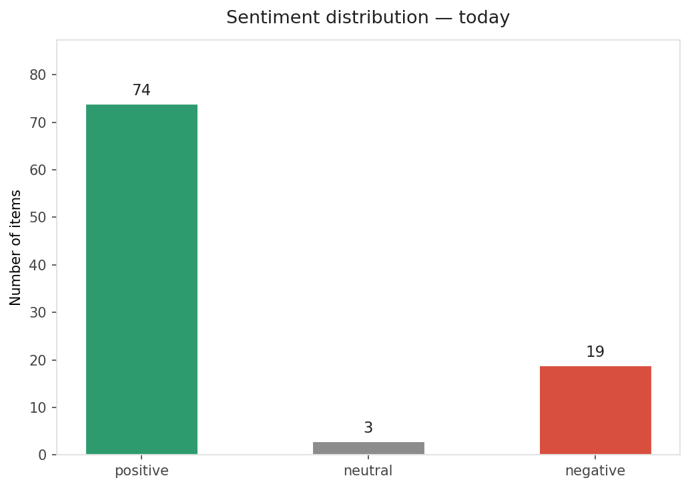
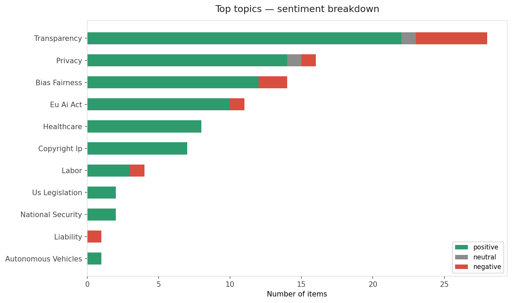
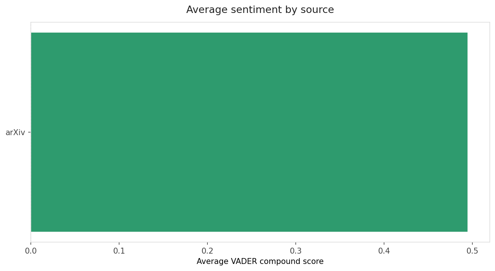
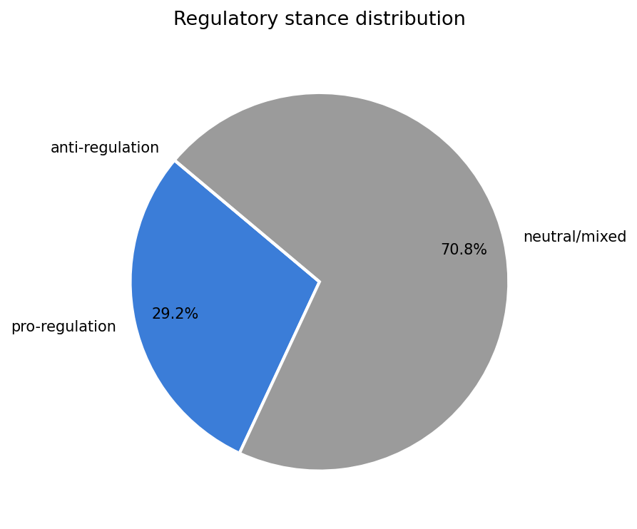
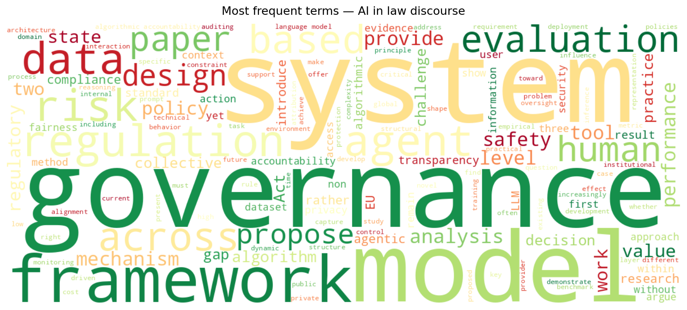
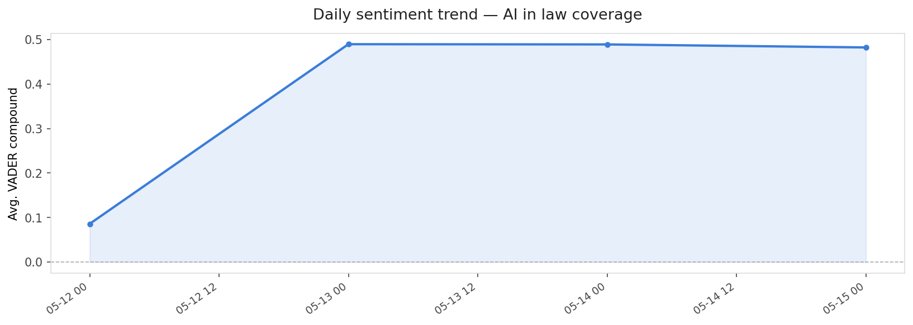

# AI in Law — Daily Sentiment Report
**Date:** 2026-05-15 | **Items analyzed:** 96 | **Overall:** 🟢 Mildly positive (+0.482)

---

## Summary

Today's collection covers **96** items from news outlets, academic preprints, Reddit, and regulatory sources.
Compared to the historical average of **0.483**, today's sentiment is ↓ **0.001** points lower.

| Metric | Value |
|--------|-------|
| Positive items | 74 (77.1%) |
| Neutral items  | 3 (3.1%) |
| Negative items | 19 (19.8%) |
| Avg. VADER compound | +0.4822 |
| Pro-regulation items | 28 |
| Anti-regulation items | 0 |

---

## Top Topics Today

- **Transparency** — 28 items
- **Privacy** — 16 items
- **Bias Fairness** — 14 items
- **Eu Ai Act** — 11 items
- **Healthcare** — 8 items

---

## Most Positive Coverage

- [Deciding how to respond: A deliberative framework to guide policymaker responses to AI systems](https://arxiv.org/abs/2508.03666v3)  
  _arXiv_ — VADER: `+0.986`
- [MAGIQ: A Post-Quantum Multi-Agentic AI Governance System with Provable Security](https://arxiv.org/abs/2605.06933v1)  
  _arXiv_ — VADER: `+0.985`
- [AI Governance under Political Turnover: The Alignment Surface of Compliance Design](https://arxiv.org/abs/2604.21103v1)  
  _arXiv_ — VADER: `+0.983`

---

## Most Critical / Negative Coverage

- [Who Governs the Machine? A Machine Identity Governance Taxonomy (MIGT) for AI Systems Operating Acro](https://arxiv.org/abs/2604.06148v1)  
  _arXiv_ — VADER: `-0.961`
- [Direct Collapse Pre-supermassive Black Hole Objects as Ly$α$ Emitters](https://arxiv.org/abs/2506.18993v2)  
  _arXiv_ — VADER: `-0.937`
- [Beyond Explanation: Evidentiary Rights for Algorithmic Accountability](https://arxiv.org/abs/2603.22716v1)  
  _arXiv_ — VADER: `-0.911`

---

## Visualizations

---

## Methodology

- **VADER** (Valence Aware Dictionary and sEntiment Reasoner) — compound score in [-1, 1].
- **Topic tagging** — regex keyword matching across 12 AI-law sub-domains.
- **Stance detection** — keyword-based pro/anti-regulation signal detection.
- Sources: RSS news feeds, arXiv academic API, Reddit (PRAW), Regulations.gov API.

_Generated automatically on 2026-05-15 10:35 UTC._
