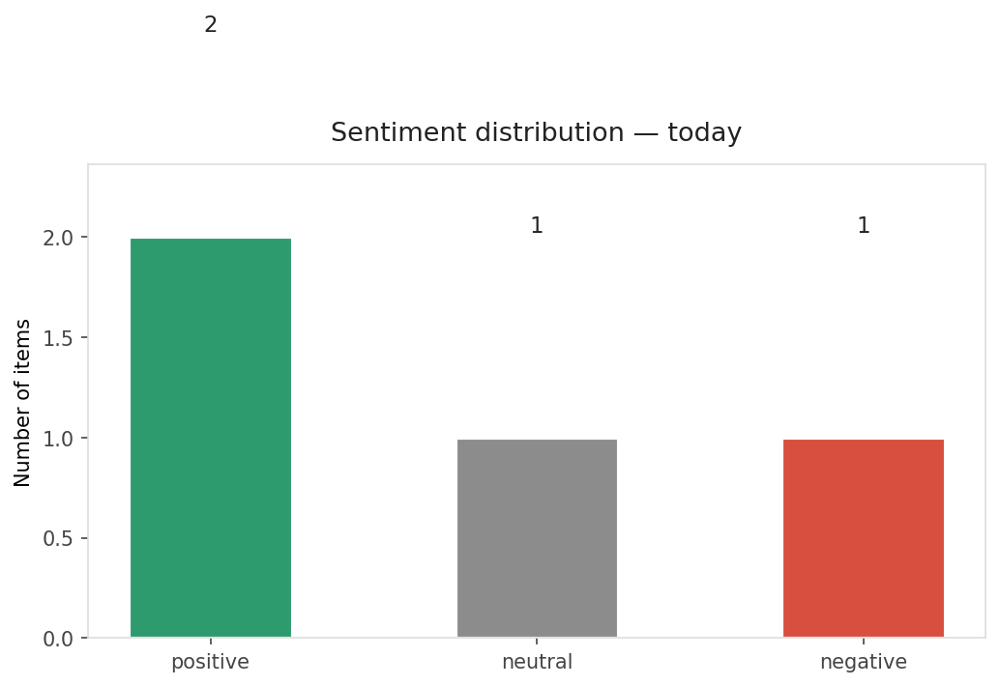
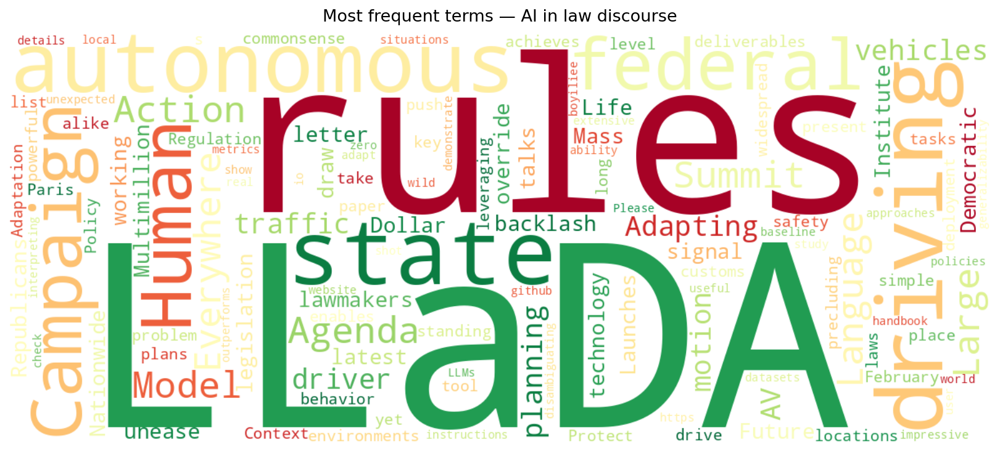
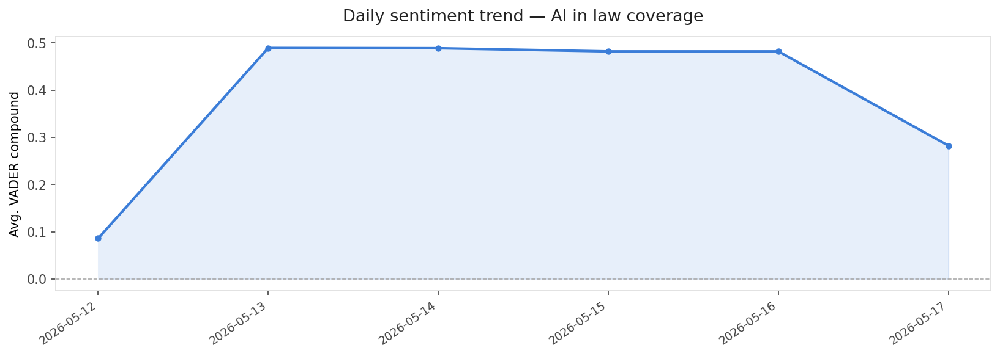

# AI in Law — Daily Sentiment Report
**Date:** 2026-05-17 | **Items analyzed:** 4 | **Overall:** 🟢 Mildly positive (+0.282)

---

## Summary

Today's collection covers **4** items from news outlets, academic preprints, Reddit, and regulatory sources.
Compared to the historical average of **0.481**, today's sentiment is ↓ **0.198** points lower.

| Metric | Value |
|--------|-------|
| Positive items | 2 (50.0%) |
| Neutral items  | 1 (25.0%) |
| Negative items | 1 (25.0%) |
| Avg. VADER compound | +0.2824 |
| Pro-regulation items | 0 |
| Anti-regulation items | 0 |

---

## Top Topics Today

_No strong topic signals detected today._

---

## Most Positive Coverage

- [Driving Everywhere with Large Language Model Policy Adaptation](https://arxiv.org/abs/2402.05932v2)  
  _arXiv_ — VADER: `+0.872`
- [Future of Life Institute Launches Multimillion Dollar Nationwide AI Regulation Campaign](https://futureoflife.org/press-release/fli-launches-multimillion-dollar-nationwide-ai-regulation-campaign/)  
  _Future of Life_ — VADER: `+0.660`
- [Context and Agenda for the 2025 AI Action Summit](https://futureoflife.org/ai-policy/context-and-agenda-2025-ai-action-summit/)  
  _Future of Life_ — VADER: `+0.000`

---

## Most Critical / Negative Coverage

- [AI talks draw backlash from Mass. state lawmakers](https://www.politico.com/news/2026/05/01/ai-backlash-massachusetts-lawmakers-00903440)  
  _POLITICO Tech_ — VADER: `-0.402`
- [Context and Agenda for the 2025 AI Action Summit](https://futureoflife.org/ai-policy/context-and-agenda-2025-ai-action-summit/)  
  _Future of Life_ — VADER: `+0.000`
- [Future of Life Institute Launches Multimillion Dollar Nationwide AI Regulation Campaign](https://futureoflife.org/press-release/fli-launches-multimillion-dollar-nationwide-ai-regulation-campaign/)  
  _Future of Life_ — VADER: `+0.660`

---

## Visualizations

---

## Methodology

- **VADER** (Valence Aware Dictionary and sEntiment Reasoner) — compound score in [-1, 1].
- **Topic tagging** — regex keyword matching across 12 AI-law sub-domains.
- **Stance detection** — keyword-based pro/anti-regulation signal detection.
- Sources: RSS news feeds, arXiv academic API, Reddit (PRAW), Regulations.gov API.

_Generated automatically on 2026-05-17 09:56 UTC._
