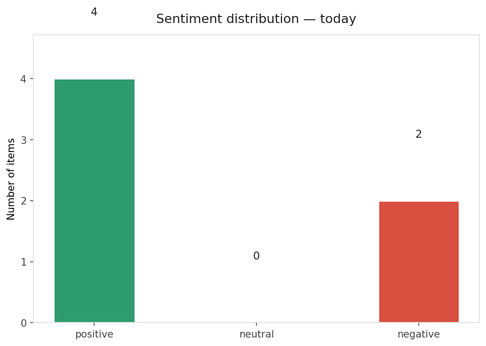
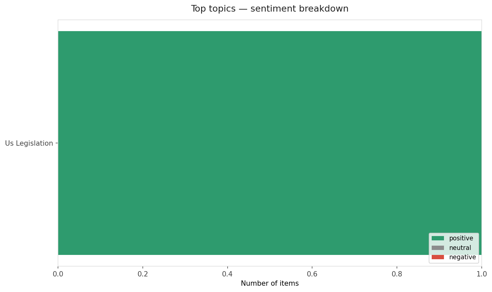
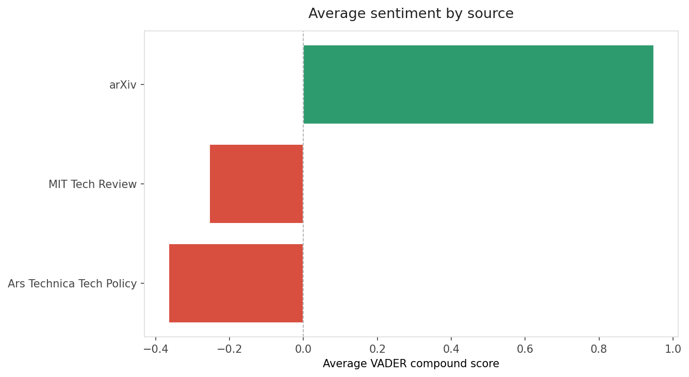
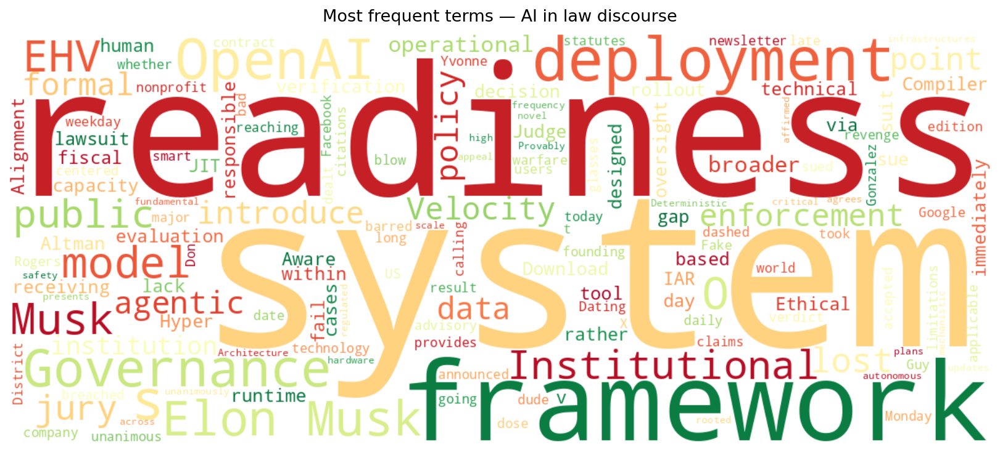
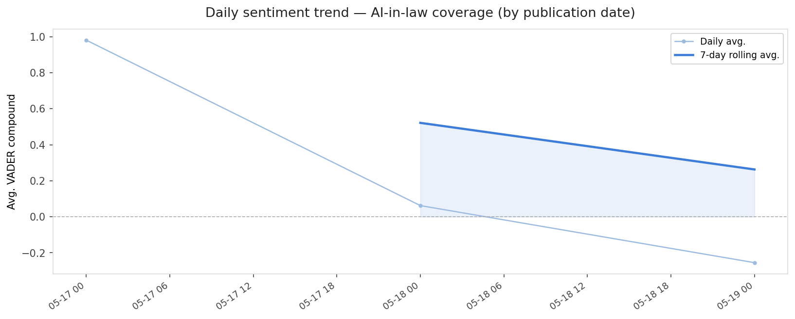
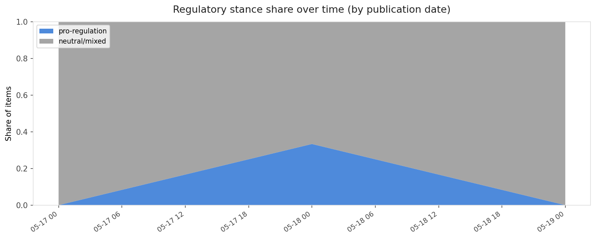

# AI in Law — Daily Sentiment Report
**Run date:** 2026-05-19 | **Items analyzed:** 6 | **Overall:** 🟢 Mildly positive (+0.110)

_Articles in this report were published between **2026-05-17** and **2026-05-19**._

---

## Summary

Today's collection covers **6** items from news outlets, academic preprints, Reddit, and regulatory sources.
Compared to the historical average of **+0.472**, today's sentiment is ↓ **0.362** points lower.

| Metric | Value |
|--------|-------|
| Positive items | 4 (66.7%) |
| Neutral items  | 0 (0.0%) |
| Negative items | 2 (33.3%) |
| Avg. VADER compound | +0.1096 |
| Pro-regulation items | 1 |
| Anti-regulation items | 0 |

---

## Top Topics Today

- **Us Legislation** — 1 items

---

## Most Positive Coverage

- [Beyond Model Readiness: Institutional Readiness for AI Deployment in Public Systems](https://arxiv.org/abs/2605.17203v1)  
  _arXiv_ — VADER: `+0.981`
- [Ethical Hyper-Velocity (EHV): A Provably Deterministic Governance-Aware JIT Compiler Architecture fo](https://arxiv.org/abs/2605.17909v1)  
  _arXiv_ — VADER: `+0.915`
- [Elon Musk took too long to sue OpenAI, jury unanimously agrees](https://arstechnica.com/tech-policy/2026/05/elon-musk-loses-trial-accusing-sam-altman-openai-of-stealing-a-charity/)  
  _Ars Technica Tech Policy_ — VADER: `+0.202`

---

## Most Critical / Negative Coverage

- [Legal fail: Don’t use AI to sue Facebook users for calling you a bad date](https://arstechnica.com/tech-policy/2026/05/legal-fail-dont-use-ai-to-sue-facebook-users-for-calling-you-a-bad-date/)  
  _Ars Technica Tech Policy_ — VADER: `-0.931`
- [The Download: Musk v. Altman, smart glasses for warfare, and Google I/O](https://www.technologyreview.com/2026/05/19/1137505/the-download-musk-altman-trial-smart-glasses-warfare-google-i-o/)  
  _MIT Tech Review_ — VADER: `-0.612`
- [Here’s why Elon Musk lost his suit against OpenAI](https://www.technologyreview.com/2026/05/18/1137488/elon-musk-suit-openai-verdict/)  
  _MIT Tech Review_ — VADER: `+0.103`

---

## Visualizations — Today

## Visualizations — Trends Over Time

---

## Methodology

- **VADER** (Valence Aware Dictionary and sEntiment Reasoner) — compound score in [-1, 1].
- **Topic tagging** — regex keyword matching across 12 AI-law sub-domains.
- **Stance detection** — keyword-based pro/anti-regulation signal detection.
- **Date filter** — items are kept only if their *publication* date falls within the look-back window (default 2 days).
- Sources: RSS news feeds, arXiv academic API, Reddit (PRAW), Regulations.gov API.

_Generated automatically on 2026-05-19 18:21 UTC._
