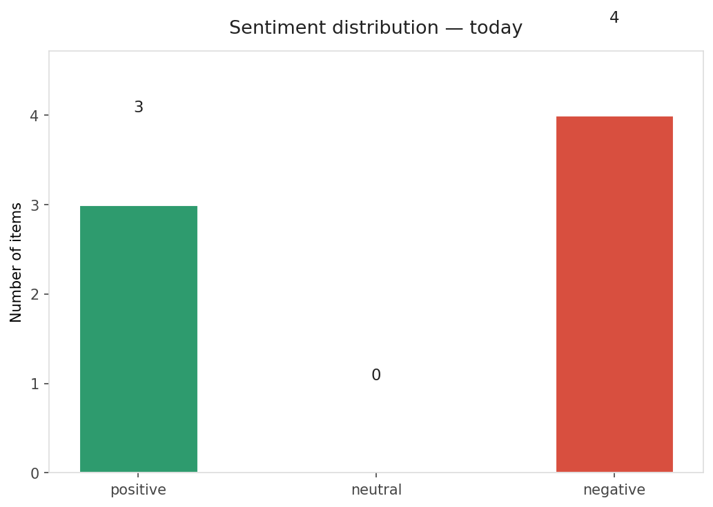
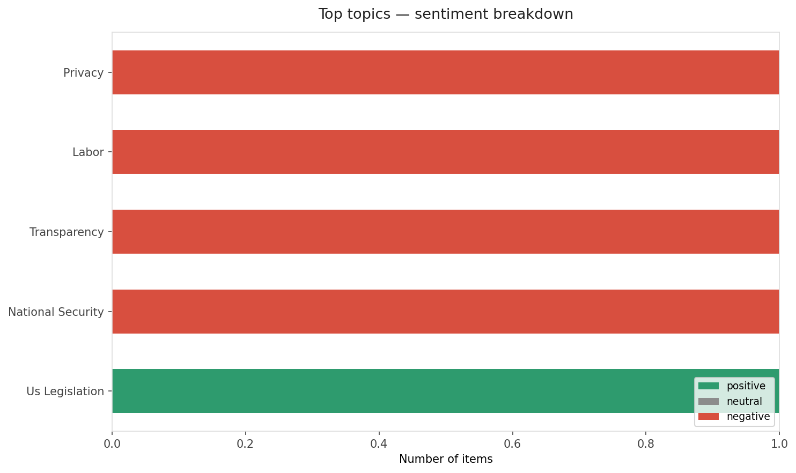
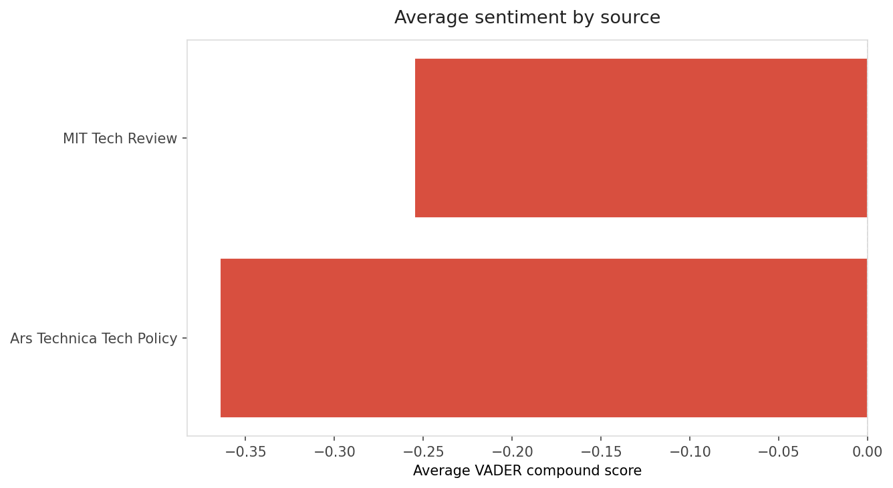
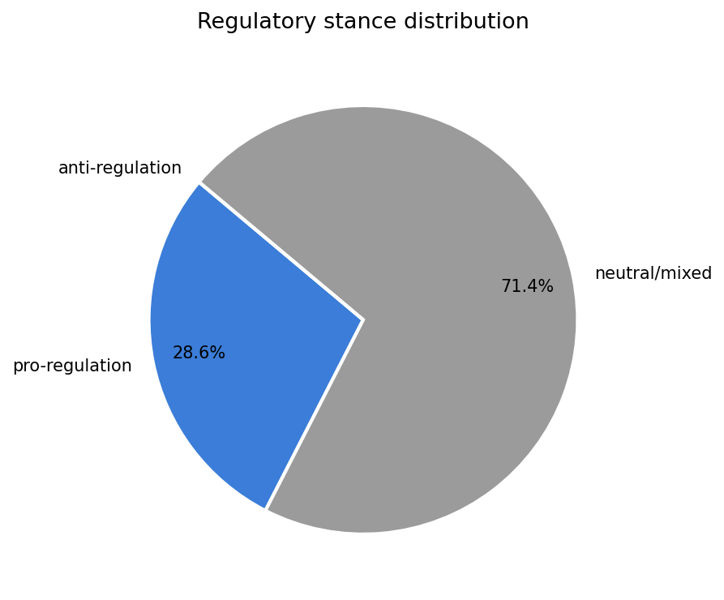
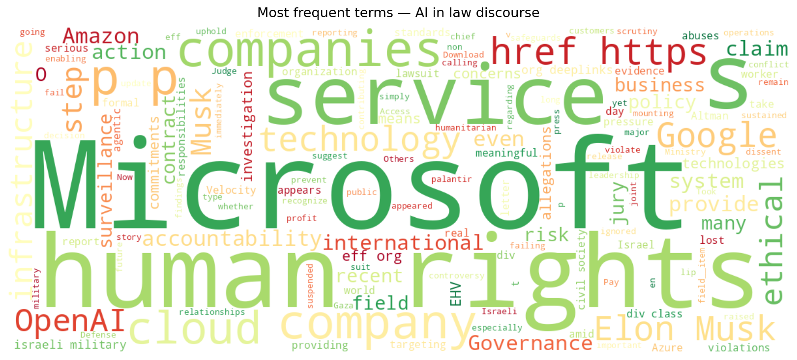
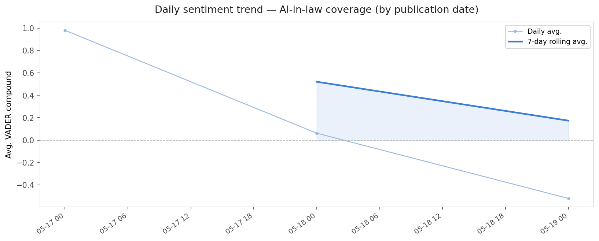
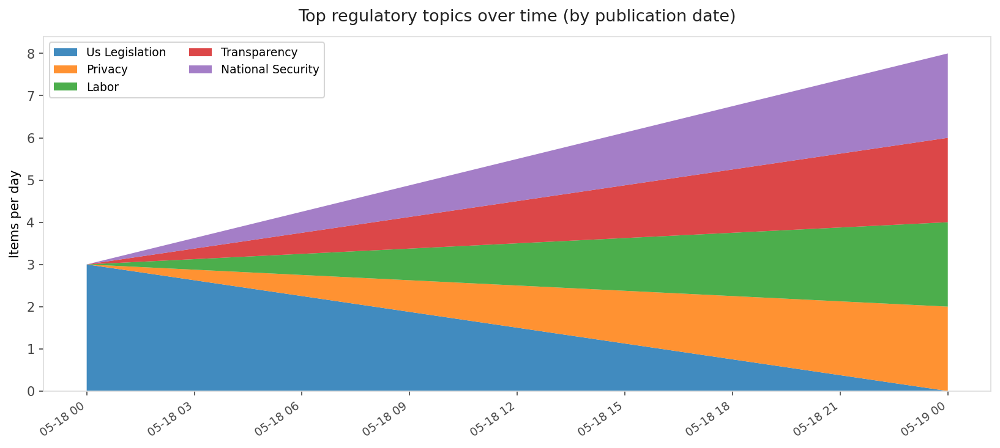
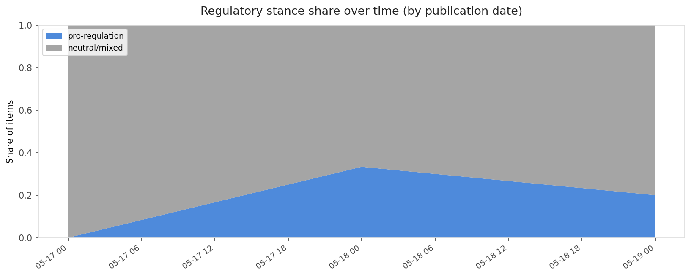

# AI in Law — Daily Sentiment Report
**Run date:** 2026-05-20 | **Items analyzed:** 7 | **Overall:** 🔴 Mildly negative (-0.309)

_Articles in this report were published between **2026-05-18** and **2026-05-19**._

---

## Summary

Today's collection covers **7** items from news outlets, academic preprints, Reddit, and regulatory sources.
Compared to the historical average of **+0.459**, today's sentiment is ↓ **0.768** points lower.

| Metric | Value |
|--------|-------|
| Positive items | 3 (42.9%) |
| Neutral items  | 0 (0.0%) |
| Negative items | 4 (57.1%) |
| Avg. VADER compound | -0.3089 |
| Pro-regulation items | 2 |
| Anti-regulation items | 0 |

---

## Top Topics Today

- **Privacy** — 1 items
- **Labor** — 1 items
- **Transparency** — 1 items
- **National Security** — 1 items
- **Us Legislation** — 1 items

---

## Most Positive Coverage

- [Ethical Hyper-Velocity (EHV): A Provably Deterministic Governance-Aware JIT Compiler Architecture fo](https://arxiv.org/abs/2605.17909v1)  
  _arXiv_ — VADER: `+0.915`
- [Elon Musk took too long to sue OpenAI, jury unanimously agrees](https://arstechnica.com/tech-policy/2026/05/elon-musk-loses-trial-accusing-sam-altman-openai-of-stealing-a-charity/)  
  _Ars Technica Tech Policy_ — VADER: `+0.202`
- [Here’s why Elon Musk lost his suit against OpenAI](https://www.technologyreview.com/2026/05/18/1137488/elon-musk-suit-openai-verdict/)  
  _MIT Tech Review_ — VADER: `+0.103`

---

## Most Critical / Negative Coverage

- [Microsoft Took a Step Toward Human Rights Accountability. Google and Amazon (and Others) Should Pay ](https://www.eff.org/deeplinks/2026/05/microsoft-took-step-toward-human-rights-accountability-google-and-amazon-and)  
  _EFF DeepLinks_ — VADER: `-0.972`
- [Legal fail: Don’t use AI to sue Facebook users for calling you a bad date](https://arstechnica.com/tech-policy/2026/05/legal-fail-dont-use-ai-to-sue-facebook-users-for-calling-you-a-bad-date/)  
  _Ars Technica Tech Policy_ — VADER: `-0.931`
- [Elon Musk said Sam Altman ‘stole’ a non-profit — but the trial showed he had similar aims](https://techcrunch.com/2026/05/19/elon-musk-said-sam-altman-stole-a-non-profit-but-the-trial-showed-he-had-similar-aims/)  
  _TechCrunch_ — VADER: `-0.867`

---

## Visualizations — Today

## Visualizations — Trends Over Time

---

## Methodology

- **VADER** (Valence Aware Dictionary and sEntiment Reasoner) — compound score in [-1, 1].
- **Topic tagging** — regex keyword matching across 12 AI-law sub-domains.
- **Stance detection** — keyword-based pro/anti-regulation signal detection.
- **Date filter** — items are kept only if their *publication* date falls within the look-back window (default 2 days).
- Sources: RSS news feeds, arXiv academic API, Reddit (PRAW), Regulations.gov API.

_Generated automatically on 2026-05-20 13:40 UTC._
