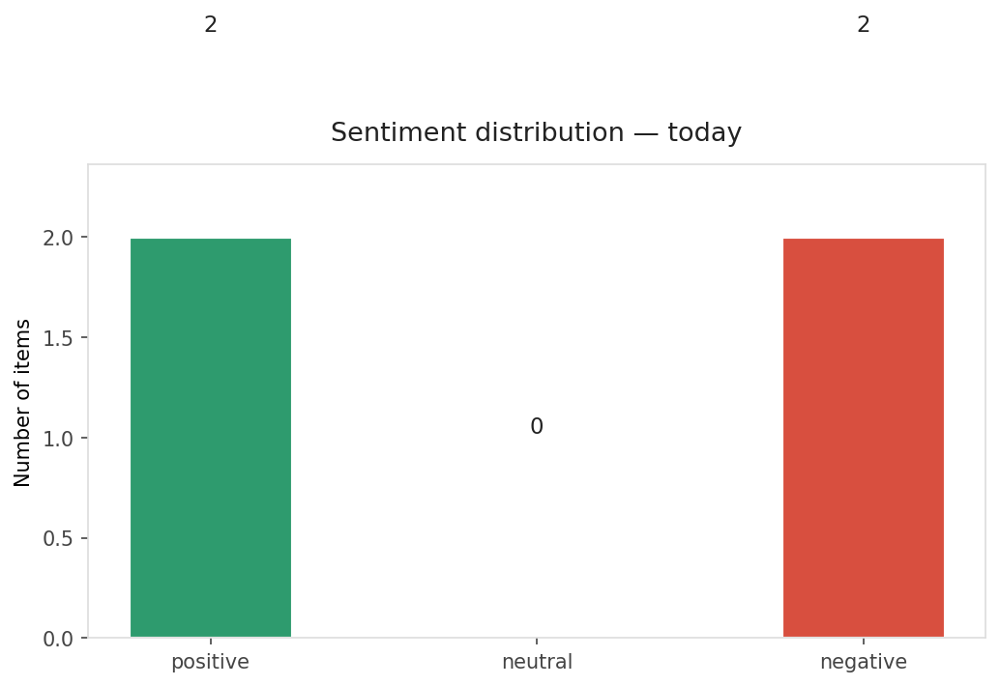
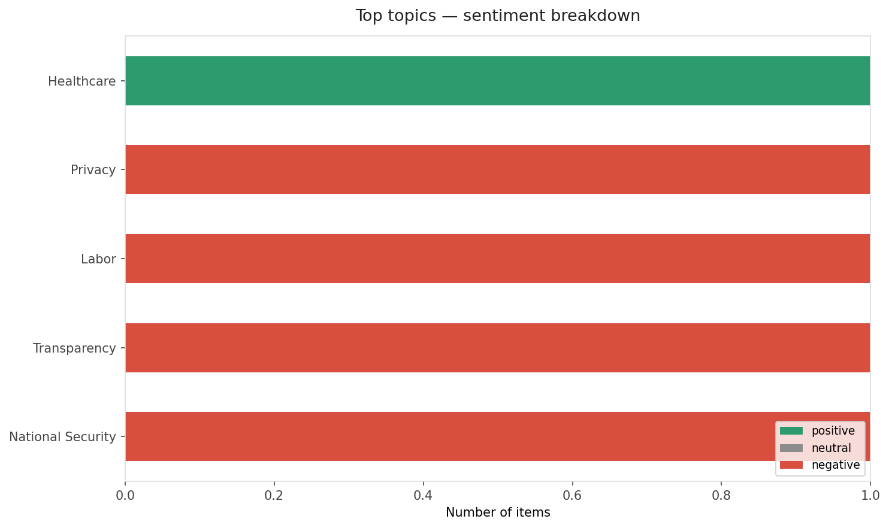
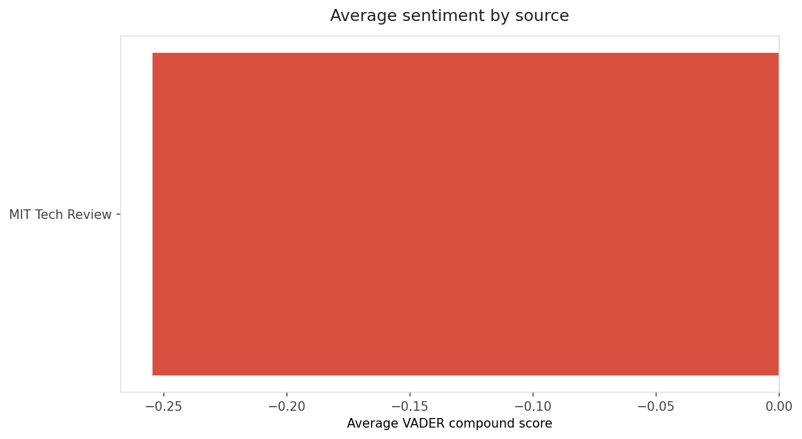
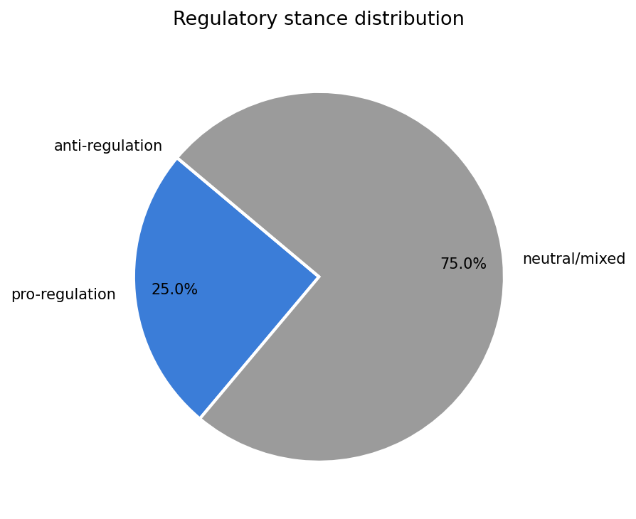
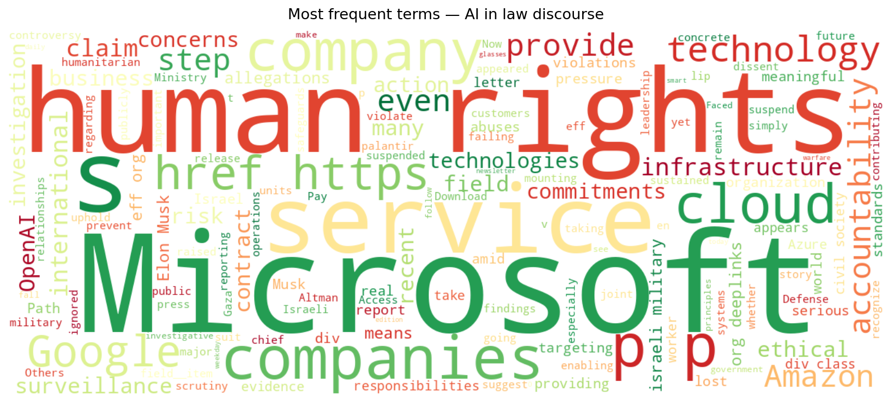
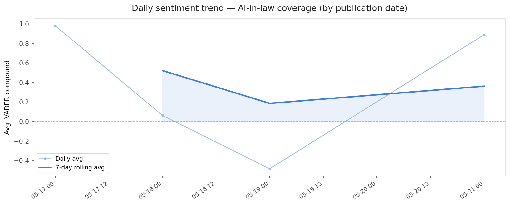
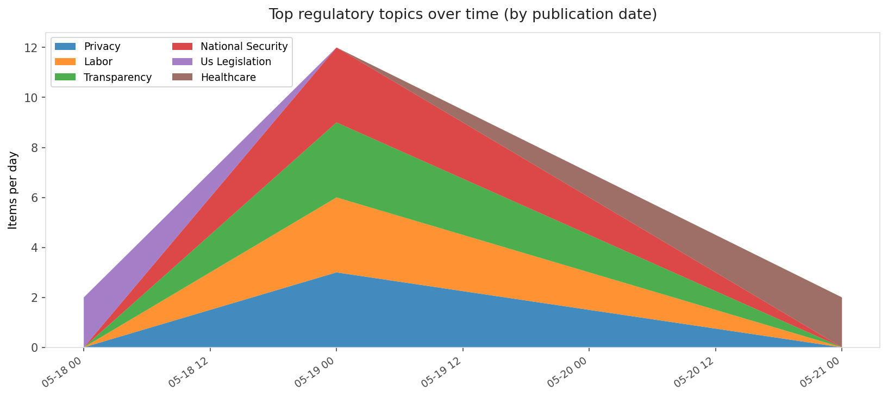
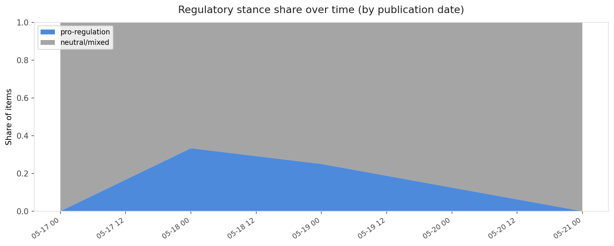

# AI in Law — Daily Sentiment Report
**Run date:** 2026-05-21 | **Items analyzed:** 4 | **Overall:** 🔴 Mildly negative (-0.148)

_Articles in this report were published between **2026-05-19** and **2026-05-21**._

---

## Summary

Today's collection covers **4** items from news outlets, academic preprints, Reddit, and regulatory sources.
Compared to the historical average of **+0.453**, today's sentiment is ↓ **0.601** points lower.

| Metric | Value |
|--------|-------|
| Positive items | 2 (50.0%) |
| Neutral items  | 0 (0.0%) |
| Negative items | 2 (50.0%) |
| Avg. VADER compound | -0.1482 |
| Pro-regulation items | 1 |
| Anti-regulation items | 0 |

---

## Top Topics Today

- **Healthcare** — 1 items
- **Privacy** — 1 items
- **Labor** — 1 items
- **Transparency** — 1 items
- **National Security** — 1 items

---

## Most Positive Coverage

- [The Path, founded by Tony Robbins and Calm alums, hopes to offer safer AI therapy](https://techcrunch.com/2026/05/21/the-path-founded-by-tony-robbins-and-calm-alums-wants-to-offer-safer-ai-therapy/)  
  _TechCrunch_ — VADER: `+0.888`
- [Here’s why Elon Musk lost his suit against OpenAI](https://www.technologyreview.com/2026/05/18/1137488/elon-musk-suit-openai-verdict/)  
  _MIT Tech Review_ — VADER: `+0.103`
- [The Download: Musk v. Altman, smart glasses for warfare, and Google I/O](https://www.technologyreview.com/2026/05/19/1137505/the-download-musk-altman-trial-smart-glasses-warfare-google-i-o/)  
  _MIT Tech Review_ — VADER: `-0.612`

---

## Most Critical / Negative Coverage

- [Microsoft Took a Step Toward Human Rights Accountability. Google and Amazon (and Others) Should Pay ](https://www.eff.org/deeplinks/2026/05/microsoft-took-step-toward-human-rights-accountability-google-and-amazon-and)  
  _EFF DeepLinks_ — VADER: `-0.972`
- [The Download: Musk v. Altman, smart glasses for warfare, and Google I/O](https://www.technologyreview.com/2026/05/19/1137505/the-download-musk-altman-trial-smart-glasses-warfare-google-i-o/)  
  _MIT Tech Review_ — VADER: `-0.612`
- [Here’s why Elon Musk lost his suit against OpenAI](https://www.technologyreview.com/2026/05/18/1137488/elon-musk-suit-openai-verdict/)  
  _MIT Tech Review_ — VADER: `+0.103`

---

## Visualizations — Today

## Visualizations — Trends Over Time

---

## Methodology

- **VADER** (Valence Aware Dictionary and sEntiment Reasoner) — compound score in [-1, 1].
- **Topic tagging** — regex keyword matching across 12 AI-law sub-domains.
- **Stance detection** — keyword-based pro/anti-regulation signal detection.
- **Date filter** — items are kept only if their *publication* date falls within the look-back window (default 2 days).
- Sources: RSS news feeds, arXiv academic API, Reddit (PRAW), Regulations.gov API.

_Generated automatically on 2026-05-21 14:18 UTC._
