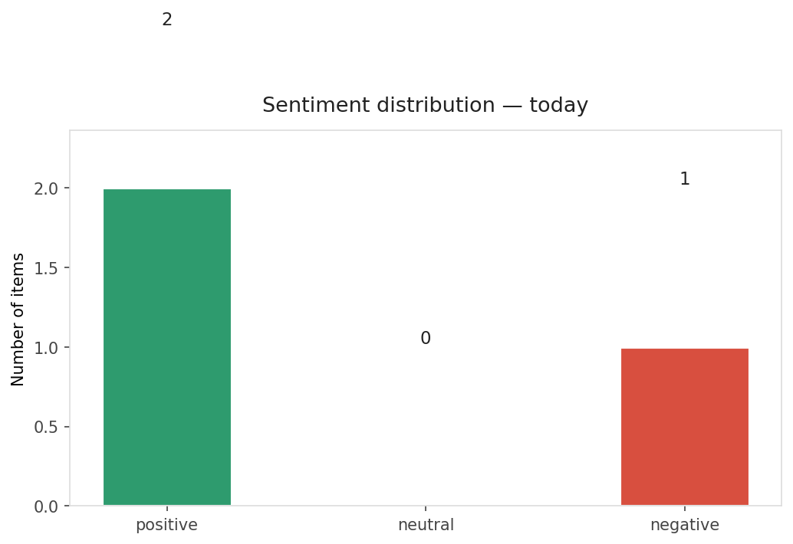
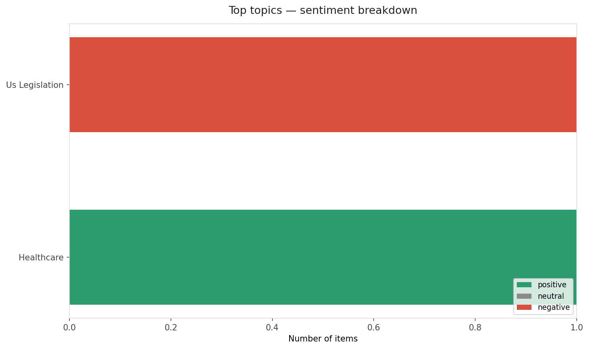
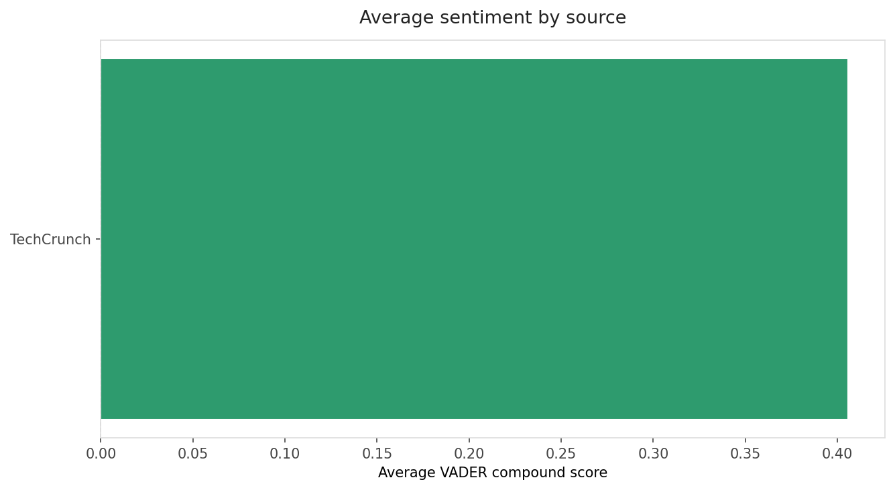
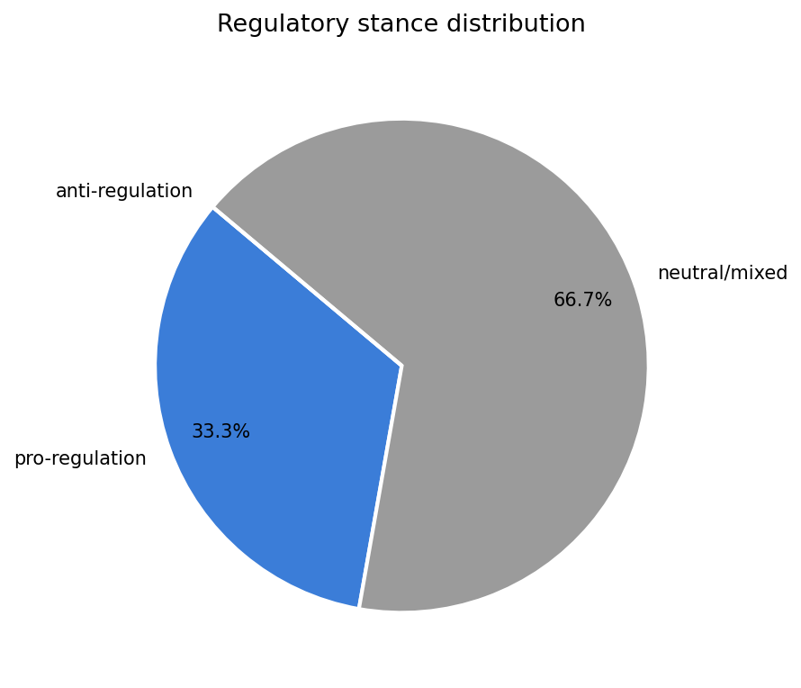
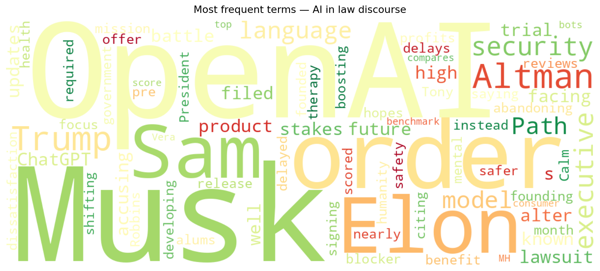
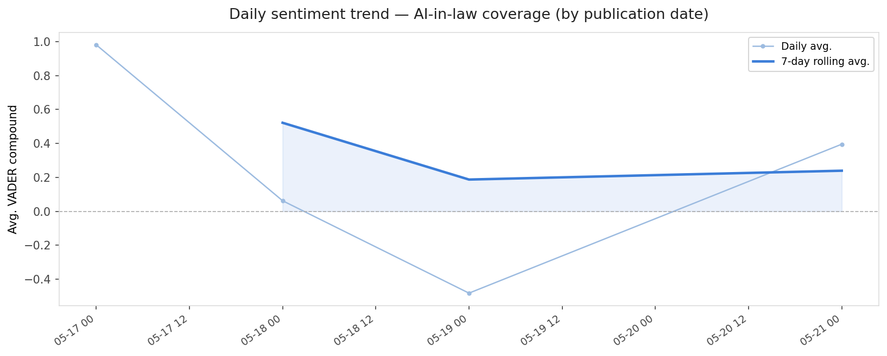
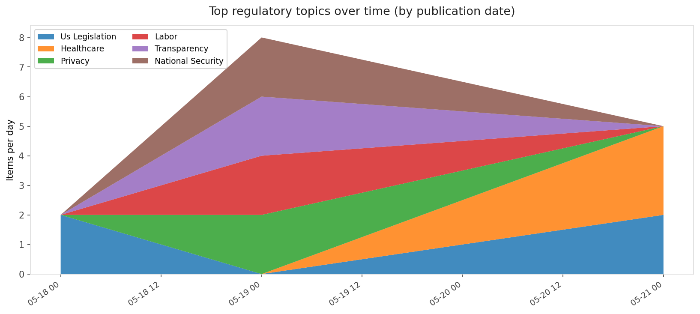
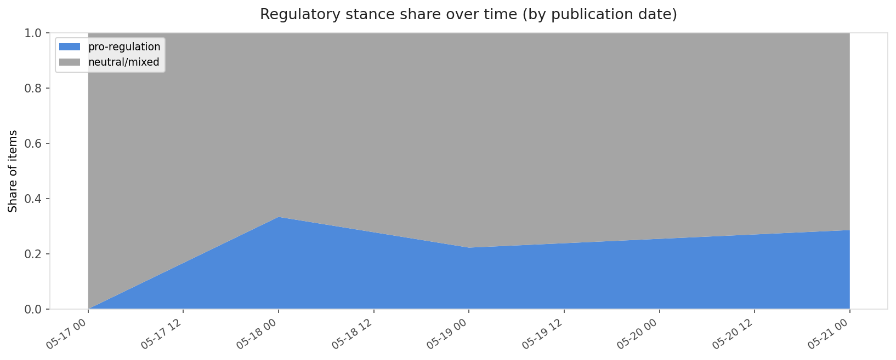

# AI in Law — Daily Sentiment Report
**Run date:** 2026-05-22 | **Items analyzed:** 3 | **Overall:** 🟢 Mildly positive (+0.313)

_Articles in this report were published between **2026-05-21** and **2026-05-21**._

---

## Summary

Today's collection covers **3** items from news outlets, academic preprints, Reddit, and regulatory sources.
Compared to the historical average of **+0.452**, today's sentiment is ↓ **0.139** points lower.

| Metric | Value |
|--------|-------|
| Positive items | 2 (66.7%) |
| Neutral items  | 0 (0.0%) |
| Negative items | 1 (33.3%) |
| Avg. VADER compound | +0.3131 |
| Pro-regulation items | 1 |
| Anti-regulation items | 0 |

---

## Top Topics Today

- **Us Legislation** — 1 items
- **Healthcare** — 1 items

---

## Most Positive Coverage

- [The Path, founded by Tony Robbins and Calm alums, hopes to offer safer AI therapy](https://techcrunch.com/2026/05/21/the-path-founded-by-tony-robbins-and-calm-alums-wants-to-offer-safer-ai-therapy/)  
  _TechCrunch_ — VADER: `+0.888`
- [All of the updates from Elon Musk and Sam Altman’s battle over OpenAI](https://www.theverge.com/tech/917225/sam-altman-elon-musk-openai-lawsuit)  
  _The Verge AI_ — VADER: `+0.128`
- [Trump delays AI security executive order, saying language ‘could have been a blocker’](https://techcrunch.com/2026/05/21/trump-delays-ai-security-executive-order-i-dont-want-to-get-in-the-way-of-that-leading/)  
  _TechCrunch_ — VADER: `-0.077`

---

## Most Critical / Negative Coverage

- [Trump delays AI security executive order, saying language ‘could have been a blocker’](https://techcrunch.com/2026/05/21/trump-delays-ai-security-executive-order-i-dont-want-to-get-in-the-way-of-that-leading/)  
  _TechCrunch_ — VADER: `-0.077`
- [All of the updates from Elon Musk and Sam Altman’s battle over OpenAI](https://www.theverge.com/tech/917225/sam-altman-elon-musk-openai-lawsuit)  
  _The Verge AI_ — VADER: `+0.128`
- [The Path, founded by Tony Robbins and Calm alums, hopes to offer safer AI therapy](https://techcrunch.com/2026/05/21/the-path-founded-by-tony-robbins-and-calm-alums-wants-to-offer-safer-ai-therapy/)  
  _TechCrunch_ — VADER: `+0.888`

---

## Visualizations — Today

## Visualizations — Trends Over Time

---

## Methodology

- **VADER** (Valence Aware Dictionary and sEntiment Reasoner) — compound score in [-1, 1].
- **Topic tagging** — regex keyword matching across 12 AI-law sub-domains.
- **Stance detection** — keyword-based pro/anti-regulation signal detection.
- **Date filter** — items are kept only if their *publication* date falls within the look-back window (default 2 days).
- Sources: RSS news feeds, arXiv academic API, Reddit (PRAW), Regulations.gov API.

_Generated automatically on 2026-05-22 13:34 UTC._
