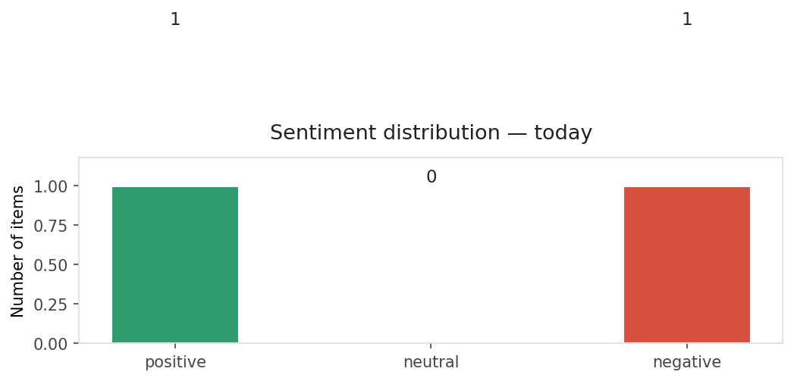
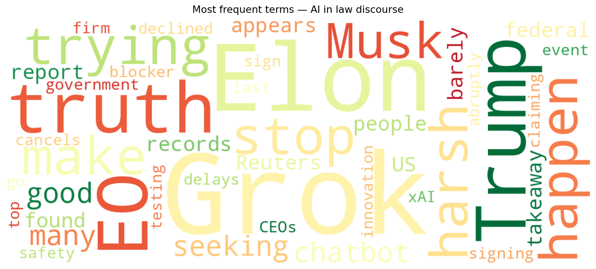
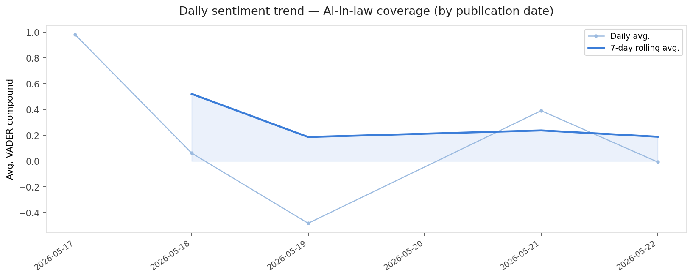
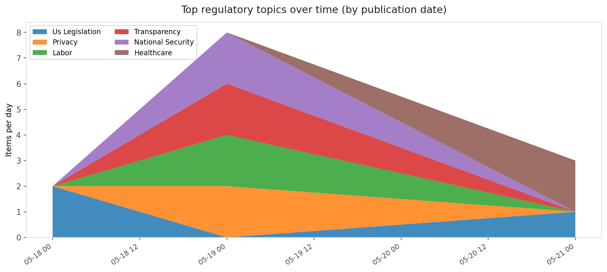
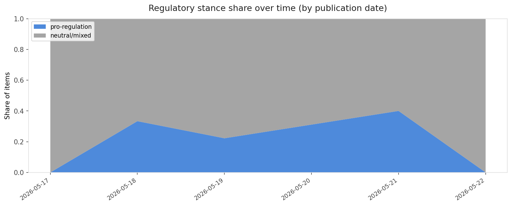

# AI in Law — Daily Sentiment Report
**Run date:** 2026-05-24 | **Items analyzed:** 2 | **Overall:** ⚪ Neutral / mixed (-0.007)

_Articles in this report were published between **2026-05-22** and **2026-05-22**._

---

## Summary

Today's collection covers **2** items from news outlets, academic preprints, Reddit, and regulatory sources.
Compared to the historical average of **+0.447**, today's sentiment is ↓ **0.453** points lower.

| Metric | Value |
|--------|-------|
| Positive items | 1 (50.0%) |
| Neutral items  | 0 (0.0%) |
| Negative items | 1 (50.0%) |
| Avg. VADER compound | -0.0068 |
| Pro-regulation items | 0 |
| Anti-regulation items | 0 |

---

## Top Topics Today

_No strong topic signals detected today._

---

## Most Positive Coverage

- [Trump abruptly cancels EO signing event after top AI firm CEOs declined to go](https://arstechnica.com/tech-policy/2026/05/trump-canceled-ai-safety-testing-eo-after-snub-from-tech-ceos/)  
  _Ars Technica Tech Policy_ — VADER: `+0.649`
- [Elon, stop trying to make Grok happen](https://www.theverge.com/ai-artificial-intelligence/936219/elon-stop-trying-to-make-grok-happen)  
  _The Verge AI_ — VADER: `-0.662`

---

## Most Critical / Negative Coverage

- [Elon, stop trying to make Grok happen](https://www.theverge.com/ai-artificial-intelligence/936219/elon-stop-trying-to-make-grok-happen)  
  _The Verge AI_ — VADER: `-0.662`
- [Trump abruptly cancels EO signing event after top AI firm CEOs declined to go](https://arstechnica.com/tech-policy/2026/05/trump-canceled-ai-safety-testing-eo-after-snub-from-tech-ceos/)  
  _Ars Technica Tech Policy_ — VADER: `+0.649`

---

## Visualizations — Today

## Visualizations — Trends Over Time

---

## Methodology

- **VADER** (Valence Aware Dictionary and sEntiment Reasoner) — compound score in [-1, 1].
- **Topic tagging** — regex keyword matching across 12 AI-law sub-domains.
- **Stance detection** — keyword-based pro/anti-regulation signal detection.
- **Date filter** — items are kept only if their *publication* date falls within the look-back window (default 2 days).
- Sources: RSS news feeds, arXiv academic API, Reddit (PRAW), Regulations.gov API.

_Generated automatically on 2026-05-24 12:02 UTC._
