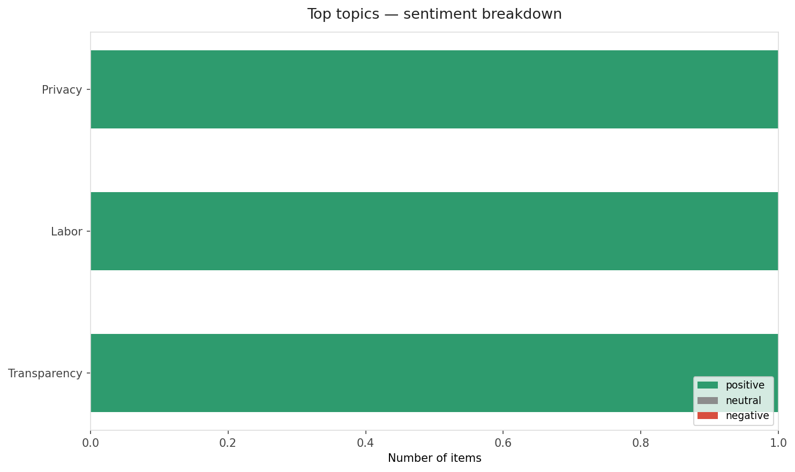
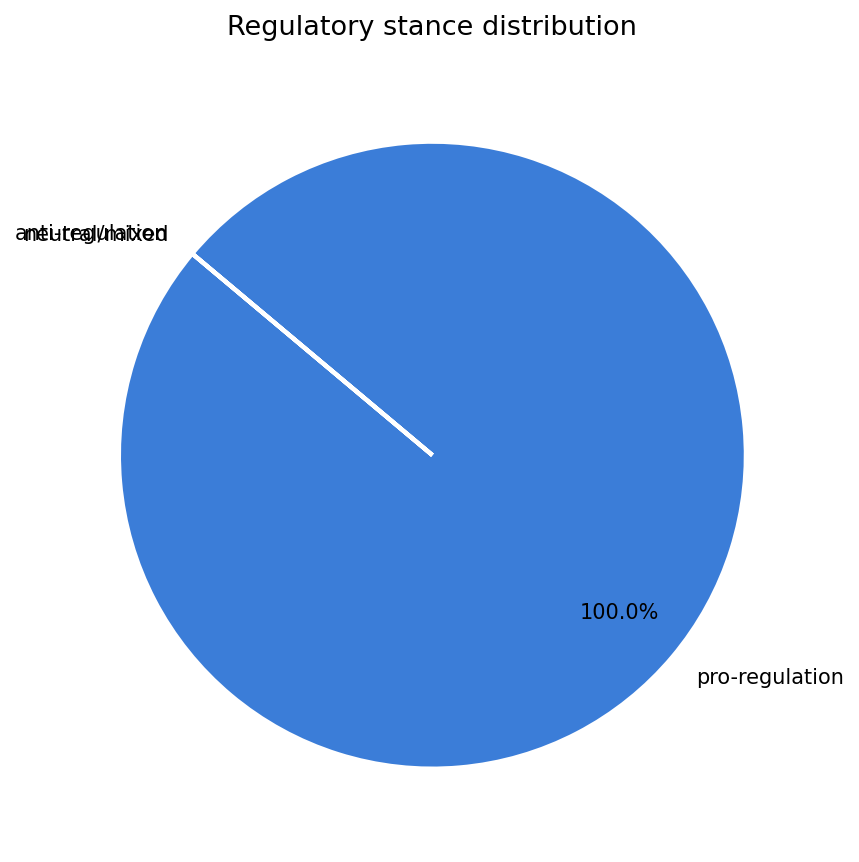
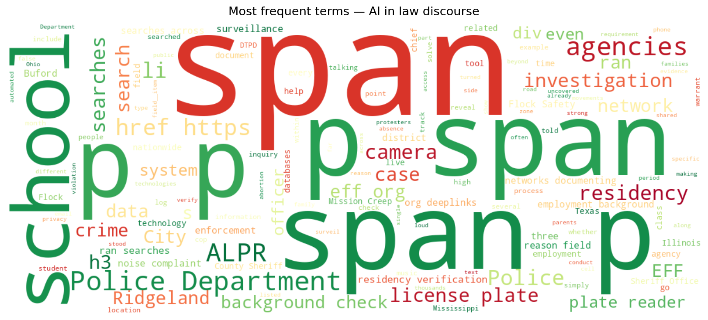
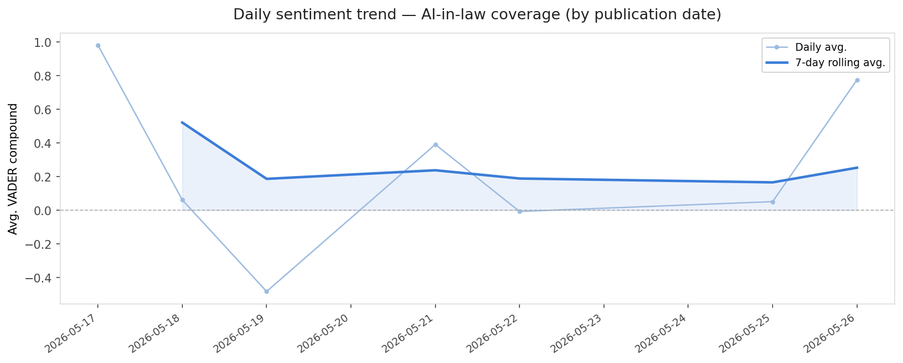
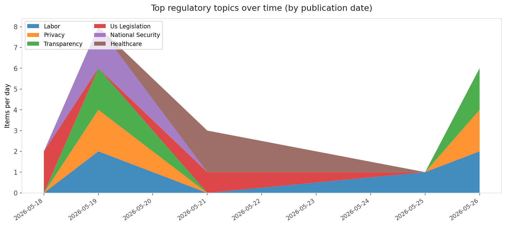
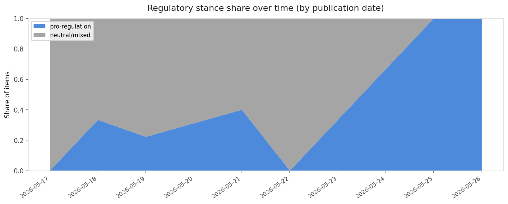

# AI in Law — Daily Sentiment Report
**Run date:** 2026-05-27 | **Items analyzed:** 1 | **Overall:** 🟢 Mildly positive (+0.775)

_Articles in this report were published between **2026-05-26** and **2026-05-26**._

---

## Summary

Today's collection covers **1** items from news outlets, academic preprints, Reddit, and regulatory sources.
Compared to the historical average of **+0.446**, today's sentiment is ↑ **0.329** points higher.

| Metric | Value |
|--------|-------|
| Positive items | 1 (100.0%) |
| Neutral items  | 0 (0.0%) |
| Negative items | 0 (0.0%) |
| Avg. VADER compound | +0.7750 |
| Pro-regulation items | 1 |
| Anti-regulation items | 0 |

---

## Top Topics Today

- **Privacy** — 1 items
- **Labor** — 1 items
- **Transparency** — 1 items

---

## Most Positive Coverage

- [More License Plate Reader Mission Creep: School Residency Verification, Background Checks, and Noise](https://www.eff.org/deeplinks/2026/05/more-license-plate-reader-mission-creep-school-residency-verification-background)  
  _EFF DeepLinks_ — VADER: `+0.775`

---

## Most Critical / Negative Coverage

- [More License Plate Reader Mission Creep: School Residency Verification, Background Checks, and Noise](https://www.eff.org/deeplinks/2026/05/more-license-plate-reader-mission-creep-school-residency-verification-background)  
  _EFF DeepLinks_ — VADER: `+0.775`

---

## Visualizations — Today

## Visualizations — Trends Over Time

---

## Methodology

- **VADER** (Valence Aware Dictionary and sEntiment Reasoner) — compound score in [-1, 1].
- **Topic tagging** — regex keyword matching across 12 AI-law sub-domains.
- **Stance detection** — keyword-based pro/anti-regulation signal detection.
- **Date filter** — items are kept only if their *publication* date falls within the look-back window (default 2 days).
- Sources: RSS news feeds, arXiv academic API, Reddit (PRAW), Regulations.gov API.

_Generated automatically on 2026-05-27 14:30 UTC._
