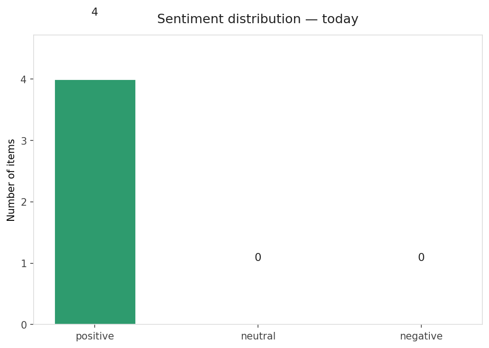
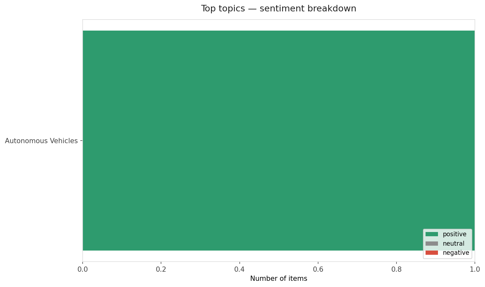
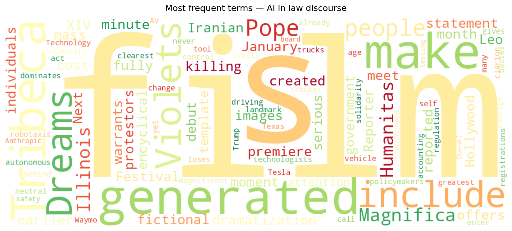
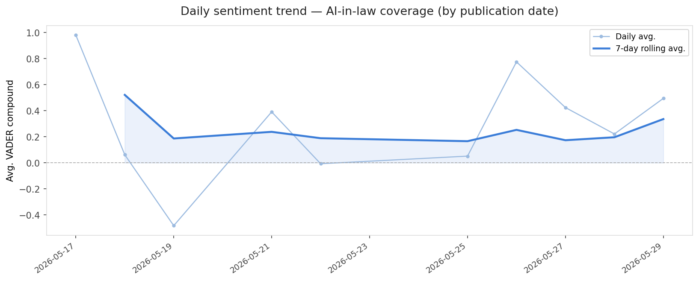
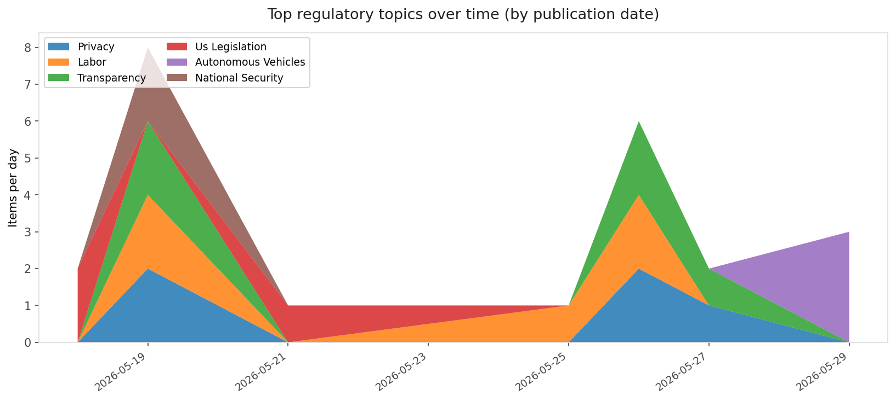
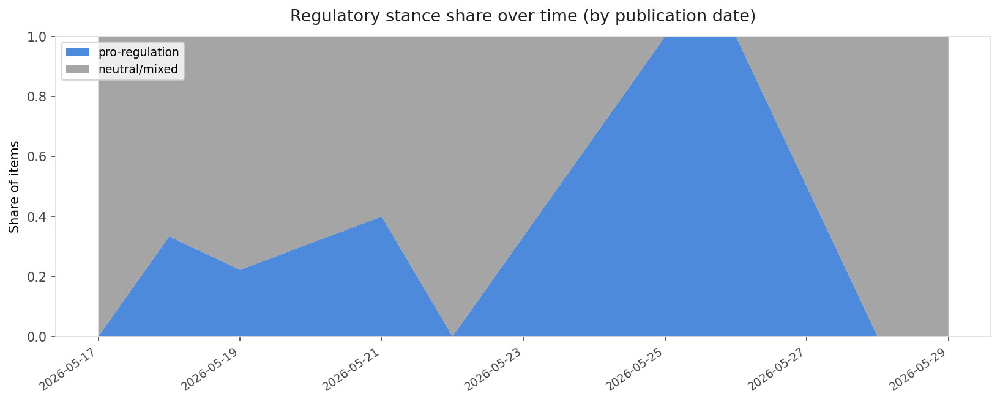

# AI in Law — Daily Sentiment Report
**Run date:** 2026-05-30 | **Items analyzed:** 4 | **Overall:** 🟢 Mildly positive (+0.465)

_Articles in this report were published between **2026-05-28** and **2026-05-29**._

---

## Summary

Today's collection covers **4** items from news outlets, academic preprints, Reddit, and regulatory sources.
Compared to the historical average of **+0.443**, today's sentiment is ↑ **0.022** points higher.

| Metric | Value |
|--------|-------|
| Positive items | 4 (100.0%) |
| Neutral items  | 0 (0.0%) |
| Negative items | 0 (0.0%) |
| Avg. VADER compound | +0.4654 |
| Pro-regulation items | 0 |
| Anti-regulation items | 0 |

---

## Top Topics Today

- **Autonomous Vehicles** — 1 items

---

## Most Positive Coverage

- [How the Pope’s Magnifica Humanitas offers a template for individuals to meet the AI moment](https://www.technologyreview.com/2026/05/29/1138107/how-the-popes-magnifica-humanitas-offers-a-template-for-individuals-to-meet-the-ai-moment/)  
  _MIT Tech Review_ — VADER: `+0.938`
- [A $2,000 AI-generated film will make its debut at Tribeca](https://www.theverge.com/entertainment/939067/ai-film-dreams-of-violets-tribeca)  
  _The Verge AI_ — VADER: `+0.670`
- [Trump loses more control over AI regulation as Illinois passes landmark law](https://arstechnica.com/tech-policy/2026/05/trump-loses-more-control-over-ai-regulation-as-illinois-passes-landmark-law/)  
  _Ars Technica Tech Policy_ — VADER: `+0.202`

---

## Most Critical / Negative Coverage

- [Waymo dominates autonomous vehicle registrations as Tesla trails behind](https://techcrunch.com/2026/05/28/waymo-dominates-texas-autonomous-vehicle-registrations-as-tesla-trails-behind/)  
  _TechCrunch_ — VADER: `+0.052`
- [Trump loses more control over AI regulation as Illinois passes landmark law](https://arstechnica.com/tech-policy/2026/05/trump-loses-more-control-over-ai-regulation-as-illinois-passes-landmark-law/)  
  _Ars Technica Tech Policy_ — VADER: `+0.202`
- [A $2,000 AI-generated film will make its debut at Tribeca](https://www.theverge.com/entertainment/939067/ai-film-dreams-of-violets-tribeca)  
  _The Verge AI_ — VADER: `+0.670`

---

## Visualizations — Today

## Visualizations — Trends Over Time

---

## Methodology

- **VADER** (Valence Aware Dictionary and sEntiment Reasoner) — compound score in [-1, 1].
- **Topic tagging** — regex keyword matching across 12 AI-law sub-domains.
- **Stance detection** — keyword-based pro/anti-regulation signal detection.
- **Date filter** — items are kept only if their *publication* date falls within the look-back window (default 2 days).
- Sources: RSS news feeds, arXiv academic API, Reddit (PRAW), Regulations.gov API.

_Generated automatically on 2026-05-30 12:07 UTC._
