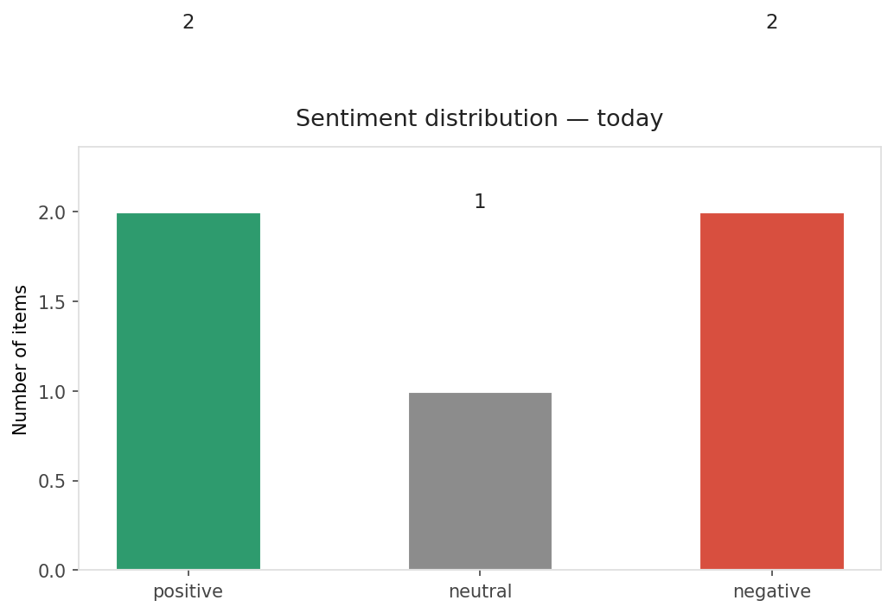
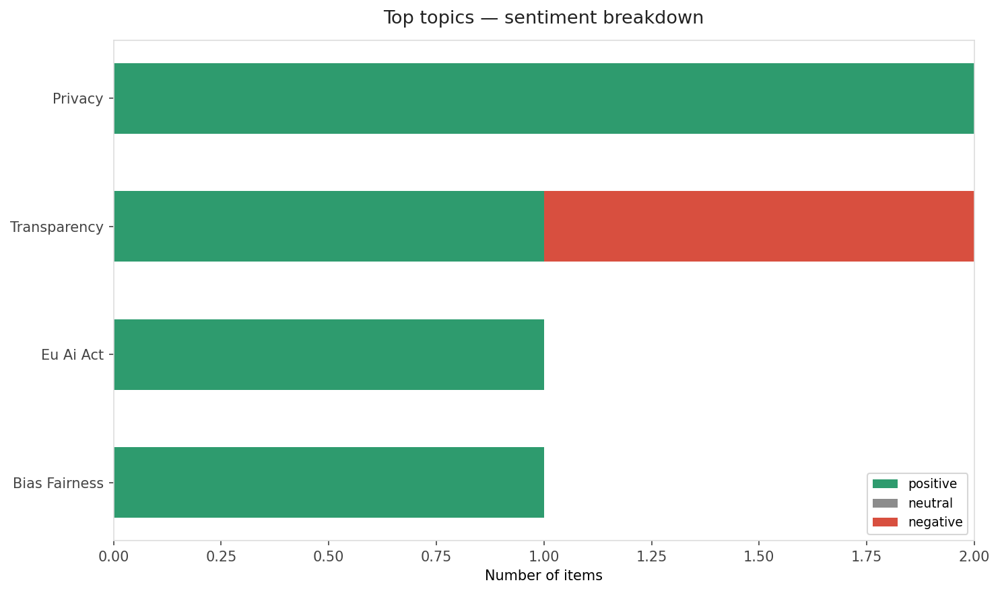
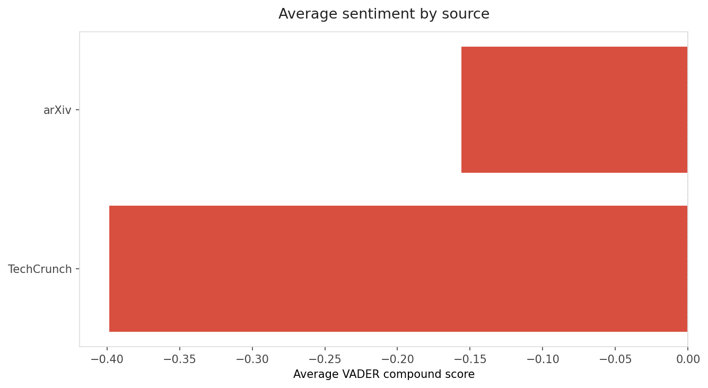
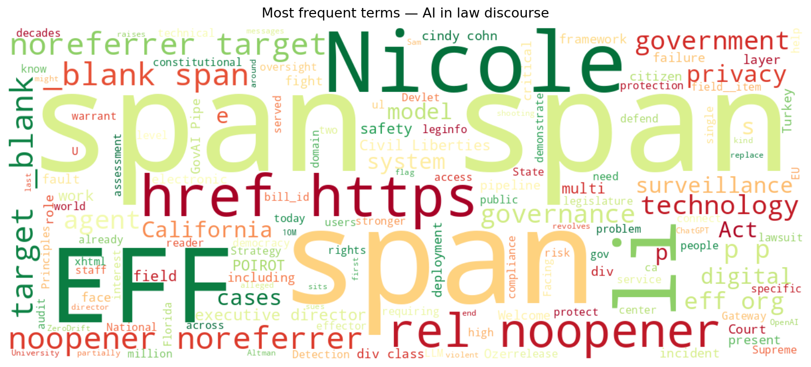
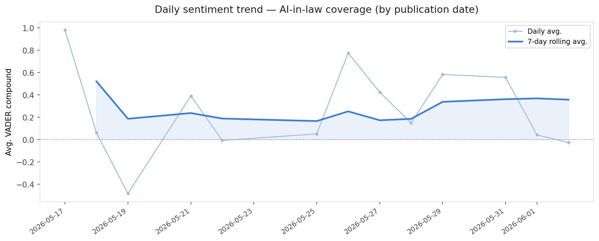
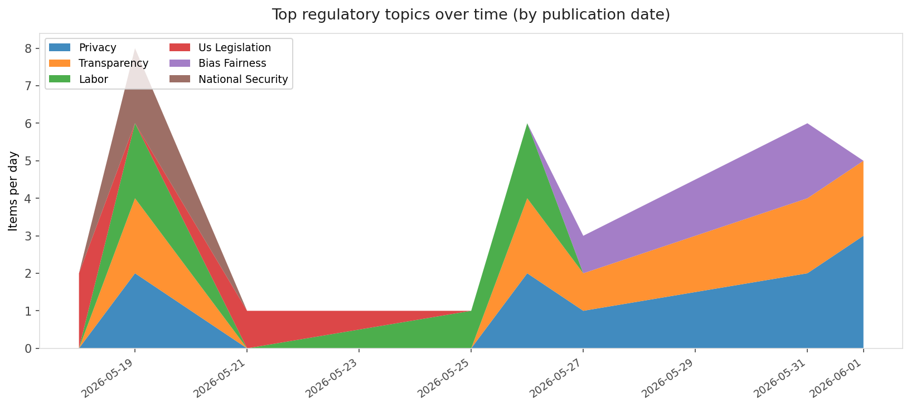
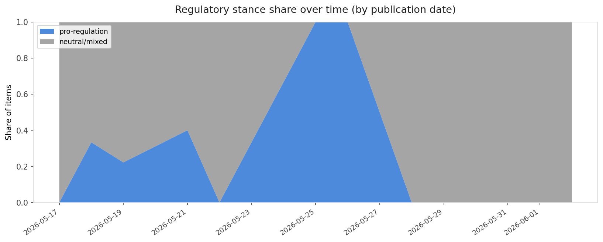

# AI in Law — Daily Sentiment Report
**Run date:** 2026-06-02 | **Items analyzed:** 5 | **Overall:** ⚪ Neutral / mixed (-0.023)

_Articles in this report were published between **2026-05-31** and **2026-06-02**._

---

## Summary

Today's collection covers **5** items from news outlets, academic preprints, Reddit, and regulatory sources.
Compared to the historical average of **+0.441**, today's sentiment is ↓ **0.464** points lower.

| Metric | Value |
|--------|-------|
| Positive items | 2 (40.0%) |
| Neutral items  | 1 (20.0%) |
| Negative items | 2 (40.0%) |
| Avg. VADER compound | -0.0231 |
| Pro-regulation items | 0 |
| Anti-regulation items | 0 |

---

## Top Topics Today

- **Privacy** — 2 items
- **Transparency** — 2 items
- **Eu Ai Act** — 1 items
- **Bias Fairness** — 1 items

---

## Most Positive Coverage

- [Welcome New EFF Executive Director Nicole Ozer](https://www.eff.org/deeplinks/2026/05/welcome-new-eff-executive-director-nicole-ozer)  
  _EFF DeepLinks_ — VADER: `+0.995`
- [GovAI-Pipe: A Layered AI Governance Pipeline for Citizen-Facing AI in Turkey's e-Government Gateway](https://arxiv.org/abs/2606.01417v1)  
  _arXiv_ — VADER: `+0.557`
- [ZeroDrift raises $10M to protect AI models from themselves](https://techcrunch.com/2026/06/02/zerodrift-raises-10-million-to-protect-ai-models-from-themselves/)  
  _TechCrunch_ — VADER: `-0.026`

---

## Most Critical / Negative Coverage

- [POIROT: Interrogating Agents for Failure Detection in Multi-Agent Systems](https://arxiv.org/abs/2606.02282v1)  
  _arXiv_ — VADER: `-0.870`
- [Florida sues OpenAI, Sam Altman, in first-of-its-kind lawsuit over violent incidents](https://techcrunch.com/2026/06/01/florida-sues-openai-sam-altman-in-first-of-its-kind-lawsuit-over-violent-incidents/)  
  _TechCrunch_ — VADER: `-0.772`
- [ZeroDrift raises $10M to protect AI models from themselves](https://techcrunch.com/2026/06/02/zerodrift-raises-10-million-to-protect-ai-models-from-themselves/)  
  _TechCrunch_ — VADER: `-0.026`

---

## Visualizations — Today

## Visualizations — Trends Over Time

---

## Methodology

- **VADER** (Valence Aware Dictionary and sEntiment Reasoner) — compound score in [-1, 1].
- **Topic tagging** — regex keyword matching across 12 AI-law sub-domains.
- **Stance detection** — keyword-based pro/anti-regulation signal detection.
- **Date filter** — items are kept only if their *publication* date falls within the look-back window (default 2 days).
- Sources: RSS news feeds, arXiv academic API, Reddit (PRAW), Regulations.gov API.

_Generated automatically on 2026-06-02 14:55 UTC._
