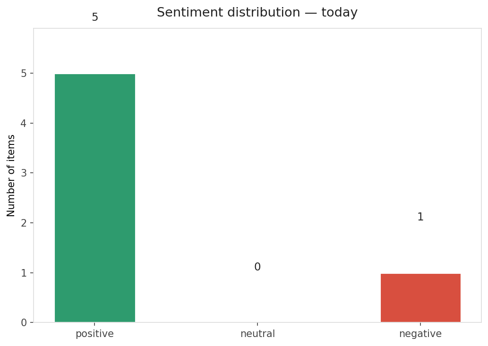
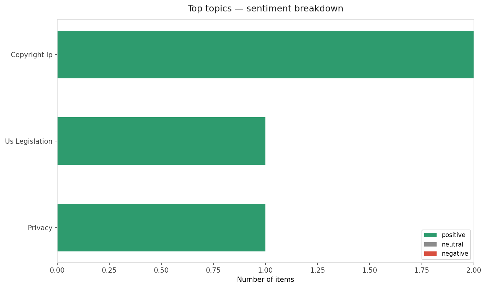
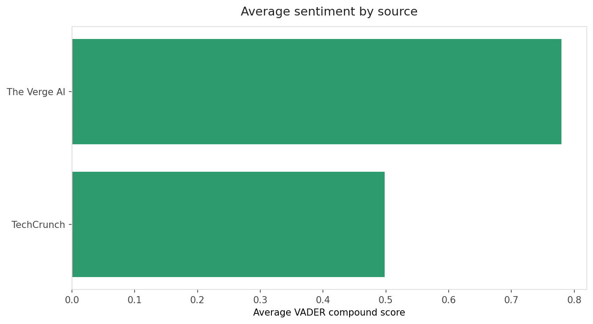
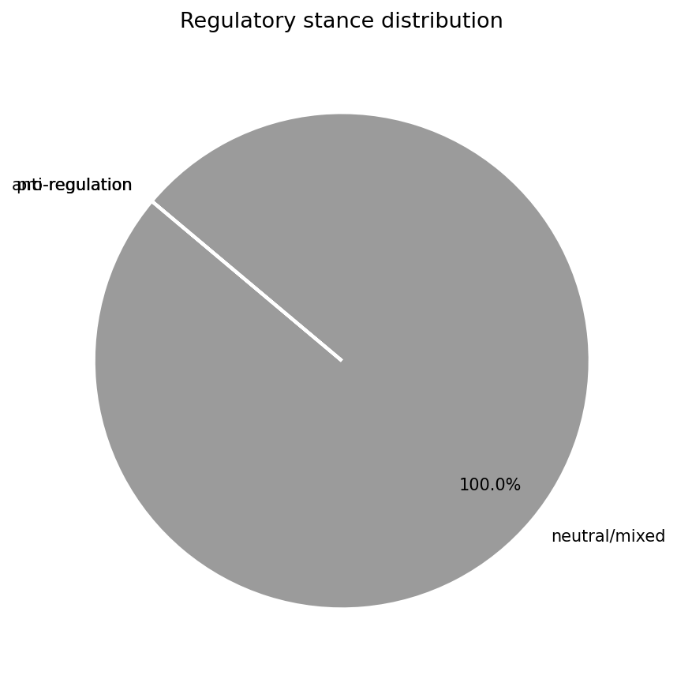
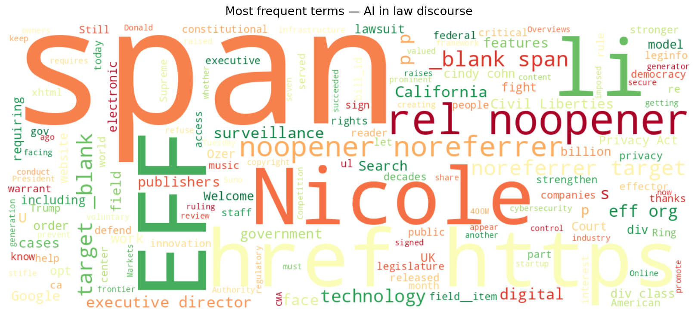
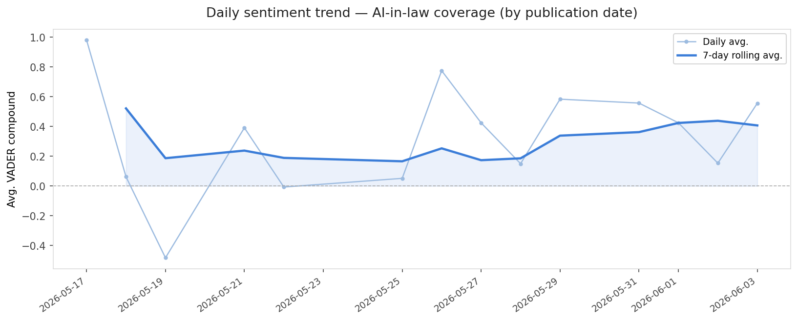
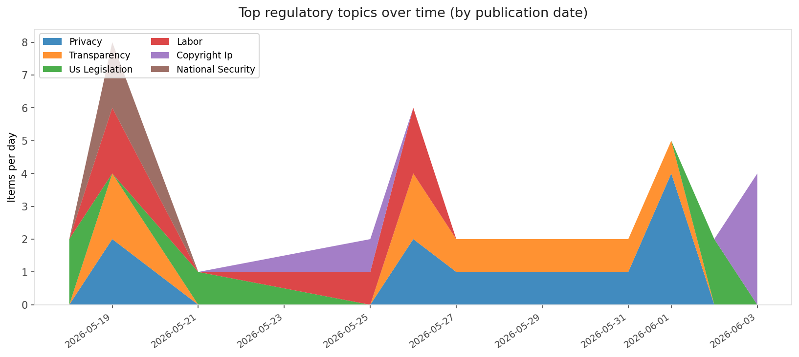
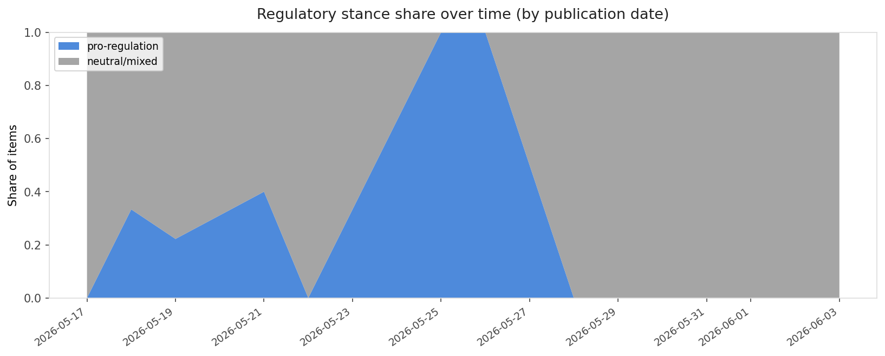

# AI in Law — Daily Sentiment Report
**Run date:** 2026-06-03 | **Items analyzed:** 6 | **Overall:** 🟢 Mildly positive (+0.510)

_Articles in this report were published between **2026-06-01** and **2026-06-03**._

---

## Summary

Today's collection covers **6** items from news outlets, academic preprints, Reddit, and regulatory sources.
Compared to the historical average of **+0.442**, today's sentiment is ↑ **0.068** points higher.

| Metric | Value |
|--------|-------|
| Positive items | 5 (83.3%) |
| Neutral items  | 0 (0.0%) |
| Negative items | 1 (16.7%) |
| Avg. VADER compound | +0.5100 |
| Pro-regulation items | 0 |
| Anti-regulation items | 0 |

---

## Top Topics Today

- **Copyright Ip** — 2 items
- **Us Legislation** — 1 items
- **Privacy** — 1 items

---

## Most Positive Coverage

- [Welcome New EFF Executive Director Nicole Ozer](https://www.eff.org/deeplinks/2026/05/welcome-new-eff-executive-director-nicole-ozer)  
  _EFF DeepLinks_ — VADER: `+0.995`
- [Trump signs executive order to review AI models before they’re released](https://www.theverge.com/policy/941775/trump-ai-executive-order)  
  _The Verge AI_ — VADER: `+0.891`
- [Google must let publishers opt out of AI Search features, rules UK](https://www.theverge.com/tech/942302/google-search-ai-overviews-uk-cma-publisher-opt-out)  
  _The Verge AI_ — VADER: `+0.670`

---

## Most Critical / Negative Coverage

- [Amazon-owned Ring should pay Americans for scanning their faces, lawsuit says](https://arstechnica.com/tech-policy/2026/06/amazon-owned-ring-should-pay-americans-for-scanning-their-faces-lawsuit-says/)  
  _Ars Technica Tech Policy_ — VADER: `-0.494`
- [Publishers will be able to opt out of AI Search, thanks to new regulation](https://techcrunch.com/2026/06/03/publishers-will-be-able-to-opt-out-of-ai-search-thanks-to-new-regulation/)  
  _TechCrunch_ — VADER: `+0.440`
- [Still facing copyright lawsuits, AI music generator Suno raises another $400M](https://techcrunch.com/2026/06/03/still-facing-copyright-lawsuits-ai-music-generator-suno-raises-another-400m/)  
  _TechCrunch_ — VADER: `+0.557`

---

## Visualizations — Today

## Visualizations — Trends Over Time

---

## Methodology

- **VADER** (Valence Aware Dictionary and sEntiment Reasoner) — compound score in [-1, 1].
- **Topic tagging** — regex keyword matching across 12 AI-law sub-domains.
- **Stance detection** — keyword-based pro/anti-regulation signal detection.
- **Date filter** — items are kept only if their *publication* date falls within the look-back window (default 2 days).
- Sources: RSS news feeds, arXiv academic API, Reddit (PRAW), Regulations.gov API.

_Generated automatically on 2026-06-03 15:40 UTC._
