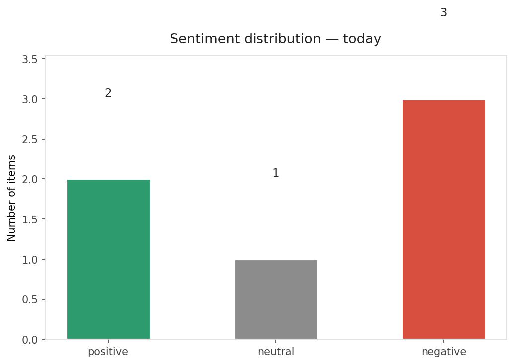
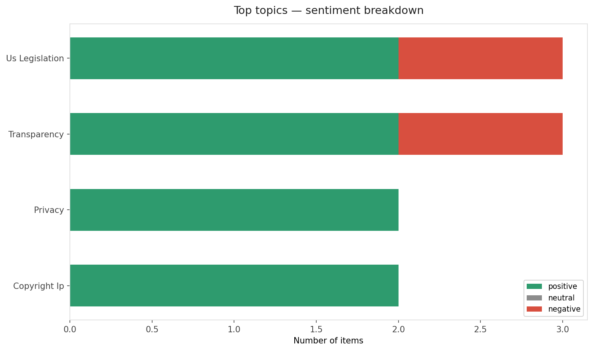
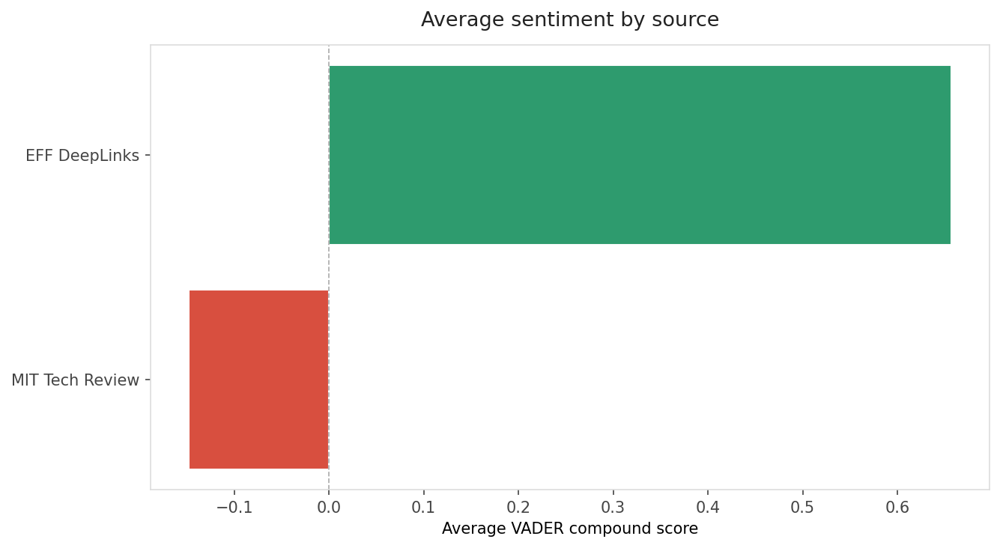
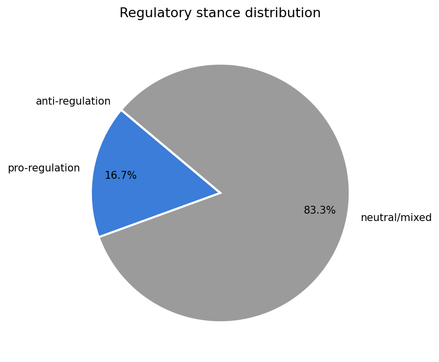
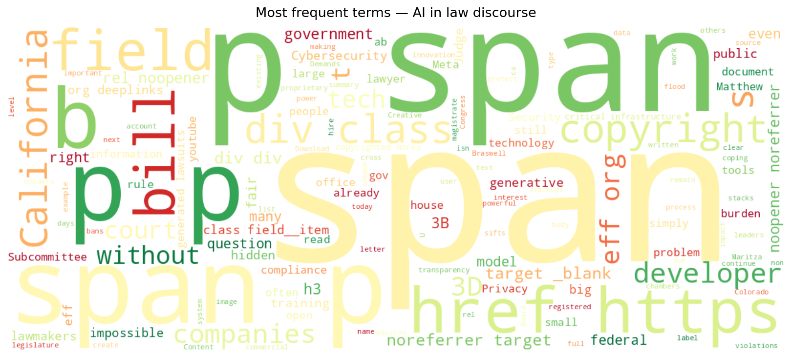
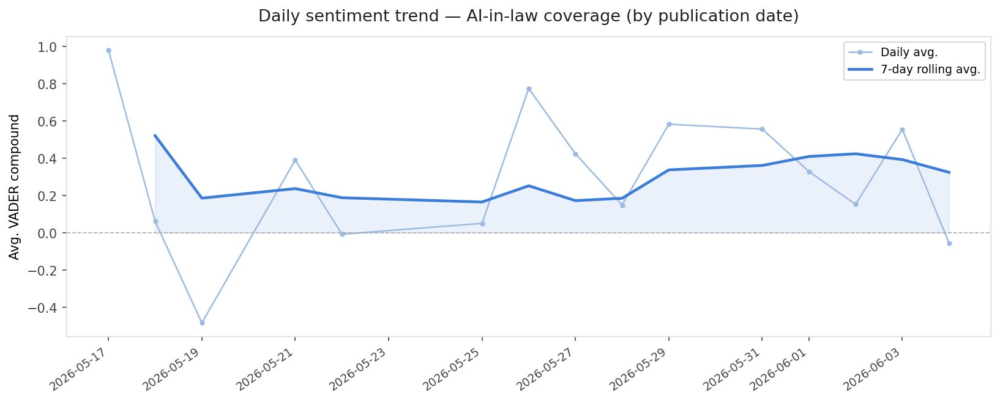
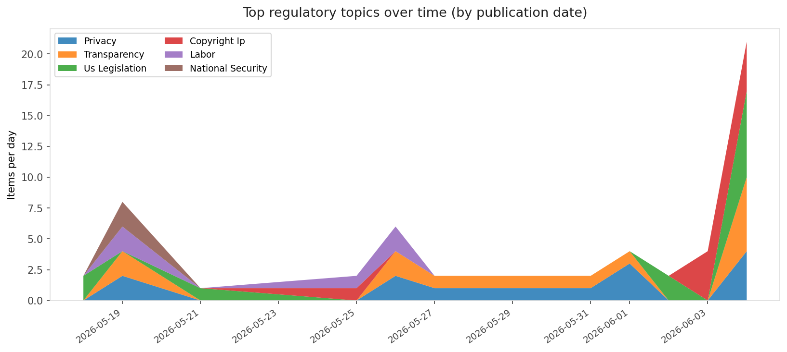
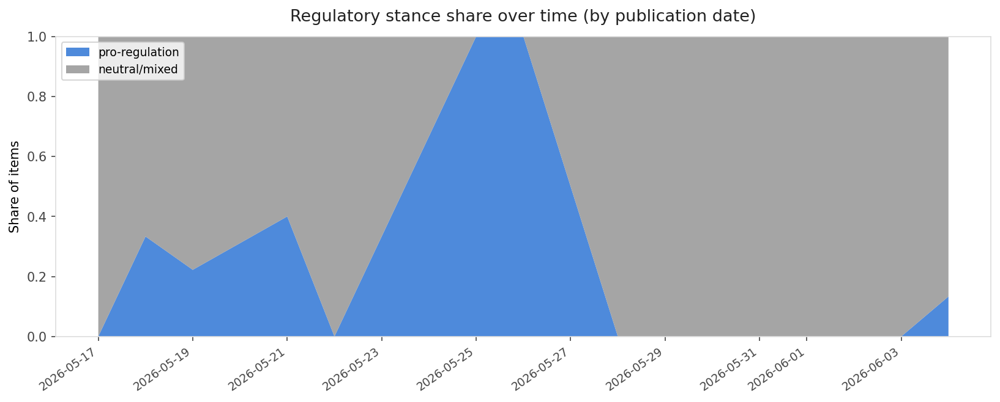

# AI in Law — Daily Sentiment Report
**Run date:** 2026-06-05 | **Items analyzed:** 6 | **Overall:** ⚪ Neutral / mixed (+0.010)

_Articles in this report were published between **2026-06-04** and **2026-06-04**._

---

## Summary

Today's collection covers **6** items from news outlets, academic preprints, Reddit, and regulatory sources.
Compared to the historical average of **+0.431**, today's sentiment is ↓ **0.421** points lower.

| Metric | Value |
|--------|-------|
| Positive items | 2 (33.3%) |
| Neutral items  | 1 (16.7%) |
| Negative items | 3 (50.0%) |
| Avg. VADER compound | +0.0104 |
| Pro-regulation items | 1 |
| Anti-regulation items | 0 |

---

## Top Topics Today

- **Us Legislation** — 3 items
- **Transparency** — 3 items
- **Privacy** — 2 items
- **Copyright Ip** — 2 items

---

## Most Positive Coverage

- [California’s AB 412 Still Demands Developers Do The Impossible](https://www.eff.org/deeplinks/2026/06/californias-ab-412-still-demands-developers-do-impossible)  
  _EFF DeepLinks_ — VADER: `+0.936`
- [EFF Testifies to Congress on Protecting Americans’ Rights from Government AI](https://www.eff.org/deeplinks/2026/06/eff-testifies-congress-protecting-americans-rights-government-ai)  
  _EFF DeepLinks_ — VADER: `+0.378`
- [How courts are coping with a flood of AI-generated lawsuits](https://www.technologyreview.com/2026/06/04/1138391/courts-coping-ai-lawsuits/)  
  _MIT Tech Review_ — VADER: `+0.000`

---

## Most Critical / Negative Coverage

- [AI leaders call for tougher protections against AI-aided bioweapons](https://www.theverge.com/ai-artificial-intelligence/942956/ai-biological-weapons-open-letter-congress)  
  _The Verge AI_ — VADER: `-0.637`
- [Meta’s Oversight Board says account bans lack due process, transparency](https://techcrunch.com/2026/06/04/metas-oversight-board-says-account-bans-lack-due-process-transparency/)  
  _TechCrunch_ — VADER: `-0.318`
- [The Download: AI-generated lawsuits and virtual power plants for data centers](https://www.technologyreview.com/2026/06/04/1138408/the-download-ai-lawsuits-virtual-power-plants-data-centers/)  
  _MIT Tech Review_ — VADER: `-0.296`

---

## Visualizations — Today

## Visualizations — Trends Over Time

---

## Methodology

- **VADER** (Valence Aware Dictionary and sEntiment Reasoner) — compound score in [-1, 1].
- **Topic tagging** — regex keyword matching across 12 AI-law sub-domains.
- **Stance detection** — keyword-based pro/anti-regulation signal detection.
- **Date filter** — items are kept only if their *publication* date falls within the look-back window (default 2 days).
- Sources: RSS news feeds, arXiv academic API, Reddit (PRAW), Regulations.gov API.

_Generated automatically on 2026-06-05 13:57 UTC._
