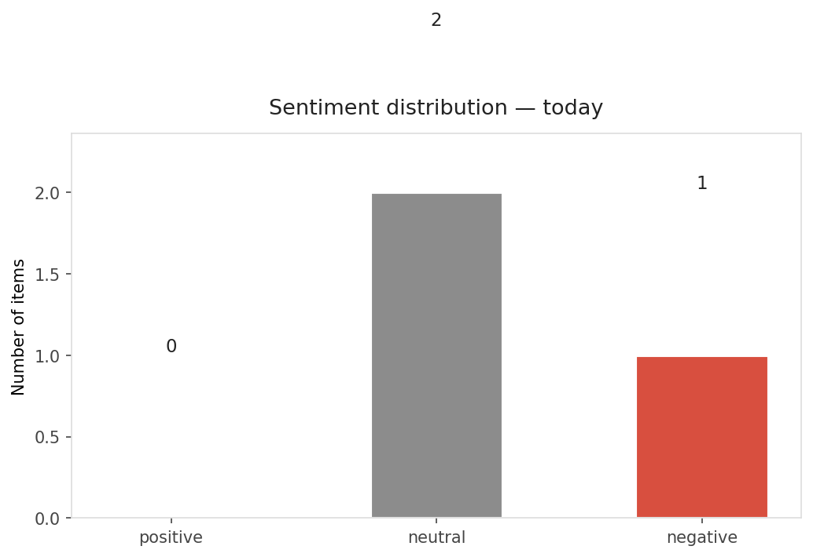
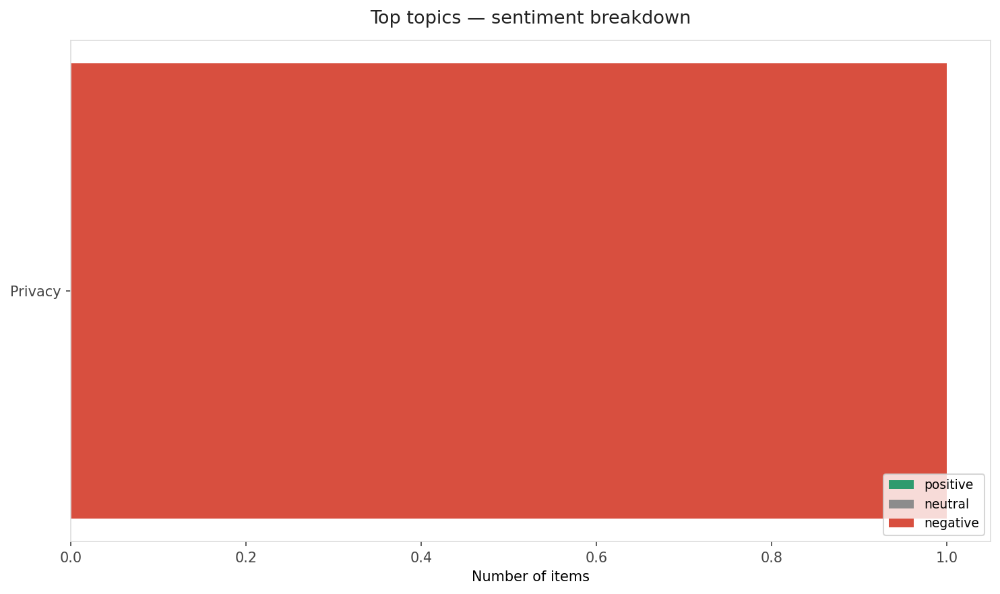
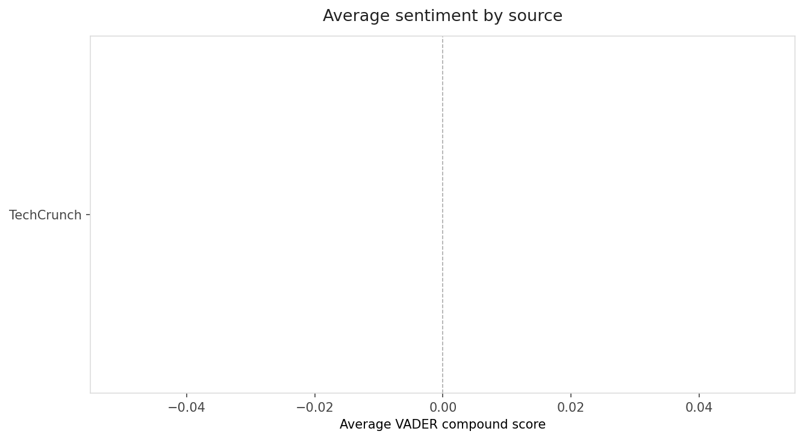
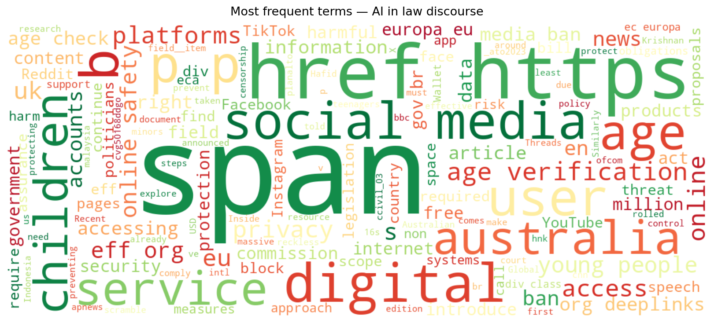
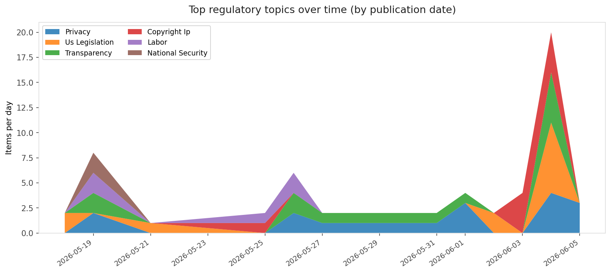

# AI in Law — Daily Sentiment Report
**Run date:** 2026-06-07 | **Items analyzed:** 3 | **Overall:** 🔴 Mildly negative (-0.314)

_Articles in this report were published between **2026-06-05** and **2026-06-06**._

---

## Summary

Today's collection covers **3** items from news outlets, academic preprints, Reddit, and regulatory sources.
Compared to the historical average of **+0.419**, today's sentiment is ↓ **0.732** points lower.

| Metric | Value |
|--------|-------|
| Positive items | 0 (0.0%) |
| Neutral items  | 2 (66.7%) |
| Negative items | 1 (33.3%) |
| Avg. VADER compound | -0.3138 |
| Pro-regulation items | 1 |
| Anti-regulation items | 0 |

---

## Top Topics Today

- **Privacy** — 1 items

---

## Most Positive Coverage

- [Sriram Krishnan is leaving his role as White House AI advisor](https://techcrunch.com/2026/06/06/sriram-krishnan-is-leaving-his-role-as-white-house-ai-advisor/)  
  _TechCrunch_ — VADER: `+0.000`
- [The token bill comes due: Inside the industry scramble to manage AI’s runaway costs](https://techcrunch.com/2026/06/05/the-token-bill-comes-due-inside-the-industry-scramble-to-manage-ais-runaway-costs/)  
  _TechCrunch_ — VADER: `+0.000`
- [Internet Age-Gates Are a Growing Global Threat](https://www.eff.org/deeplinks/2026/06/internet-age-gates-are-growing-global-threat)  
  _EFF DeepLinks_ — VADER: `-0.941`

---

## Most Critical / Negative Coverage

- [Internet Age-Gates Are a Growing Global Threat](https://www.eff.org/deeplinks/2026/06/internet-age-gates-are-growing-global-threat)  
  _EFF DeepLinks_ — VADER: `-0.941`
- [Sriram Krishnan is leaving his role as White House AI advisor](https://techcrunch.com/2026/06/06/sriram-krishnan-is-leaving-his-role-as-white-house-ai-advisor/)  
  _TechCrunch_ — VADER: `+0.000`
- [The token bill comes due: Inside the industry scramble to manage AI’s runaway costs](https://techcrunch.com/2026/06/05/the-token-bill-comes-due-inside-the-industry-scramble-to-manage-ais-runaway-costs/)  
  _TechCrunch_ — VADER: `+0.000`

---

## Visualizations — Today

## Visualizations — Trends Over Time

---

## Methodology

- **VADER** (Valence Aware Dictionary and sEntiment Reasoner) — compound score in [-1, 1].
- **Topic tagging** — regex keyword matching across 12 AI-law sub-domains.
- **Stance detection** — keyword-based pro/anti-regulation signal detection.
- **Date filter** — items are kept only if their *publication* date falls within the look-back window (default 2 days).
- Sources: RSS news feeds, arXiv academic API, Reddit (PRAW), Regulations.gov API.

_Generated automatically on 2026-06-07 12:23 UTC._
