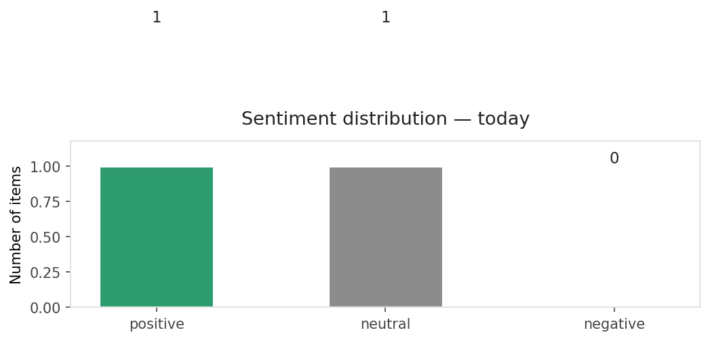
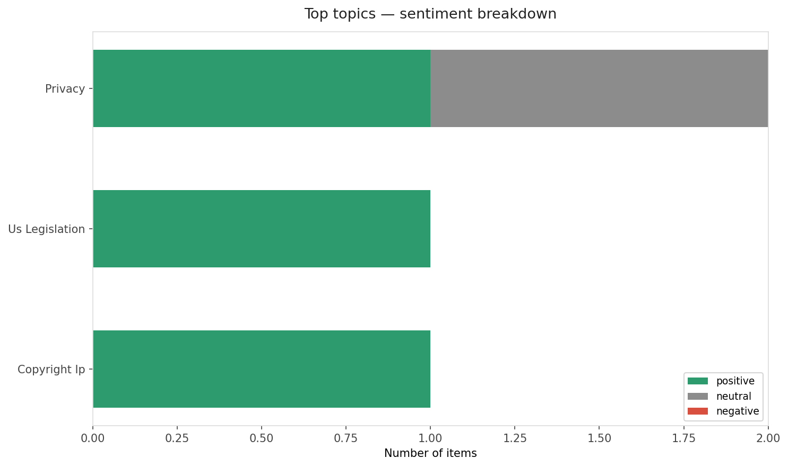
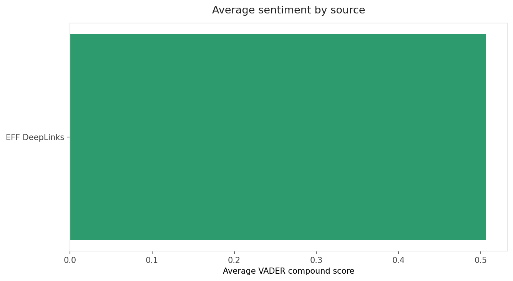
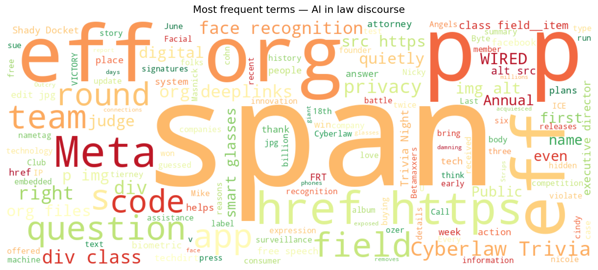
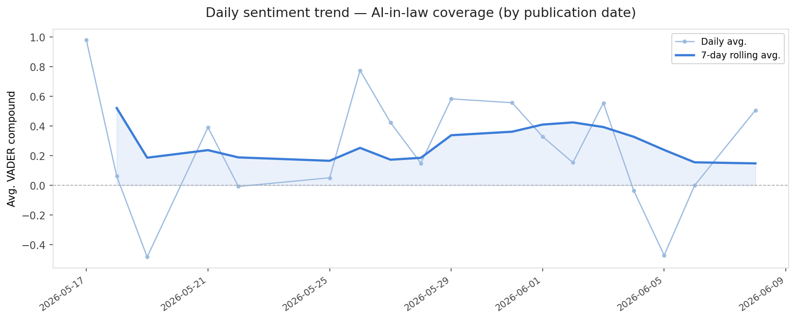
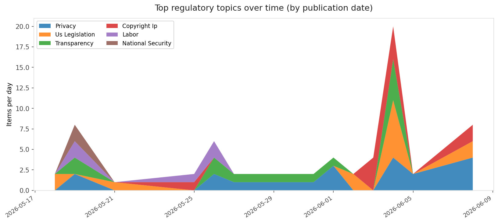
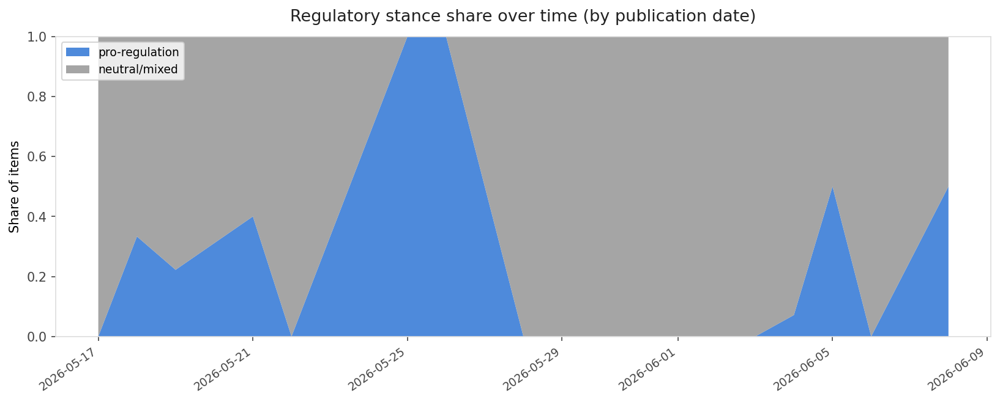

# AI in Law — Daily Sentiment Report
**Run date:** 2026-06-09 | **Items analyzed:** 2 | **Overall:** 🟢 Mildly positive (+0.507)

_Articles in this report were published between **2026-06-08** and **2026-06-08**._

---

## Summary

Today's collection covers **2** items from news outlets, academic preprints, Reddit, and regulatory sources.
Compared to the historical average of **+0.418**, today's sentiment is ↑ **0.089** points higher.

| Metric | Value |
|--------|-------|
| Positive items | 1 (50.0%) |
| Neutral items  | 1 (50.0%) |
| Negative items | 0 (0.0%) |
| Avg. VADER compound | +0.5070 |
| Pro-regulation items | 1 |
| Anti-regulation items | 0 |

---

## Top Topics Today

- **Privacy** — 2 items
- **Us Legislation** — 1 items
- **Copyright Ip** — 1 items

---

## Most Positive Coverage

- [Cheers to the Winners of EFF’s 18th Annual Cyberlaw Trivia Night!](https://www.eff.org/deeplinks/2026/06/cheers-winners-effs-17th-annual-cyberlaw-trivia-night)  
  _EFF DeepLinks_ — VADER: `+0.988`
- [VICTORY: Meta Strips Facial Recognition Code From Smart Glasses App After Public Outcry](https://www.eff.org/deeplinks/2026/06/victory-meta-strips-facial-recognition-code-smart-glasses-app-after-public-outcry)  
  _EFF DeepLinks_ — VADER: `+0.026`

---

## Most Critical / Negative Coverage

- [VICTORY: Meta Strips Facial Recognition Code From Smart Glasses App After Public Outcry](https://www.eff.org/deeplinks/2026/06/victory-meta-strips-facial-recognition-code-smart-glasses-app-after-public-outcry)  
  _EFF DeepLinks_ — VADER: `+0.026`
- [Cheers to the Winners of EFF’s 18th Annual Cyberlaw Trivia Night!](https://www.eff.org/deeplinks/2026/06/cheers-winners-effs-17th-annual-cyberlaw-trivia-night)  
  _EFF DeepLinks_ — VADER: `+0.988`

---

## Visualizations — Today

## Visualizations — Trends Over Time

---

## Methodology

- **VADER** (Valence Aware Dictionary and sEntiment Reasoner) — compound score in [-1, 1].
- **Topic tagging** — regex keyword matching across 12 AI-law sub-domains.
- **Stance detection** — keyword-based pro/anti-regulation signal detection.
- **Date filter** — items are kept only if their *publication* date falls within the look-back window (default 2 days).
- Sources: RSS news feeds, arXiv academic API, Reddit (PRAW), Regulations.gov API.

_Generated automatically on 2026-06-09 13:47 UTC._
