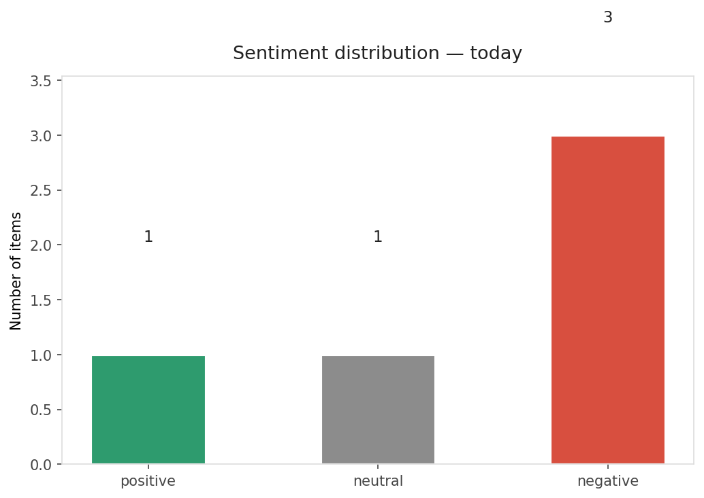
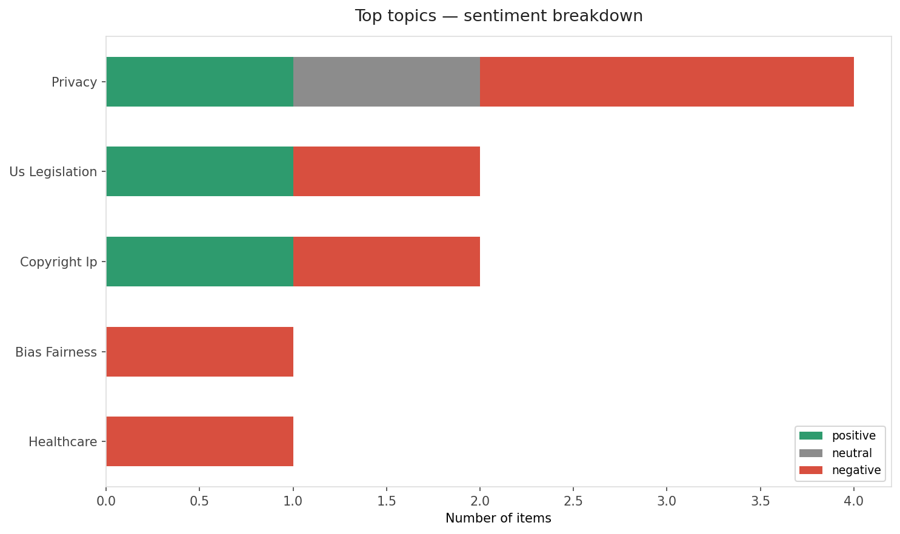
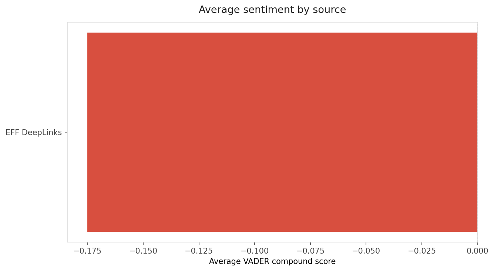
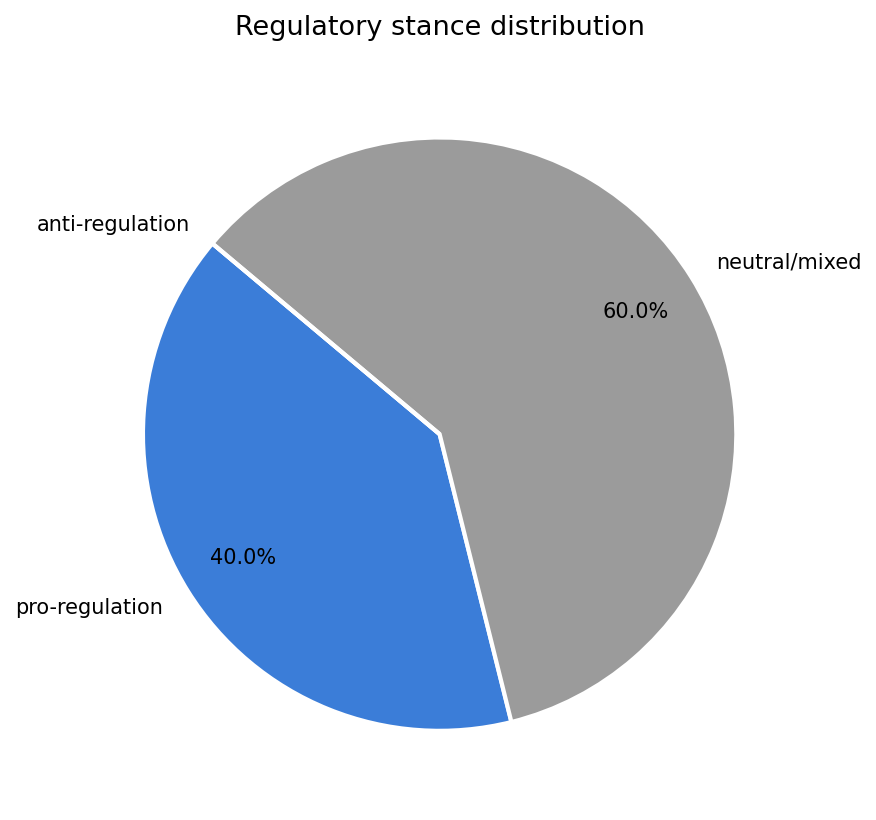
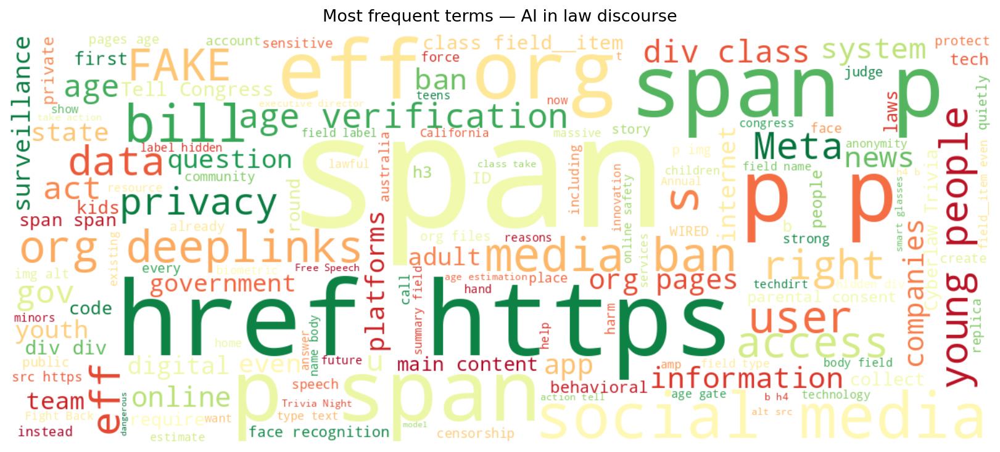
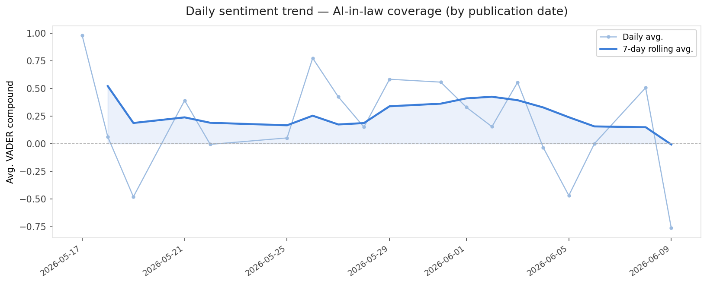
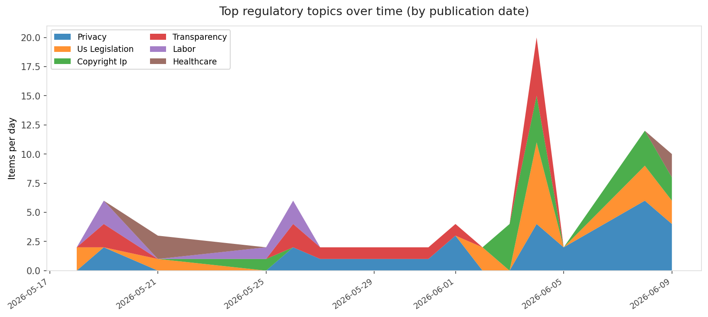
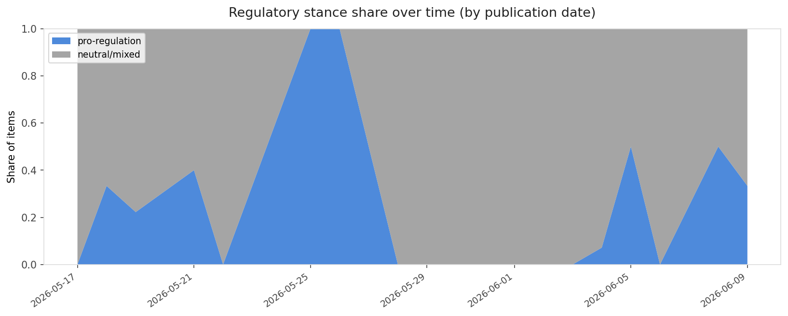

# AI in Law — Daily Sentiment Report
**Run date:** 2026-06-10 | **Items analyzed:** 5 | **Overall:** 🔴 Mildly negative (-0.257)

_Articles in this report were published between **2026-06-08** and **2026-06-09**._

---

## Summary

Today's collection covers **5** items from news outlets, academic preprints, Reddit, and regulatory sources.
Compared to the historical average of **+0.411**, today's sentiment is ↓ **0.668** points lower.

| Metric | Value |
|--------|-------|
| Positive items | 1 (20.0%) |
| Neutral items  | 1 (20.0%) |
| Negative items | 3 (60.0%) |
| Avg. VADER compound | -0.2566 |
| Pro-regulation items | 2 |
| Anti-regulation items | 0 |

---

## Top Topics Today

- **Privacy** — 4 items
- **Us Legislation** — 2 items
- **Copyright Ip** — 2 items
- **Bias Fairness** — 1 items
- **Healthcare** — 1 items

---

## Most Positive Coverage

- [Cheers to the Winners of EFF’s 18th Annual Cyberlaw Trivia Night!](https://www.eff.org/deeplinks/2026/06/cheers-winners-effs-17th-annual-cyberlaw-trivia-night)  
  _EFF DeepLinks_ — VADER: `+0.988`
- [VICTORY: Meta Strips Facial Recognition Code From Smart Glasses App After Public Outcry](https://www.eff.org/deeplinks/2026/06/victory-meta-strips-facial-recognition-code-smart-glasses-app-after-public-outcry)  
  _EFF DeepLinks_ — VADER: `+0.026`
- [Microsoft AI head calls out Anthropic for acting like Claude is conscious](https://www.theverge.com/tech/947197/microsoft-ai-mustafa-suleyman-anthropic-claude-conscious)  
  _The Verge AI_ — VADER: `-0.582`

---

## Most Critical / Negative Coverage

- [Tell Congress: Just Say No to NO FAKES](https://www.eff.org/deeplinks/2026/06/tell-congress-just-say-no-no-fakes)  
  _EFF DeepLinks_ — VADER: `-0.860`
- [How and Why to Fight Back Against Social Media Bans](https://www.eff.org/deeplinks/2026/06/how-and-why-fight-back-against-social-media-bans)  
  _EFF DeepLinks_ — VADER: `-0.855`
- [Microsoft AI head calls out Anthropic for acting like Claude is conscious](https://www.theverge.com/tech/947197/microsoft-ai-mustafa-suleyman-anthropic-claude-conscious)  
  _The Verge AI_ — VADER: `-0.582`

---

## Visualizations — Today

## Visualizations — Trends Over Time

---

## Methodology

- **VADER** (Valence Aware Dictionary and sEntiment Reasoner) — compound score in [-1, 1].
- **Topic tagging** — regex keyword matching across 12 AI-law sub-domains.
- **Stance detection** — keyword-based pro/anti-regulation signal detection.
- **Date filter** — items are kept only if their *publication* date falls within the look-back window (default 2 days).
- Sources: RSS news feeds, arXiv academic API, Reddit (PRAW), Regulations.gov API.

_Generated automatically on 2026-06-10 14:25 UTC._
