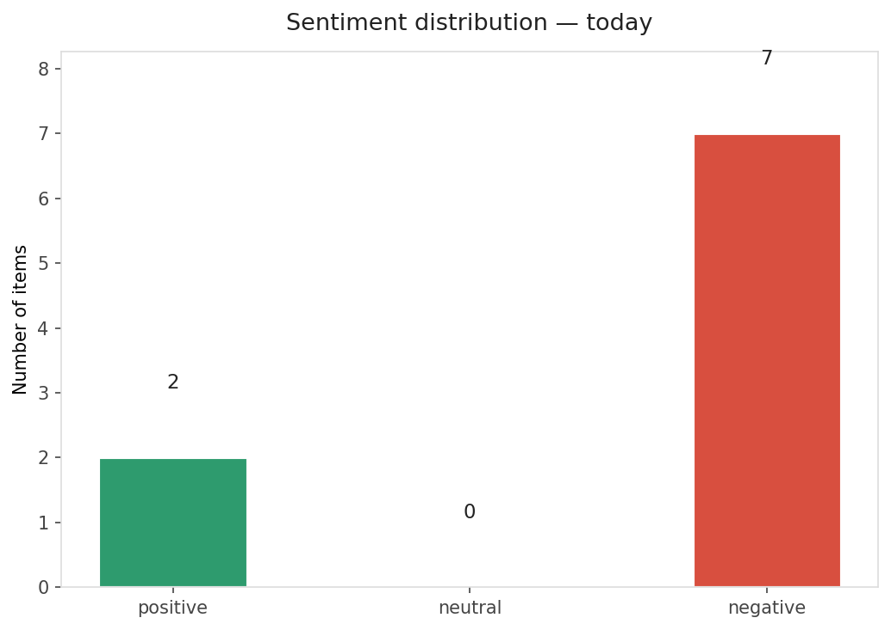
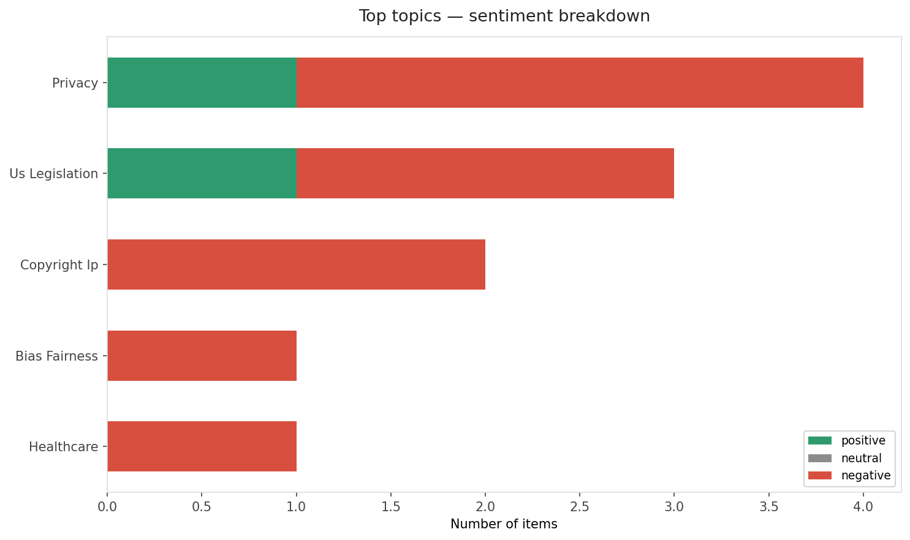
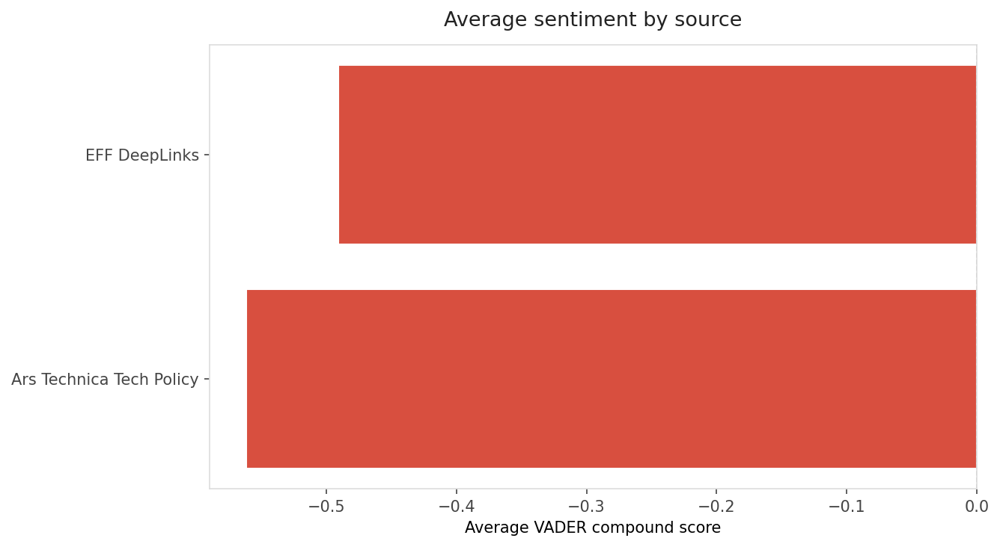
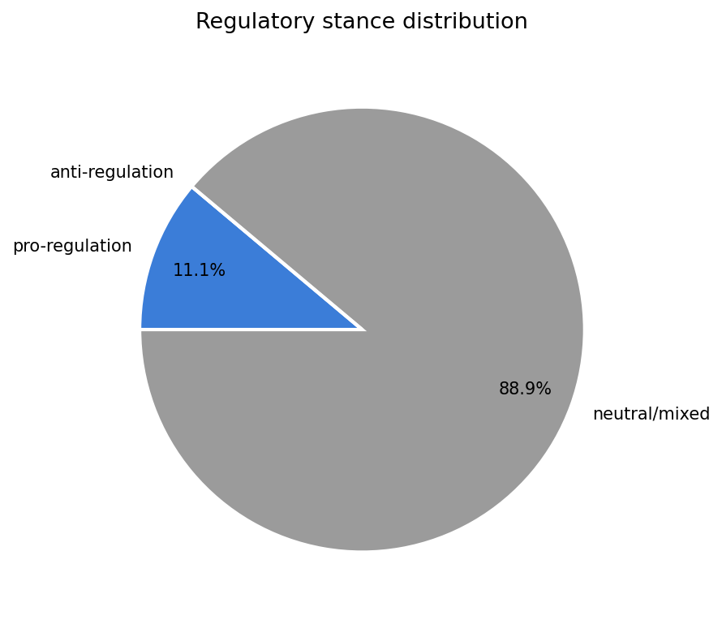
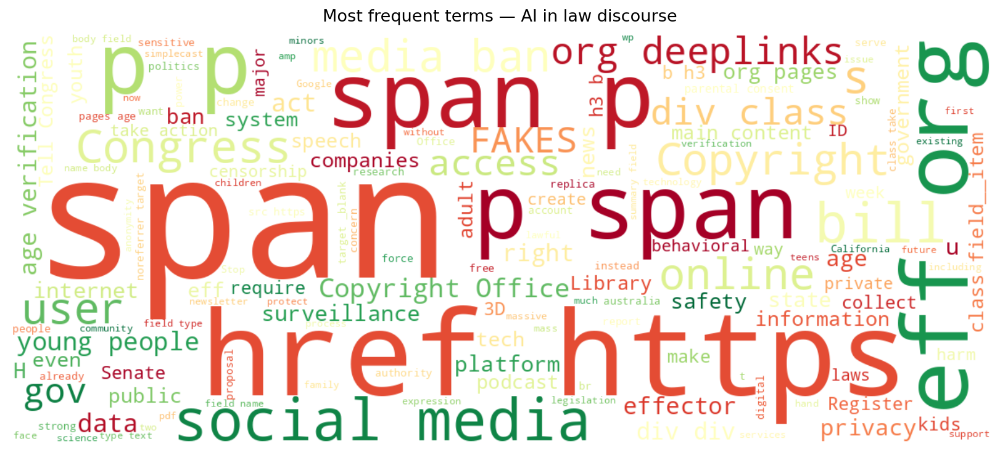
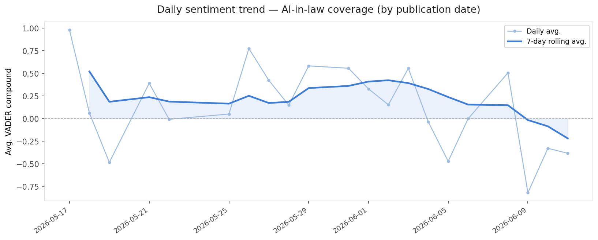
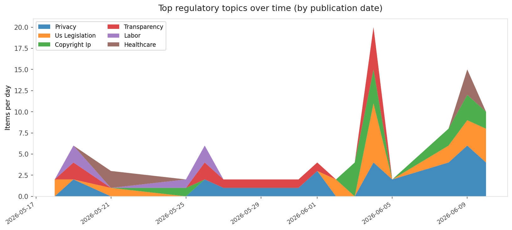
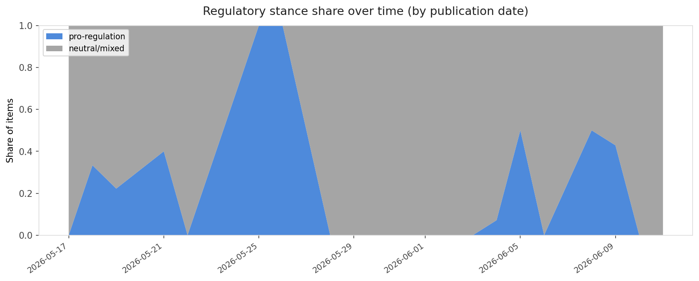

# AI in Law — Daily Sentiment Report
**Run date:** 2026-06-11 | **Items analyzed:** 9 | **Overall:** 🔴 Mildly negative (-0.451)

_Articles in this report were published between **2026-06-09** and **2026-06-11**._

---

## Summary

Today's collection covers **9** items from news outlets, academic preprints, Reddit, and regulatory sources.
Compared to the historical average of **+0.395**, today's sentiment is ↓ **0.846** points lower.

| Metric | Value |
|--------|-------|
| Positive items | 2 (22.2%) |
| Neutral items  | 0 (0.0%) |
| Negative items | 7 (77.8%) |
| Avg. VADER compound | -0.4512 |
| Pro-regulation items | 1 |
| Anti-regulation items | 0 |

---

## Top Topics Today

- **Privacy** — 4 items
- **Us Legislation** — 3 items
- **Copyright Ip** — 2 items
- **Bias Fairness** — 1 items
- **Healthcare** — 1 items

---

## Most Positive Coverage

- [🔊 Mass Surveillance for… Loud Music? | EFFector 38.11](https://www.eff.org/deeplinks/2026/06/mass-surveillance-loud-music-effector-3811)  
  _EFF DeepLinks_ — VADER: `+0.546`
- [The future of AI regulation is courting the strangest, most anxious bedfellows](https://www.theverge.com/column/947838/washington-ai-network-honors-2026-midterms)  
  _The Verge AI_ — VADER: `+0.180`
- [Google DeepMind is worried about what happens when millions of agents start to interact](https://www.technologyreview.com/2026/06/11/1138794/google-deepmind-is-worried-about-what-happens-when-millions-of-agents-start-to-interact/)  
  _MIT Tech Review_ — VADER: `-0.382`

---

## Most Critical / Negative Coverage

- [Tell Congress: Just Say No to NO FAKES](https://www.eff.org/deeplinks/2026/06/tell-congress-just-say-no-no-fakes)  
  _EFF DeepLinks_ — VADER: `-0.860`
- [How and Why to Fight Back Against Social Media Bans](https://www.eff.org/deeplinks/2026/06/how-and-why-fight-back-against-social-media-bans)  
  _EFF DeepLinks_ — VADER: `-0.855`
- [Congress Just Rushed Through a Disastrous Copyright Office Overhaul](https://www.eff.org/deeplinks/2026/06/congress-just-rushed-through-disastrous-copyright-office-overhaul)  
  _EFF DeepLinks_ — VADER: `-0.795`

---

## Visualizations — Today

## Visualizations — Trends Over Time

---

## Methodology

- **VADER** (Valence Aware Dictionary and sEntiment Reasoner) — compound score in [-1, 1].
- **Topic tagging** — regex keyword matching across 12 AI-law sub-domains.
- **Stance detection** — keyword-based pro/anti-regulation signal detection.
- **Date filter** — items are kept only if their *publication* date falls within the look-back window (default 2 days).
- Sources: RSS news feeds, arXiv academic API, Reddit (PRAW), Regulations.gov API.

_Generated automatically on 2026-06-11 14:40 UTC._
