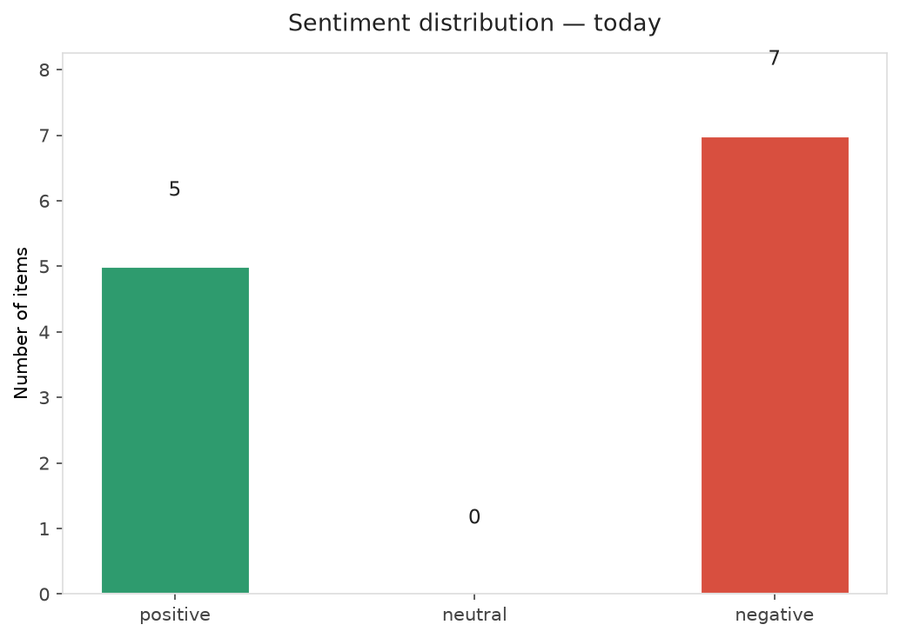
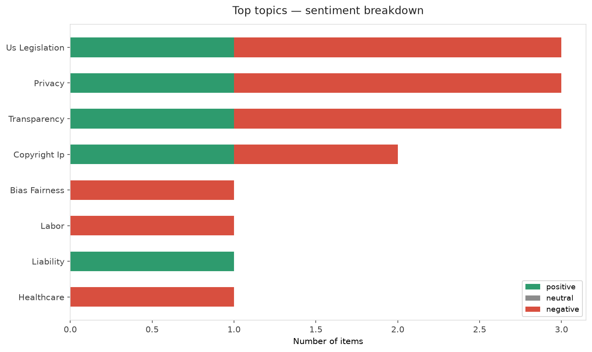
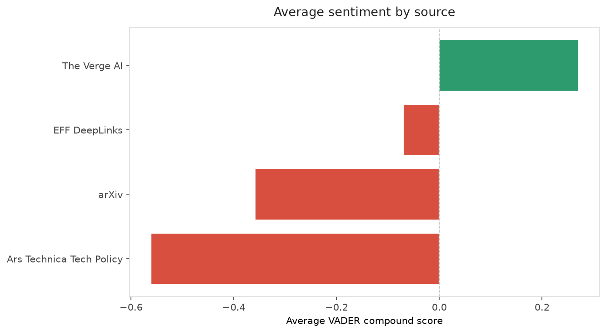
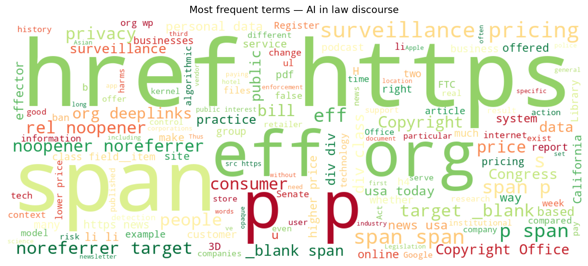
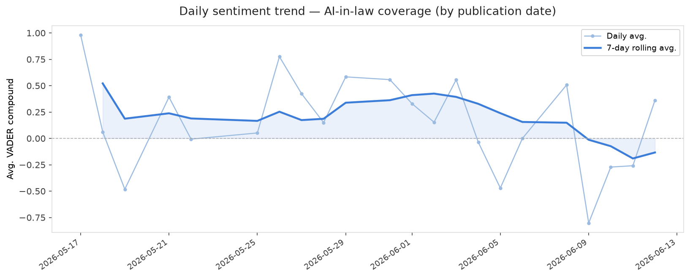
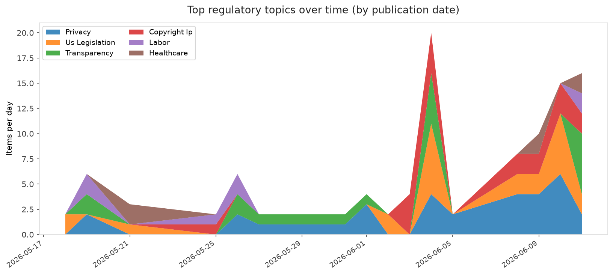
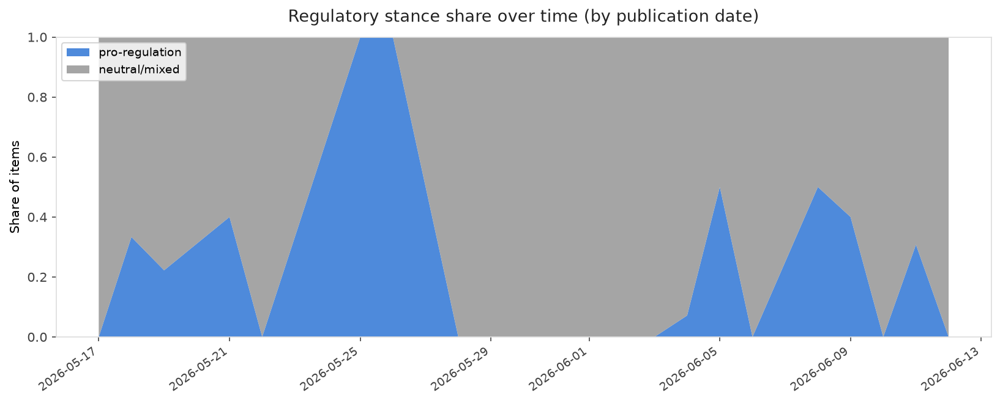

# AI in Law — Daily Sentiment Report
**Run date:** 2026-06-12 | **Items analyzed:** 12 | **Overall:** 🔴 Mildly negative (-0.194)

_Articles in this report were published between **2026-06-10** and **2026-06-12**._

---

## Summary

Today's collection covers **12** items from news outlets, academic preprints, Reddit, and regulatory sources.
Compared to the historical average of **+0.381**, today's sentiment is ↓ **0.575** points lower.

| Metric | Value |
|--------|-------|
| Positive items | 5 (41.7%) |
| Neutral items  | 0 (0.0%) |
| Negative items | 7 (58.3%) |
| Avg. VADER compound | -0.1936 |
| Pro-regulation items | 2 |
| Anti-regulation items | 0 |

---

## Top Topics Today

- **Us Legislation** — 3 items
- **Privacy** — 3 items
- **Transparency** — 3 items
- **Copyright Ip** — 2 items
- **Bias Fairness** — 1 items

---

## Most Positive Coverage

- [‘News’ Site Keeps Hallucinating EFF Staffers](https://www.eff.org/deeplinks/2026/06/news-site-keeps-hallucinating-eff-staffers)  
  _EFF DeepLinks_ — VADER: `+0.890`
- [🔊 Mass Surveillance for… Loud Music? | EFFector 38.11](https://www.eff.org/deeplinks/2026/06/mass-surveillance-loud-music-effector-3811)  
  _EFF DeepLinks_ — VADER: `+0.546`
- [Siri won’t be your AI girlfriend](https://www.theverge.com/tech/948890/siri-wont-be-your-ai-girlfriend)  
  _The Verge AI_ — VADER: `+0.361`

---

## Most Critical / Negative Coverage

- [Yes to California's Bill to Ban Surveillance Pricing](https://www.eff.org/deeplinks/2026/06/californias-bill-ban-surveillance-pricing)  
  _EFF DeepLinks_ — VADER: `-0.924`
- [Exploring Systems-Thinking Approaches to Loss of Control Risk](https://arxiv.org/abs/2606.13474v1)  
  _arXiv_ — VADER: `-0.848`
- [Congress Just Rushed Through a Disastrous Copyright Office Overhaul](https://www.eff.org/deeplinks/2026/06/congress-just-rushed-through-disastrous-copyright-office-overhaul)  
  _EFF DeepLinks_ — VADER: `-0.795`

---

## Visualizations — Today

## Visualizations — Trends Over Time

---

## Methodology

- **VADER** (Valence Aware Dictionary and sEntiment Reasoner) — compound score in [-1, 1].
- **Topic tagging** — regex keyword matching across 12 AI-law sub-domains.
- **Stance detection** — keyword-based pro/anti-regulation signal detection.
- **Date filter** — items are kept only if their *publication* date falls within the look-back window (default 2 days).
- Sources: RSS news feeds, arXiv academic API, Reddit (PRAW), Regulations.gov API.

_Generated automatically on 2026-06-12 14:12 UTC._
