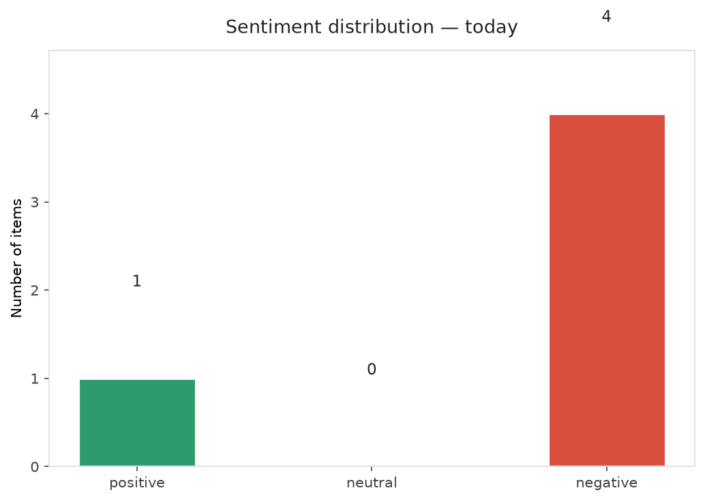
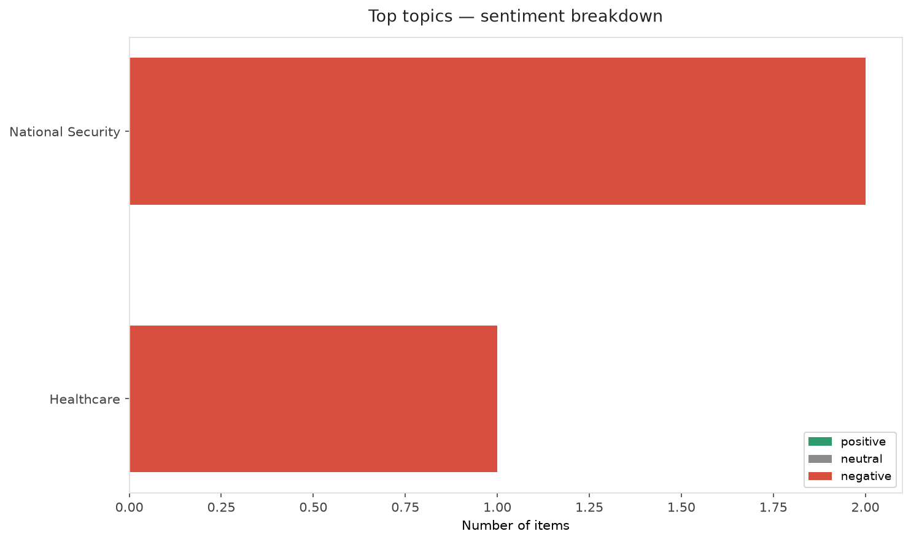
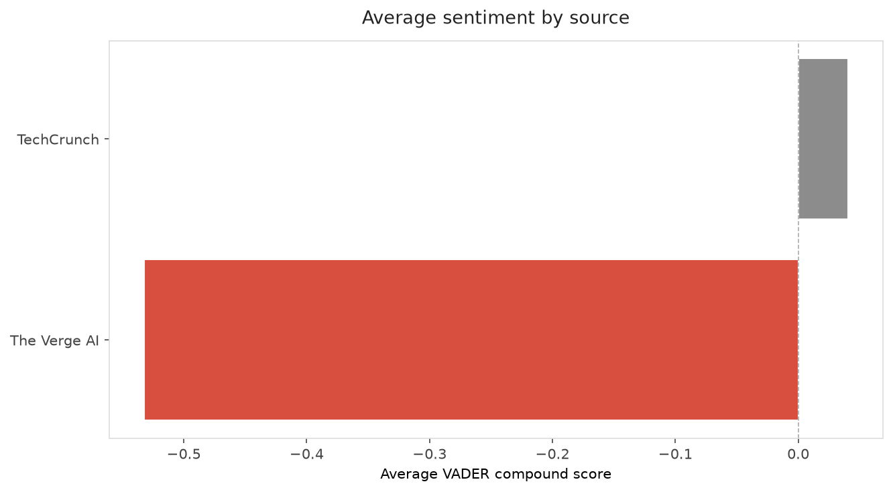
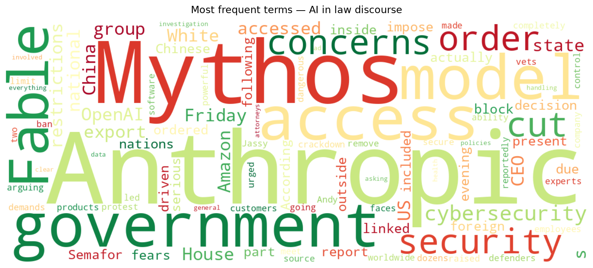
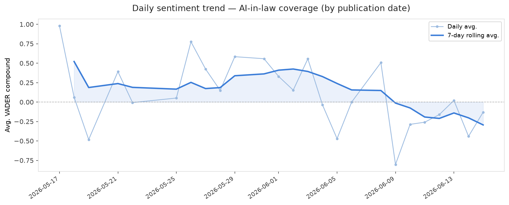
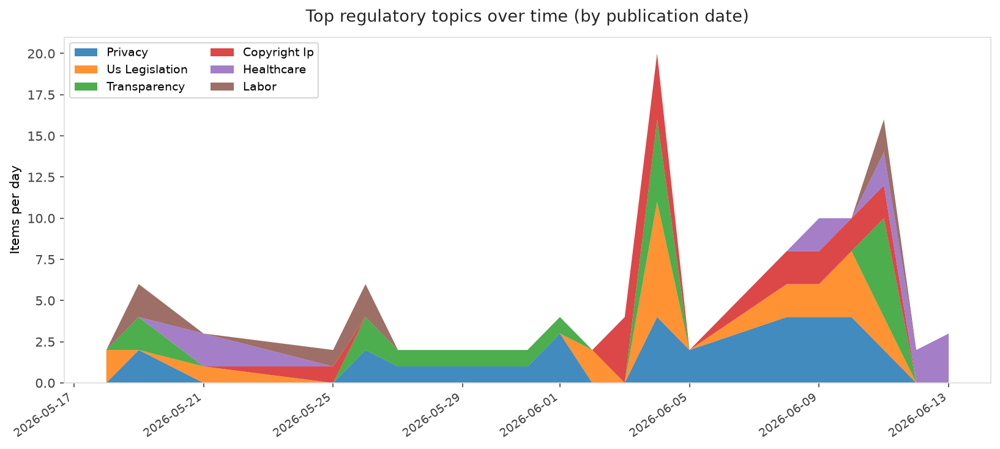
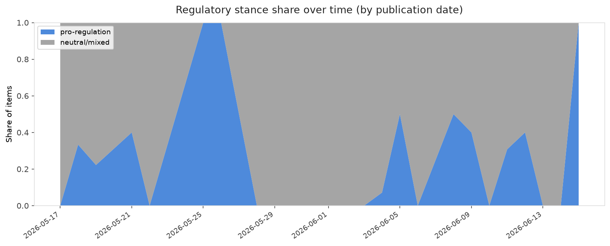

# AI in Law — Daily Sentiment Report
**Run date:** 2026-06-15 | **Items analyzed:** 5 | **Overall:** 🔴 Mildly negative (-0.189)

_Articles in this report were published between **2026-06-13** and **2026-06-15**._

---

## Summary

Today's collection covers **5** items from news outlets, academic preprints, Reddit, and regulatory sources.
Compared to the historical average of **+0.362**, today's sentiment is ↓ **0.550** points lower.

| Metric | Value |
|--------|-------|
| Positive items | 1 (20.0%) |
| Neutral items  | 0 (0.0%) |
| Negative items | 4 (80.0%) |
| Avg. VADER compound | -0.1887 |
| Pro-regulation items | 1 |
| Anti-regulation items | 0 |

---

## Top Topics Today

- **National Security** — 2 items
- **Healthcare** — 1 items

---

## Most Positive Coverage

- [Amazon CEO reportedly raised Anthropic model concerns before government crackdown](https://techcrunch.com/2026/06/13/amazon-ceo-reportedly-raised-anthropic-model-concerns-before-government-crackdown/)  
  _TechCrunch_ — VADER: `+0.402`
- [Cybersecurity vets protest ‘dangerous’ US government ban on Anthropic’s most powerful models](https://techcrunch.com/2026/06/15/cybersecurity-vets-protest-dangerous-us-government-ban-on-anthropics-most-powerful-models/)  
  _TechCrunch_ — VADER: `-0.130`
- [OpenAI faces investigation from state attorneys general](https://techcrunch.com/2026/06/13/openai-faces-investigation-from-state-attorneys-general/)  
  _TechCrunch_ — VADER: `-0.151`

---

## Most Critical / Negative Coverage

- [Anthropic cuts off Fable 5 and Mythos 5 access following government order](https://www.theverge.com/ai-artificial-intelligence/949553/anthropic-fable-5-mythos-5-government-national-security)  
  _The Verge AI_ — VADER: `-0.624`
- [China may have accessed Mythos](https://www.theverge.com/ai-artificial-intelligence/949644/china-white-house-anthropic-mythos)  
  _The Verge AI_ — VADER: `-0.440`
- [OpenAI faces investigation from state attorneys general](https://techcrunch.com/2026/06/13/openai-faces-investigation-from-state-attorneys-general/)  
  _TechCrunch_ — VADER: `-0.151`

---

## Visualizations — Today

## Visualizations — Trends Over Time

---

## Methodology

- **VADER** (Valence Aware Dictionary and sEntiment Reasoner) — compound score in [-1, 1].
- **Topic tagging** — regex keyword matching across 12 AI-law sub-domains.
- **Stance detection** — keyword-based pro/anti-regulation signal detection.
- **Date filter** — items are kept only if their *publication* date falls within the look-back window (default 2 days).
- Sources: RSS news feeds, arXiv academic API, Reddit (PRAW), Regulations.gov API.

_Generated automatically on 2026-06-15 16:20 UTC._
