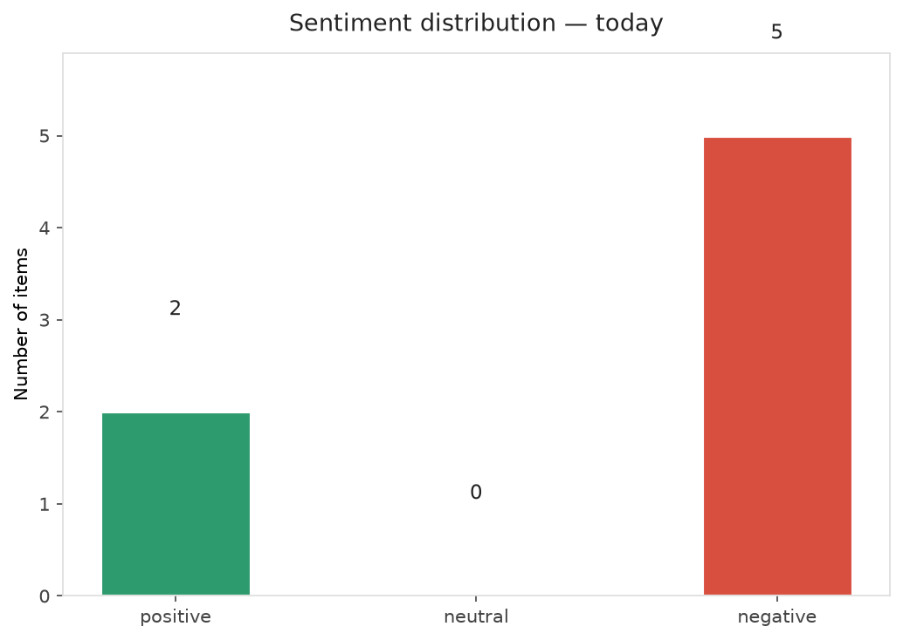
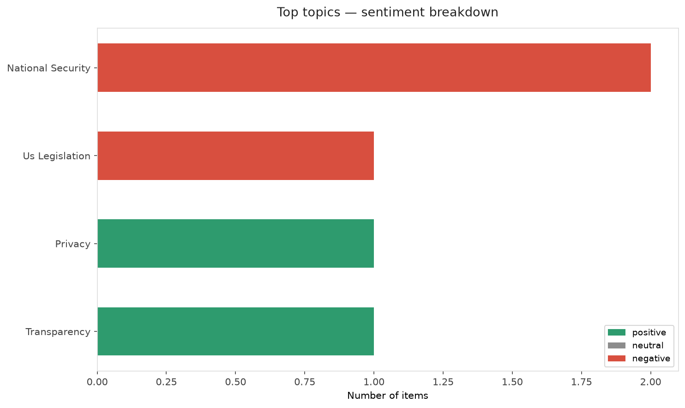
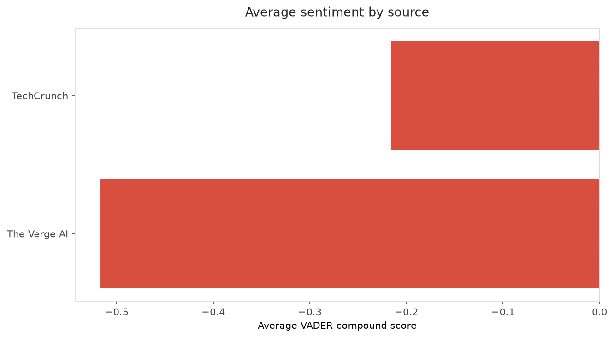
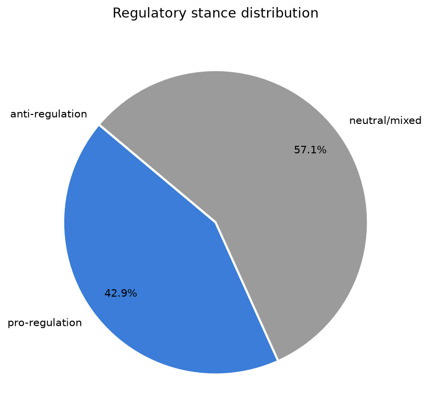
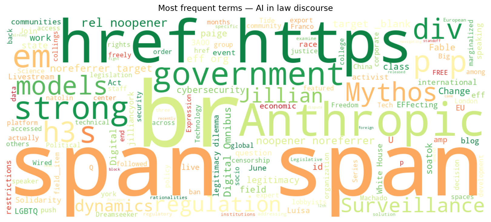
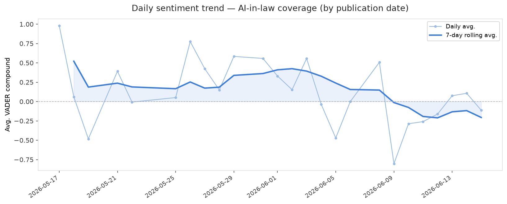
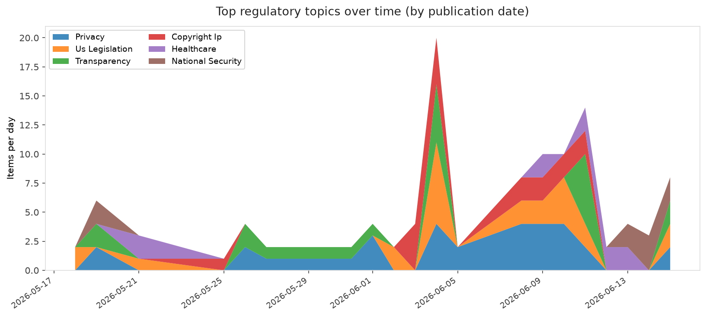
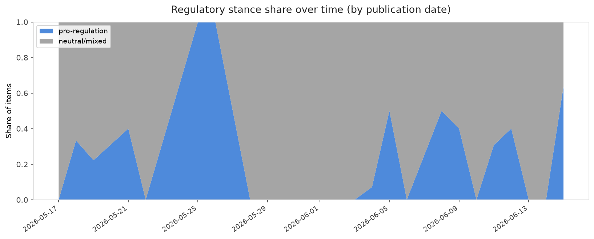

# AI in Law — Daily Sentiment Report
**Run date:** 2026-06-16 | **Items analyzed:** 7 | **Overall:** ⚪ Neutral / mixed (-0.010)

_Articles in this report were published between **2026-06-14** and **2026-06-15**._

---

## Summary

Today's collection covers **7** items from news outlets, academic preprints, Reddit, and regulatory sources.
Compared to the historical average of **+0.357**, today's sentiment is ↓ **0.366** points lower.

| Metric | Value |
|--------|-------|
| Positive items | 2 (28.6%) |
| Neutral items  | 0 (0.0%) |
| Negative items | 5 (71.4%) |
| Avg. VADER compound | -0.0097 |
| Pro-regulation items | 3 |
| Anti-regulation items | 0 |

---

## Top Topics Today

- **National Security** — 2 items
- **Us Legislation** — 1 items
- **Privacy** — 1 items
- **Transparency** — 1 items

---

## Most Positive Coverage

- [EFFecting Change: LGBTQ+ Solidarity Against the Tide of Surveillance](https://www.eff.org/deeplinks/2026/06/effecting-change-lgbtq-solidarity-against-tide-surveillance)  
  _EFF DeepLinks_ — VADER: `+0.990`
- [The Digital Omnibus on AI, Legislative Legitimacy and the Dynamics of AI Regulation](https://arxiv.org/abs/2606.15662v1)  
  _arXiv_ — VADER: `+0.927`
- [Cybersecurity vets protest ‘dangerous’ US government ban on Anthropic’s most powerful models](https://techcrunch.com/2026/06/15/cybersecurity-vets-protest-dangerous-us-government-ban-on-anthropics-most-powerful-models/)  
  _TechCrunch_ — VADER: `-0.130`

---

## Most Critical / Negative Coverage

- [All the news about Anthropic&#8217;s new AI fight with the White House](https://www.theverge.com/ai-artificial-intelligence/950026/anthropic-fable-mythos-ban-ai-shutdown)  
  _The Verge AI_ — VADER: `-0.772`
- [China may have accessed Mythos](https://www.theverge.com/ai-artificial-intelligence/949644/china-white-house-anthropic-mythos)  
  _The Verge AI_ — VADER: `-0.440`
- [Big Tech’s desperate last push at AI regulation](https://www.theverge.com/policy/949970/ai-regulation-child-safety-kosa-congress)  
  _The Verge AI_ — VADER: `-0.340`

---

## Visualizations — Today

## Visualizations — Trends Over Time

---

## Methodology

- **VADER** (Valence Aware Dictionary and sEntiment Reasoner) — compound score in [-1, 1].
- **Topic tagging** — regex keyword matching across 12 AI-law sub-domains.
- **Stance detection** — keyword-based pro/anti-regulation signal detection.
- **Date filter** — items are kept only if their *publication* date falls within the look-back window (default 2 days).
- Sources: RSS news feeds, arXiv academic API, Reddit (PRAW), Regulations.gov API.

_Generated automatically on 2026-06-16 15:56 UTC._
