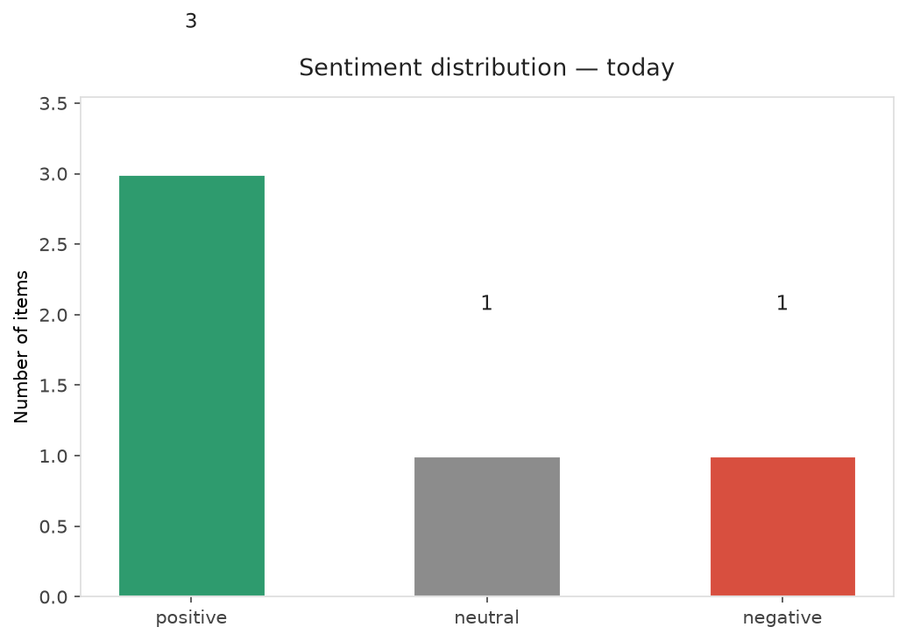
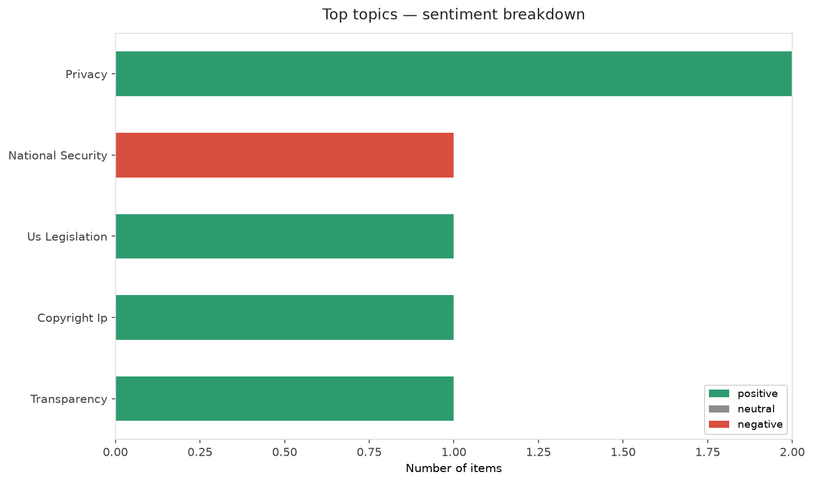
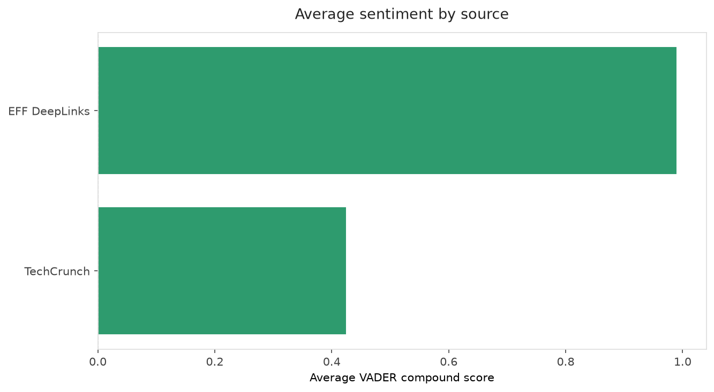
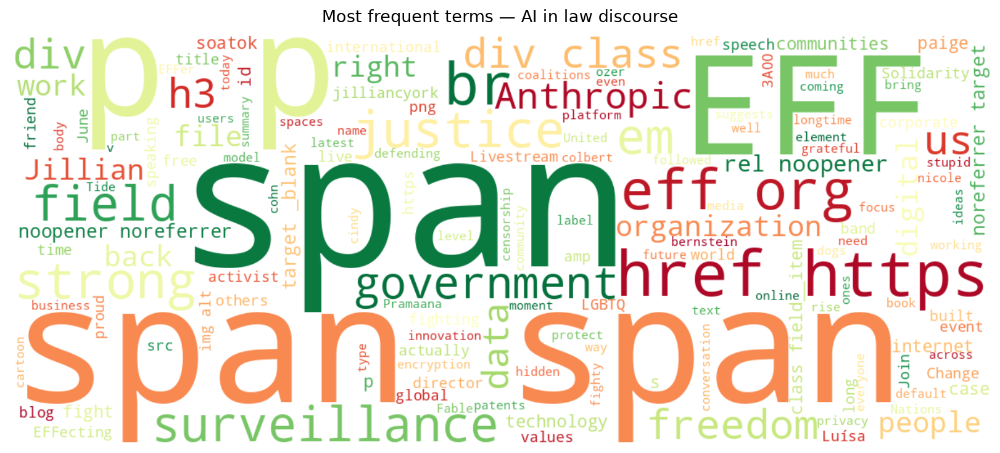
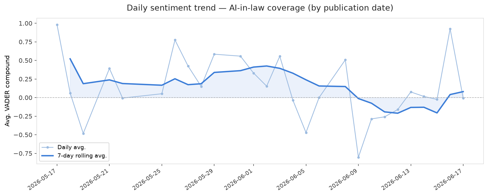
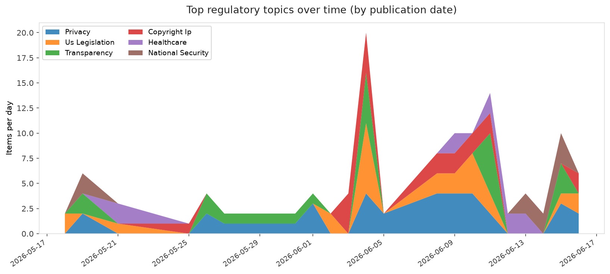
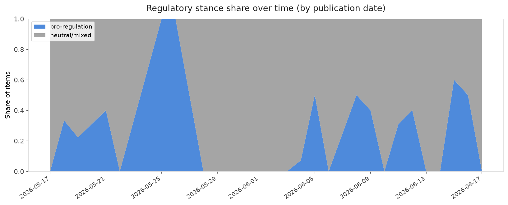

# AI in Law — Daily Sentiment Report
**Run date:** 2026-06-17 | **Items analyzed:** 5 | **Overall:** 🟢 Mildly positive (+0.412)

_Articles in this report were published between **2026-06-15** and **2026-06-17**._

---

## Summary

Today's collection covers **5** items from news outlets, academic preprints, Reddit, and regulatory sources.
Compared to the historical average of **+0.357**, today's sentiment is ↑ **0.055** points higher.

| Metric | Value |
|--------|-------|
| Positive items | 3 (60.0%) |
| Neutral items  | 1 (20.0%) |
| Negative items | 1 (20.0%) |
| Avg. VADER compound | +0.4122 |
| Pro-regulation items | 2 |
| Anti-regulation items | 0 |

---

## Top Topics Today

- **Privacy** — 2 items
- **National Security** — 1 items
- **Us Legislation** — 1 items
- **Copyright Ip** — 1 items
- **Transparency** — 1 items

---

## Most Positive Coverage

- [Onward, Friends](https://www.eff.org/deeplinks/2026/06/farewell-now-friends)  
  _EFF DeepLinks_ — VADER: `+0.992`
- [EFFecting Change: LGBTQ+ Solidarity Against the Tide of Surveillance](https://www.eff.org/deeplinks/2026/06/effecting-change-lgbtq-solidarity-against-tide-surveillance)  
  _EFF DeepLinks_ — VADER: `+0.990`
- [Anthropic’s latest feud with the Trump admin may actually help it, sales data suggests](https://techcrunch.com/2026/06/16/anthropics-latest-feud-with-the-trump-admin-may-actually-help-it-sales-data-suggests/)  
  _TechCrunch_ — VADER: `+0.861`

---

## Most Critical / Negative Coverage

- [All the news about Anthropic&#8217;s new AI fight with the White House](https://www.theverge.com/ai-artificial-intelligence/950026/anthropic-fable-mythos-ban-ai-shutdown)  
  _The Verge AI_ — VADER: `-0.772`
- [Pramaana Labs raises $27M seed round from Khosla Ventures to bring formal verification to AI](https://techcrunch.com/2026/06/17/pramaana-labs-raises-27-million-seed-round-from-khosla-ventures-to-bring-formal-verification-to-ai/)  
  _TechCrunch_ — VADER: `-0.009`
- [Anthropic’s latest feud with the Trump admin may actually help it, sales data suggests](https://techcrunch.com/2026/06/16/anthropics-latest-feud-with-the-trump-admin-may-actually-help-it-sales-data-suggests/)  
  _TechCrunch_ — VADER: `+0.861`

---

## Visualizations — Today

## Visualizations — Trends Over Time

---

## Methodology

- **VADER** (Valence Aware Dictionary and sEntiment Reasoner) — compound score in [-1, 1].
- **Topic tagging** — regex keyword matching across 12 AI-law sub-domains.
- **Stance detection** — keyword-based pro/anti-regulation signal detection.
- **Date filter** — items are kept only if their *publication* date falls within the look-back window (default 2 days).
- Sources: RSS news feeds, arXiv academic API, Reddit (PRAW), Regulations.gov API.

_Generated automatically on 2026-06-17 14:28 UTC._
