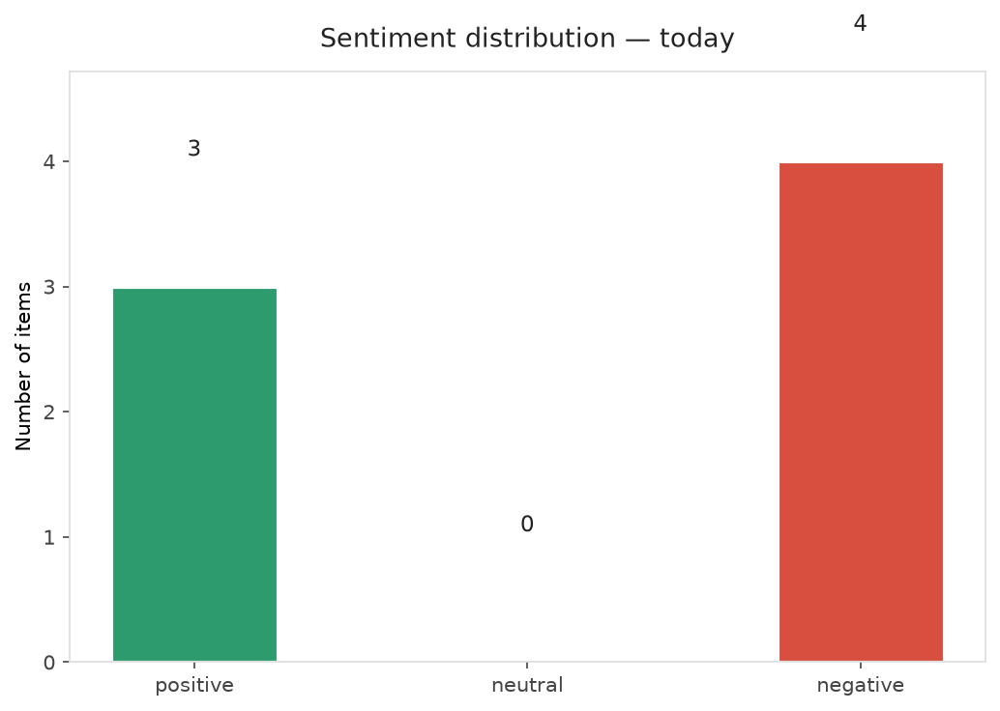
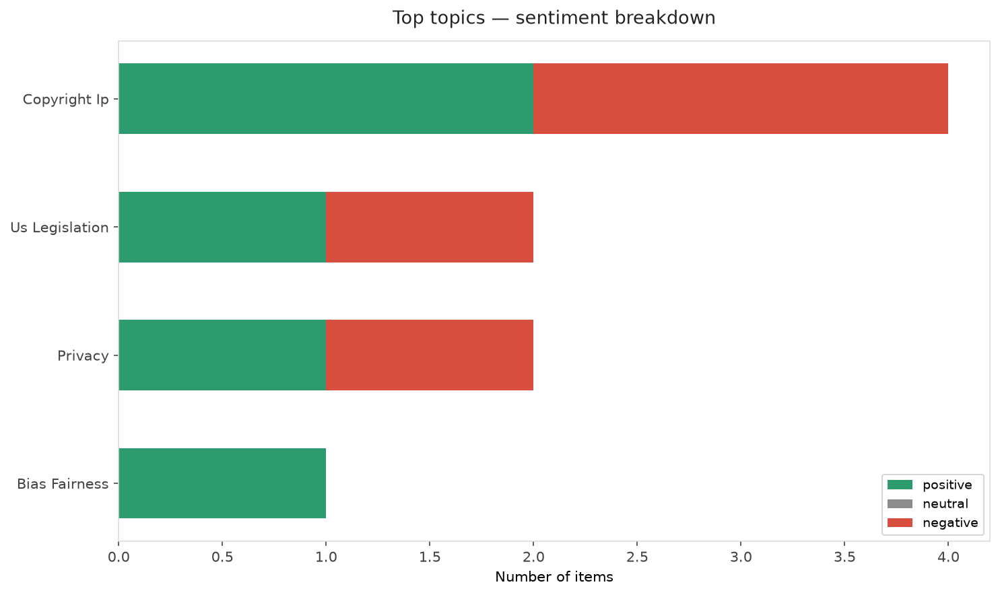
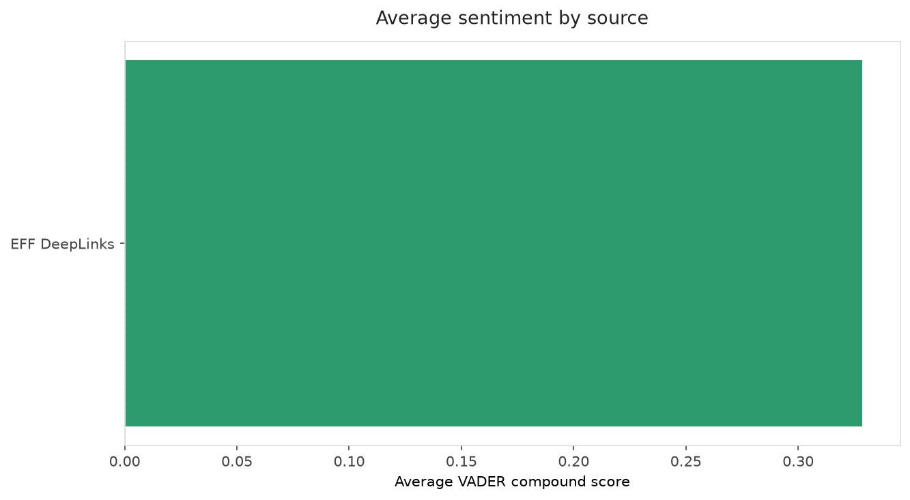
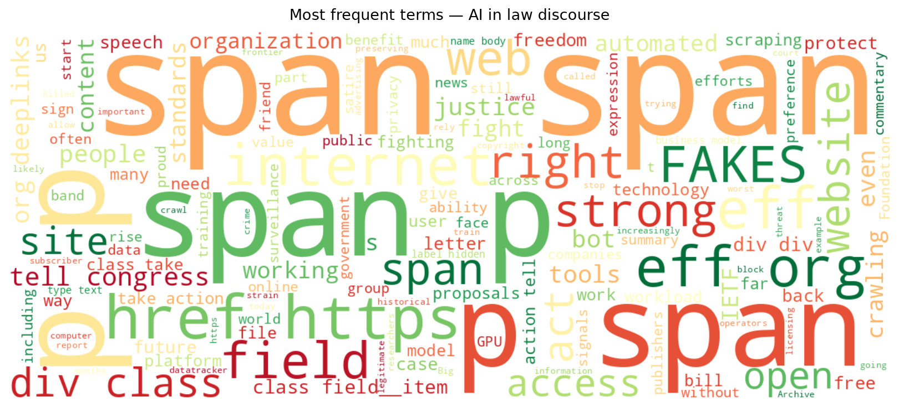
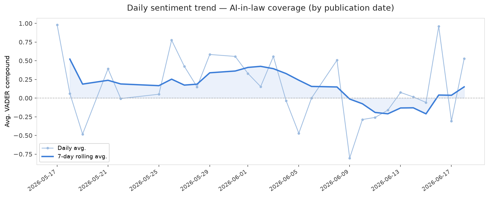
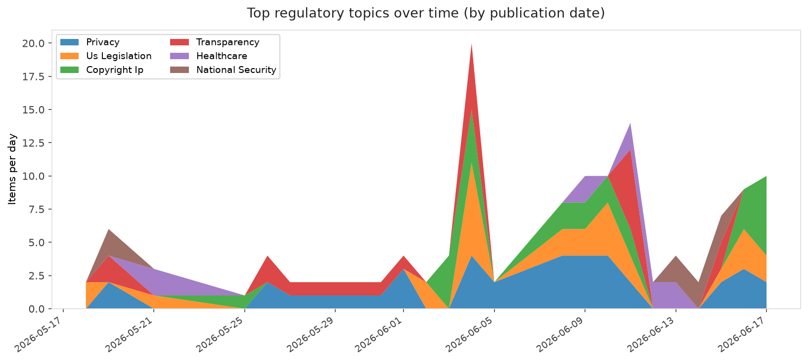
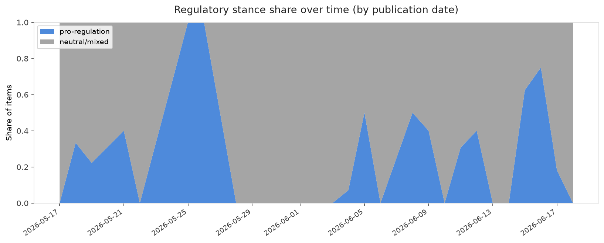

# AI in Law — Daily Sentiment Report
**Run date:** 2026-06-18 | **Items analyzed:** 7 | **Overall:** ⚪ Neutral / mixed (-0.024)

_Articles in this report were published between **2026-06-16** and **2026-06-18**._

---

## Summary

Today's collection covers **7** items from news outlets, academic preprints, Reddit, and regulatory sources.
Compared to the historical average of **+0.352**, today's sentiment is ↓ **0.376** points lower.

| Metric | Value |
|--------|-------|
| Positive items | 3 (42.9%) |
| Neutral items  | 0 (0.0%) |
| Negative items | 4 (57.1%) |
| Avg. VADER compound | -0.0235 |
| Pro-regulation items | 2 |
| Anti-regulation items | 0 |

---

## Top Topics Today

- **Copyright Ip** — 4 items
- **Us Legislation** — 2 items
- **Privacy** — 2 items
- **Bias Fairness** — 1 items

---

## Most Positive Coverage

- [Onward, Friends](https://www.eff.org/deeplinks/2026/06/farewell-now-friends)  
  _EFF DeepLinks_ — VADER: `+0.992`
- [The Free and Open Web Is Under Attack at the IETF](https://www.eff.org/deeplinks/2026/06/free-and-open-web-under-attack-ietf)  
  _EFF DeepLinks_ — VADER: `+0.827`
- [The AI Omnibus: a rollback of AI safeguards before they even apply](https://algorithmwatch.org/en/the-ai-omnibus-a-rollback-of-ai-safeguards-before-they-even-apply/)  
  _AlgorithmWatch_ — VADER: `+0.527`

---

## Most Critical / Negative Coverage

- [The NO FAKES Act Could Silence Satire, Commentary, And News](https://www.eff.org/deeplinks/2026/06/no-fakes-act-could-silence-satire-commentary-and-news)  
  _EFF DeepLinks_ — VADER: `-0.832`
- [Detecting Hidden ML Training With Zero-Overhead Telemetry](https://arxiv.org/abs/2606.19262v1)  
  _arXiv_ — VADER: `-0.821`
- [Vibe-decoding the White House-Anthropic fight over Fable](https://www.theverge.com/column/951516/trump-anthropic-feud-mythos-fable-white-house)  
  _The Verge AI_ — VADER: `-0.431`

---

## Visualizations — Today

## Visualizations — Trends Over Time

---

## Methodology

- **VADER** (Valence Aware Dictionary and sEntiment Reasoner) — compound score in [-1, 1].
- **Topic tagging** — regex keyword matching across 12 AI-law sub-domains.
- **Stance detection** — keyword-based pro/anti-regulation signal detection.
- **Date filter** — items are kept only if their *publication* date falls within the look-back window (default 2 days).
- Sources: RSS news feeds, arXiv academic API, Reddit (PRAW), Regulations.gov API.

_Generated automatically on 2026-06-18 14:13 UTC._
