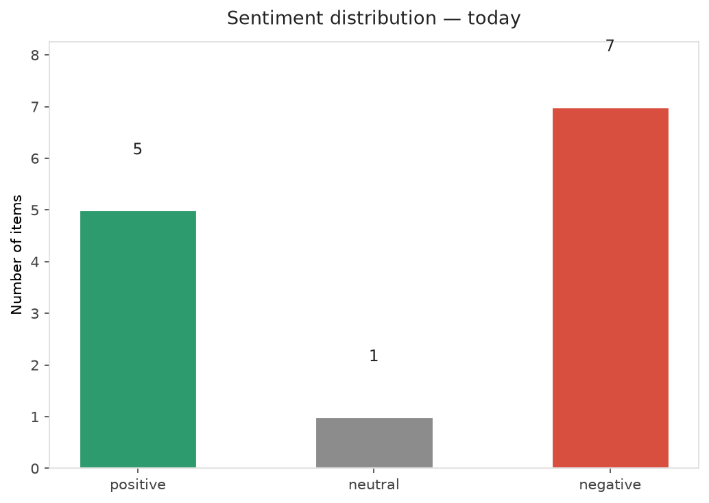
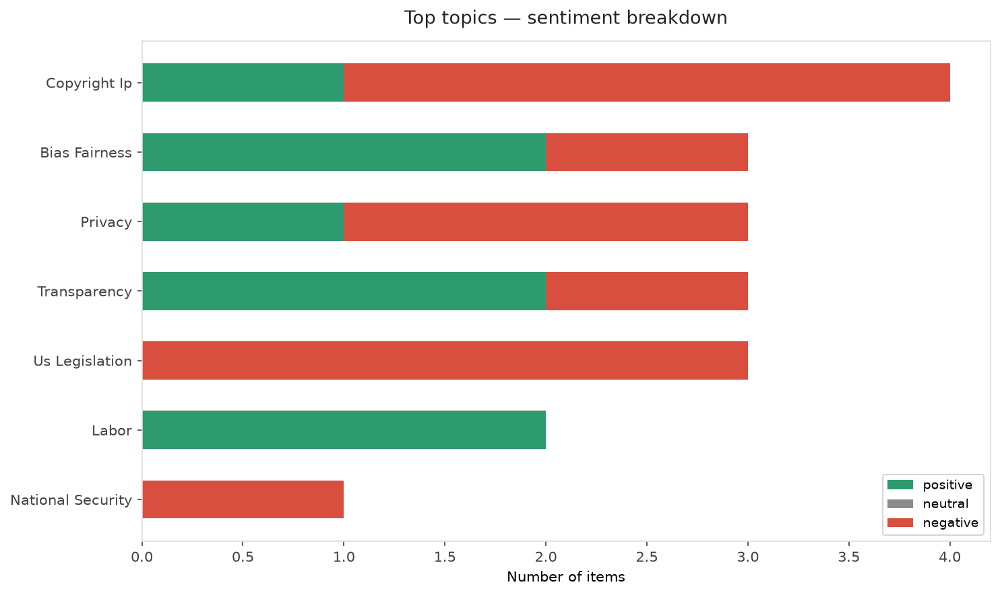
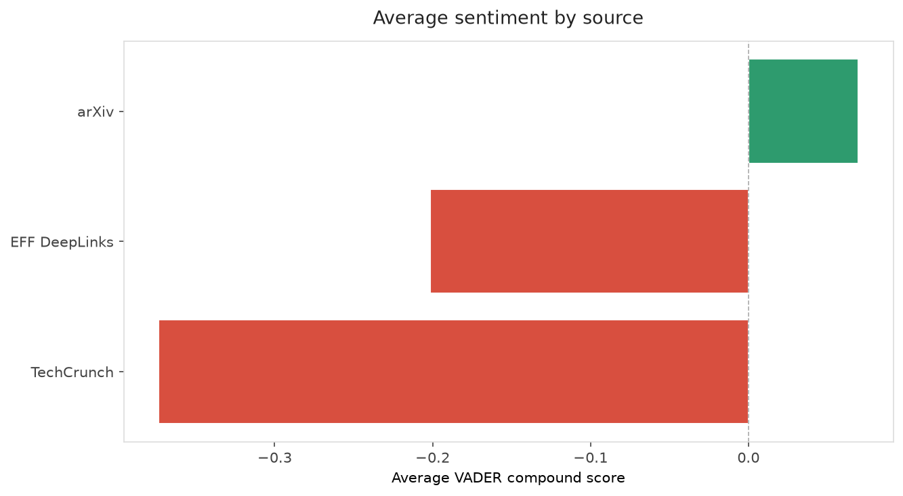
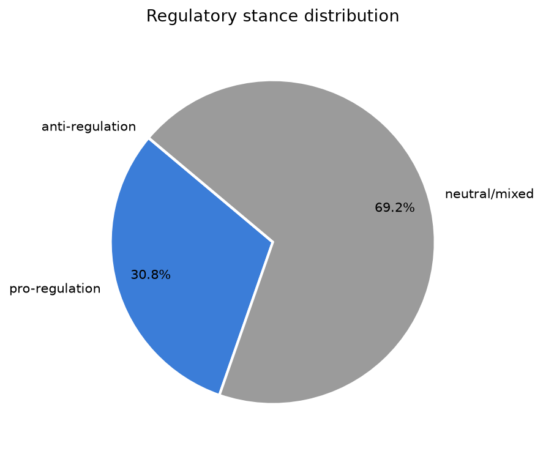
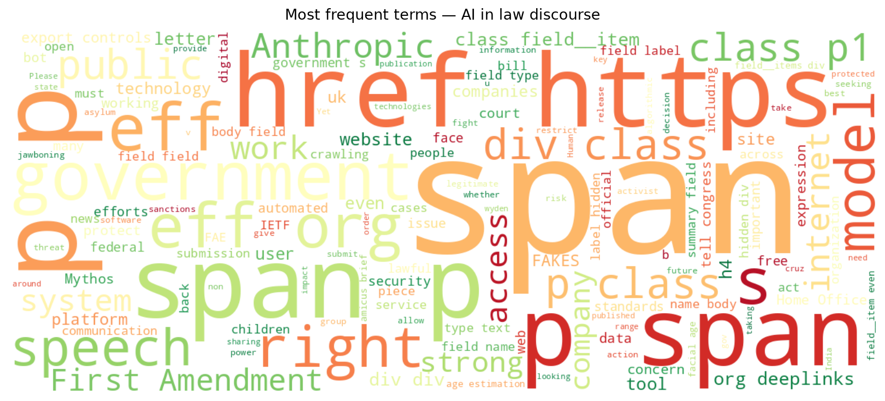
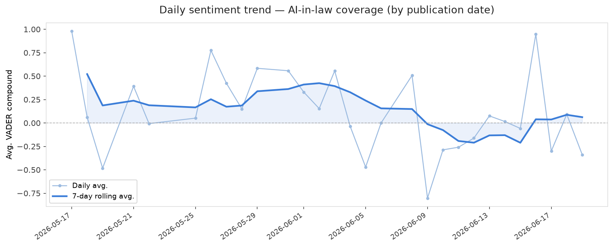
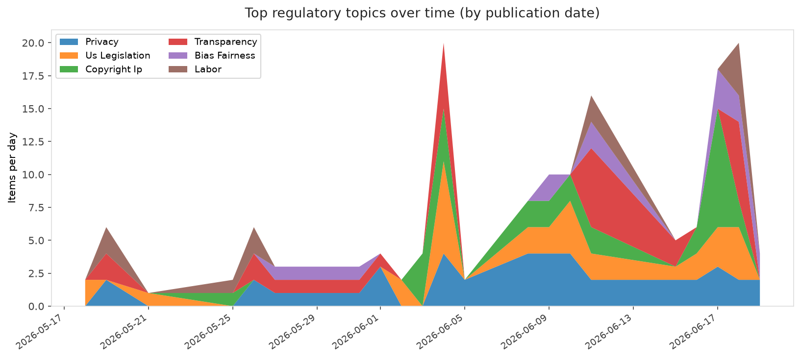
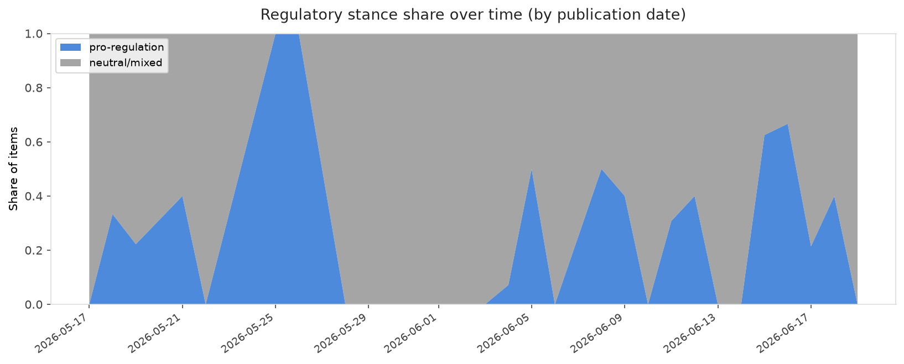

# AI in Law — Daily Sentiment Report
**Run date:** 2026-06-19 | **Items analyzed:** 13 | **Overall:** 🔴 Mildly negative (-0.116)

_Articles in this report were published between **2026-06-17** and **2026-06-19**._

---

## Summary

Today's collection covers **13** items from news outlets, academic preprints, Reddit, and regulatory sources.
Compared to the historical average of **+0.341**, today's sentiment is ↓ **0.457** points lower.

| Metric | Value |
|--------|-------|
| Positive items | 5 (38.5%) |
| Neutral items  | 1 (7.7%) |
| Negative items | 7 (53.8%) |
| Avg. VADER compound | -0.1157 |
| Pro-regulation items | 4 |
| Anti-regulation items | 0 |

---

## Top Topics Today

- **Copyright Ip** — 4 items
- **Bias Fairness** — 3 items
- **Privacy** — 3 items
- **Transparency** — 3 items
- **Us Legislation** — 3 items

---

## Most Positive Coverage

- [Call for Submissions: Digital Pride](https://www.eff.org/deeplinks/2026/06/call-submissions-digital-pride)  
  _EFF DeepLinks_ — VADER: `+0.977`
- [The Algorithmic-Human Manager: AI, Apps, and Workers in the Indian Gig Economy](https://arxiv.org/abs/2606.19975v1)  
  _arXiv_ — VADER: `+0.960`
- [The Free and Open Web Is Under Attack at the IETF](https://www.eff.org/deeplinks/2026/06/free-and-open-web-under-attack-ietf)  
  _EFF DeepLinks_ — VADER: `+0.827`

---

## Most Critical / Negative Coverage

- [EFF Joins 60+ Groups Urging the UK to Halt Face Estimation at the Border](https://www.eff.org/deeplinks/2026/06/joins-60-groups-urging-uk-halt-face-estimation-border)  
  _EFF DeepLinks_ — VADER: `-0.893`
- [The NO FAKES Act Could Silence Satire, Commentary, And News](https://www.eff.org/deeplinks/2026/06/no-fakes-act-could-silence-satire-commentary-and-news)  
  _EFF DeepLinks_ — VADER: `-0.832`
- [Detecting Hidden ML Training With Zero-Overhead Telemetry](https://arxiv.org/abs/2606.19262v1)  
  _arXiv_ — VADER: `-0.821`

---

## Visualizations — Today

## Visualizations — Trends Over Time

---

## Methodology

- **VADER** (Valence Aware Dictionary and sEntiment Reasoner) — compound score in [-1, 1].
- **Topic tagging** — regex keyword matching across 12 AI-law sub-domains.
- **Stance detection** — keyword-based pro/anti-regulation signal detection.
- **Date filter** — items are kept only if their *publication* date falls within the look-back window (default 2 days).
- Sources: RSS news feeds, arXiv academic API, Reddit (PRAW), Regulations.gov API.

_Generated automatically on 2026-06-19 14:15 UTC._
