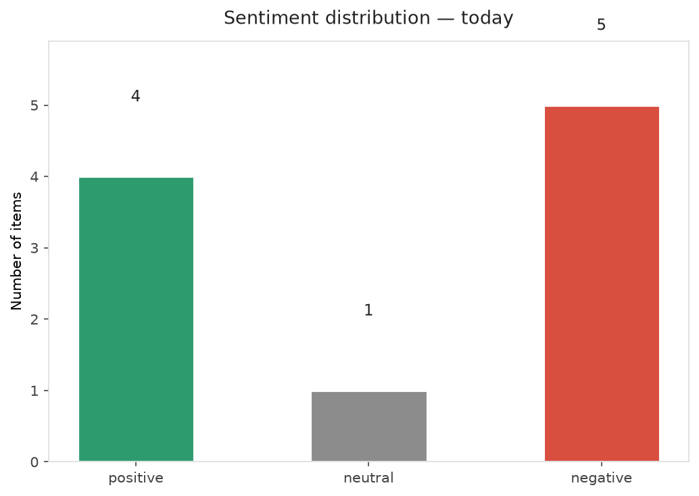
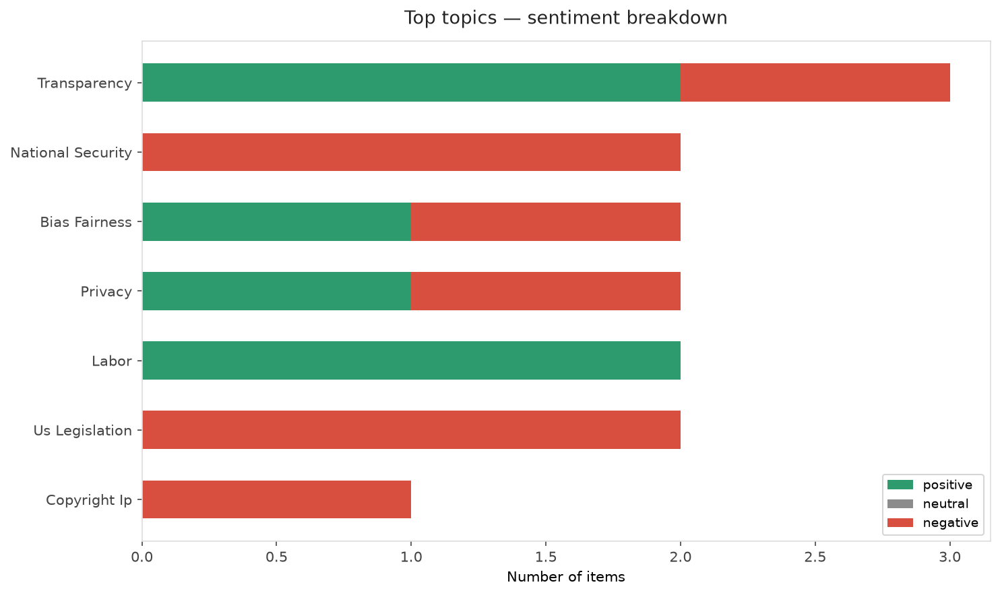
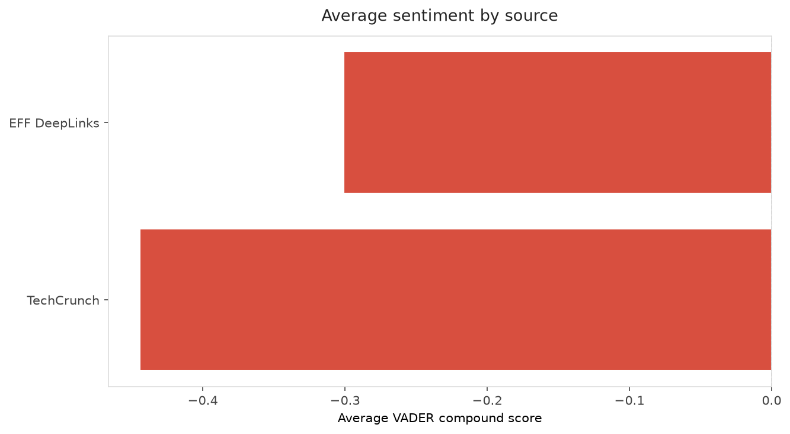
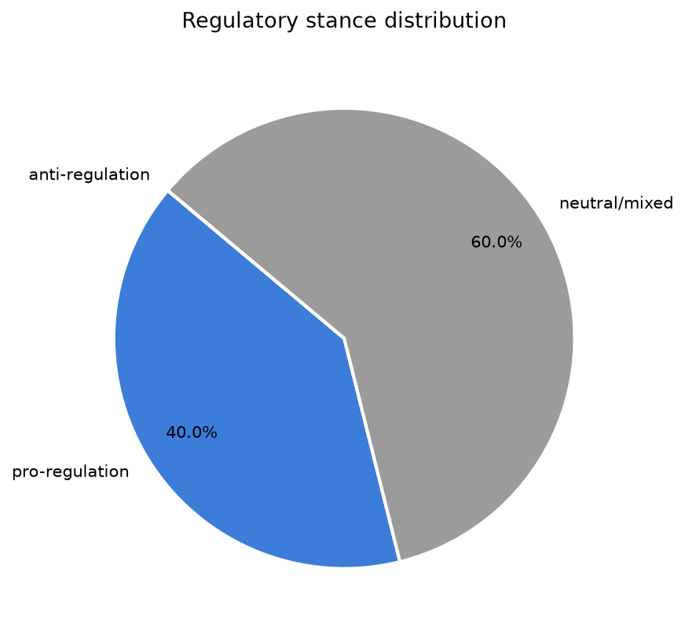
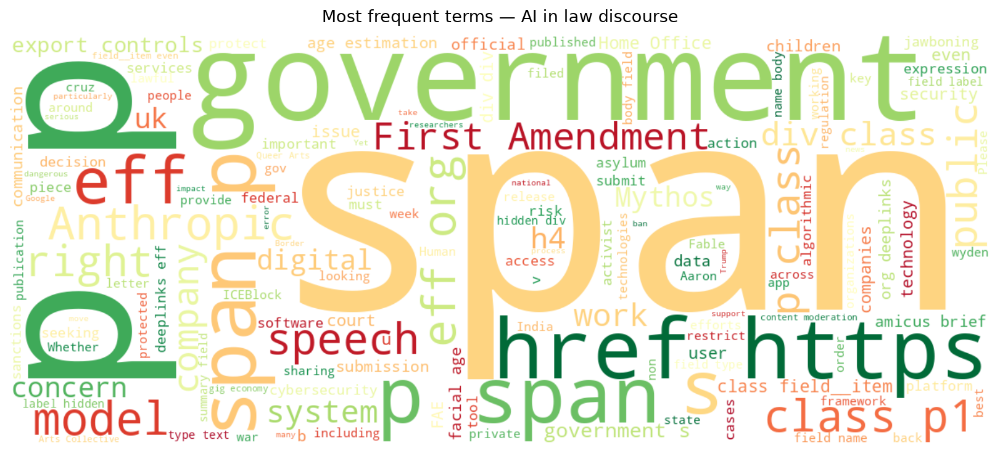
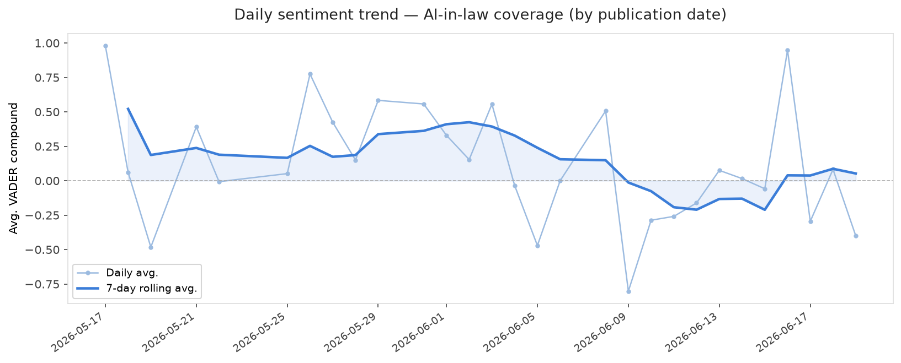
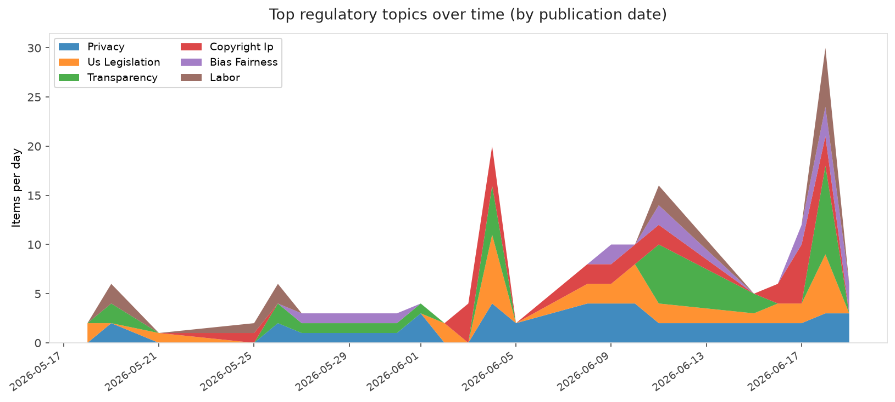
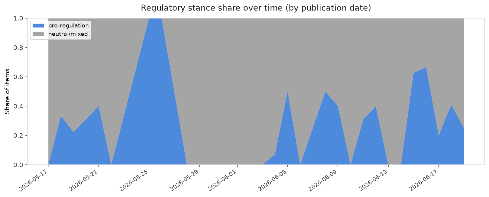

# AI in Law — Daily Sentiment Report
**Run date:** 2026-06-20 | **Items analyzed:** 10 | **Overall:** 🔴 Mildly negative (-0.083)

_Articles in this report were published between **2026-06-18** and **2026-06-19**._

---

## Summary

Today's collection covers **10** items from news outlets, academic preprints, Reddit, and regulatory sources.
Compared to the historical average of **+0.334**, today's sentiment is ↓ **0.417** points lower.

| Metric | Value |
|--------|-------|
| Positive items | 4 (40.0%) |
| Neutral items  | 1 (10.0%) |
| Negative items | 5 (50.0%) |
| Avg. VADER compound | -0.0833 |
| Pro-regulation items | 4 |
| Anti-regulation items | 0 |

---

## Top Topics Today

- **Transparency** — 3 items
- **National Security** — 2 items
- **Bias Fairness** — 2 items
- **Privacy** — 2 items
- **Labor** — 2 items

---

## Most Positive Coverage

- [Call for Submissions: Digital Pride](https://www.eff.org/deeplinks/2026/06/call-submissions-digital-pride)  
  _EFF DeepLinks_ — VADER: `+0.977`
- [The Algorithmic-Human Manager: AI, Apps, and Workers in the Indian Gig Economy](https://arxiv.org/abs/2606.19975v1)  
  _arXiv_ — VADER: `+0.960`
- [The AI Omnibus: a rollback of AI safeguards before they even apply](https://algorithmwatch.org/en/the-ai-omnibus-a-rollback-of-ai-safeguards-before-they-even-apply/)  
  _AlgorithmWatch_ — VADER: `+0.527`

---

## Most Critical / Negative Coverage

- [EFF Joins 60+ Groups Urging the UK to Halt Face Estimation at the Border](https://www.eff.org/deeplinks/2026/06/joins-60-groups-urging-uk-halt-face-estimation-border)  
  _EFF DeepLinks_ — VADER: `-0.893`
- [A New Bill Takes Aim at Government Pressure to Silence Lawful Online Speech](https://www.eff.org/deeplinks/2026/06/new-bill-takes-aim-government-pressure-silence-lawful-online-speech)  
  _EFF DeepLinks_ — VADER: `-0.818`
- [AI data centers just got a government-mandated fast lane to the grid](https://techcrunch.com/2026/06/18/ai-data-centers-just-got-a-government-mandated-fast-lane-to-the-grid/)  
  _TechCrunch_ — VADER: `-0.747`

---

## Visualizations — Today

## Visualizations — Trends Over Time

---

## Methodology

- **VADER** (Valence Aware Dictionary and sEntiment Reasoner) — compound score in [-1, 1].
- **Topic tagging** — regex keyword matching across 12 AI-law sub-domains.
- **Stance detection** — keyword-based pro/anti-regulation signal detection.
- **Date filter** — items are kept only if their *publication* date falls within the look-back window (default 2 days).
- Sources: RSS news feeds, arXiv academic API, Reddit (PRAW), Regulations.gov API.

_Generated automatically on 2026-06-20 12:30 UTC._
