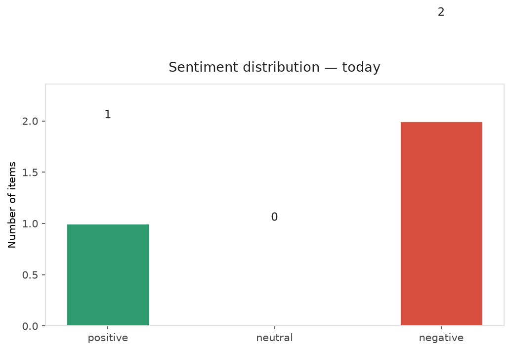
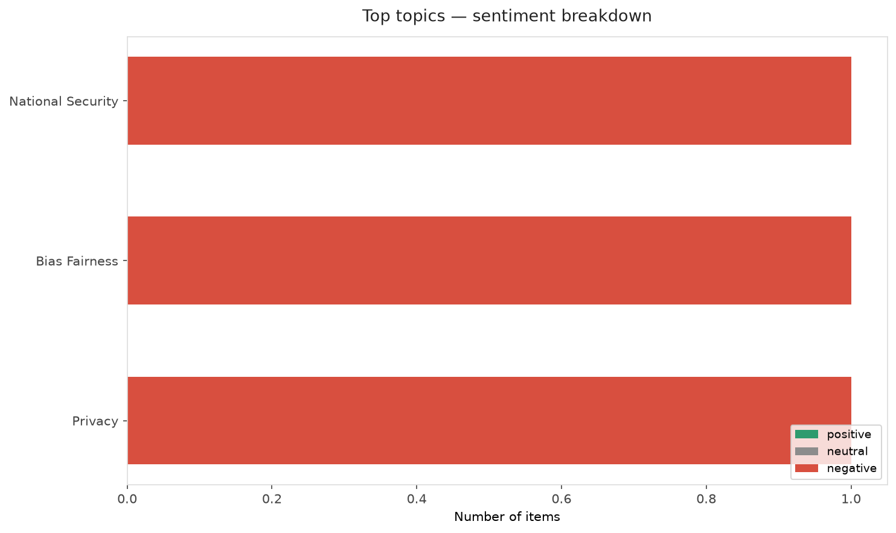
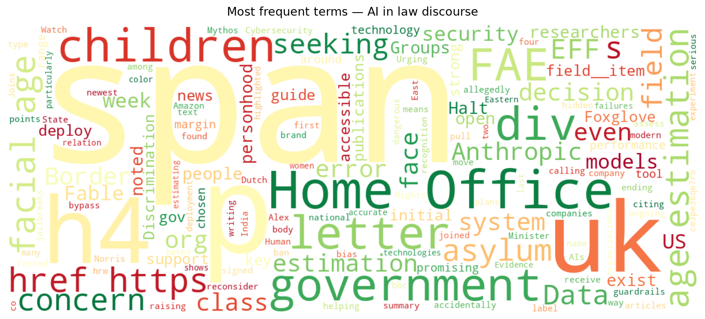
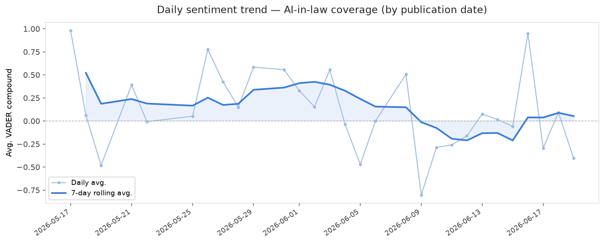
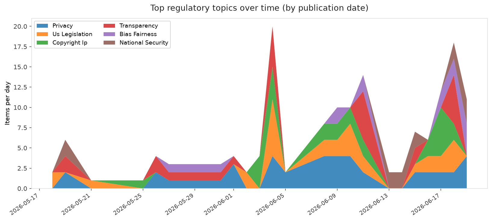
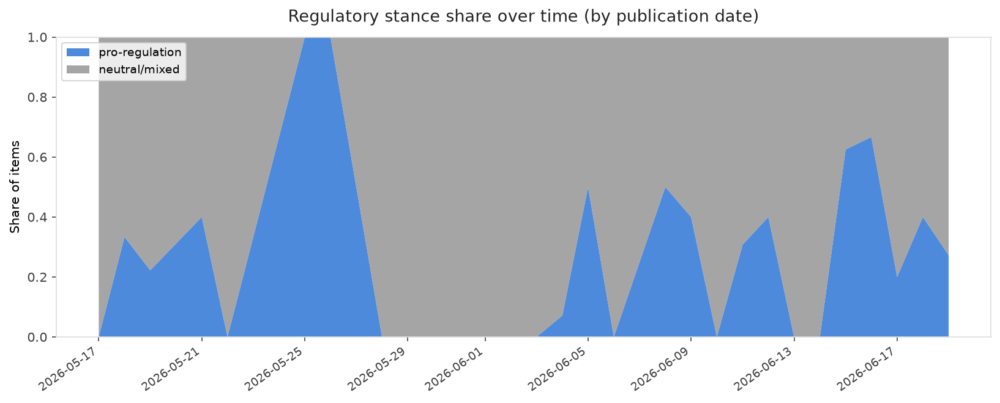

# AI in Law — Daily Sentiment Report
**Run date:** 2026-06-21 | **Items analyzed:** 3 | **Overall:** 🔴 Mildly negative (-0.421)

_Articles in this report were published between **2026-06-19** and **2026-06-19**._

---

## Summary

Today's collection covers **3** items from news outlets, academic preprints, Reddit, and regulatory sources.
Compared to the historical average of **+0.330**, today's sentiment is ↓ **0.750** points lower.

| Metric | Value |
|--------|-------|
| Positive items | 1 (33.3%) |
| Neutral items  | 0 (0.0%) |
| Negative items | 2 (66.7%) |
| Avg. VADER compound | -0.4206 |
| Pro-regulation items | 1 |
| Anti-regulation items | 0 |

---

## Top Topics Today

- **National Security** — 1 items
- **Bias Fairness** — 1 items
- **Privacy** — 1 items

---

## Most Positive Coverage

- [Should AIs be people too?](https://futureoflife.org/ai/should-ais-be-people-too/)  
  _Future of Life_ — VADER: `+0.217`
- [Is the US government’s Anthropic ban accidentally helping the brand?](https://techcrunch.com/video/is-the-us-governments-anthropic-ban-accidentally-helping-the-brand/)  
  _TechCrunch_ — VADER: `-0.586`
- [EFF Joins 60+ Groups Urging the UK to Halt Face Estimation at the Border](https://www.eff.org/deeplinks/2026/06/joins-60-groups-urging-uk-halt-face-estimation-border)  
  _EFF DeepLinks_ — VADER: `-0.893`

---

## Most Critical / Negative Coverage

- [EFF Joins 60+ Groups Urging the UK to Halt Face Estimation at the Border](https://www.eff.org/deeplinks/2026/06/joins-60-groups-urging-uk-halt-face-estimation-border)  
  _EFF DeepLinks_ — VADER: `-0.893`
- [Is the US government’s Anthropic ban accidentally helping the brand?](https://techcrunch.com/video/is-the-us-governments-anthropic-ban-accidentally-helping-the-brand/)  
  _TechCrunch_ — VADER: `-0.586`
- [Should AIs be people too?](https://futureoflife.org/ai/should-ais-be-people-too/)  
  _Future of Life_ — VADER: `+0.217`

---

## Visualizations — Today

## Visualizations — Trends Over Time

---

## Methodology

- **VADER** (Valence Aware Dictionary and sEntiment Reasoner) — compound score in [-1, 1].
- **Topic tagging** — regex keyword matching across 12 AI-law sub-domains.
- **Stance detection** — keyword-based pro/anti-regulation signal detection.
- **Date filter** — items are kept only if their *publication* date falls within the look-back window (default 2 days).
- Sources: RSS news feeds, arXiv academic API, Reddit (PRAW), Regulations.gov API.

_Generated automatically on 2026-06-21 13:08 UTC._
