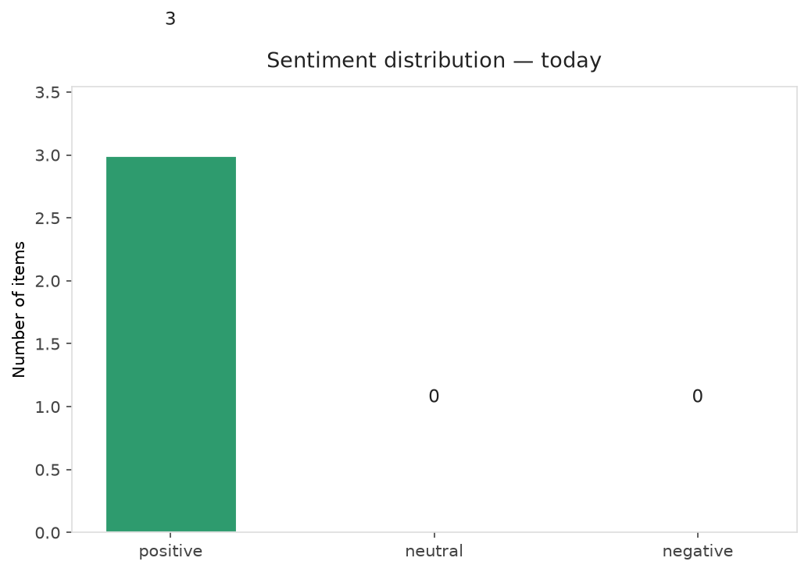
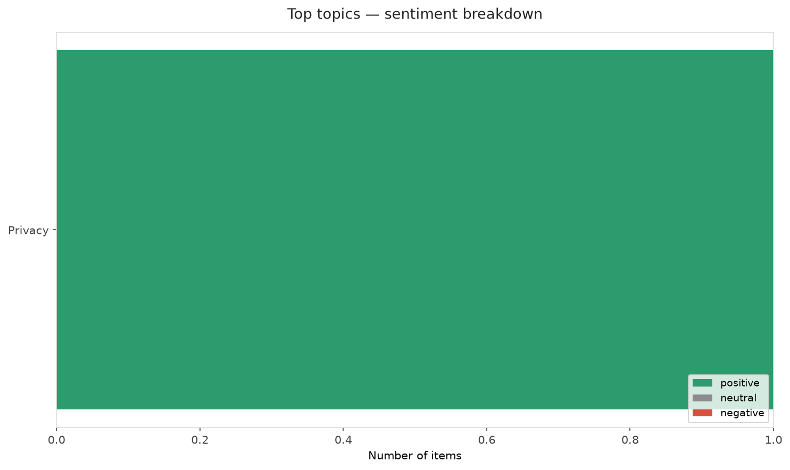
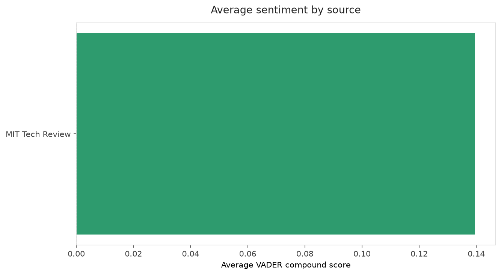
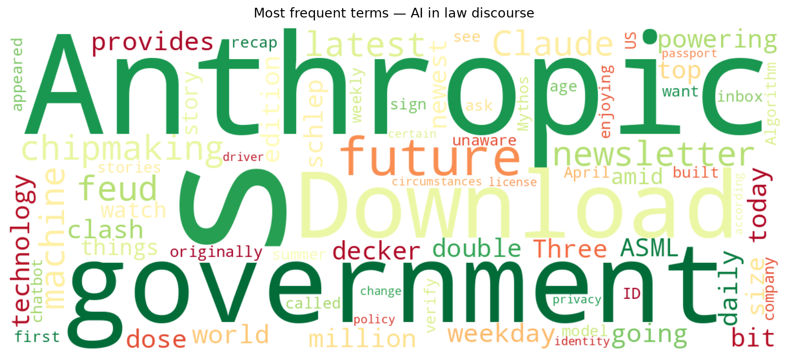
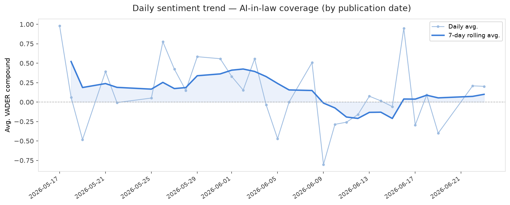
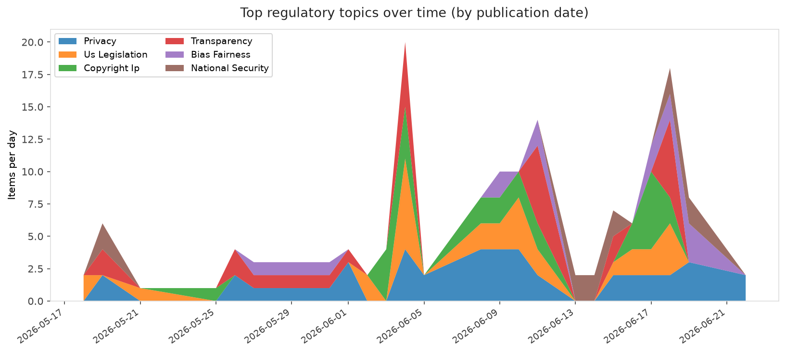
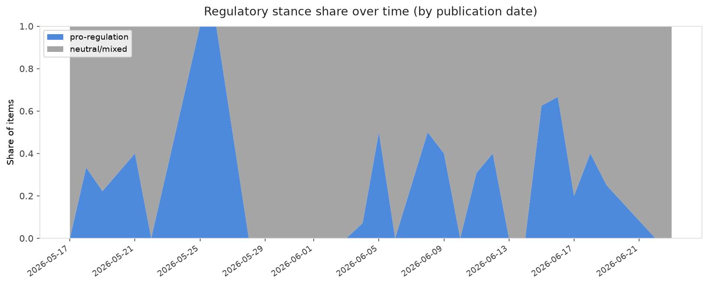

# AI in Law — Daily Sentiment Report
**Run date:** 2026-06-23 | **Items analyzed:** 3 | **Overall:** 🟢 Mildly positive (+0.207)

_Articles in this report were published between **2026-06-22** and **2026-06-23**._

---

## Summary

Today's collection covers **3** items from news outlets, academic preprints, Reddit, and regulatory sources.
Compared to the historical average of **+0.329**, today's sentiment is ↓ **0.123** points lower.

| Metric | Value |
|--------|-------|
| Positive items | 3 (100.0%) |
| Neutral items  | 0 (0.0%) |
| Negative items | 0 (0.0%) |
| Avg. VADER compound | +0.2065 |
| Pro-regulation items | 0 |
| Anti-regulation items | 0 |

---

## Top Topics Today

- **Privacy** — 1 items

---

## Most Positive Coverage

- [Anthropic says Claude may want to see your ID](https://techcrunch.com/2026/06/22/anthropic-says-claude-may-want-to-see-your-id/)  
  _TechCrunch_ — VADER: `+0.340`
- [The Download: the future of chipmaking and Anthropic’s government clash](https://www.technologyreview.com/2026/06/23/1139483/the-download-chipmaking-future-asml-ai-anthropic-government-clash/)  
  _MIT Tech Review_ — VADER: `+0.202`
- [Three things to watch amid Anthropic’s latest feud with the government](https://www.technologyreview.com/2026/06/22/1139424/three-things-to-watch-amid-anthropics-latest-feud-with-the-government/)  
  _MIT Tech Review_ — VADER: `+0.077`

---

## Most Critical / Negative Coverage

- [Three things to watch amid Anthropic’s latest feud with the government](https://www.technologyreview.com/2026/06/22/1139424/three-things-to-watch-amid-anthropics-latest-feud-with-the-government/)  
  _MIT Tech Review_ — VADER: `+0.077`
- [The Download: the future of chipmaking and Anthropic’s government clash](https://www.technologyreview.com/2026/06/23/1139483/the-download-chipmaking-future-asml-ai-anthropic-government-clash/)  
  _MIT Tech Review_ — VADER: `+0.202`
- [Anthropic says Claude may want to see your ID](https://techcrunch.com/2026/06/22/anthropic-says-claude-may-want-to-see-your-id/)  
  _TechCrunch_ — VADER: `+0.340`

---

## Visualizations — Today

## Visualizations — Trends Over Time

---

## Methodology

- **VADER** (Valence Aware Dictionary and sEntiment Reasoner) — compound score in [-1, 1].
- **Topic tagging** — regex keyword matching across 12 AI-law sub-domains.
- **Stance detection** — keyword-based pro/anti-regulation signal detection.
- **Date filter** — items are kept only if their *publication* date falls within the look-back window (default 2 days).
- Sources: RSS news feeds, arXiv academic API, Reddit (PRAW), Regulations.gov API.

_Generated automatically on 2026-06-23 13:45 UTC._
