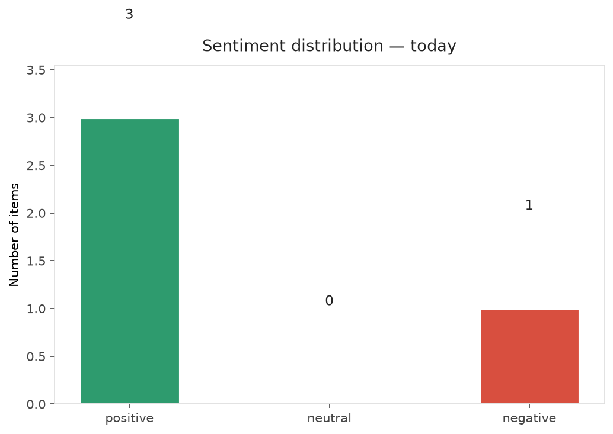
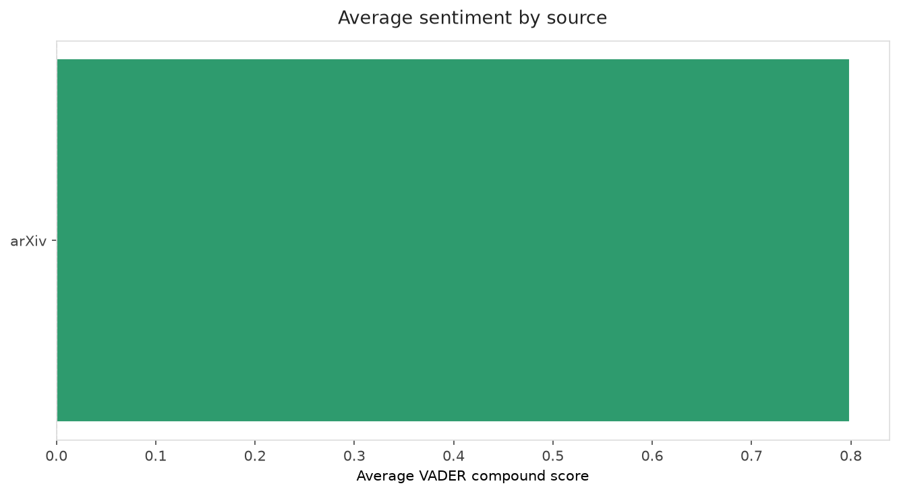
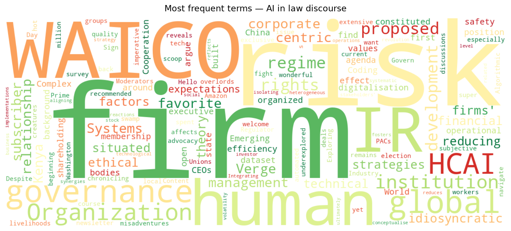
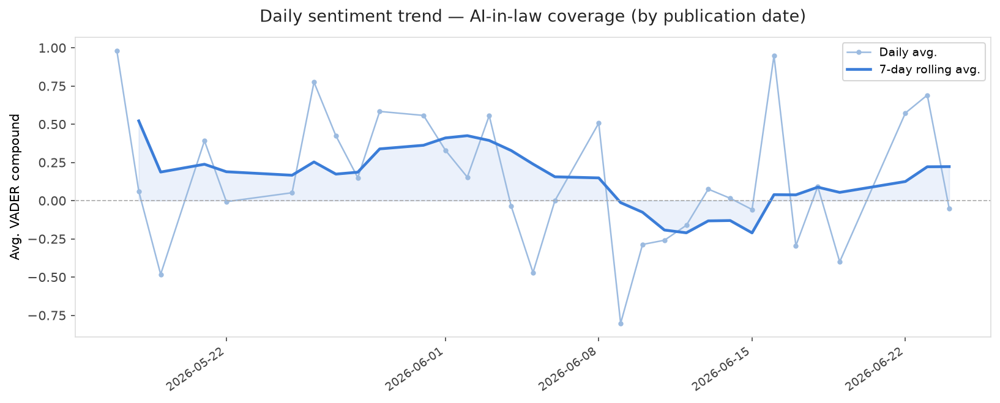
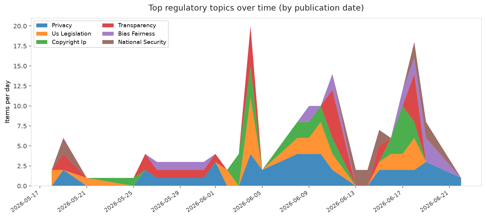
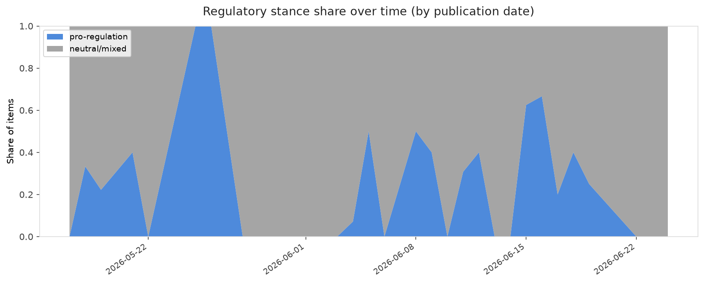

# AI in Law — Daily Sentiment Report
**Run date:** 2026-06-24 | **Items analyzed:** 4 | **Overall:** 🟢 Mildly positive (+0.628)

_Articles in this report were published between **2026-06-22** and **2026-06-24**._

---

## Summary

Today's collection covers **4** items from news outlets, academic preprints, Reddit, and regulatory sources.
Compared to the historical average of **+0.331**, today's sentiment is ↑ **0.297** points higher.

| Metric | Value |
|--------|-------|
| Positive items | 3 (75.0%) |
| Neutral items  | 0 (0.0%) |
| Negative items | 1 (25.0%) |
| Avg. VADER compound | +0.6278 |
| Pro-regulation items | 0 |
| Anti-regulation items | 0 |

---

## Top Topics Today

_No strong topic signals detected today._

---

## Most Positive Coverage

- [Why corporate AI super PACs spent $27 million on a local election](https://www.theverge.com/policy/954970/ai-super-pacs-alex-bores-new-york-12th-district)  
  _The Verge AI_ — VADER: `+0.965`
- [World Artificial Intelligence Cooperation Organization (WAICO): Mapping an Emerging Institution in t](https://arxiv.org/abs/2606.23860v1)  
  _arXiv_ — VADER: `+0.938`
- [Exploring the relationship between human-centric AI and firm idiosyncratic risks](https://arxiv.org/abs/2606.24224v1)  
  _arXiv_ — VADER: `+0.660`

---

## Most Critical / Negative Coverage

- [How Algorithmic Systems Govern Kenya’s Content Moderators](https://algorithmwatch.org/en/scored-and-silenced-how-algorithmic-systems-govern-kenyas-content-moderators/)  
  _AlgorithmWatch_ — VADER: `-0.052`
- [Exploring the relationship between human-centric AI and firm idiosyncratic risks](https://arxiv.org/abs/2606.24224v1)  
  _arXiv_ — VADER: `+0.660`
- [World Artificial Intelligence Cooperation Organization (WAICO): Mapping an Emerging Institution in t](https://arxiv.org/abs/2606.23860v1)  
  _arXiv_ — VADER: `+0.938`

---

## Visualizations — Today

## Visualizations — Trends Over Time

---

## Methodology

- **VADER** (Valence Aware Dictionary and sEntiment Reasoner) — compound score in [-1, 1].
- **Topic tagging** — regex keyword matching across 12 AI-law sub-domains.
- **Stance detection** — keyword-based pro/anti-regulation signal detection.
- **Date filter** — items are kept only if their *publication* date falls within the look-back window (default 2 days).
- Sources: RSS news feeds, arXiv academic API, Reddit (PRAW), Regulations.gov API.

_Generated automatically on 2026-06-24 13:25 UTC._
