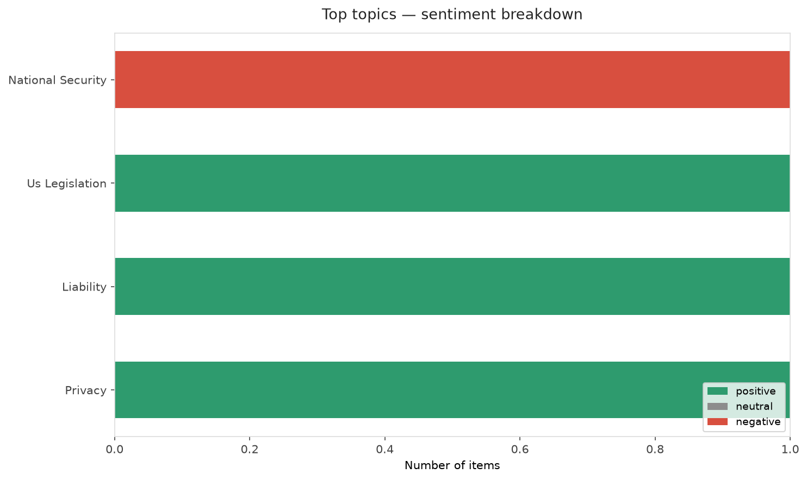
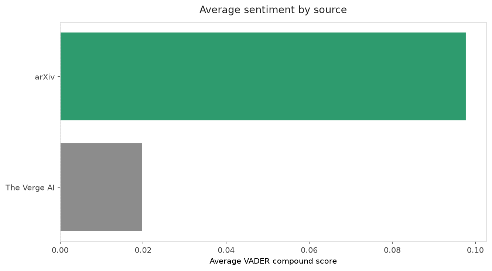
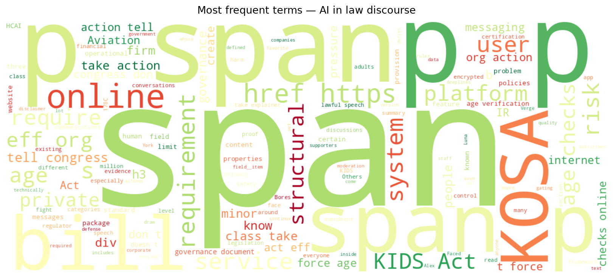
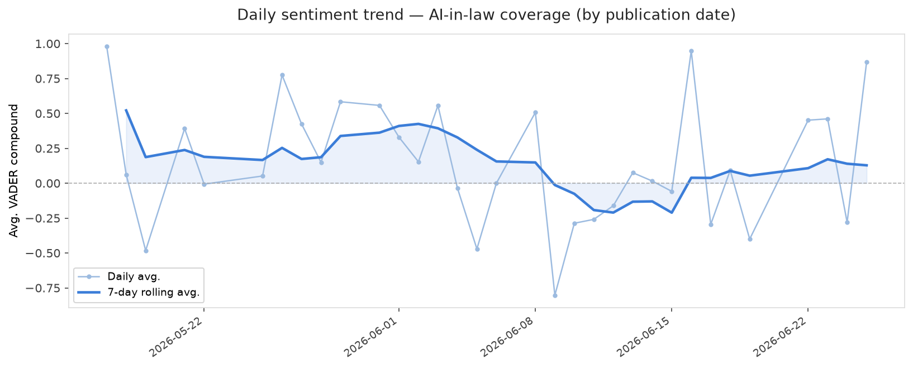
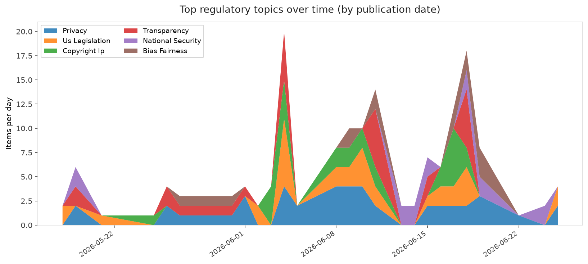
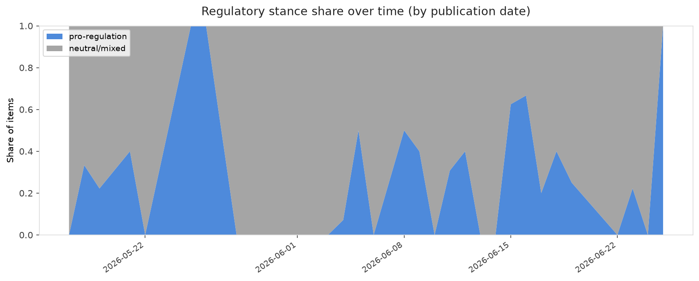

# AI in Law — Daily Sentiment Report
**Run date:** 2026-06-25 | **Items analyzed:** 7 | **Overall:** 🟢 Mildly positive (+0.153)

_Articles in this report were published between **2026-06-23** and **2026-06-25**._

---

## Summary

Today's collection covers **7** items from news outlets, academic preprints, Reddit, and regulatory sources.
Compared to the historical average of **+0.329**, today's sentiment is ↓ **0.176** points lower.

| Metric | Value |
|--------|-------|
| Positive items | 3 (42.9%) |
| Neutral items  | 0 (0.0%) |
| Negative items | 4 (57.1%) |
| Avg. VADER compound | +0.1532 |
| Pro-regulation items | 2 |
| Anti-regulation items | 0 |

---

## Top Topics Today

- **National Security** — 1 items
- **Us Legislation** — 1 items
- **Liability** — 1 items
- **Privacy** — 1 items

---

## Most Positive Coverage

- [Why corporate AI super PACs spent $27 million on a local election](https://www.theverge.com/policy/954970/ai-super-pacs-alex-bores-new-york-12th-district)  
  _The Verge AI_ — VADER: `+0.965`
- [The KIDS Act Would Require Age Checks To Get Online](https://www.eff.org/deeplinks/2026/06/kids-act-would-require-age-checks-get-online)  
  _EFF DeepLinks_ — VADER: `+0.869`
- [Exploring the relationship between human-centric AI and firm idiosyncratic risks](https://arxiv.org/abs/2606.24224v1)  
  _arXiv_ — VADER: `+0.660`

---

## Most Critical / Negative Coverage

- [The $27 million Al proxy war over Alex Bores ends in a draw](https://www.theverge.com/ai-artificial-intelligence/956263/alex-bores-new-york-12th-district-congressional-primary-results)  
  _The Verge AI_ — VADER: `-0.840`
- [Fifty Years of Specification Completeness: What Aviation Certification Tells AI Governance About Epo](https://arxiv.org/abs/2606.25120v1)  
  _arXiv_ — VADER: `-0.464`
- [Congresswoman denies staff used AI to write defense funding amendment](https://www.theverge.com/policy/956394/florida-anna-paulina-luna-anthropic-claude)  
  _The Verge AI_ — VADER: `-0.065`

---

## Visualizations — Today

## Visualizations — Trends Over Time

---

## Methodology

- **VADER** (Valence Aware Dictionary and sEntiment Reasoner) — compound score in [-1, 1].
- **Topic tagging** — regex keyword matching across 12 AI-law sub-domains.
- **Stance detection** — keyword-based pro/anti-regulation signal detection.
- **Date filter** — items are kept only if their *publication* date falls within the look-back window (default 2 days).
- Sources: RSS news feeds, arXiv academic API, Reddit (PRAW), Regulations.gov API.

_Generated automatically on 2026-06-25 13:21 UTC._
