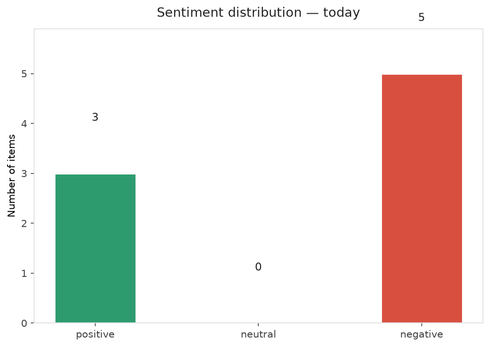
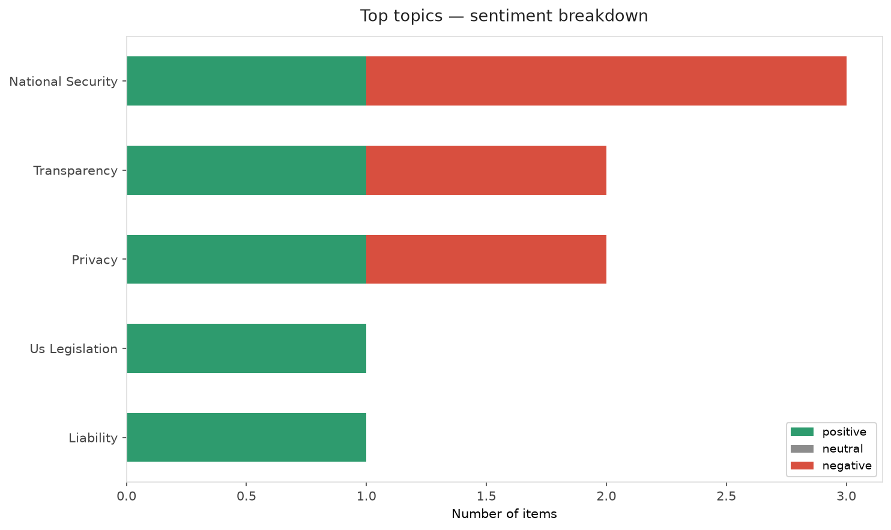
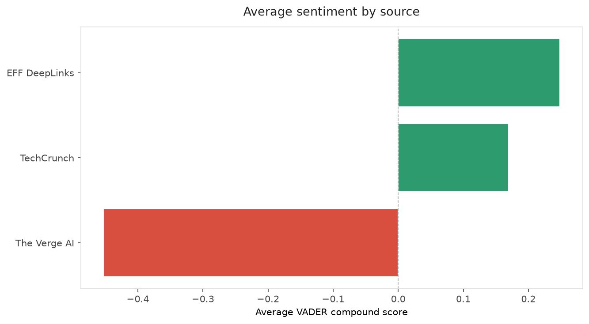
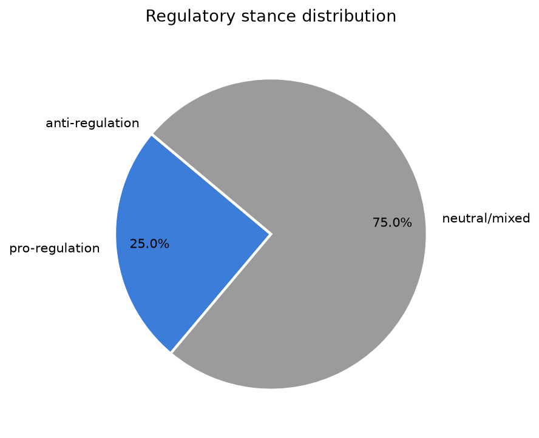
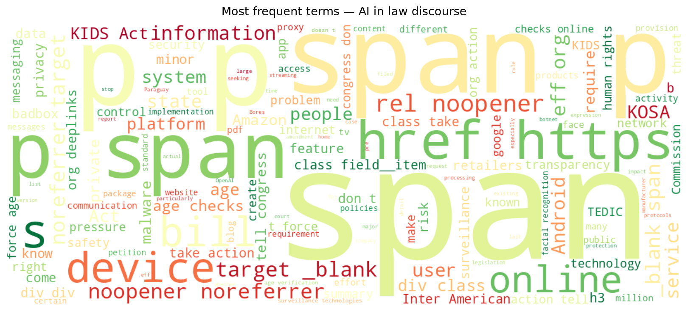
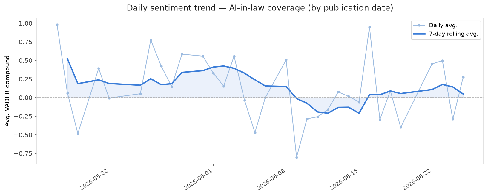
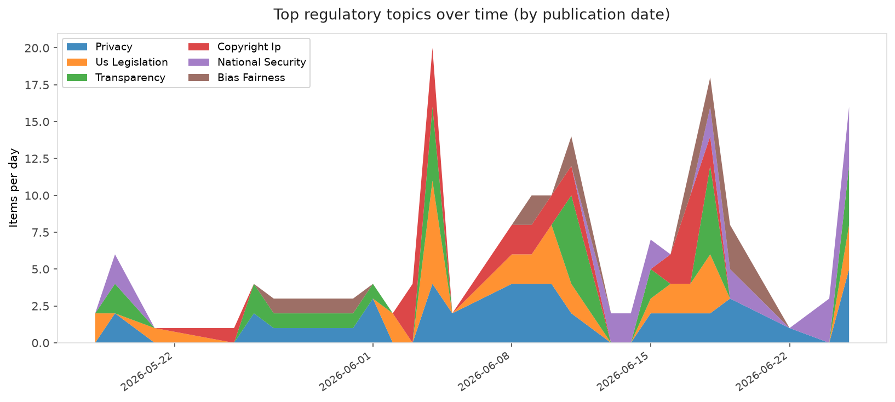
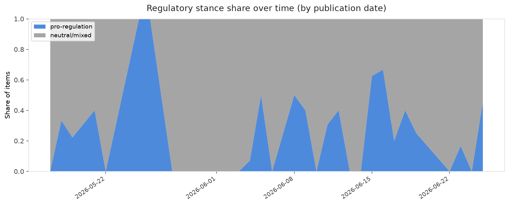

# AI in Law — Daily Sentiment Report
**Run date:** 2026-06-26 | **Items analyzed:** 8 | **Overall:** ⚪ Neutral / mixed (+0.016)

_Articles in this report were published between **2026-06-24** and **2026-06-25**._

---

## Summary

Today's collection covers **8** items from news outlets, academic preprints, Reddit, and regulatory sources.
Compared to the historical average of **+0.325**, today's sentiment is ↓ **0.309** points lower.

| Metric | Value |
|--------|-------|
| Positive items | 3 (37.5%) |
| Neutral items  | 0 (0.0%) |
| Negative items | 5 (62.5%) |
| Avg. VADER compound | +0.0158 |
| Pro-regulation items | 2 |
| Anti-regulation items | 0 |

---

## Top Topics Today

- **National Security** — 3 items
- **Transparency** — 2 items
- **Privacy** — 2 items
- **Us Legislation** — 1 items
- **Liability** — 1 items

---

## Most Positive Coverage

- [The KIDS Act Would Require Age Checks To Get Online](https://www.eff.org/deeplinks/2026/06/kids-act-would-require-age-checks-get-online)  
  _EFF DeepLinks_ — VADER: `+0.869`
- [Primed for Malware: Stop Selling Compromised Android Devices](https://www.eff.org/deeplinks/2026/06/primed-malware-stop-selling-compromised-android-devices)  
  _EFF DeepLinks_ — VADER: `+0.823`
- [The White House is asking OpenAI to slow roll the release of its new model over safety concerns](https://techcrunch.com/2026/06/25/the-white-house-is-asking-openai-to-slow-roll-the-release-of-its-new-model-over-safety-concerns/)  
  _TechCrunch_ — VADER: `+0.612`

---

## Most Critical / Negative Coverage

- [EFF, TEDIC and CEJIL Challenge Secrecy in the Use of Face Recognition in Paraguay](https://www.eff.org/deeplinks/2026/06/eff-tedic-and-cejil-challenge-secrecy-use-face-recognition-paraguay)  
  _EFF DeepLinks_ — VADER: `-0.947`
- [The $27 million Al proxy war over Alex Bores ends in a draw](https://www.theverge.com/ai-artificial-intelligence/956263/alex-bores-new-york-12th-district-congressional-primary-results)  
  _The Verge AI_ — VADER: `-0.840`
- [Databricks’ former AI chief thinks he can cut AI’s power bill by 1,000x](https://techcrunch.com/2026/06/25/databricks-former-ai-chief-thinks-he-can-cut-ais-power-bill-by-1000x/)  
  _TechCrunch_ — VADER: `-0.273`

---

## Visualizations — Today

## Visualizations — Trends Over Time

---

## Methodology

- **VADER** (Valence Aware Dictionary and sEntiment Reasoner) — compound score in [-1, 1].
- **Topic tagging** — regex keyword matching across 12 AI-law sub-domains.
- **Stance detection** — keyword-based pro/anti-regulation signal detection.
- **Date filter** — items are kept only if their *publication* date falls within the look-back window (default 2 days).
- Sources: RSS news feeds, arXiv academic API, Reddit (PRAW), Regulations.gov API.

_Generated automatically on 2026-06-26 13:13 UTC._
