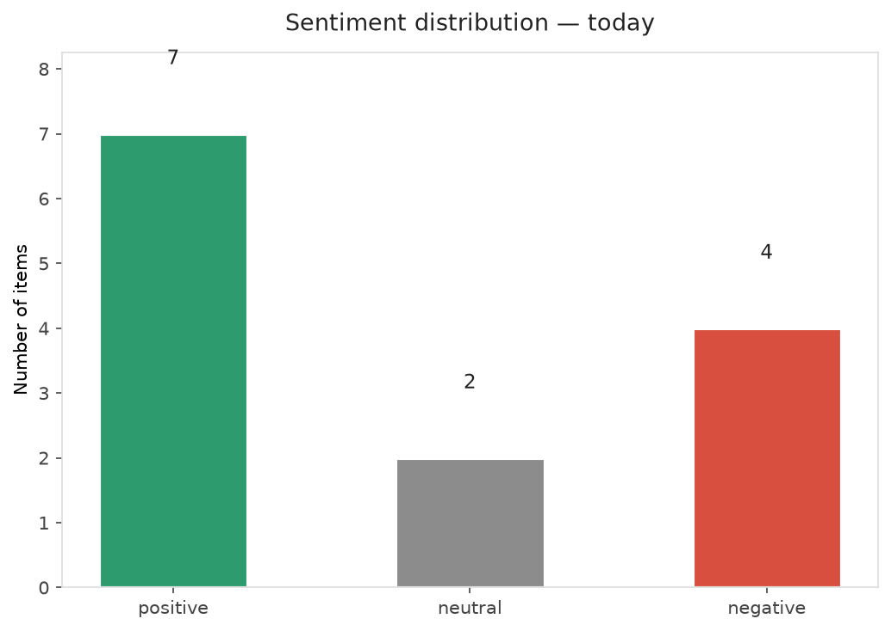
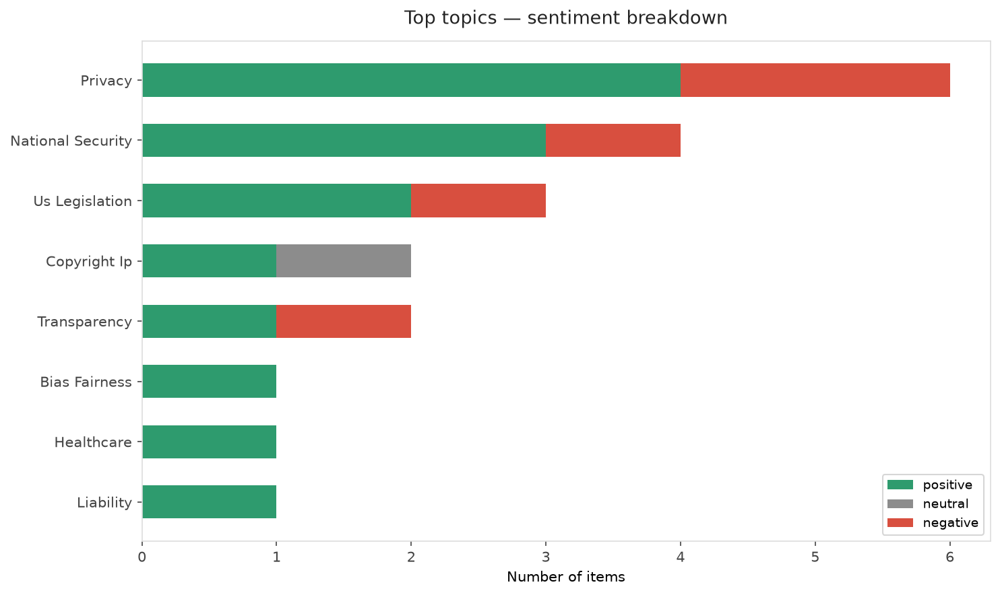
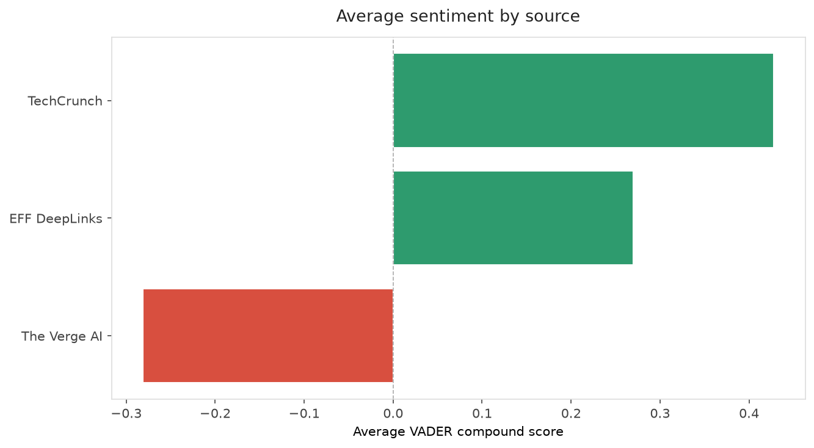
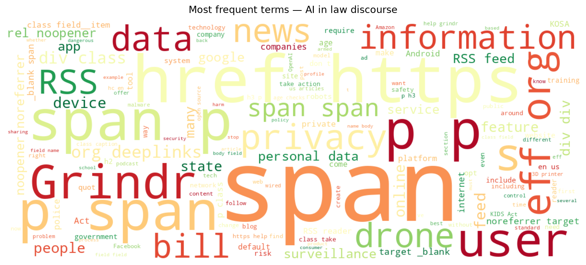
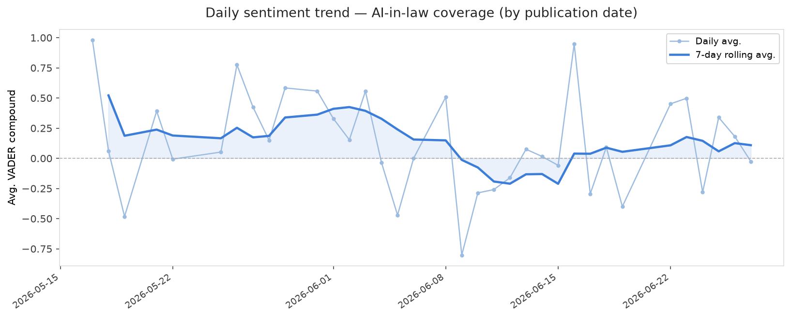
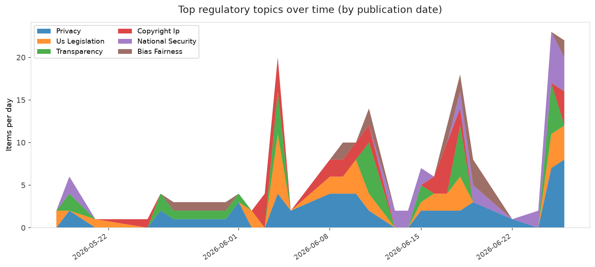
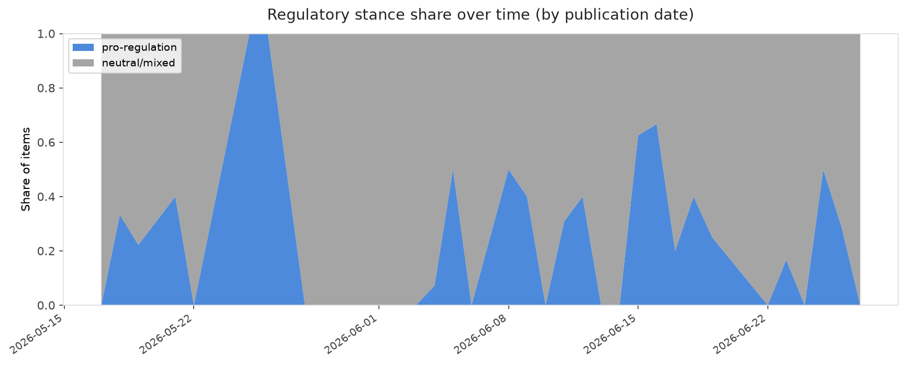

# AI in Law — Daily Sentiment Report
**Run date:** 2026-06-27 | **Items analyzed:** 13 | **Overall:** 🟢 Mildly positive (+0.201)

_Articles in this report were published between **2026-06-25** and **2026-06-27**._

---

## Summary

Today's collection covers **13** items from news outlets, academic preprints, Reddit, and regulatory sources.
Compared to the historical average of **+0.322**, today's sentiment is ↓ **0.121** points lower.

| Metric | Value |
|--------|-------|
| Positive items | 7 (53.8%) |
| Neutral items  | 2 (15.4%) |
| Negative items | 4 (30.8%) |
| Avg. VADER compound | +0.2009 |
| Pro-regulation items | 4 |
| Anti-regulation items | 0 |

---

## Top Topics Today

- **Privacy** — 6 items
- **National Security** — 4 items
- **Us Legislation** — 3 items
- **Copyright Ip** — 2 items
- **Transparency** — 2 items

---

## Most Positive Coverage

- [Hate “The Algorithm?” RSS Is One of the Tools You’ve Been Looking For](https://www.eff.org/deeplinks/2026/06/hate-algorithm-rss-one-tools-youve-been-looking)  
  _EFF DeepLinks_ — VADER: `+0.925`
- [The KIDS Act Would Require Age Checks To Get Online](https://www.eff.org/deeplinks/2026/06/kids-act-would-require-age-checks-get-online)  
  _EFF DeepLinks_ — VADER: `+0.869`
- [Primed for Malware: Stop Selling Compromised Android Devices](https://www.eff.org/deeplinks/2026/06/primed-malware-stop-selling-compromised-android-devices)  
  _EFF DeepLinks_ — VADER: `+0.823`

---

## Most Critical / Negative Coverage

- [EFF, TEDIC and CEJIL Challenge Secrecy in the Use of Face Recognition in Paraguay](https://www.eff.org/deeplinks/2026/06/eff-tedic-and-cejil-challenge-secrecy-use-face-recognition-paraguay)  
  _EFF DeepLinks_ — VADER: `-0.908`
- [We Can Still Stop California’s 3D Printer Surveillance Scheme](https://www.eff.org/deeplinks/2026/06/we-can-still-stop-californias-3d-printer-surveillance-scheme)  
  _EFF DeepLinks_ — VADER: `-0.819`
- [OpenAI unveils GPT-5.6 amid US AI regulatory drama](https://www.theverge.com/ai-artificial-intelligence/957845/openai-gpt-5-6-trump-administration-ai-preview)  
  _The Verge AI_ — VADER: `-0.511`

---

## Visualizations — Today

## Visualizations — Trends Over Time

---

## Methodology

- **VADER** (Valence Aware Dictionary and sEntiment Reasoner) — compound score in [-1, 1].
- **Topic tagging** — regex keyword matching across 12 AI-law sub-domains.
- **Stance detection** — keyword-based pro/anti-regulation signal detection.
- **Date filter** — items are kept only if their *publication* date falls within the look-back window (default 2 days).
- Sources: RSS news feeds, arXiv academic API, Reddit (PRAW), Regulations.gov API.

_Generated automatically on 2026-06-27 12:11 UTC._
