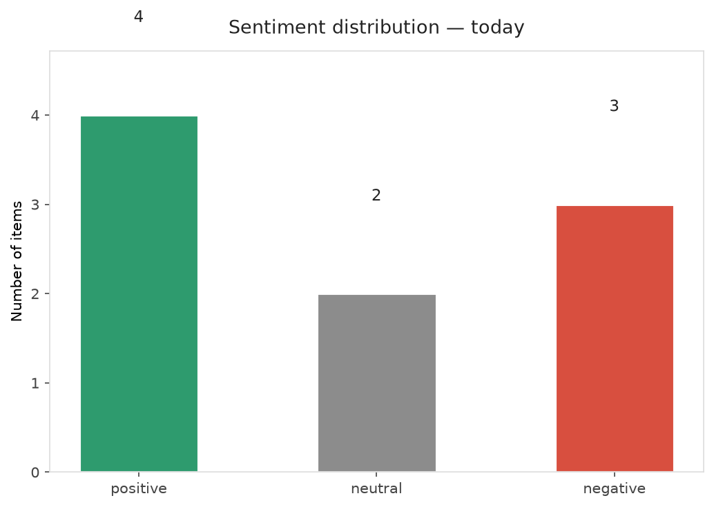
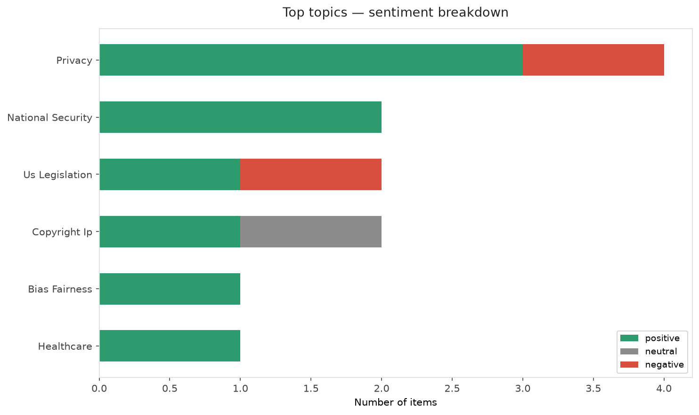
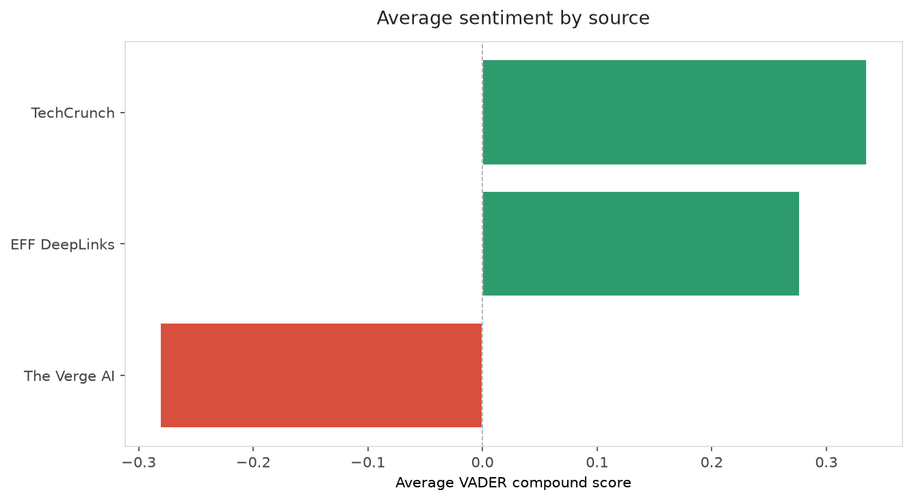
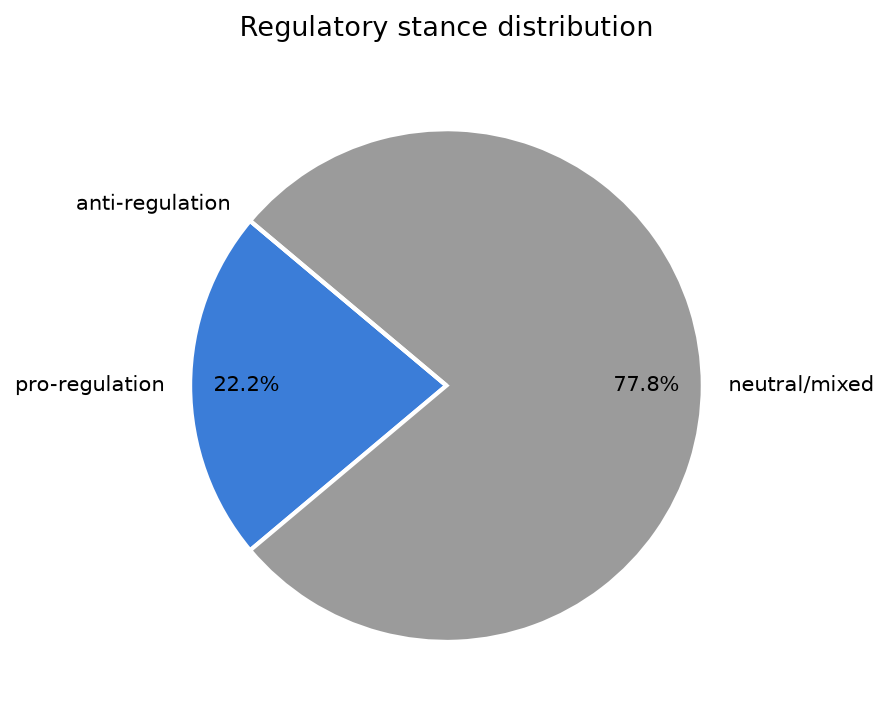
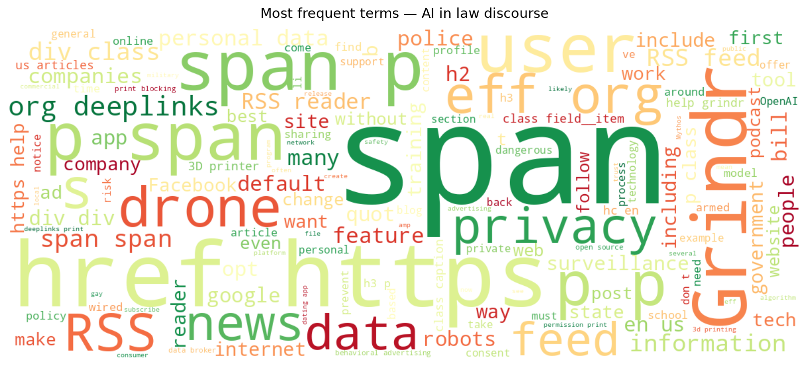
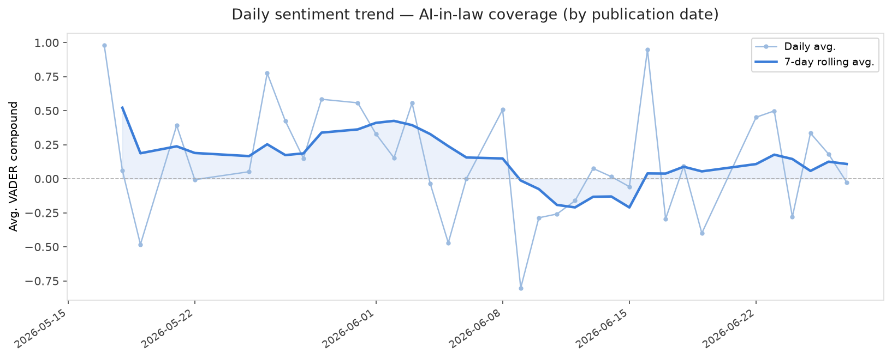
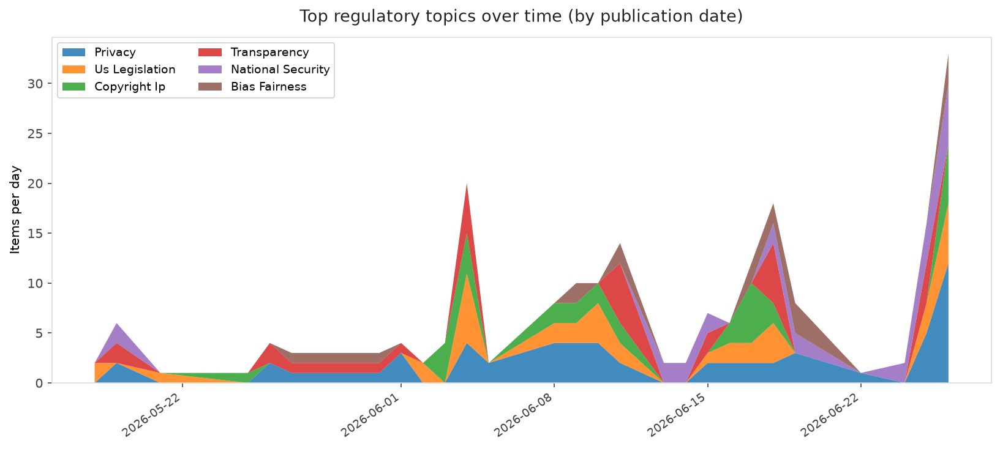

# AI in Law — Daily Sentiment Report
**Run date:** 2026-06-28 | **Items analyzed:** 9 | **Overall:** 🟢 Mildly positive (+0.135)

_Articles in this report were published between **2026-06-26** and **2026-06-27**._

---

## Summary

Today's collection covers **9** items from news outlets, academic preprints, Reddit, and regulatory sources.
Compared to the historical average of **+0.319**, today's sentiment is ↓ **0.184** points lower.

| Metric | Value |
|--------|-------|
| Positive items | 4 (44.4%) |
| Neutral items  | 2 (22.2%) |
| Negative items | 3 (33.3%) |
| Avg. VADER compound | +0.1351 |
| Pro-regulation items | 2 |
| Anti-regulation items | 0 |

---

## Top Topics Today

- **Privacy** — 4 items
- **National Security** — 2 items
- **Us Legislation** — 2 items
- **Copyright Ip** — 2 items
- **Bias Fairness** — 1 items

---

## Most Positive Coverage

- [Hate “The Algorithm?” RSS Is One of the Tools You’ve Been Looking For](https://www.eff.org/deeplinks/2026/06/hate-algorithm-rss-one-tools-youve-been-looking)  
  _EFF DeepLinks_ — VADER: `+0.925`
- [EFF to Grindr: This Pride Month, Put Safety and Privacy Over Profits](https://www.eff.org/deeplinks/2026/06/grindr-put-queer-safety-and-privacy-over-profits)  
  _EFF DeepLinks_ — VADER: `+0.707`
- [OpenAI limits GPT-5.6 rollout after government request, says restrictions shouldn’t be the norm](https://techcrunch.com/2026/06/26/openai-limits-gpt-5-6-rollout-after-government-request-says-restrictions-shouldnt-be-the-norm/)  
  _TechCrunch_ — VADER: `+0.670`

---

## Most Critical / Negative Coverage

- [We Can Still Stop California’s 3D Printer Surveillance Scheme](https://www.eff.org/deeplinks/2026/06/we-can-still-stop-californias-3d-printer-surveillance-scheme)  
  _EFF DeepLinks_ — VADER: `-0.819`
- [OpenAI unveils GPT-5.6 amid US AI regulatory drama](https://www.theverge.com/ai-artificial-intelligence/957845/openai-gpt-5-6-trump-administration-ai-preview)  
  _The Verge AI_ — VADER: `-0.511`
- [Anthropic&#8217;s Mythos 5 is back](https://www.theverge.com/ai-artificial-intelligence/958458/anthropic-mythos-5-is-back-trump-negotiations)  
  _The Verge AI_ — VADER: `-0.052`

---

## Visualizations — Today

## Visualizations — Trends Over Time

---

## Methodology

- **VADER** (Valence Aware Dictionary and sEntiment Reasoner) — compound score in [-1, 1].
- **Topic tagging** — regex keyword matching across 12 AI-law sub-domains.
- **Stance detection** — keyword-based pro/anti-regulation signal detection.
- **Date filter** — items are kept only if their *publication* date falls within the look-back window (default 2 days).
- Sources: RSS news feeds, arXiv academic API, Reddit (PRAW), Regulations.gov API.

_Generated automatically on 2026-06-28 12:18 UTC._
