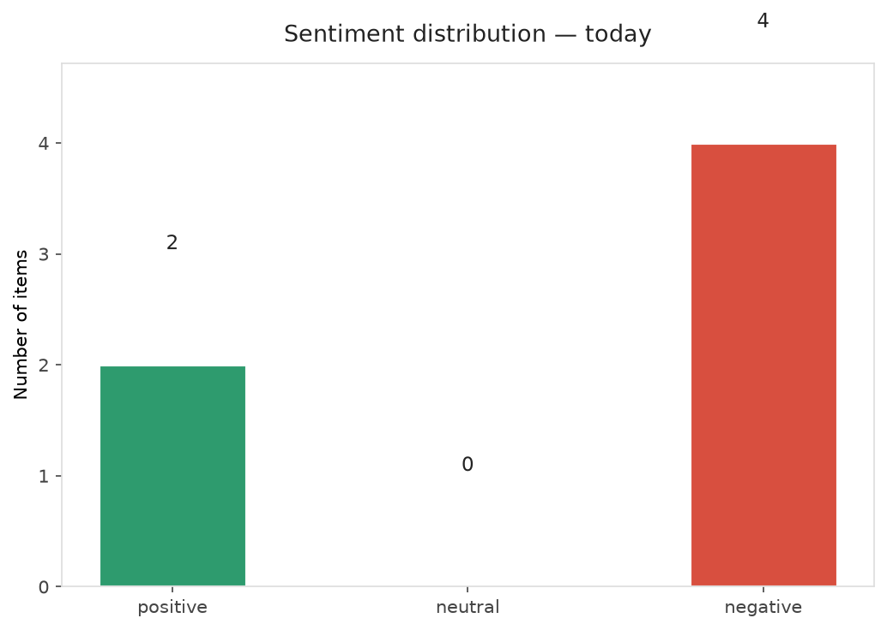
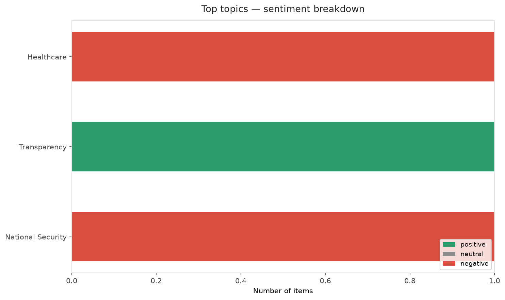
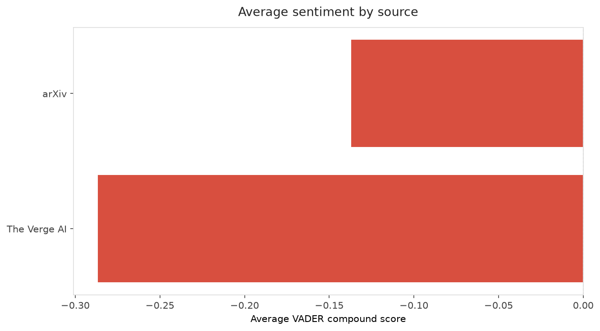
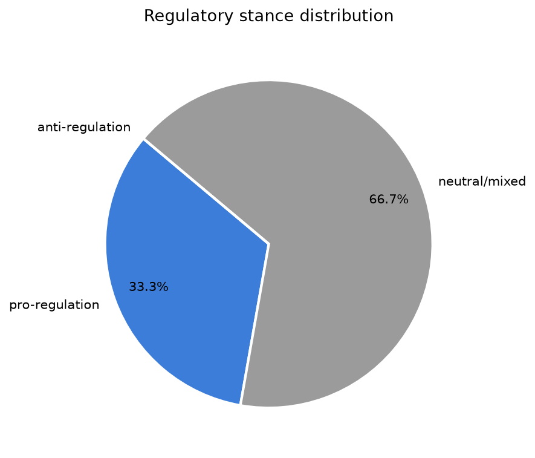
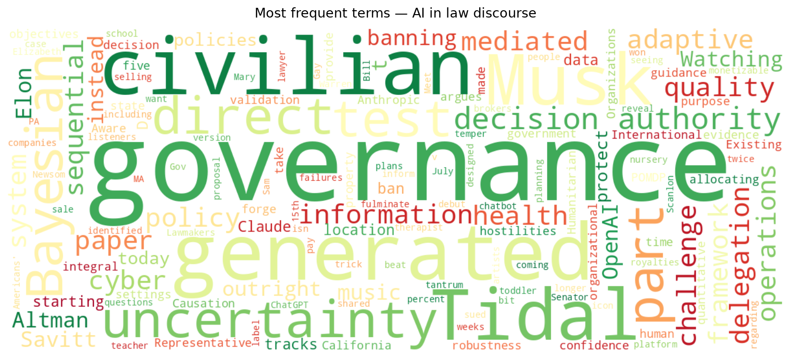
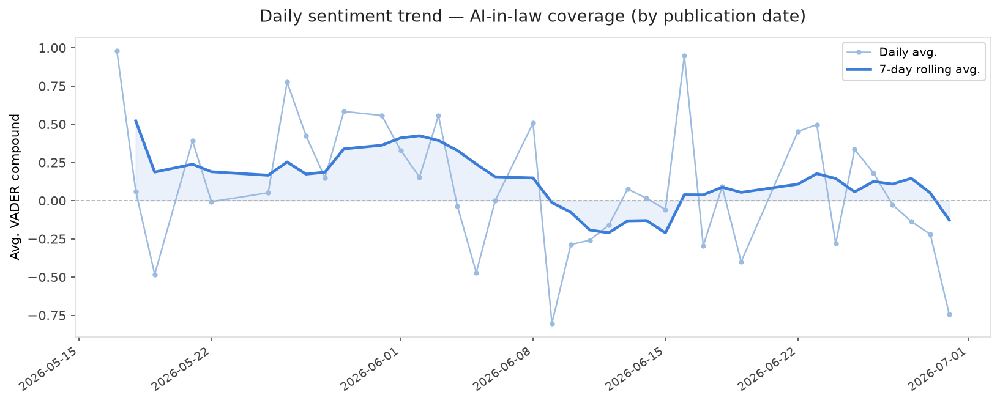
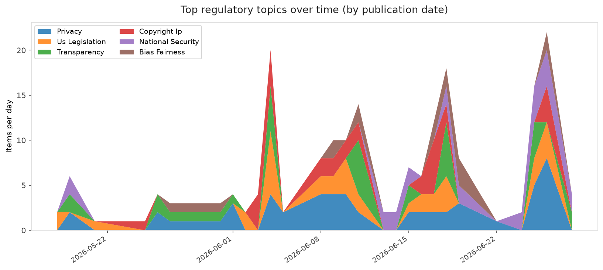
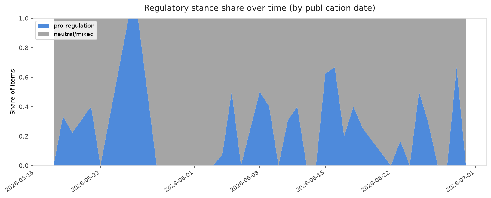

# AI in Law — Daily Sentiment Report
**Run date:** 2026-06-30 | **Items analyzed:** 6 | **Overall:** 🔴 Mildly negative (-0.280)

_Articles in this report were published between **2026-06-28** and **2026-06-30**._

---

## Summary

Today's collection covers **6** items from news outlets, academic preprints, Reddit, and regulatory sources.
Compared to the historical average of **+0.312**, today's sentiment is ↓ **0.592** points lower.

| Metric | Value |
|--------|-------|
| Positive items | 2 (33.3%) |
| Neutral items  | 0 (0.0%) |
| Negative items | 4 (66.7%) |
| Avg. VADER compound | -0.2795 |
| Pro-regulation items | 2 |
| Anti-regulation items | 0 |

---

## Top Topics Today

- **Healthcare** — 1 items
- **Transparency** — 1 items
- **National Security** — 1 items

---

## Most Positive Coverage

- [Adaptive AI Delegation under Uncertainty: A Bayesian Governance Policy for Sequential Decision Autho](https://arxiv.org/abs/2606.29406v1)  
  _arXiv_ — VADER: `+0.686`
- [Tidal won’t pay royalties on AI-generated music, but isn’t banning it outright](https://www.theverge.com/tech/959211/tidal-ai-music-policy-demonetizingdetect-label)  
  _The Verge AI_ — VADER: `+0.542`
- [Anthropic and Gov. Newsom forge deal allowing California government to use Claude at half price](https://techcrunch.com/2026/06/29/anthropic-and-gov-newsom-forge-deal-allowing-california-government-to-use-claude-at-half-price/)  
  _TechCrunch_ — VADER: `-0.542`

---

## Most Critical / Negative Coverage

- [Direct Causation in International Humanitarian Law and the Challenge of AI-Mediated Civilian Cyber O](https://arxiv.org/abs/2606.29175v1)  
  _arXiv_ — VADER: `-0.960`
- [Meet the lawyer who beat Elon Musk — twice](https://www.theverge.com/column/959270/elon-musk-open-ai-bill-savitt-twitter)  
  _The Verge AI_ — VADER: `-0.743`
- [Lawmakers want to ban AI companies from selling your health data](https://www.theverge.com/ai-artificial-intelligence/959033/health-location-data-protection-act-ai-warren-scanlon)  
  _The Verge AI_ — VADER: `-0.660`

---

## Visualizations — Today

## Visualizations — Trends Over Time

---

## Methodology

- **VADER** (Valence Aware Dictionary and sEntiment Reasoner) — compound score in [-1, 1].
- **Topic tagging** — regex keyword matching across 12 AI-law sub-domains.
- **Stance detection** — keyword-based pro/anti-regulation signal detection.
- **Date filter** — items are kept only if their *publication* date falls within the look-back window (default 2 days).
- Sources: RSS news feeds, arXiv academic API, Reddit (PRAW), Regulations.gov API.

_Generated automatically on 2026-06-30 13:11 UTC._
