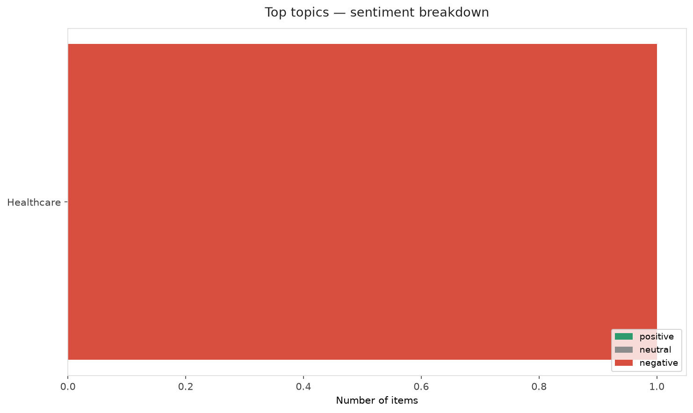
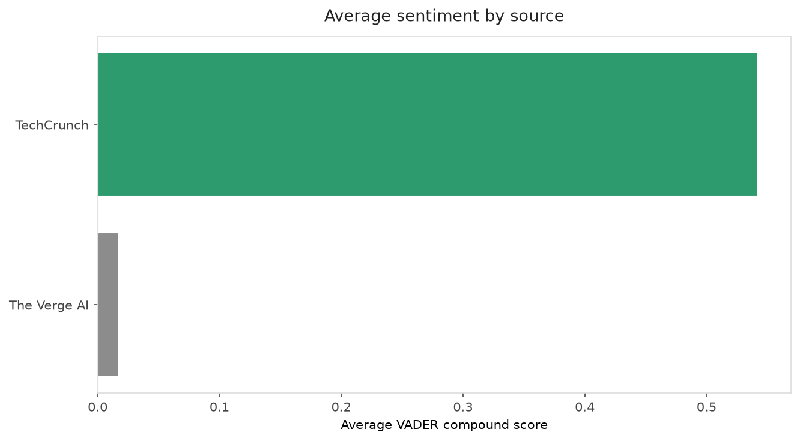
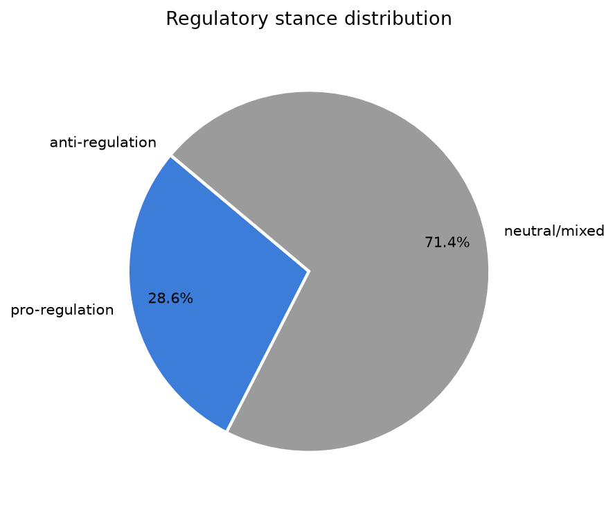
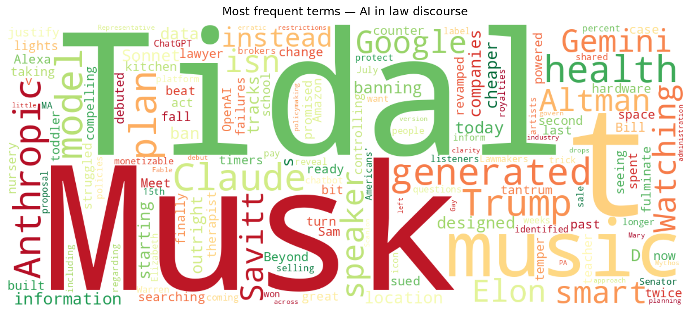
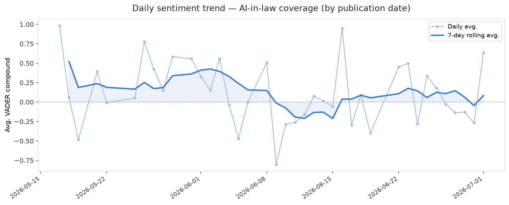
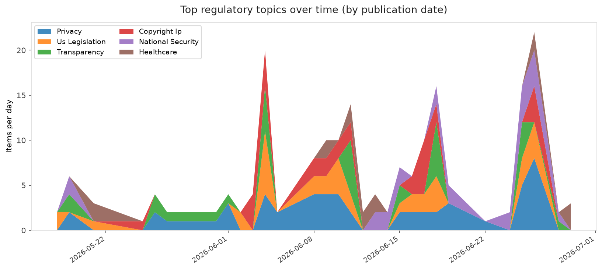
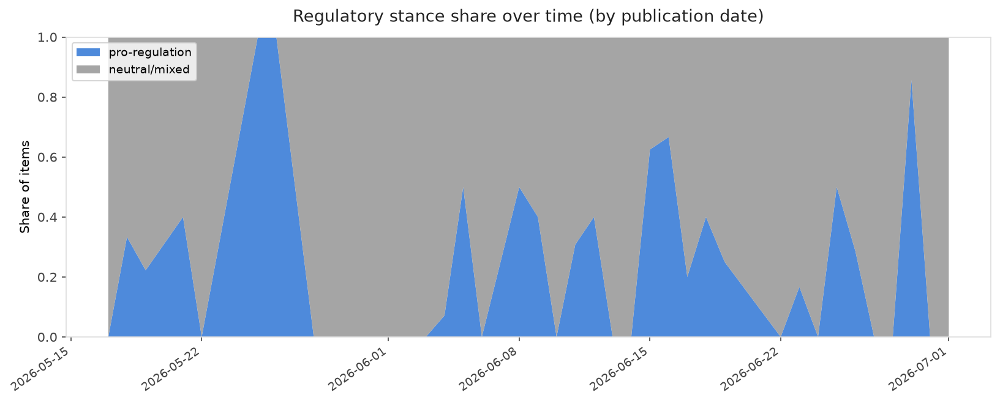

# AI in Law — Daily Sentiment Report
**Run date:** 2026-07-01 | **Items analyzed:** 7 | **Overall:** 🟢 Mildly positive (+0.083)

_Articles in this report were published between **2026-06-29** and **2026-07-01**._

---

## Summary

Today's collection covers **7** items from news outlets, academic preprints, Reddit, and regulatory sources.
Compared to the historical average of **+0.310**, today's sentiment is ↓ **0.227** points lower.

| Metric | Value |
|--------|-------|
| Positive items | 4 (57.1%) |
| Neutral items  | 0 (0.0%) |
| Negative items | 3 (42.9%) |
| Avg. VADER compound | +0.0831 |
| Pro-regulation items | 2 |
| Anti-regulation items | 0 |

---

## Top Topics Today

- **Healthcare** — 1 items

---

## Most Positive Coverage

- [Google built a great smart speaker, but Gemini isn’t ready for it](https://www.theverge.com/tech/959503/google-home-speaker-review-gemini-for-home)  
  _The Verge AI_ — VADER: `+0.929`
- [Anthropic launches Claude Sonnet 5 as a cheaper way to run agents](https://techcrunch.com/2026/06/30/anthropic-launches-claude-sonnet-5-as-a-cheaper-way-to-run-agents/)  
  _TechCrunch_ — VADER: `+0.743`
- [Tidal won’t pay royalties on AI-generated music, but isn’t banning it outright](https://www.theverge.com/tech/959211/tidal-ai-music-policy-demonetizingdetect-label)  
  _The Verge AI_ — VADER: `+0.542`

---

## Most Critical / Negative Coverage

- [Meet the lawyer who beat Elon Musk — twice](https://www.theverge.com/column/959270/elon-musk-open-ai-bill-savitt-twitter)  
  _The Verge AI_ — VADER: `-0.743`
- [Lawmakers want to ban AI companies from selling your health data](https://www.theverge.com/ai-artificial-intelligence/959033/health-location-data-protection-act-ai-warren-scanlon)  
  _The Verge AI_ — VADER: `-0.660`
- [Trump's plan to redesign every .gov website leads to AI-designed horrors](https://arstechnica.com/tech-policy/2026/06/trumps-plan-to-redesign-every-gov-website-leads-to-ai-designed-horrors/)  
  _Ars Technica Tech Policy_ — VADER: `-0.572`

---

## Visualizations — Today

## Visualizations — Trends Over Time

---

## Methodology

- **VADER** (Valence Aware Dictionary and sEntiment Reasoner) — compound score in [-1, 1].
- **Topic tagging** — regex keyword matching across 12 AI-law sub-domains.
- **Stance detection** — keyword-based pro/anti-regulation signal detection.
- **Date filter** — items are kept only if their *publication* date falls within the look-back window (default 2 days).
- Sources: RSS news feeds, arXiv academic API, Reddit (PRAW), Regulations.gov API.

_Generated automatically on 2026-07-01 13:37 UTC._
