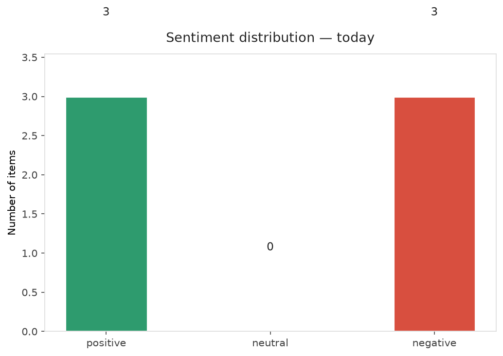
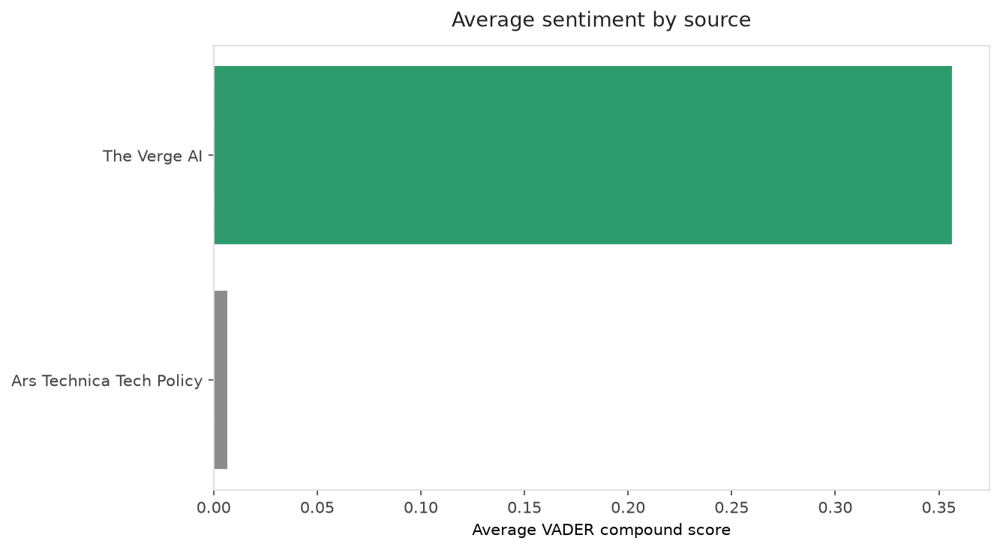
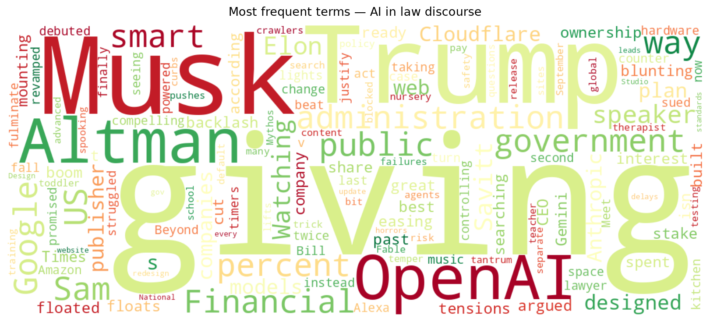
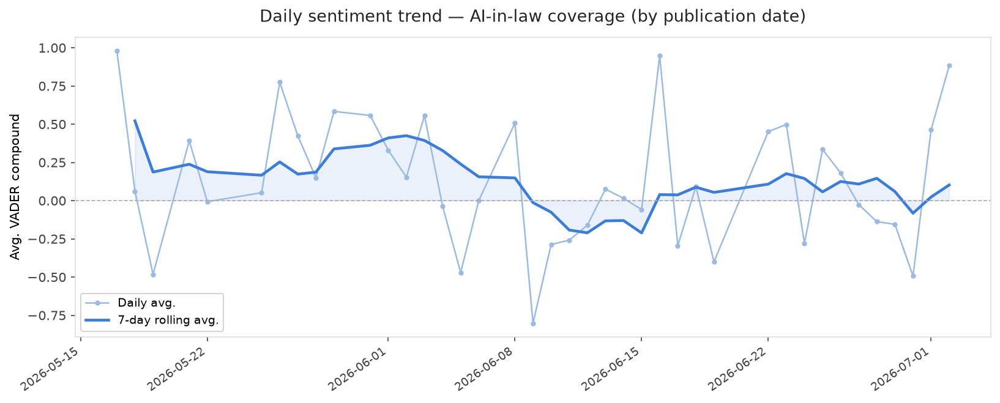
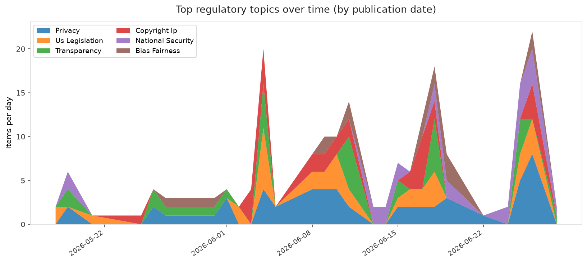
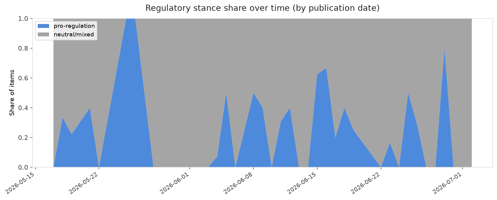

# AI in Law — Daily Sentiment Report
**Run date:** 2026-07-02 | **Items analyzed:** 6 | **Overall:** 🟢 Mildly positive (+0.131)

_Articles in this report were published between **2026-06-30** and **2026-07-02**._

---

## Summary

Today's collection covers **6** items from news outlets, academic preprints, Reddit, and regulatory sources.
Compared to the historical average of **+0.308**, today's sentiment is ↓ **0.177** points lower.

| Metric | Value |
|--------|-------|
| Positive items | 3 (50.0%) |
| Neutral items  | 0 (0.0%) |
| Negative items | 3 (50.0%) |
| Avg. VADER compound | +0.1313 |
| Pro-regulation items | 0 |
| Anti-regulation items | 0 |

---

## Top Topics Today

_No strong topic signals detected today._

---

## Most Positive Coverage

- [Google built a great smart speaker, but Gemini isn’t ready for it](https://www.theverge.com/tech/959503/google-home-speaker-review-gemini-for-home)  
  _The Verge AI_ — VADER: `+0.929`
- [OpenAI floats giving Trump administration 5 percent cut of AI boom](https://www.theverge.com/ai-artificial-intelligence/960588/openai-government-5-percent-stake-trump)  
  _The Verge AI_ — VADER: `+0.883`
- [After spooking Trump into safety testing, Anthropic AI models get global release](https://arstechnica.com/tech-policy/2026/07/after-spooking-trump-into-safety-testing-anthropic-ai-models-get-global-release/)  
  _Ars Technica Tech Policy_ — VADER: `+0.586`

---

## Most Critical / Negative Coverage

- [Meet the lawyer who beat Elon Musk — twice](https://www.theverge.com/column/959270/elon-musk-open-ai-bill-savitt-twitter)  
  _The Verge AI_ — VADER: `-0.743`
- [Trump's plan to redesign every .gov website leads to AI-designed horrors](https://arstechnica.com/tech-policy/2026/06/trumps-plan-to-redesign-every-gov-website-leads-to-ai-designed-horrors/)  
  _Ars Technica Tech Policy_ — VADER: `-0.572`
- [Cloudflare’s new policy pushes AI companies to pay for publishers’ content](https://techcrunch.com/2026/07/01/cloudflares-new-policy-pushes-ai-companies-to-pay-for-publishers-content/)  
  _TechCrunch_ — VADER: `-0.296`

---

## Visualizations — Today

## Visualizations — Trends Over Time

---

## Methodology

- **VADER** (Valence Aware Dictionary and sEntiment Reasoner) — compound score in [-1, 1].
- **Topic tagging** — regex keyword matching across 12 AI-law sub-domains.
- **Stance detection** — keyword-based pro/anti-regulation signal detection.
- **Date filter** — items are kept only if their *publication* date falls within the look-back window (default 2 days).
- Sources: RSS news feeds, arXiv academic API, Reddit (PRAW), Regulations.gov API.

_Generated automatically on 2026-07-02 13:02 UTC._
