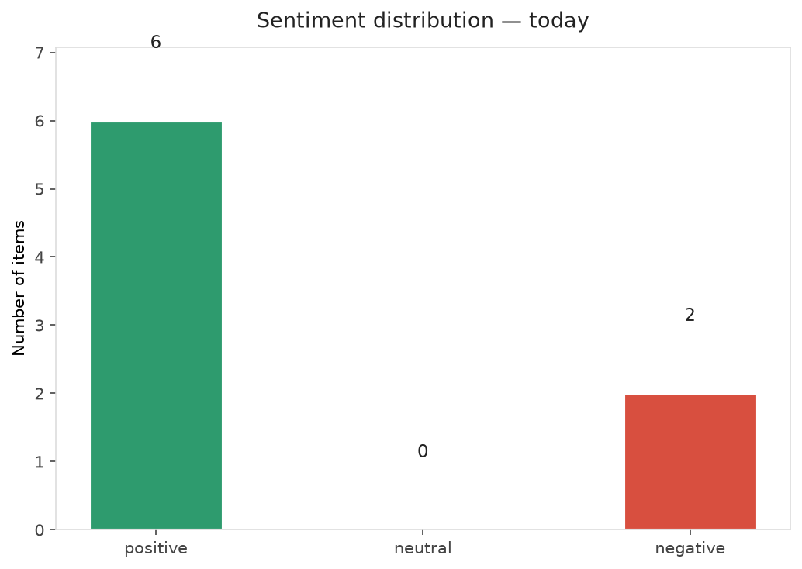
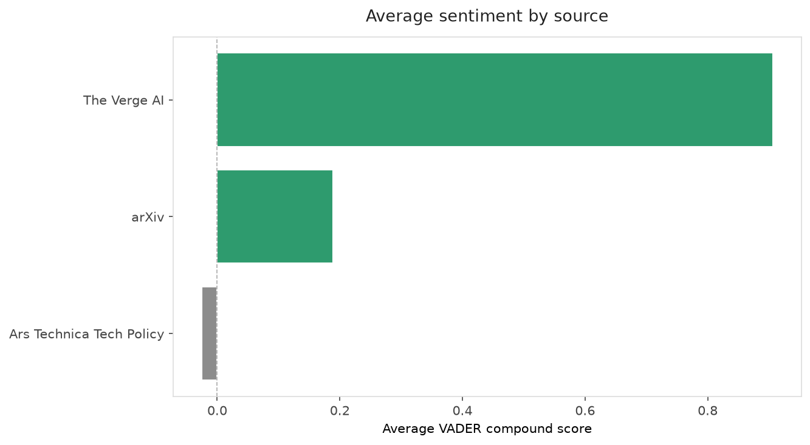
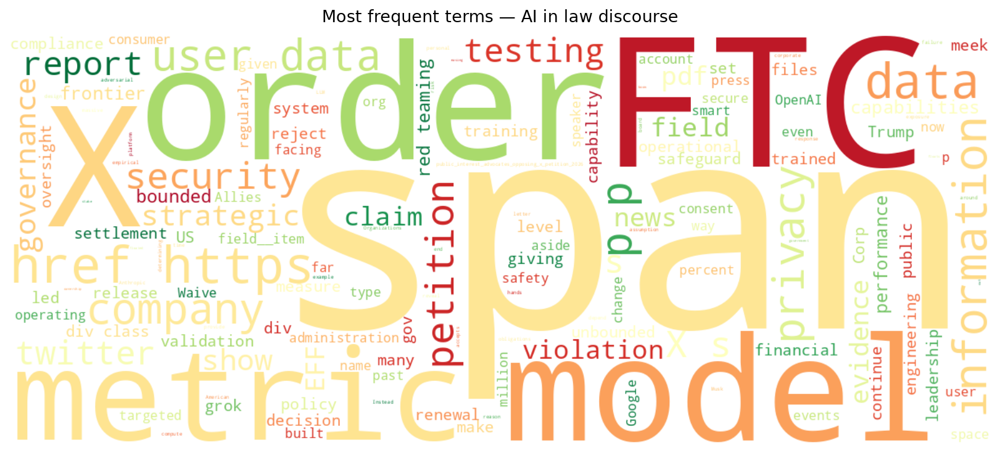
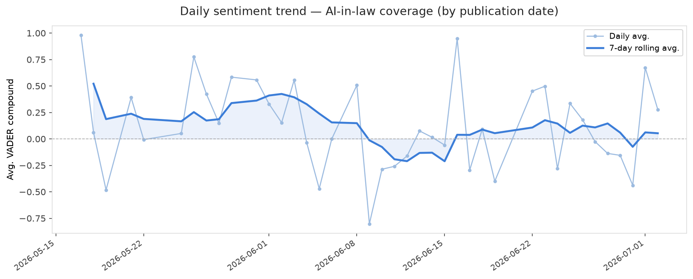
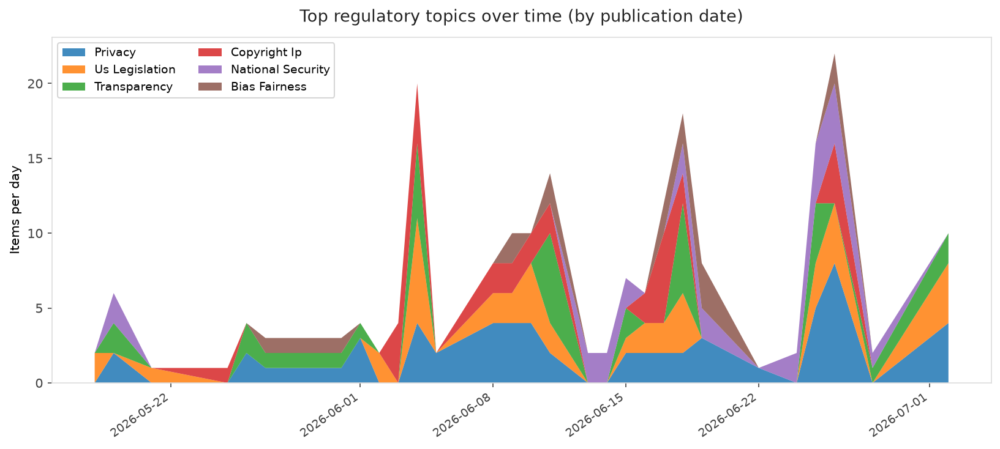
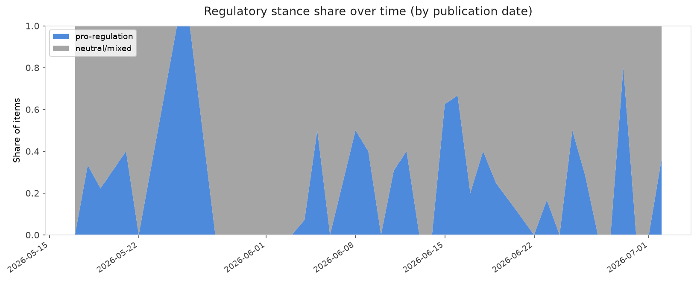

# AI in Law — Daily Sentiment Report
**Run date:** 2026-07-03 | **Items analyzed:** 8 | **Overall:** 🟢 Mildly positive (+0.442)

_Articles in this report were published between **2026-07-01** and **2026-07-02**._

---

## Summary

Today's collection covers **8** items from news outlets, academic preprints, Reddit, and regulatory sources.
Compared to the historical average of **+0.310**, today's sentiment is ↑ **0.132** points higher.

| Metric | Value |
|--------|-------|
| Positive items | 6 (75.0%) |
| Neutral items  | 0 (0.0%) |
| Negative items | 2 (25.0%) |
| Avg. VADER compound | +0.4418 |
| Pro-regulation items | 2 |
| Anti-regulation items | 0 |

---

## Top Topics Today

- **Us Legislation** — 2 items
- **Privacy** — 2 items
- **Transparency** — 1 items

---

## Most Positive Coverage

- [Two AI Metrics Diverged: Will it Make All the Difference?](https://arxiv.org/abs/2607.00913v1)  
  _arXiv_ — VADER: `+0.934`
- [Google built a great smart speaker, but Gemini isn’t ready for it](https://www.theverge.com/tech/959503/google-home-speaker-review-gemini-for-home)  
  _The Verge AI_ — VADER: `+0.929`
- [OpenAI floats giving Trump administration 5 percent cut of AI boom](https://www.theverge.com/ai-artificial-intelligence/960588/openai-government-5-percent-stake-trump)  
  _The Verge AI_ — VADER: `+0.883`

---

## Most Critical / Negative Coverage

- [Musk’s X poses “serious risk to Americans’ privacy,” advocates warn FTC](https://arstechnica.com/tech-policy/2026/07/musks-x-poses-serious-risk-to-americans-privacy-advocates-warn-ftc/)  
  _Ars Technica Tech Policy_ — VADER: `-0.637`
- [From Battlefield to Boardroom: Strategic Red Teaming as an Epistemic Governance Instrument in the Ag](https://arxiv.org/abs/2607.01913v1)  
  _arXiv_ — VADER: `-0.557`
- [After spooking Trump into safety testing, Anthropic AI models get global release](https://arstechnica.com/tech-policy/2026/07/after-spooking-trump-into-safety-testing-anthropic-ai-models-get-global-release/)  
  _Ars Technica Tech Policy_ — VADER: `+0.586`

---

## Visualizations — Today

## Visualizations — Trends Over Time

---

## Methodology

- **VADER** (Valence Aware Dictionary and sEntiment Reasoner) — compound score in [-1, 1].
- **Topic tagging** — regex keyword matching across 12 AI-law sub-domains.
- **Stance detection** — keyword-based pro/anti-regulation signal detection.
- **Date filter** — items are kept only if their *publication* date falls within the look-back window (default 2 days).
- Sources: RSS news feeds, arXiv academic API, Reddit (PRAW), Regulations.gov API.

_Generated automatically on 2026-07-03 12:57 UTC._
