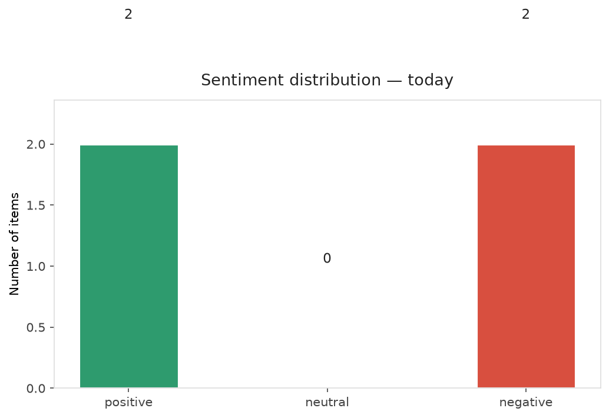
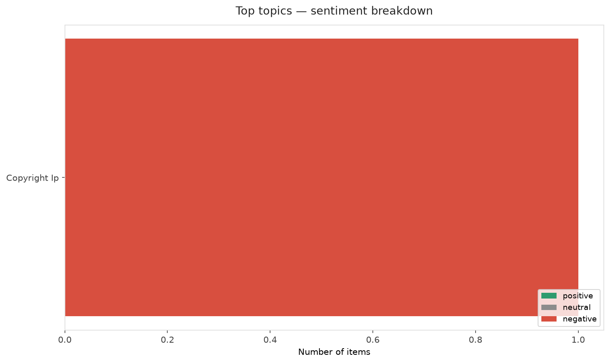
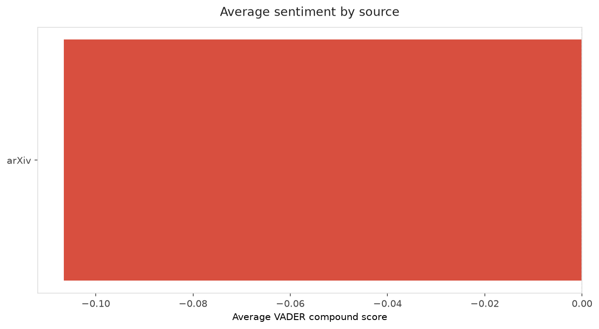
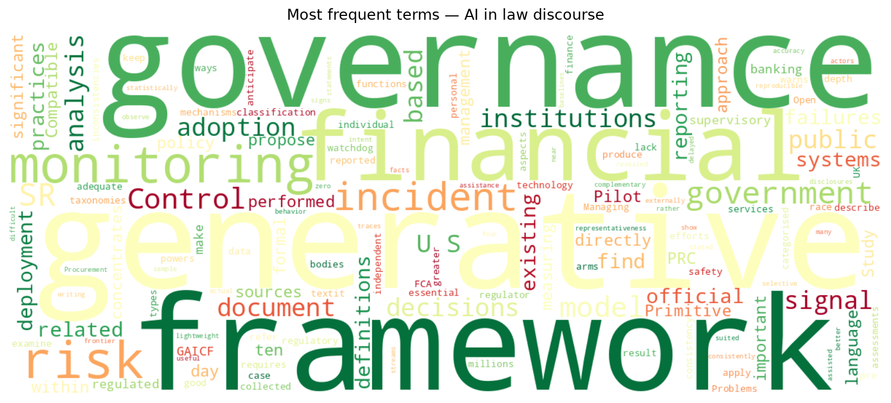
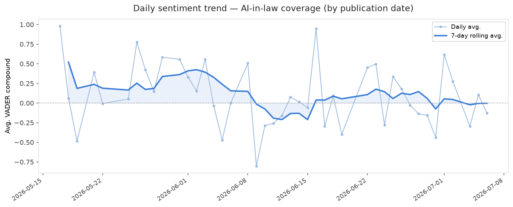
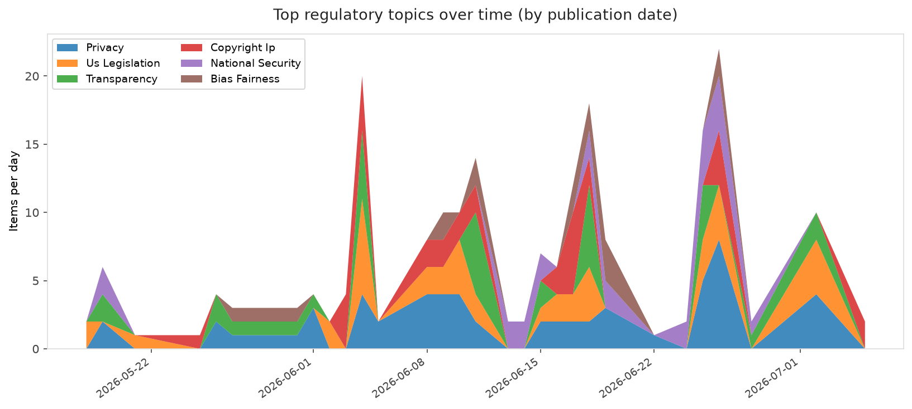
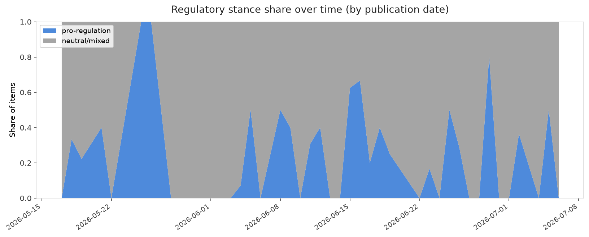

# AI in Law — Daily Sentiment Report
**Run date:** 2026-07-07 | **Items analyzed:** 4 | **Overall:** ⚪ Neutral / mixed (-0.012)

_Articles in this report were published between **2026-07-05** and **2026-07-06**._

---

## Summary

Today's collection covers **4** items from news outlets, academic preprints, Reddit, and regulatory sources.
Compared to the historical average of **+0.305**, today's sentiment is ↓ **0.317** points lower.

| Metric | Value |
|--------|-------|
| Positive items | 2 (50.0%) |
| Neutral items  | 0 (0.0%) |
| Negative items | 2 (50.0%) |
| Avg. VADER compound | -0.0117 |
| Pro-regulation items | 1 |
| Anti-regulation items | 0 |

---

## Top Topics Today

- **Copyright Ip** — 1 items

---

## Most Positive Coverage

- [Government AI Use as a Monitoring Primitive: A Public Document Pilot Study](https://arxiv.org/abs/2607.04543v1)  
  _arXiv_ — VADER: `+0.691`
- [UK regulator warns of "arms race" to keep up with AI use in financial services](https://arstechnica.com/ai/2026/07/uk-regulator-warns-of-arms-race-to-keep-up-with-ai-use-in-financial-services/)  
  _Ars Technica Tech Policy_ — VADER: `+0.273`
- [Governing Generative AI Across Financial Institutions: An SR 26-2-Compatible Framework for Generativ](https://arxiv.org/abs/2607.04103v1)  
  _arXiv_ — VADER: `-0.484`

---

## Most Critical / Negative Coverage

- [Open Problems in AI Incident Governance](https://arxiv.org/abs/2607.05163v1)  
  _arXiv_ — VADER: `-0.527`
- [Governing Generative AI Across Financial Institutions: An SR 26-2-Compatible Framework for Generativ](https://arxiv.org/abs/2607.04103v1)  
  _arXiv_ — VADER: `-0.484`
- [UK regulator warns of "arms race" to keep up with AI use in financial services](https://arstechnica.com/ai/2026/07/uk-regulator-warns-of-arms-race-to-keep-up-with-ai-use-in-financial-services/)  
  _Ars Technica Tech Policy_ — VADER: `+0.273`

---

## Visualizations — Today

## Visualizations — Trends Over Time

---

## Methodology

- **VADER** (Valence Aware Dictionary and sEntiment Reasoner) — compound score in [-1, 1].
- **Topic tagging** — regex keyword matching across 12 AI-law sub-domains.
- **Stance detection** — keyword-based pro/anti-regulation signal detection.
- **Date filter** — items are kept only if their *publication* date falls within the look-back window (default 2 days).
- Sources: RSS news feeds, arXiv academic API, Reddit (PRAW), Regulations.gov API.

_Generated automatically on 2026-07-07 13:25 UTC._
