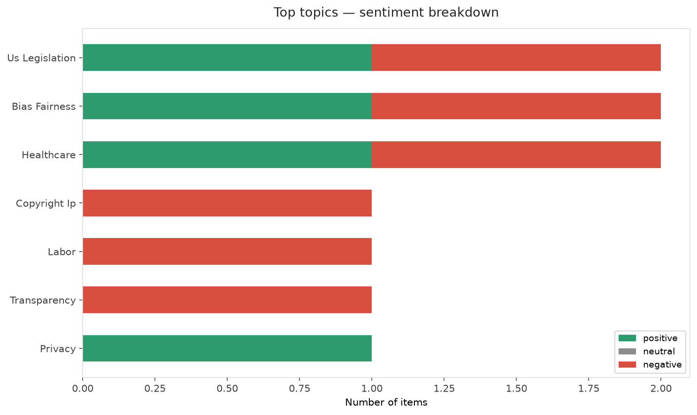
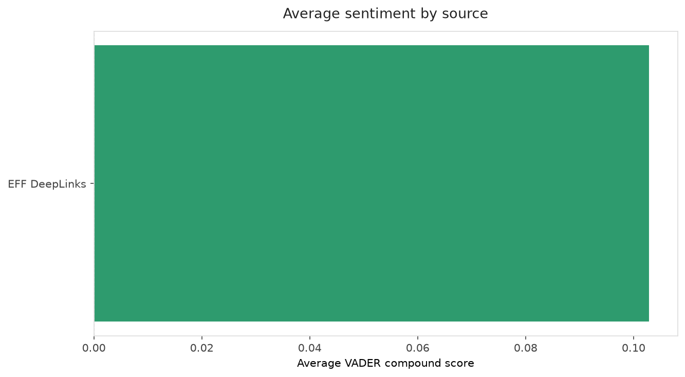
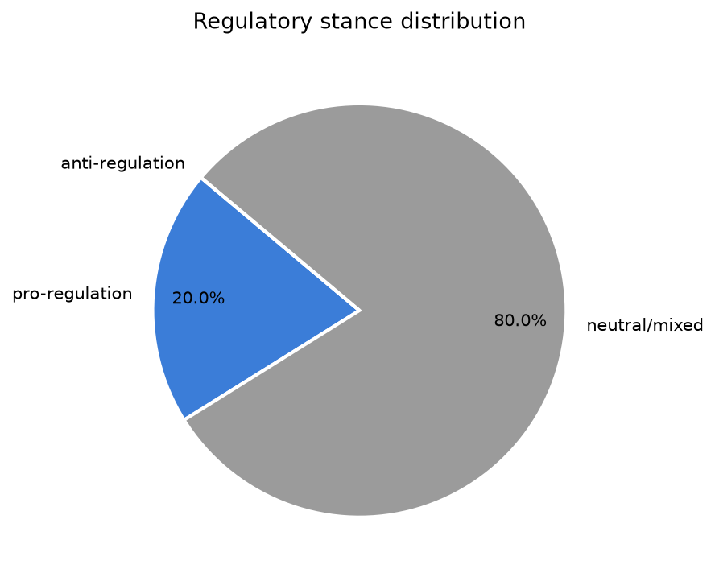
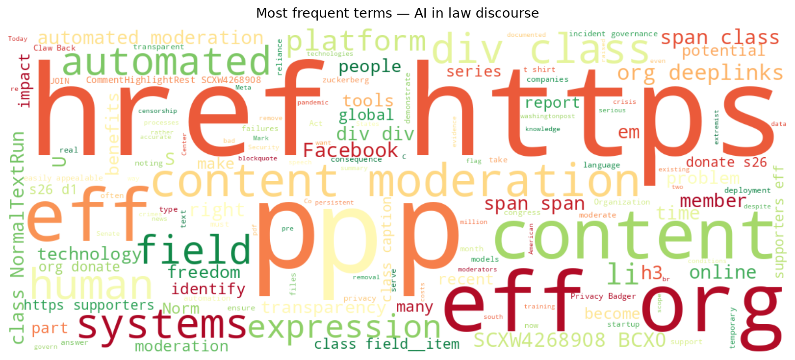
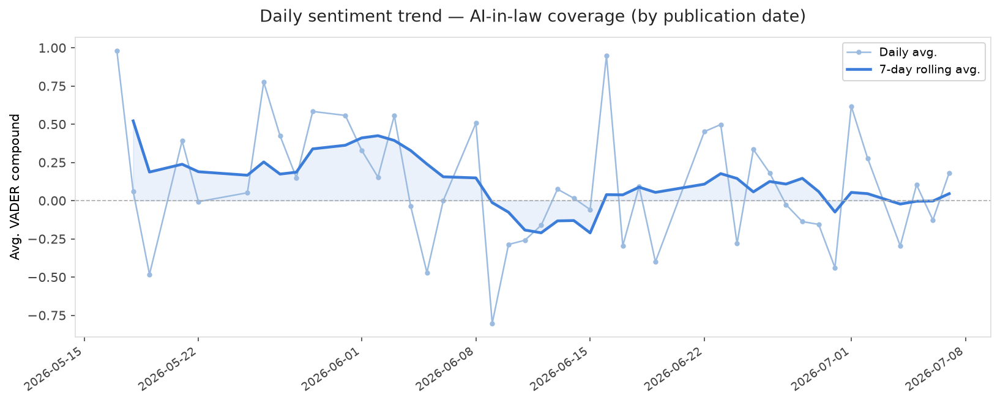
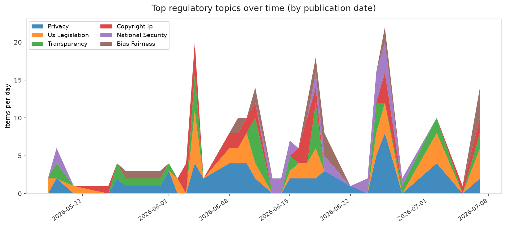
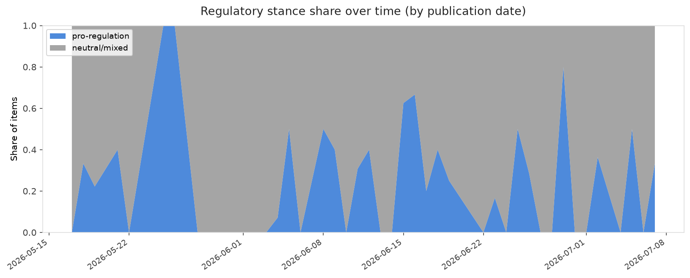

# AI in Law — Daily Sentiment Report
**Run date:** 2026-07-08 | **Items analyzed:** 5 | **Overall:** 🟢 Mildly positive (+0.059)

_Articles in this report were published between **2026-07-06** and **2026-07-07**._

---

## Summary

Today's collection covers **5** items from news outlets, academic preprints, Reddit, and regulatory sources.
Compared to the historical average of **+0.303**, today's sentiment is ↓ **0.245** points lower.

| Metric | Value |
|--------|-------|
| Positive items | 3 (60.0%) |
| Neutral items  | 0 (0.0%) |
| Negative items | 2 (40.0%) |
| Avg. VADER compound | +0.0585 |
| Pro-regulation items | 1 |
| Anti-regulation items | 0 |

---

## Top Topics Today

- **Us Legislation** — 2 items
- **Bias Fairness** — 2 items
- **Healthcare** — 2 items
- **Copyright Ip** — 1 items
- **Labor** — 1 items

---

## Most Positive Coverage

- [Help EFF Cut the AI Hype](https://www.eff.org/deeplinks/2026/07/help-eff-cut-ai-hype)  
  _EFF DeepLinks_ — VADER: `+0.981`
- [AI law startup Norm raises $120M, hits unicorn valuation](https://techcrunch.com/2026/07/07/ai-law-startup-norm-raises-120m-hits-unicorn-valuation/)  
  _TechCrunch_ — VADER: `+0.340`
- [UK regulator warns of "arms race" to keep up with AI use in financial services](https://arstechnica.com/ai/2026/07/uk-regulator-warns-of-arms-race-to-keep-up-with-ai-use-in-financial-services/)  
  _Ars Technica Tech Policy_ — VADER: `+0.273`

---

## Most Critical / Negative Coverage

- [Automated Moderation Is Here to Stay](https://www.eff.org/deeplinks/2026/07/part-1-automated-moderation-here-stay)  
  _EFF DeepLinks_ — VADER: `-0.775`
- [Open Problems in AI Incident Governance](https://arxiv.org/abs/2607.05163v1)  
  _arXiv_ — VADER: `-0.527`
- [UK regulator warns of "arms race" to keep up with AI use in financial services](https://arstechnica.com/ai/2026/07/uk-regulator-warns-of-arms-race-to-keep-up-with-ai-use-in-financial-services/)  
  _Ars Technica Tech Policy_ — VADER: `+0.273`

---

## Visualizations — Today

## Visualizations — Trends Over Time

---

## Methodology

- **VADER** (Valence Aware Dictionary and sEntiment Reasoner) — compound score in [-1, 1].
- **Topic tagging** — regex keyword matching across 12 AI-law sub-domains.
- **Stance detection** — keyword-based pro/anti-regulation signal detection.
- **Date filter** — items are kept only if their *publication* date falls within the look-back window (default 2 days).
- Sources: RSS news feeds, arXiv academic API, Reddit (PRAW), Regulations.gov API.

_Generated automatically on 2026-07-08 12:23 UTC._
