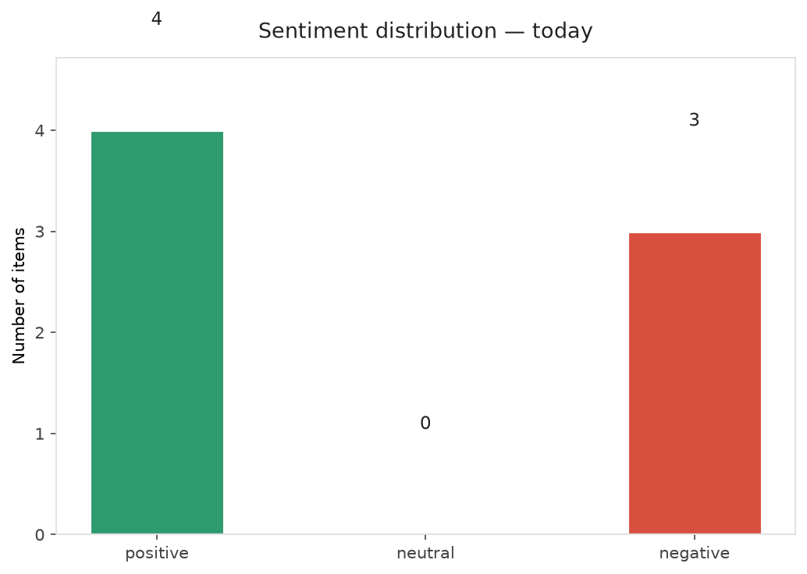
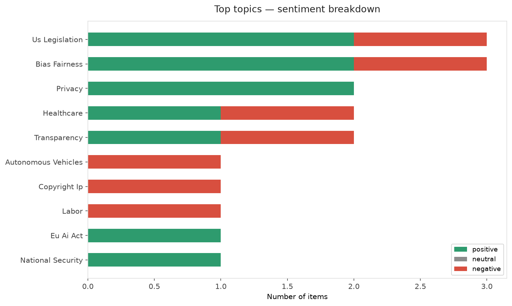
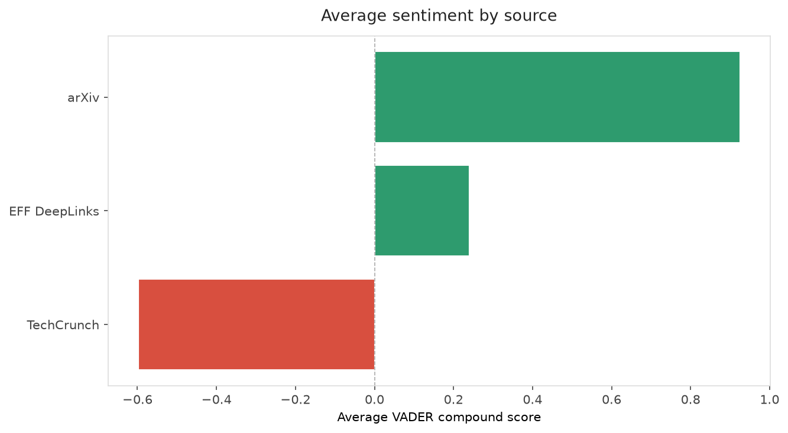
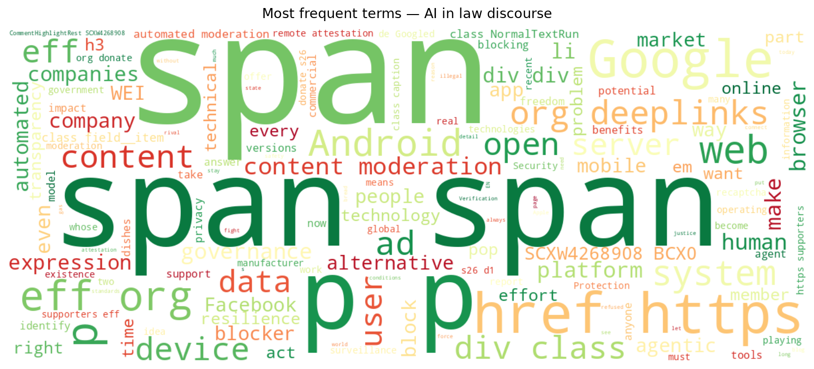
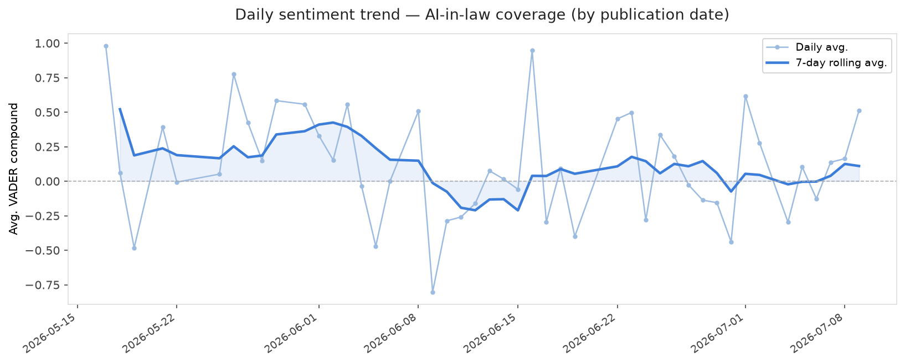
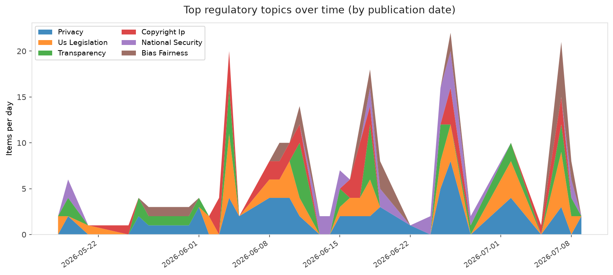
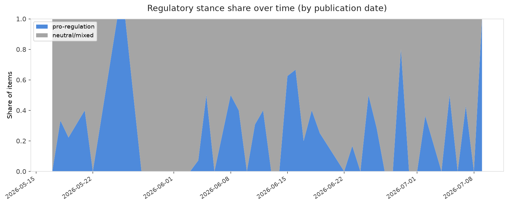

# AI in Law — Daily Sentiment Report
**Run date:** 2026-07-09 | **Items analyzed:** 7 | **Overall:** 🟢 Mildly positive (+0.196)

_Articles in this report were published between **2026-07-07** and **2026-07-09**._

---

## Summary

Today's collection covers **7** items from news outlets, academic preprints, Reddit, and regulatory sources.
Compared to the historical average of **+0.302**, today's sentiment is ↓ **0.106** points lower.

| Metric | Value |
|--------|-------|
| Positive items | 4 (57.1%) |
| Neutral items  | 0 (0.0%) |
| Negative items | 3 (42.9%) |
| Avg. VADER compound | +0.1962 |
| Pro-regulation items | 2 |
| Anti-regulation items | 0 |

---

## Top Topics Today

- **Us Legislation** — 3 items
- **Bias Fairness** — 3 items
- **Privacy** — 2 items
- **Healthcare** — 2 items
- **Transparency** — 2 items

---

## Most Positive Coverage

- [Help EFF Cut the AI Hype](https://www.eff.org/deeplinks/2026/07/help-eff-cut-ai-hype)  
  _EFF DeepLinks_ — VADER: `+0.981`
- [The AI Resilience Gap: Bringing Artificial Intelligence Inside the Operational Resilience Perimeter](https://arxiv.org/abs/2607.07359v1)  
  _arXiv_ — VADER: `+0.961`
- [Towards Agentic AI Governance: A Preliminary Assessment](https://arxiv.org/abs/2607.07612v1)  
  _arXiv_ — VADER: `+0.891`

---

## Most Critical / Negative Coverage

- [Google’s deepfake detector system used to debunk McConnell hoax pic](https://techcrunch.com/2026/07/08/googles-deepfake-detector-system-used-to-debunk-mcconnell-hoax-pic/)  
  _TechCrunch_ — VADER: `-0.836`
- [Automated Moderation Is Here to Stay](https://www.eff.org/deeplinks/2026/07/part-1-automated-moderation-here-stay)  
  _EFF DeepLinks_ — VADER: `-0.775`
- [Feds demand autonomous vehicle companies stop interfering with first responders](https://techcrunch.com/2026/07/08/feds-demand-autonomous-vehicle-companies-stop-interfering-with-first-responders/)  
  _TechCrunch_ — VADER: `-0.361`

---

## Visualizations — Today

## Visualizations — Trends Over Time

---

## Methodology

- **VADER** (Valence Aware Dictionary and sEntiment Reasoner) — compound score in [-1, 1].
- **Topic tagging** — regex keyword matching across 12 AI-law sub-domains.
- **Stance detection** — keyword-based pro/anti-regulation signal detection.
- **Date filter** — items are kept only if their *publication* date falls within the look-back window (default 2 days).
- Sources: RSS news feeds, arXiv academic API, Reddit (PRAW), Regulations.gov API.

_Generated automatically on 2026-07-09 13:52 UTC._
