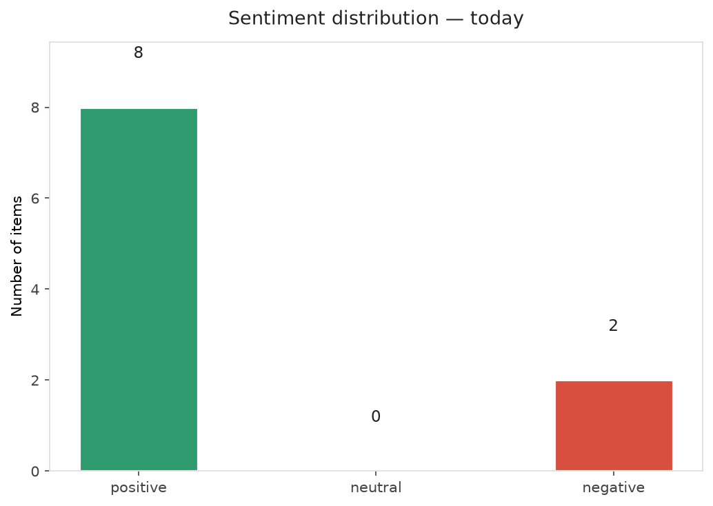
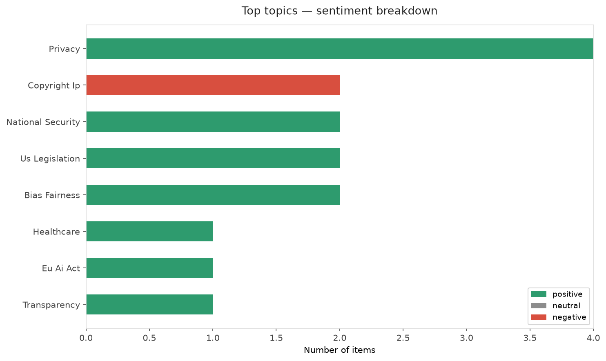
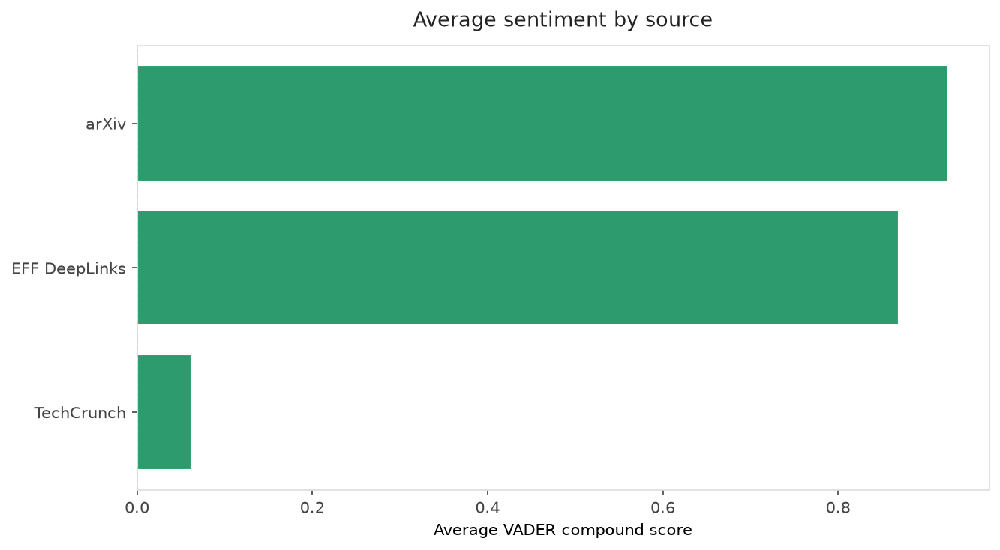
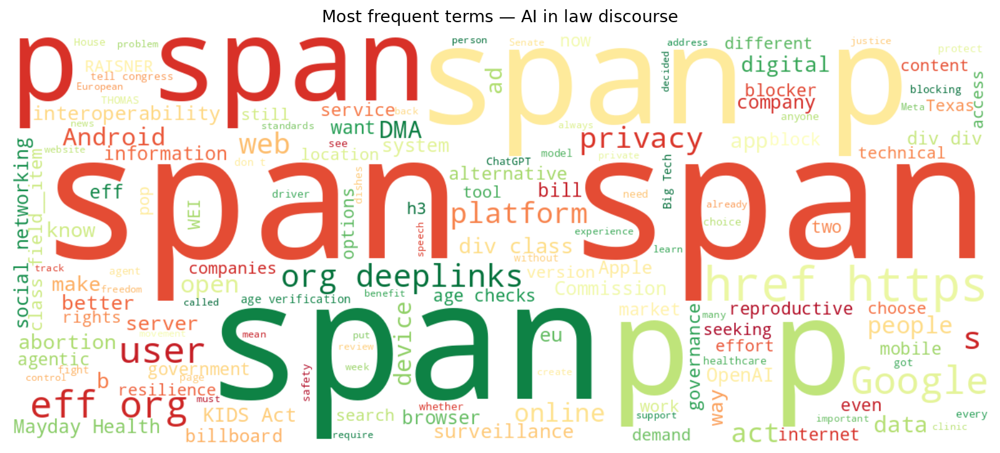
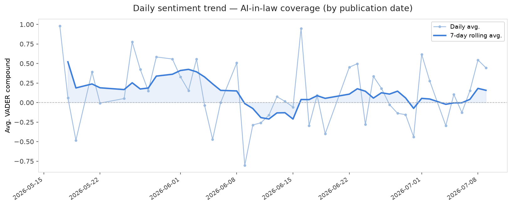
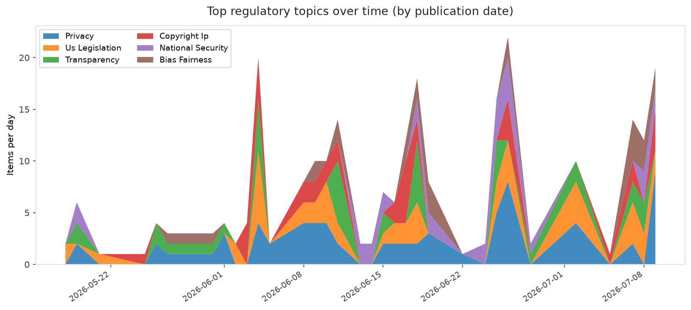
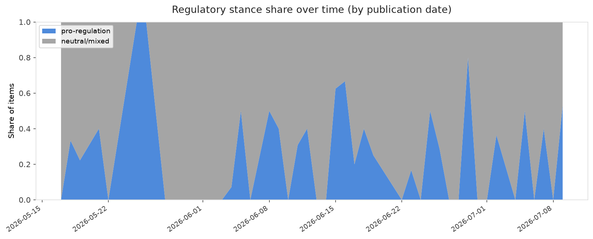

# AI in Law — Daily Sentiment Report
**Run date:** 2026-07-10 | **Items analyzed:** 10 | **Overall:** 🟢 Mildly positive (+0.537)

_Articles in this report were published between **2026-07-08** and **2026-07-09**._

---

## Summary

Today's collection covers **10** items from news outlets, academic preprints, Reddit, and regulatory sources.
Compared to the historical average of **+0.306**, today's sentiment is ↑ **0.232** points higher.

| Metric | Value |
|--------|-------|
| Positive items | 8 (80.0%) |
| Neutral items  | 0 (0.0%) |
| Negative items | 2 (20.0%) |
| Avg. VADER compound | +0.5373 |
| Pro-regulation items | 4 |
| Anti-regulation items | 0 |

---

## Top Topics Today

- **Privacy** — 4 items
- **Copyright Ip** — 2 items
- **National Security** — 2 items
- **Us Legislation** — 2 items
- **Bias Fairness** — 2 items

---

## Most Positive Coverage

- [European Commission Chooses to Keep EU Users Locked Up Behind Big Tech’s Gates](https://www.eff.org/deeplinks/2026/07/european-commission-chooses-keep-eu-users-locked-behind-big-techs-gates)  
  _EFF DeepLinks_ — VADER: `+0.994`
- [The AI Resilience Gap: Bringing Artificial Intelligence Inside the Operational Resilience Perimeter](https://arxiv.org/abs/2607.07359v1)  
  _arXiv_ — VADER: `+0.961`
- [Towards Agentic AI Governance: A Preliminary Assessment](https://arxiv.org/abs/2607.07612v1)  
  _arXiv_ — VADER: `+0.891`

---

## Most Critical / Negative Coverage

- [OpenAI may have made a fatal misstep in copyright fight with news orgs](https://arstechnica.com/tech-policy/2026/07/openai-faked-inability-to-search-training-data-hid-billions-of-logs-nyt-says/)  
  _Ars Technica Tech Policy_ — VADER: `-0.872`
- [New York Times says OpenAI hid evidence in ChatGPT copyright trial](https://techcrunch.com/2026/07/09/new-york-times-says-openai-hid-evidence-in-chatgpt-copyright-trial/)  
  _TechCrunch_ — VADER: `-0.402`
- [How did the government decide OpenAI’s frontier model was safe to release?](https://techcrunch.com/2026/07/09/how-did-the-government-decide-openais-frontier-model-was-safe-to-release/)  
  _TechCrunch_ — VADER: `+0.527`

---

## Visualizations — Today

## Visualizations — Trends Over Time

---

## Methodology

- **VADER** (Valence Aware Dictionary and sEntiment Reasoner) — compound score in [-1, 1].
- **Topic tagging** — regex keyword matching across 12 AI-law sub-domains.
- **Stance detection** — keyword-based pro/anti-regulation signal detection.
- **Date filter** — items are kept only if their *publication* date falls within the look-back window (default 2 days).
- Sources: RSS news feeds, arXiv academic API, Reddit (PRAW), Regulations.gov API.

_Generated automatically on 2026-07-10 13:14 UTC._
