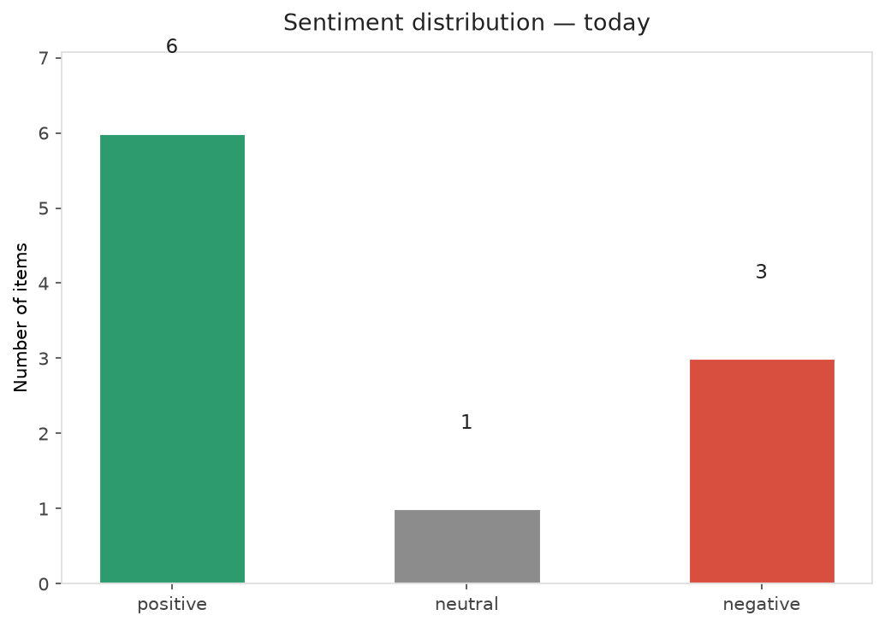
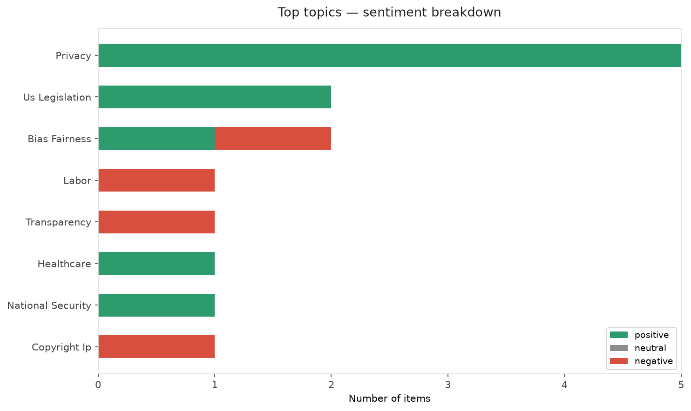
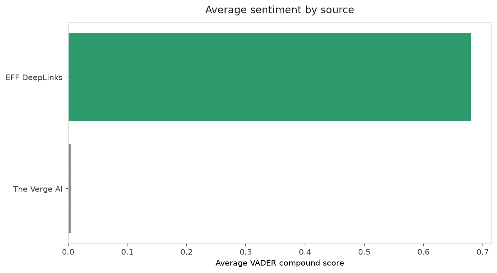
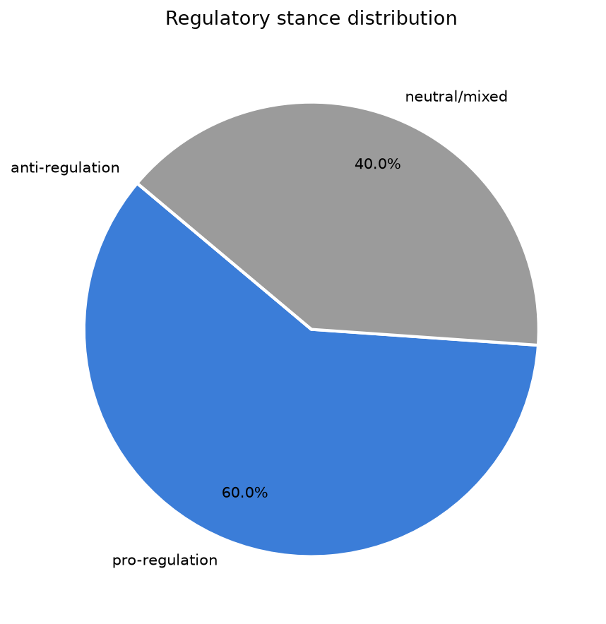
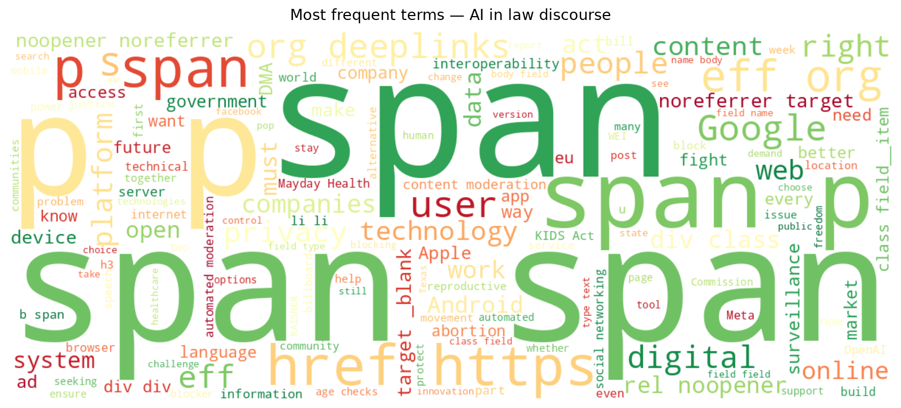
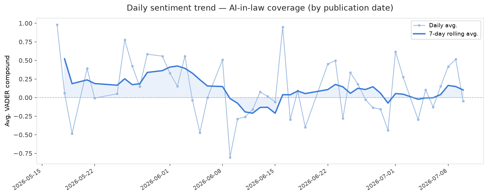
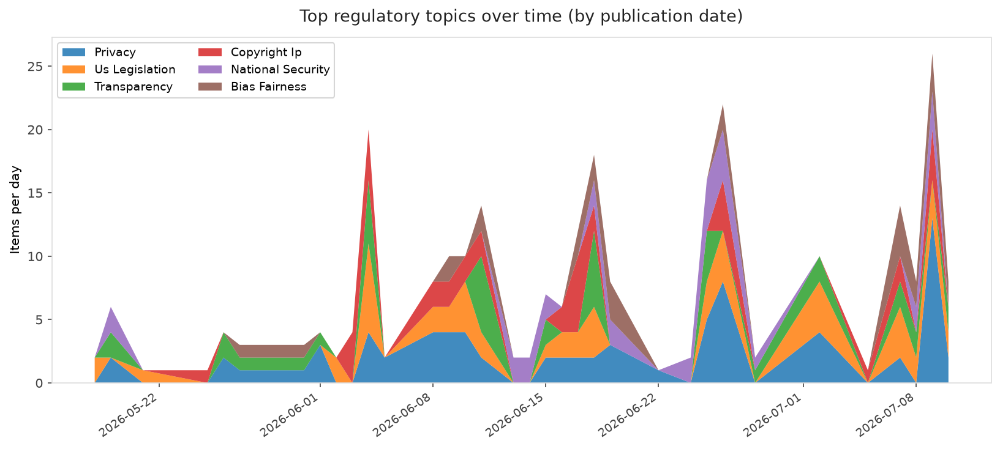
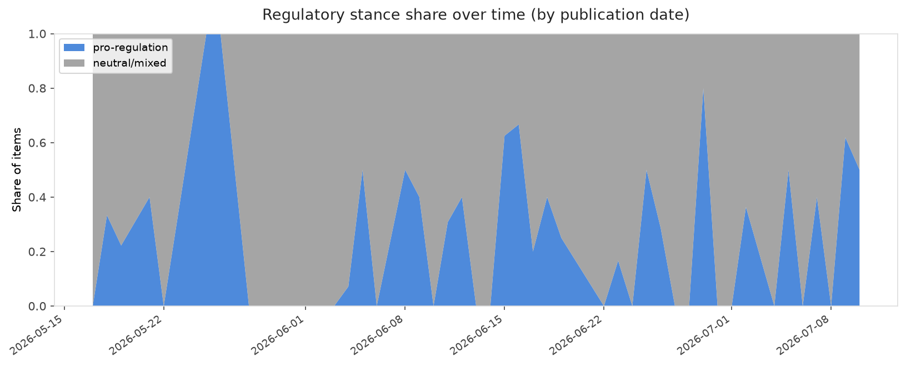

# AI in Law — Daily Sentiment Report
**Run date:** 2026-07-11 | **Items analyzed:** 10 | **Overall:** 🟢 Mildly positive (+0.320)

_Articles in this report were published between **2026-07-09** and **2026-07-10**._

---

## Summary

Today's collection covers **10** items from news outlets, academic preprints, Reddit, and regulatory sources.
Compared to the historical average of **+0.306**, today's sentiment is ↑ **0.014** points higher.

| Metric | Value |
|--------|-------|
| Positive items | 6 (60.0%) |
| Neutral items  | 1 (10.0%) |
| Negative items | 3 (30.0%) |
| Avg. VADER compound | +0.3201 |
| Pro-regulation items | 6 |
| Anti-regulation items | 0 |

---

## Top Topics Today

- **Privacy** — 5 items
- **Us Legislation** — 2 items
- **Bias Fairness** — 2 items
- **Labor** — 1 items
- **Transparency** — 1 items

---

## Most Positive Coverage

- [European Commission Chooses to Keep EU Users Locked Up Behind Big Tech’s Gates](https://www.eff.org/deeplinks/2026/07/european-commission-chooses-keep-eu-users-locked-behind-big-techs-gates)  
  _EFF DeepLinks_ — VADER: `+0.994`
- [Building Our Future Together](https://www.eff.org/deeplinks/2026/07/building-our-future-together)  
  _EFF DeepLinks_ — VADER: `+0.990`
- [The House Passed The KIDS Act—The Senate Should Reject It](https://www.eff.org/deeplinks/2026/07/house-passed-kids-act-senate-should-reject-it)  
  _EFF DeepLinks_ — VADER: `+0.859`

---

## Most Critical / Negative Coverage

- [OpenAI may have made a fatal misstep in copyright fight with news orgs](https://arstechnica.com/tech-policy/2026/07/openai-faked-inability-to-search-training-data-hid-billions-of-logs-nyt-says/)  
  _Ars Technica Tech Policy_ — VADER: `-0.872`
- [Apple sues OpenAI for allegedly stealing hardware secrets](https://www.theverge.com/tech/964350/apple-openai-lawsuit-trade-secrets)  
  _The Verge AI_ — VADER: `-0.778`
- [Automated Moderation Is Here to Stay—Accountability Must Keep Pace](https://www.eff.org/deeplinks/2026/07/part-2-automated-moderation-here-stay-accountability-must-keep-pace)  
  _EFF DeepLinks_ — VADER: `-0.382`

---

## Visualizations — Today

## Visualizations — Trends Over Time

---

## Methodology

- **VADER** (Valence Aware Dictionary and sEntiment Reasoner) — compound score in [-1, 1].
- **Topic tagging** — regex keyword matching across 12 AI-law sub-domains.
- **Stance detection** — keyword-based pro/anti-regulation signal detection.
- **Date filter** — items are kept only if their *publication* date falls within the look-back window (default 2 days).
- Sources: RSS news feeds, arXiv academic API, Reddit (PRAW), Regulations.gov API.

_Generated automatically on 2026-07-11 11:53 UTC._
