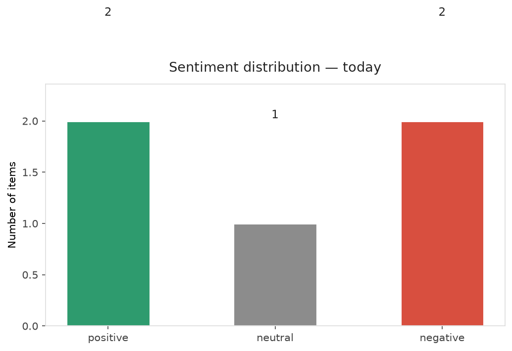
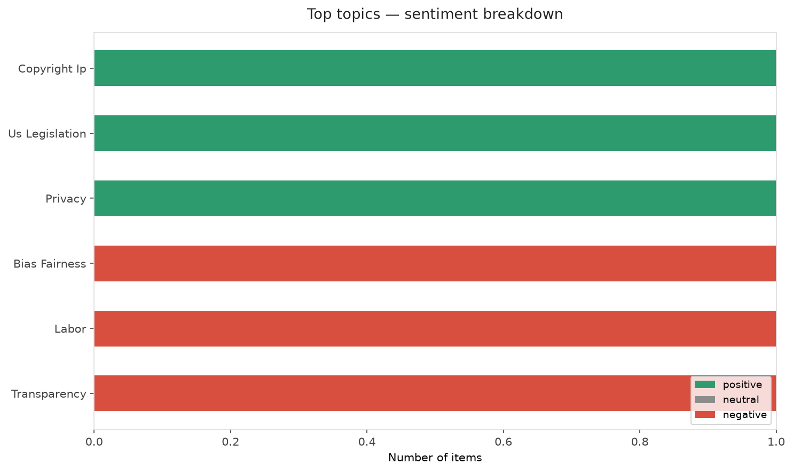
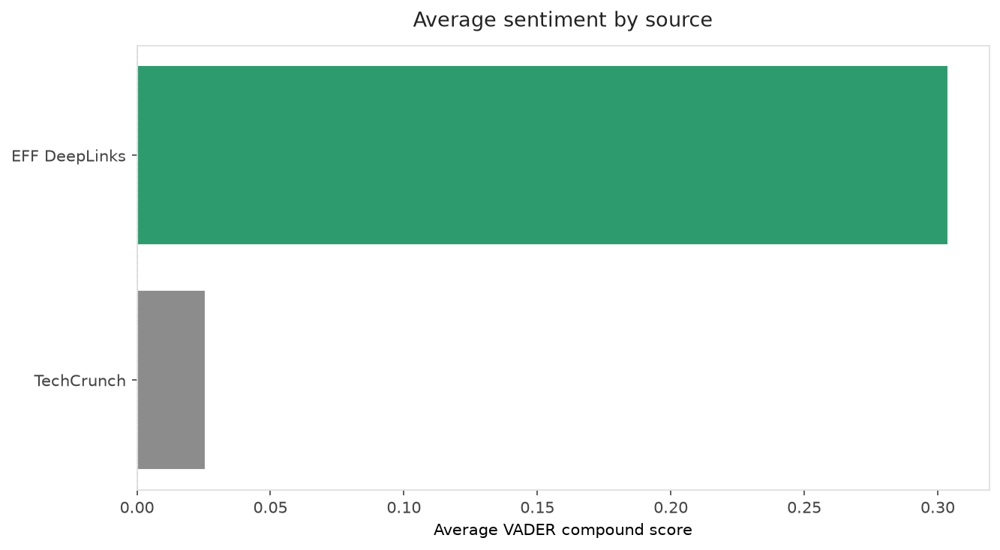
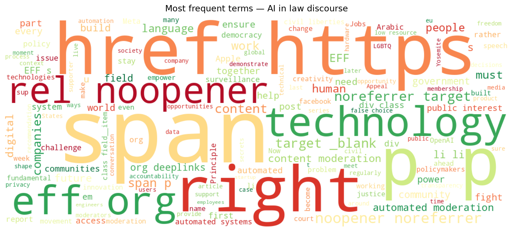
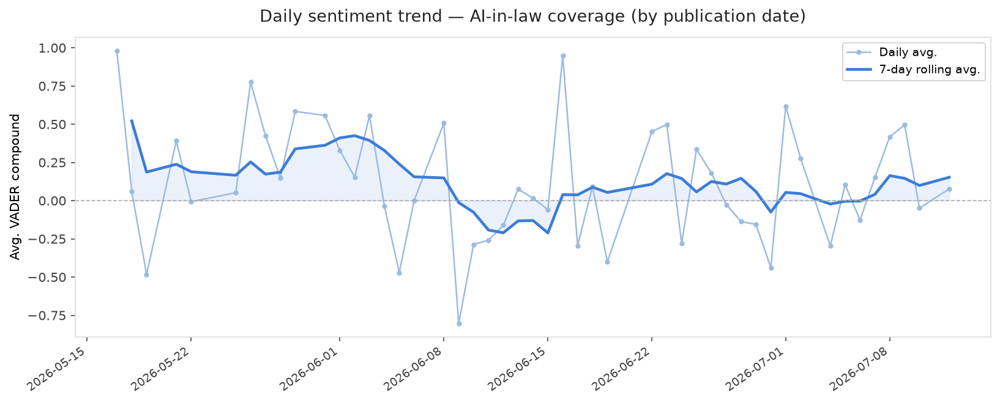
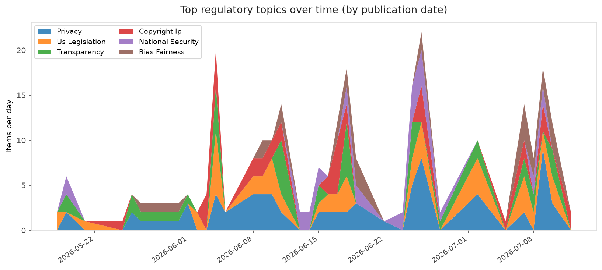
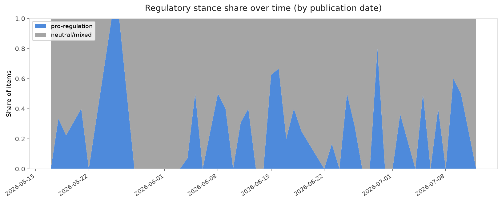

# AI in Law — Daily Sentiment Report
**Run date:** 2026-07-12 | **Items analyzed:** 5 | **Overall:** ⚪ Neutral / mixed (-0.024)

_Articles in this report were published between **2026-07-10** and **2026-07-12**._

---

## Summary

Today's collection covers **5** items from news outlets, academic preprints, Reddit, and regulatory sources.
Compared to the historical average of **+0.303**, today's sentiment is ↓ **0.327** points lower.

| Metric | Value |
|--------|-------|
| Positive items | 2 (40.0%) |
| Neutral items  | 1 (20.0%) |
| Negative items | 2 (40.0%) |
| Avg. VADER compound | -0.0238 |
| Pro-regulation items | 2 |
| Anti-regulation items | 0 |

---

## Top Topics Today

- **Copyright Ip** — 1 items
- **Us Legislation** — 1 items
- **Privacy** — 1 items
- **Bias Fairness** — 1 items
- **Labor** — 1 items

---

## Most Positive Coverage

- [Building Our Future Together](https://www.eff.org/deeplinks/2026/07/building-our-future-together)  
  _EFF DeepLinks_ — VADER: `+0.990`
- [Reed Jobs would rather talk about curing cancer than his last name](https://techcrunch.com/2026/07/11/reed-jobs-would-rather-talk-about-curing-cancer-than-his-last-name/)  
  _TechCrunch_ — VADER: `+0.077`
- [EU threatens Meta with fines over addictive features on Facebook and Instagram](https://techcrunch.com/2026/07/10/eu-threatens-meta-with-fines-over-addictive-features-on-facebook-and-instagram/)  
  _TechCrunch_ — VADER: `-0.026`

---

## Most Critical / Negative Coverage

- [Apple sues OpenAI for allegedly stealing hardware secrets](https://www.theverge.com/tech/964350/apple-openai-lawsuit-trade-secrets)  
  _The Verge AI_ — VADER: `-0.778`
- [Automated Moderation Is Here to Stay—Accountability Must Keep Pace](https://www.eff.org/deeplinks/2026/07/part-2-automated-moderation-here-stay-accountability-must-keep-pace)  
  _EFF DeepLinks_ — VADER: `-0.382`
- [EU threatens Meta with fines over addictive features on Facebook and Instagram](https://techcrunch.com/2026/07/10/eu-threatens-meta-with-fines-over-addictive-features-on-facebook-and-instagram/)  
  _TechCrunch_ — VADER: `-0.026`

---

## Visualizations — Today

## Visualizations — Trends Over Time

---

## Methodology

- **VADER** (Valence Aware Dictionary and sEntiment Reasoner) — compound score in [-1, 1].
- **Topic tagging** — regex keyword matching across 12 AI-law sub-domains.
- **Stance detection** — keyword-based pro/anti-regulation signal detection.
- **Date filter** — items are kept only if their *publication* date falls within the look-back window (default 2 days).
- Sources: RSS news feeds, arXiv academic API, Reddit (PRAW), Regulations.gov API.

_Generated automatically on 2026-07-12 12:02 UTC._
