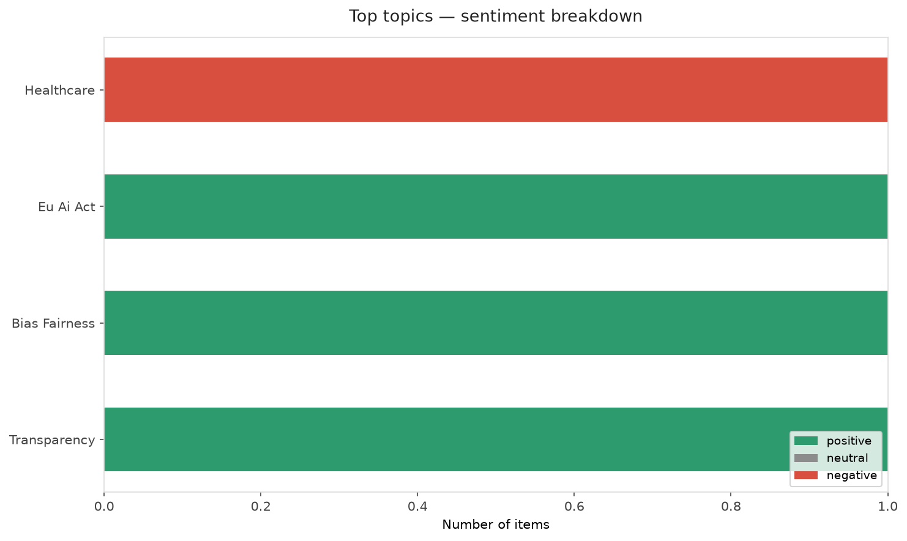
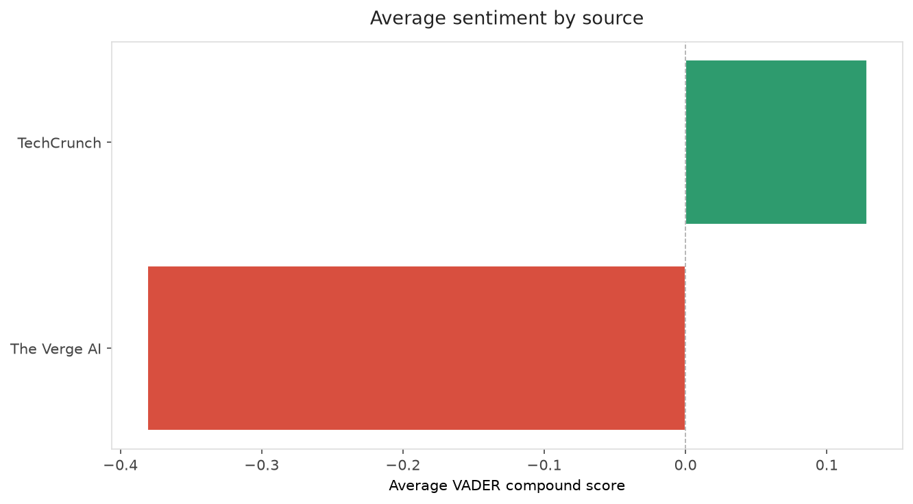
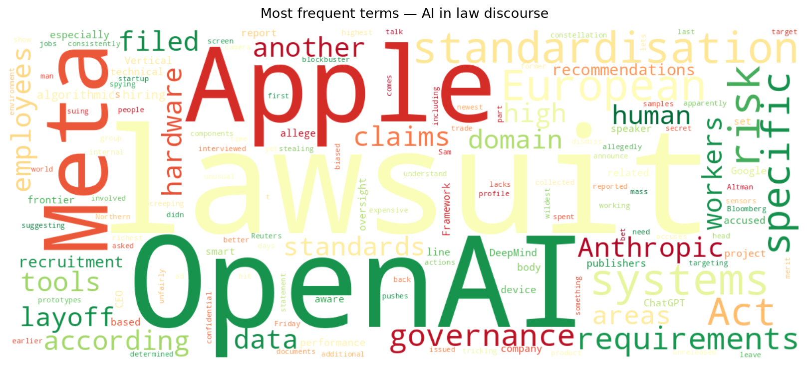
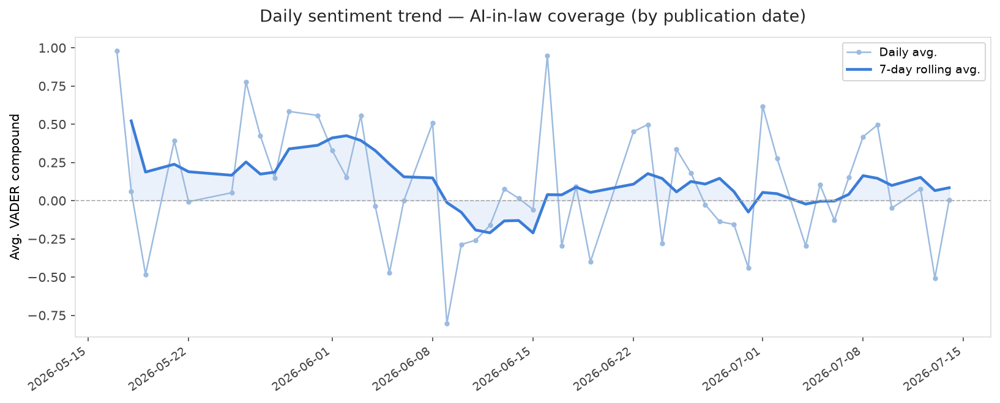
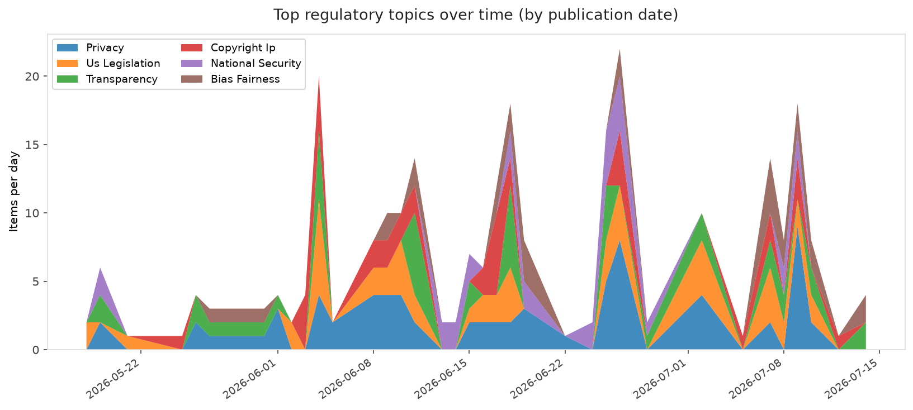
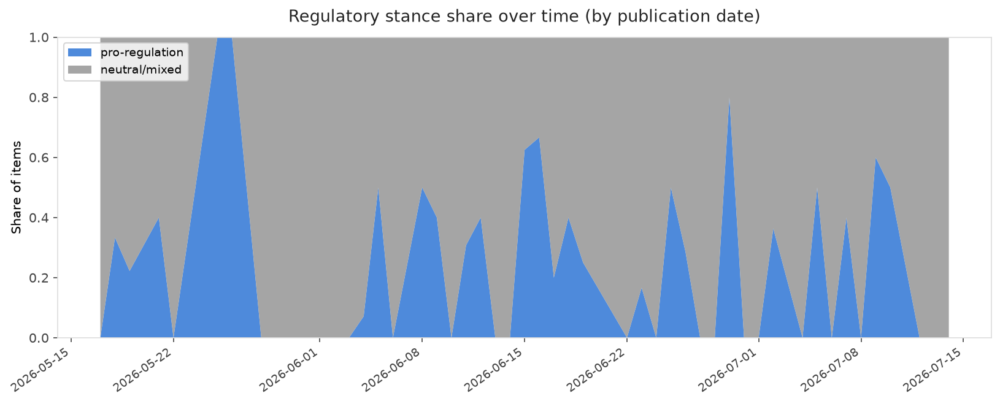

# AI in Law — Daily Sentiment Report
**Run date:** 2026-07-15 | **Items analyzed:** 10 | **Overall:** 🔴 Mildly negative (-0.056)

_Articles in this report were published between **2026-07-13** and **2026-07-14**._

---

## Summary

Today's collection covers **10** items from news outlets, academic preprints, Reddit, and regulatory sources.
Compared to the historical average of **+0.296**, today's sentiment is ↓ **0.352** points lower.

| Metric | Value |
|--------|-------|
| Positive items | 4 (40.0%) |
| Neutral items  | 1 (10.0%) |
| Negative items | 5 (50.0%) |
| Avg. VADER compound | -0.0559 |
| Pro-regulation items | 0 |
| Anti-regulation items | 0 |

---

## Top Topics Today

- **Healthcare** — 1 items
- **Eu Ai Act** — 1 items
- **Bias Fairness** — 1 items
- **Transparency** — 1 items

---

## Most Positive Coverage

- [Vertical Standardisation for High-Risk AI Systems under the EU AI Act: A Domain-Specific Framework f](https://arxiv.org/abs/2607.12588v1)  
  _arXiv_ — VADER: `+0.762`
- [DeepMind CEO calls for an independent standards body to regulate frontier AI](https://techcrunch.com/2026/07/14/deepmind-ceo-calls-for-an-independent-standards-body-to-regulate-frontier-ai/)  
  _TechCrunch_ — VADER: `+0.637`
- [Anthropic’s newest ad is creeping people out](https://techcrunch.com/2026/07/14/anthropics-newest-ad-is-creeping-people-out/)  
  _TechCrunch_ — VADER: `+0.103`

---

## Most Critical / Negative Coverage

- [Meta accused of using biased AI targeting for mass layoffs](https://www.theverge.com/tech/965486/meta-lawsuit-former-employees-ai-layoffs)  
  _The Verge AI_ — VADER: `-0.625`
- [The 6 wildest claims in Apple&#8217;s lawsuit against OpenAI](https://www.theverge.com/tech/964843/apple-openai-lawsuit-wildest-claims)  
  _The Verge AI_ — VADER: `-0.599`
- [OpenAI may announce a ChatGPT smart speaker this year](https://www.theverge.com/ai-artificial-intelligence/965670/openai-chatgpt-ai-smart-speaker-hardware-device)  
  _The Verge AI_ — VADER: `-0.351`

---

## Visualizations — Today

## Visualizations — Trends Over Time

---

## Methodology

- **VADER** (Valence Aware Dictionary and sEntiment Reasoner) — compound score in [-1, 1].
- **Topic tagging** — regex keyword matching across 12 AI-law sub-domains.
- **Stance detection** — keyword-based pro/anti-regulation signal detection.
- **Date filter** — items are kept only if their *publication* date falls within the look-back window (default 2 days).
- Sources: RSS news feeds, arXiv academic API, Reddit (PRAW), Regulations.gov API.

_Generated automatically on 2026-07-15 12:16 UTC._
