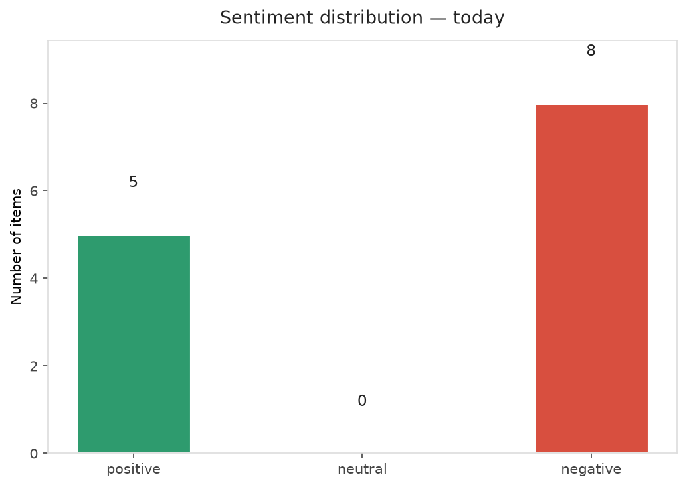
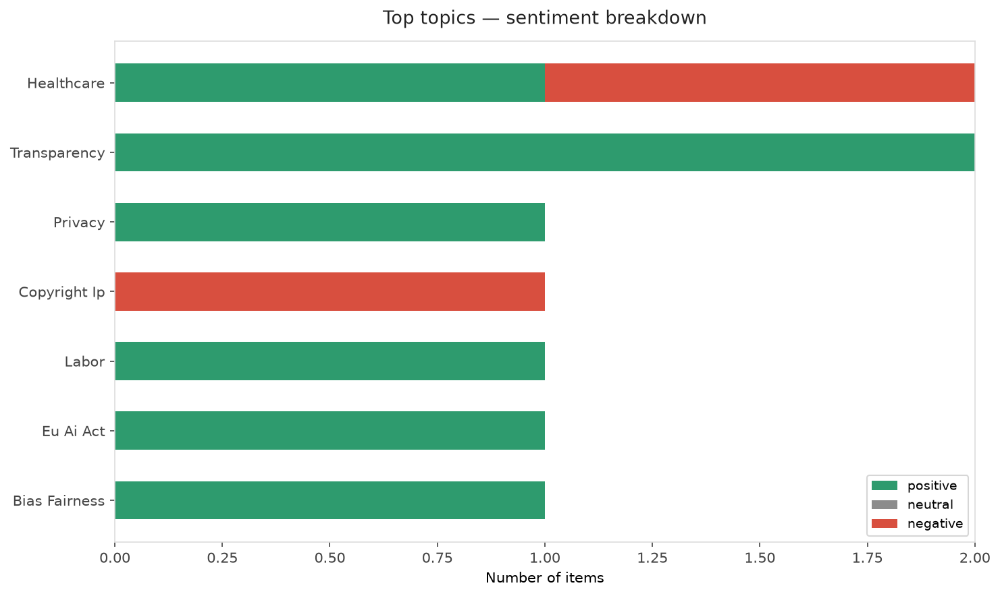
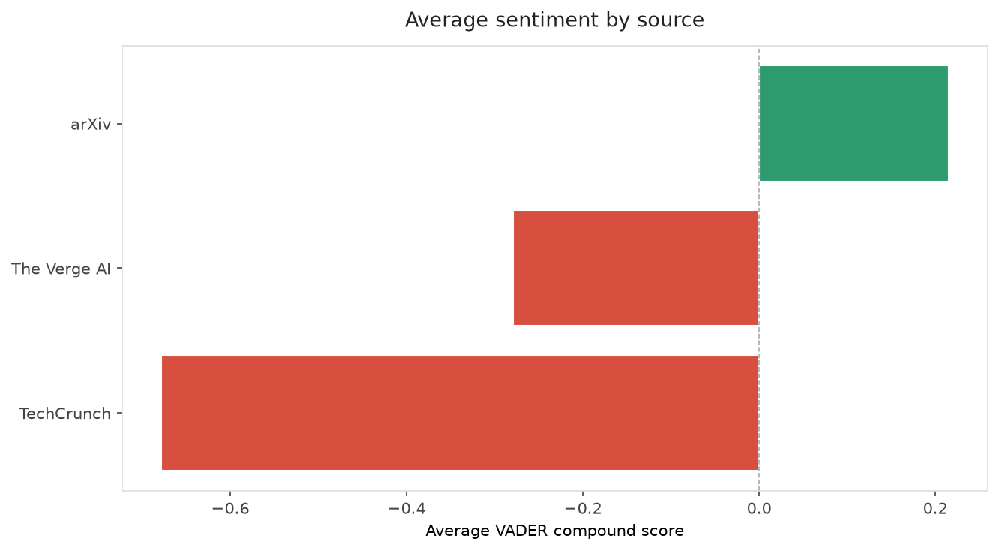
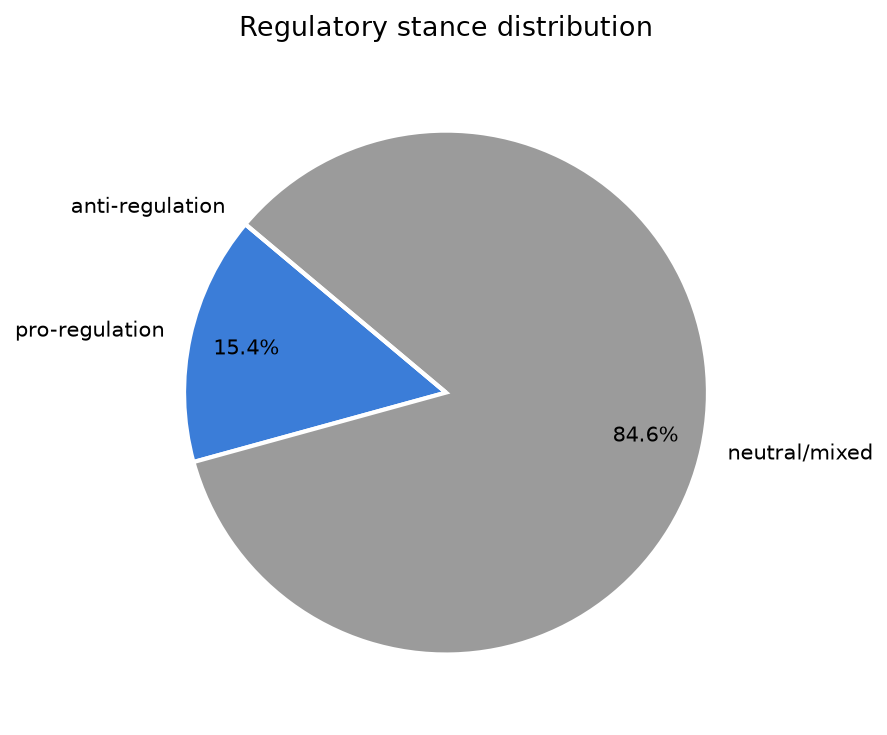
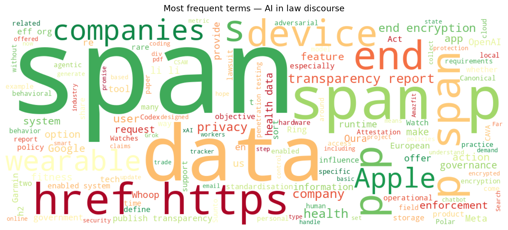
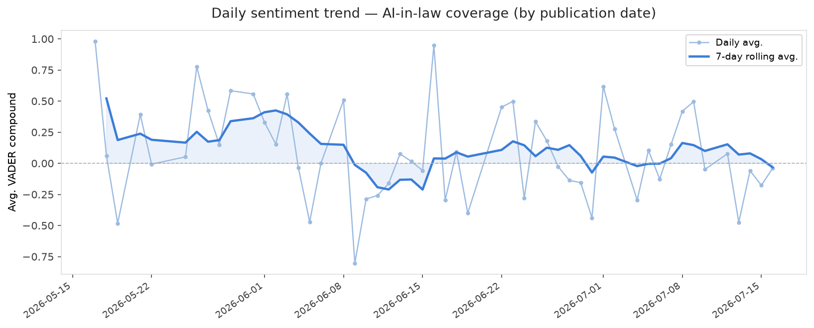
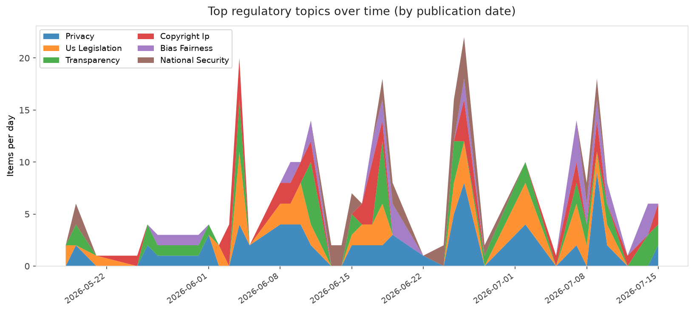
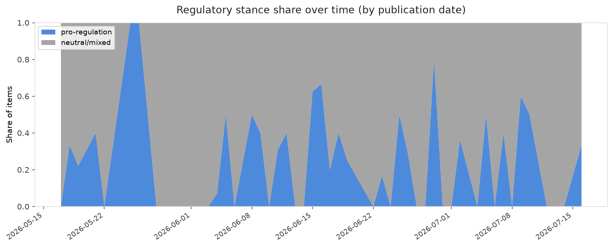

# AI in Law — Daily Sentiment Report
**Run date:** 2026-07-16 | **Items analyzed:** 13 | **Overall:** 🔴 Mildly negative (-0.131)

_Articles in this report were published between **2026-07-14** and **2026-07-16**._

---

## Summary

Today's collection covers **13** items from news outlets, academic preprints, Reddit, and regulatory sources.
Compared to the historical average of **+0.288**, today's sentiment is ↓ **0.420** points lower.

| Metric | Value |
|--------|-------|
| Positive items | 5 (38.5%) |
| Neutral items  | 0 (0.0%) |
| Negative items | 8 (61.5%) |
| Avg. VADER compound | -0.1312 |
| Pro-regulation items | 2 |
| Anti-regulation items | 0 |

---

## Top Topics Today

- **Healthcare** — 2 items
- **Transparency** — 2 items
- **Privacy** — 1 items
- **Copyright Ip** — 1 items
- **Labor** — 1 items

---

## Most Positive Coverage

- [Most Smart Watches, Rings, and Bands Lack Basic Transparency Reports and Key Privacy Features](https://www.eff.org/deeplinks/2026/07/most-smart-watches-rings-and-bands-lack-basic-transparency-reports-and-key-privacy)  
  _EFF DeepLinks_ — VADER: `+0.994`
- [CAVA: Canonical Action Verification and Attestation for Runtime Governance of Agentic AI Systems](https://arxiv.org/abs/2607.13716v1)  
  _arXiv_ — VADER: `+0.875`
- [Vertical Standardisation for High-Risk AI Systems under the EU AI Act: A Domain-Specific Framework f](https://arxiv.org/abs/2607.12588v1)  
  _arXiv_ — VADER: `+0.762`

---

## Most Critical / Negative Coverage

- [Rethinking Penetration Testing for AI-Enabled Systems: From Resource Compromise to Behavioral Object](https://arxiv.org/abs/2607.14006v1)  
  _arXiv_ — VADER: `-0.993`
- [Meta now alerts parents if their teen discussed suicide or self-harm with its AI chatbot](https://techcrunch.com/2026/07/16/meta-now-alerts-parents-if-their-teen-discussed-suicide-or-self-harm-with-its-ai-chatbot/)  
  _TechCrunch_ — VADER: `-0.863`
- [OpenAI finally launches hardware… for Codex](https://www.theverge.com/ai-artificial-intelligence/965901/openai-hardware-codex-micro-launch)  
  _The Verge AI_ — VADER: `-0.743`

---

## Visualizations — Today

## Visualizations — Trends Over Time

---

## Methodology

- **VADER** (Valence Aware Dictionary and sEntiment Reasoner) — compound score in [-1, 1].
- **Topic tagging** — regex keyword matching across 12 AI-law sub-domains.
- **Stance detection** — keyword-based pro/anti-regulation signal detection.
- **Date filter** — items are kept only if their *publication* date falls within the look-back window (default 2 days).
- Sources: RSS news feeds, arXiv academic API, Reddit (PRAW), Regulations.gov API.

_Generated automatically on 2026-07-16 12:22 UTC._
