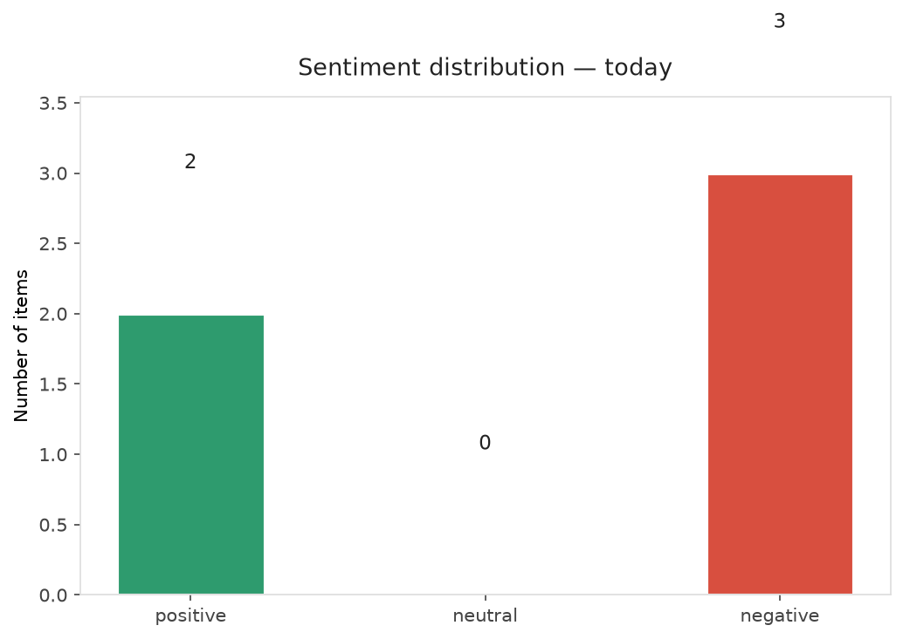
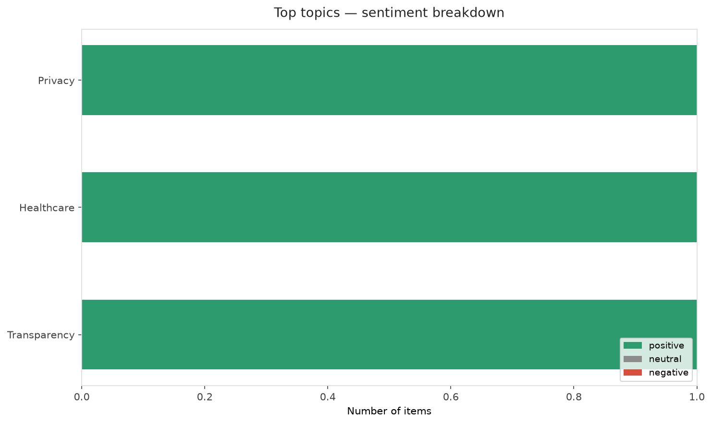
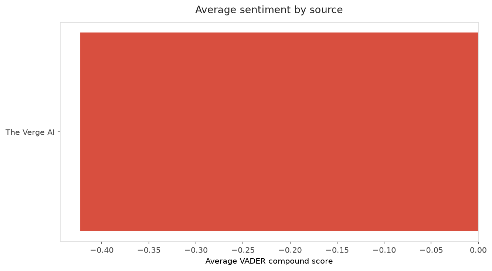
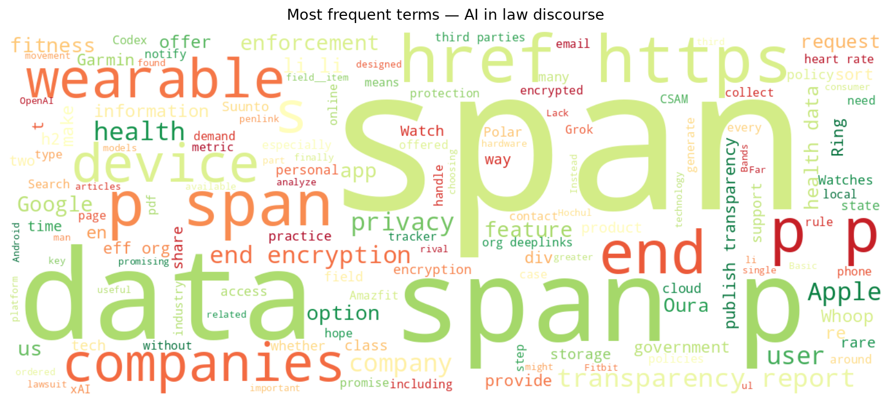
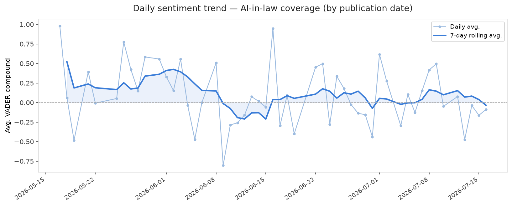
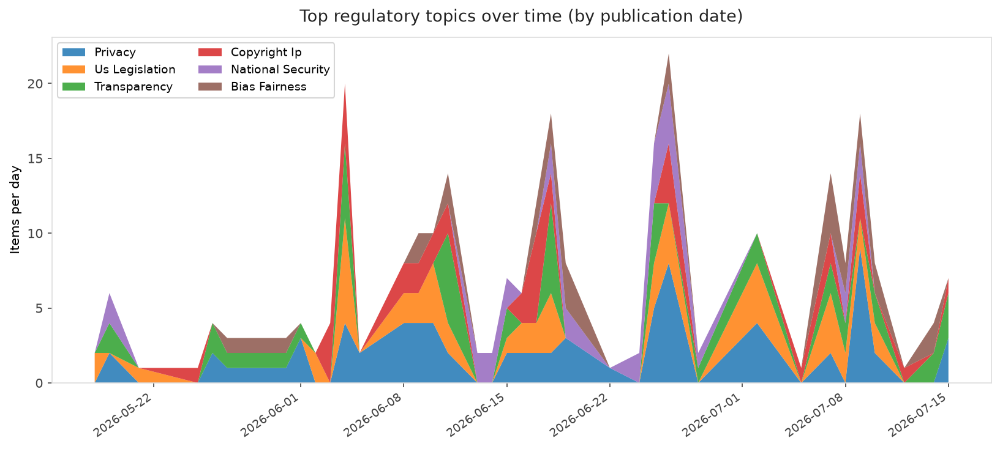
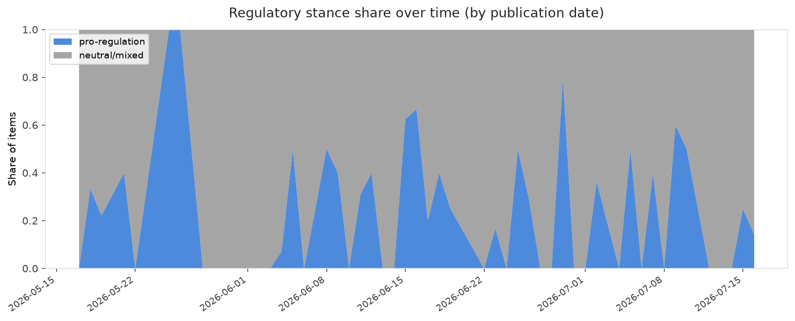

# AI in Law — Daily Sentiment Report
**Run date:** 2026-07-17 | **Items analyzed:** 5 | **Overall:** 🔴 Mildly negative (-0.140)

_Articles in this report were published between **2026-07-15** and **2026-07-16**._

---

## Summary

Today's collection covers **5** items from news outlets, academic preprints, Reddit, and regulatory sources.
Compared to the historical average of **+0.285**, today's sentiment is ↓ **0.425** points lower.

| Metric | Value |
|--------|-------|
| Positive items | 2 (40.0%) |
| Neutral items  | 0 (0.0%) |
| Negative items | 3 (60.0%) |
| Avg. VADER compound | -0.1397 |
| Pro-regulation items | 1 |
| Anti-regulation items | 0 |

---

## Top Topics Today

- **Privacy** — 1 items
- **Healthcare** — 1 items
- **Transparency** — 1 items

---

## Most Positive Coverage

- [Most Smart Watches, Rings, and Bands Lack Basic Transparency Reports and Key Privacy Features](https://www.eff.org/deeplinks/2026/07/most-smart-watches-rings-and-bands-lack-basic-transparency-reports-and-key-privacy)  
  _EFF DeepLinks_ — VADER: `+0.994`
- [Google ordered to open Android and Search to rivals in Europe](https://www.theverge.com/policy/966438/eu-google-android-ai-interoperability-search-data-dma)  
  _The Verge AI_ — VADER: `+0.201`
- [New York governor says she&#8217;s using AI to analyze &#8216;every single rule&#8217; in the state](https://www.theverge.com/ai-artificial-intelligence/966647/new-york-governor-kathy-hochul-ai-policies)  
  _The Verge AI_ — VADER: `-0.450`

---

## Most Critical / Negative Coverage

- [OpenAI finally launches hardware… for Codex](https://www.theverge.com/ai-artificial-intelligence/965901/openai-hardware-codex-micro-launch)  
  _The Verge AI_ — VADER: `-0.743`
- [xAI sues a man for using Grok to generate CSAM &#8216;deepfakes&#8217;](https://www.theverge.com/ai-artificial-intelligence/966293/xai-grok-user-lawsuit-csam)  
  _The Verge AI_ — VADER: `-0.700`
- [New York governor says she&#8217;s using AI to analyze &#8216;every single rule&#8217; in the state](https://www.theverge.com/ai-artificial-intelligence/966647/new-york-governor-kathy-hochul-ai-policies)  
  _The Verge AI_ — VADER: `-0.450`

---

## Visualizations — Today

## Visualizations — Trends Over Time

---

## Methodology

- **VADER** (Valence Aware Dictionary and sEntiment Reasoner) — compound score in [-1, 1].
- **Topic tagging** — regex keyword matching across 12 AI-law sub-domains.
- **Stance detection** — keyword-based pro/anti-regulation signal detection.
- **Date filter** — items are kept only if their *publication* date falls within the look-back window (default 2 days).
- Sources: RSS news feeds, arXiv academic API, Reddit (PRAW), Regulations.gov API.

_Generated automatically on 2026-07-17 12:13 UTC._
