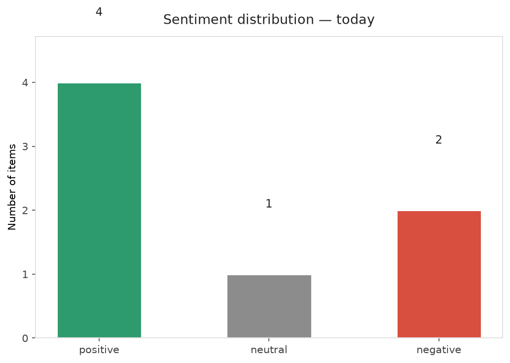
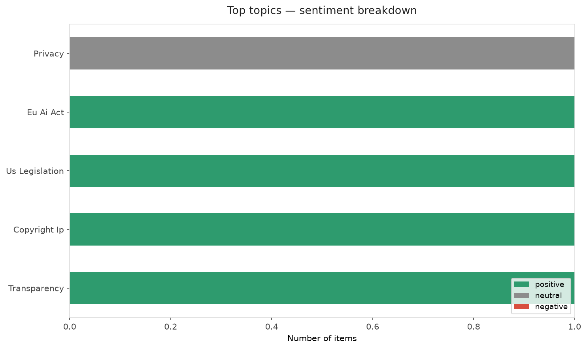
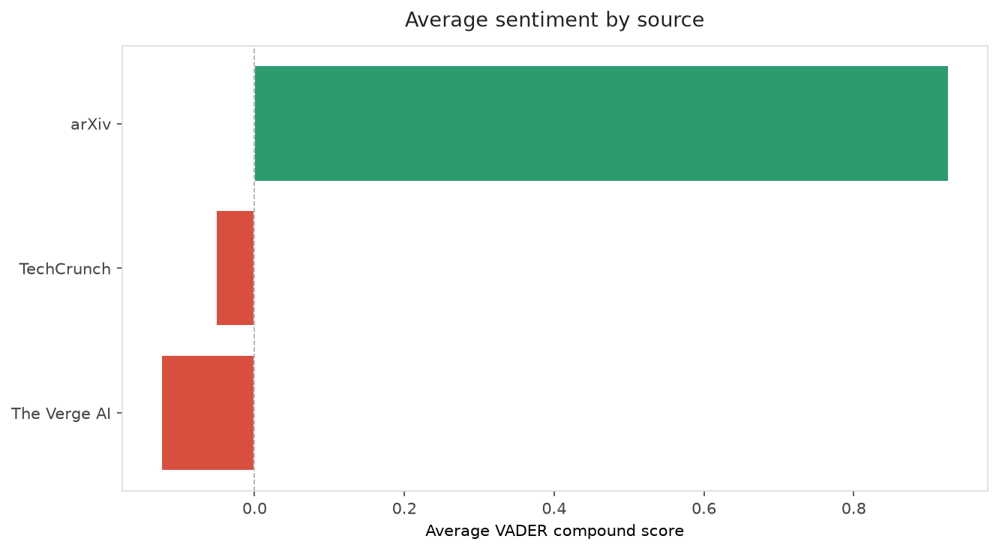
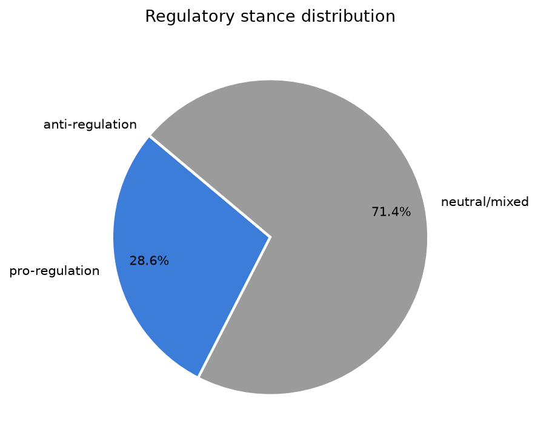
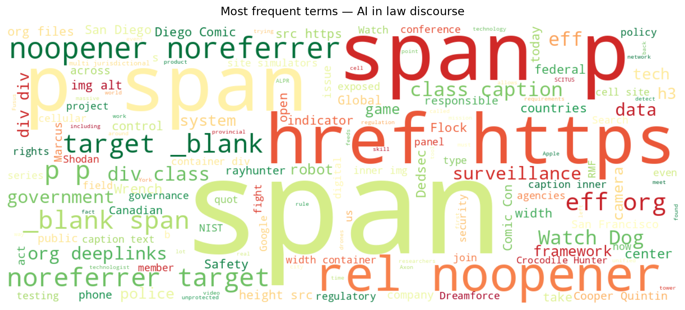
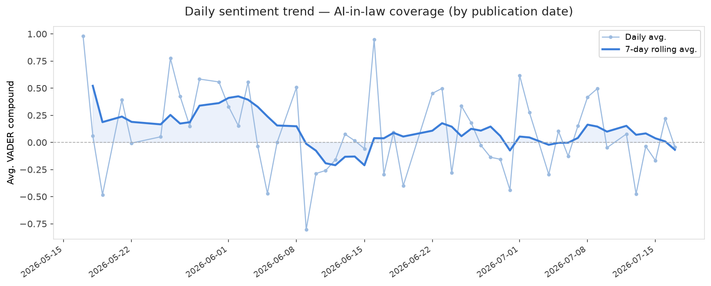
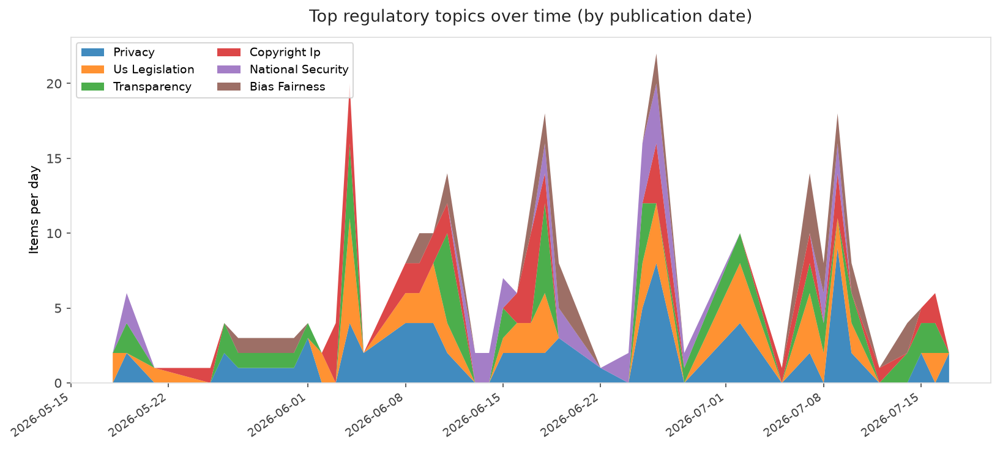
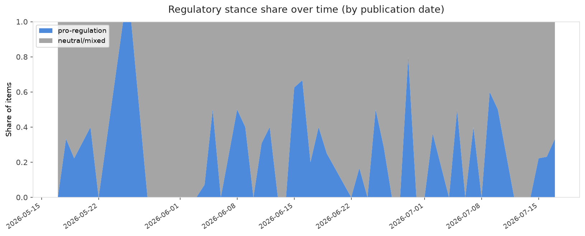

# AI in Law — Daily Sentiment Report
**Run date:** 2026-07-18 | **Items analyzed:** 7 | **Overall:** 🟢 Mildly positive (+0.211)

_Articles in this report were published between **2026-07-16** and **2026-07-17**._

---

## Summary

Today's collection covers **7** items from news outlets, academic preprints, Reddit, and regulatory sources.
Compared to the historical average of **+0.285**, today's sentiment is ↓ **0.074** points lower.

| Metric | Value |
|--------|-------|
| Positive items | 4 (57.1%) |
| Neutral items  | 1 (14.3%) |
| Negative items | 2 (28.6%) |
| Avg. VADER compound | +0.2106 |
| Pro-regulation items | 2 |
| Anti-regulation items | 0 |

---

## Top Topics Today

- **Privacy** — 1 items
- **Eu Ai Act** — 1 items
- **Us Legislation** — 1 items
- **Copyright Ip** — 1 items
- **Transparency** — 1 items

---

## Most Positive Coverage

- [Global Index on Responsible AI: 2026 Report](https://arxiv.org/abs/2607.14782v1)  
  _arXiv_ — VADER: `+0.976`
- [SCITUS: A Multi-Jurisdictional Framework for Adapting NIST AI RMF to the Canadian Regulatory Context](https://arxiv.org/abs/2607.15051v1)  
  _arXiv_ — VADER: `+0.877`
- [Databricks hits $188B valuation, extending its run as AI’s favorite second act](https://techcrunch.com/2026/07/17/databricks-hits-188b-valuation-extending-its-run-as-ais-favorite-second-act/)  
  _TechCrunch_ — VADER: `+0.459`

---

## Most Critical / Negative Coverage

- [How Apple’s big lawsuit could disrupt OpenAI’s IPO plans](https://techcrunch.com/video/how-apples-big-lawsuit-could-disrupt-openais-ipo-plans/)  
  _TechCrunch_ — VADER: `-0.563`
- [New York governor says she&#8217;s using AI to analyze &#8216;every single rule&#8217; in the state](https://www.theverge.com/ai-artificial-intelligence/966647/new-york-governor-kathy-hochul-ai-policies)  
  _The Verge AI_ — VADER: `-0.450`
- [How the Watch Dogs Video Game Series Mirrored and Predicted Real-World Digital Rights Issues](https://www.eff.org/deeplinks/2026/07/how-watch-dogs-video-game-series-mirrored-and-predicted-real-world-digital-rights)  
  _EFF DeepLinks_ — VADER: `-0.026`

---

## Visualizations — Today

## Visualizations — Trends Over Time

---

## Methodology

- **VADER** (Valence Aware Dictionary and sEntiment Reasoner) — compound score in [-1, 1].
- **Topic tagging** — regex keyword matching across 12 AI-law sub-domains.
- **Stance detection** — keyword-based pro/anti-regulation signal detection.
- **Date filter** — items are kept only if their *publication* date falls within the look-back window (default 2 days).
- Sources: RSS news feeds, arXiv academic API, Reddit (PRAW), Regulations.gov API.

_Generated automatically on 2026-07-18 11:54 UTC._
