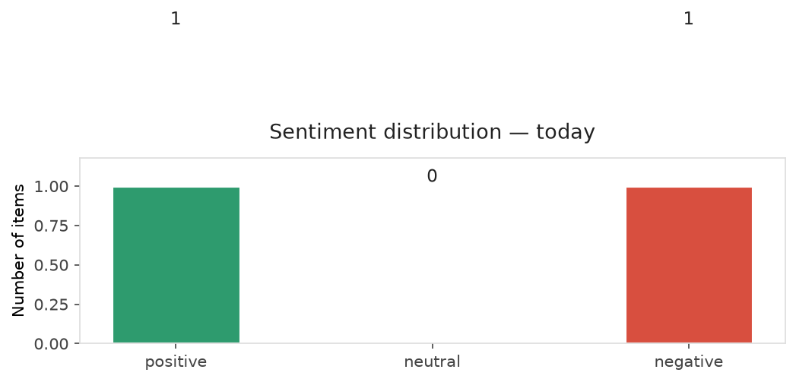
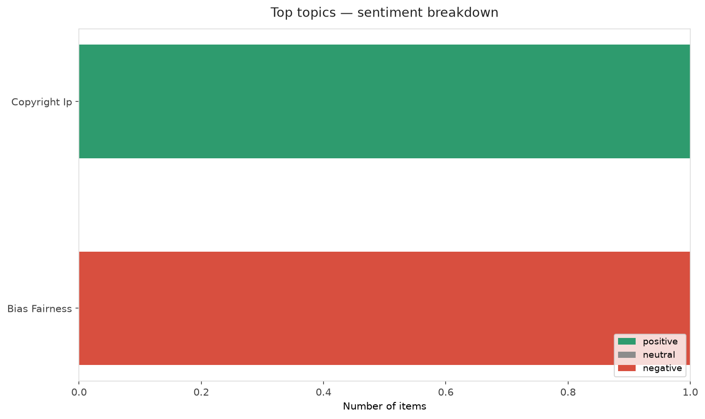
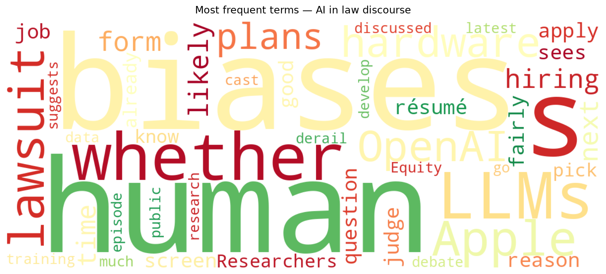
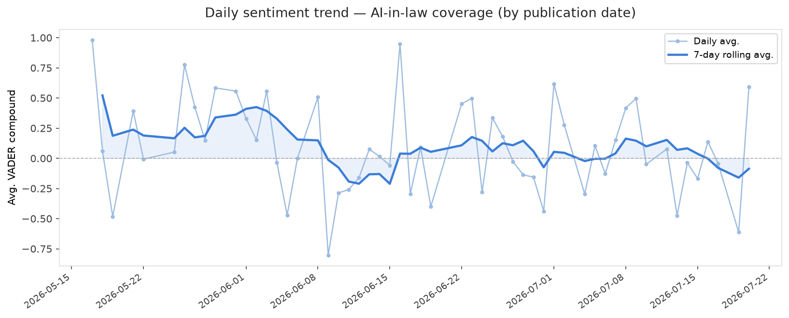
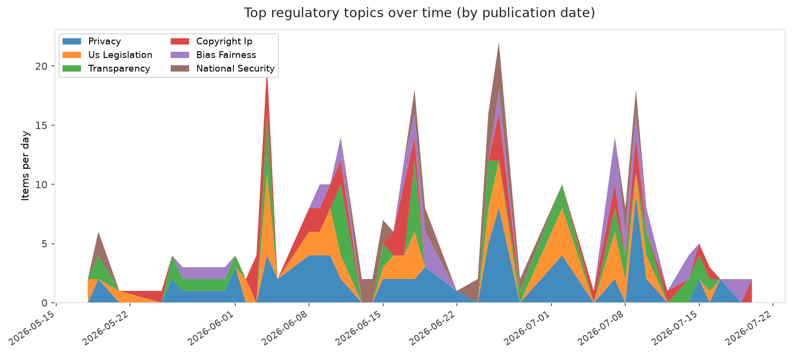
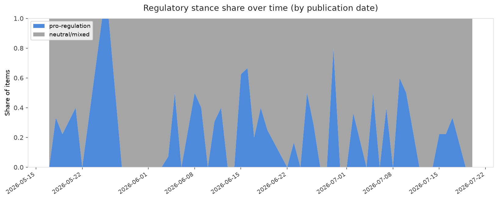

# AI in Law — Daily Sentiment Report
**Run date:** 2026-07-20 | **Items analyzed:** 2 | **Overall:** ⚪ Neutral / mixed (-0.010)

_Articles in this report were published between **2026-07-19** and **2026-07-20**._

---

## Summary

Today's collection covers **2** items from news outlets, academic preprints, Reddit, and regulatory sources.
Compared to the historical average of **+0.283**, today's sentiment is ↓ **0.292** points lower.

| Metric | Value |
|--------|-------|
| Positive items | 1 (50.0%) |
| Neutral items  | 0 (0.0%) |
| Negative items | 1 (50.0%) |
| Avg. VADER compound | -0.0099 |
| Pro-regulation items | 0 |
| Anti-regulation items | 0 |

---

## Top Topics Today

- **Copyright Ip** — 1 items
- **Bias Fairness** — 1 items

---

## Most Positive Coverage

- [AI is more likely than humans to form biases when hiring](https://www.technologyreview.com/2026/07/20/1140655/ai-biases-hiring-humans/)  
  _MIT Tech Review_ — VADER: `+0.593`
- [Can an Apple lawsuit derail OpenAI’s hardware plans?](https://techcrunch.com/2026/07/19/can-an-apple-lawsuit-derail-openais-hardware-plans/)  
  _TechCrunch_ — VADER: `-0.612`

---

## Most Critical / Negative Coverage

- [Can an Apple lawsuit derail OpenAI’s hardware plans?](https://techcrunch.com/2026/07/19/can-an-apple-lawsuit-derail-openais-hardware-plans/)  
  _TechCrunch_ — VADER: `-0.612`
- [AI is more likely than humans to form biases when hiring](https://www.technologyreview.com/2026/07/20/1140655/ai-biases-hiring-humans/)  
  _MIT Tech Review_ — VADER: `+0.593`

---

## Visualizations — Today

## Visualizations — Trends Over Time

---

## Methodology

- **VADER** (Valence Aware Dictionary and sEntiment Reasoner) — compound score in [-1, 1].
- **Topic tagging** — regex keyword matching across 12 AI-law sub-domains.
- **Stance detection** — keyword-based pro/anti-regulation signal detection.
- **Date filter** — items are kept only if their *publication* date falls within the look-back window (default 2 days).
- Sources: RSS news feeds, arXiv academic API, Reddit (PRAW), Regulations.gov API.

_Generated automatically on 2026-07-20 13:08 UTC._
