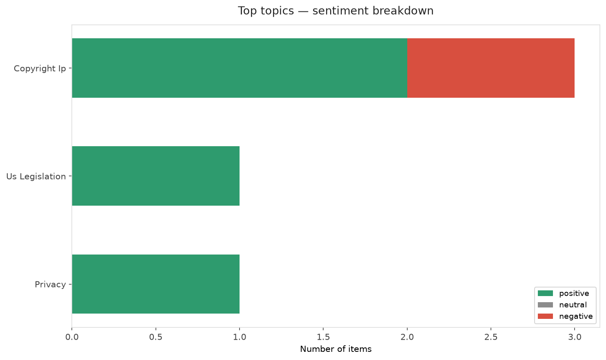
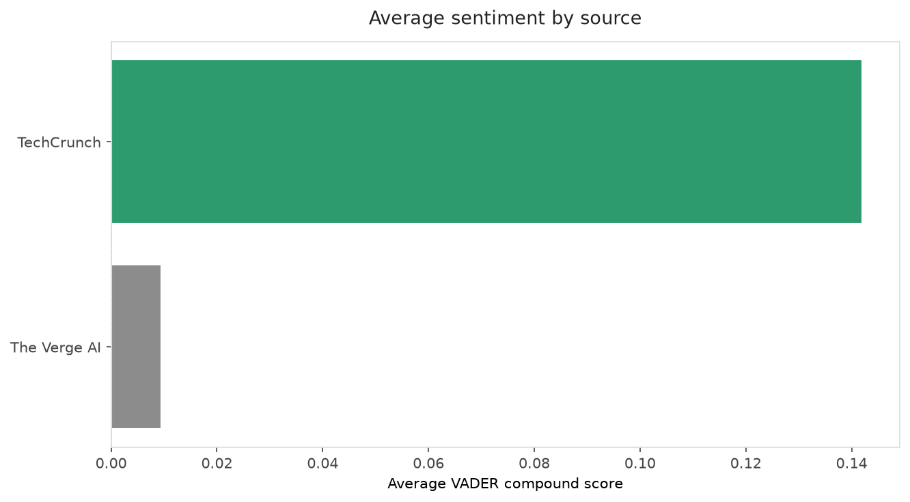
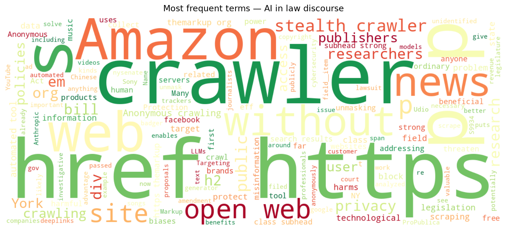
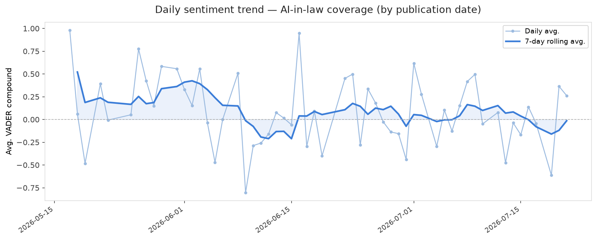
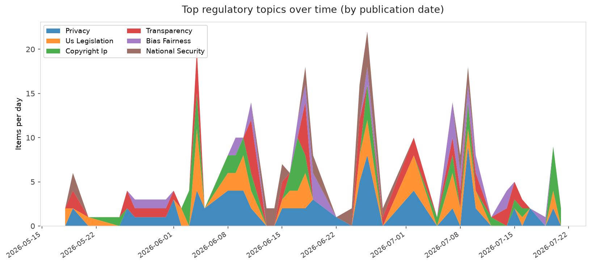
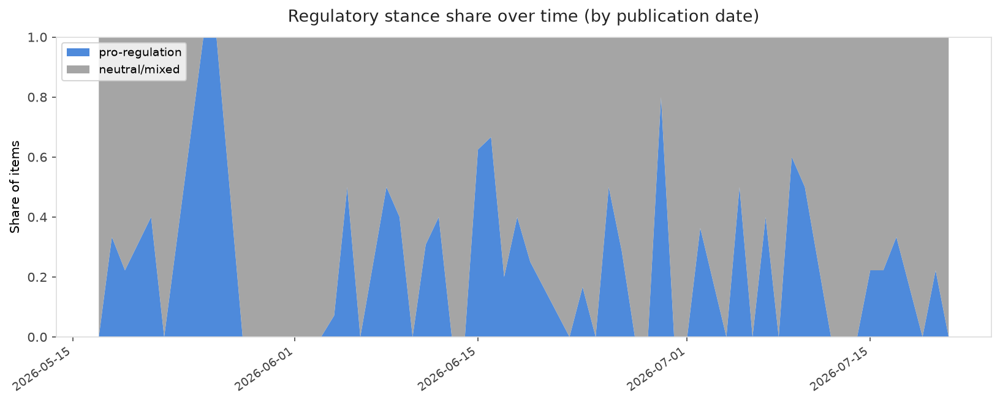

# AI in Law — Daily Sentiment Report
**Run date:** 2026-07-21 | **Items analyzed:** 6 | **Overall:** 🟢 Mildly positive (+0.311)

_Articles in this report were published between **2026-07-20** and **2026-07-21**._

---

## Summary

Today's collection covers **6** items from news outlets, academic preprints, Reddit, and regulatory sources.
Compared to the historical average of **+0.283**, today's sentiment is ↑ **0.028** points higher.

| Metric | Value |
|--------|-------|
| Positive items | 5 (83.3%) |
| Neutral items  | 0 (0.0%) |
| Negative items | 1 (16.7%) |
| Avg. VADER compound | +0.3109 |
| Pro-regulation items | 1 |
| Anti-regulation items | 0 |

---

## Top Topics Today

- **Copyright Ip** — 3 items
- **Us Legislation** — 1 items
- **Privacy** — 1 items

---

## Most Positive Coverage

- [“Stealth Crawlers” Are Not a Threat to the Open Web. Bills Targeting Them Would Be.](https://www.eff.org/deeplinks/2026/07/stealth-crawlers-are-not-threat-open-web-bills-targeting-them-would-be)  
  _EFF DeepLinks_ — VADER: `+0.970`
- [AI is more likely than humans to form biases when hiring](https://www.technologyreview.com/2026/07/20/1140655/ai-biases-hiring-humans/)  
  _MIT Tech Review_ — VADER: `+0.593`
- [America needs to stop getting shocked by Chinese AI](https://www.theverge.com/ai-artificial-intelligence/968136/chinese-ai-models-another-sputnik-moment)  
  _The Verge AI_ — VADER: `+0.440`

---

## Most Critical / Negative Coverage

- [Here are the 30,000 songs Sony is suing Udio&#8217;s AI music generator over](https://www.theverge.com/tech/968375/sony-udio-lawsuit-songs-ai-copyright)  
  _The Verge AI_ — VADER: `-0.421`
- [Anthropic’s landmark $1.5B copyright settlement is approved](https://techcrunch.com/2026/07/20/anthropics-landmark-1-5b-copyright-settlement-is-approved/)  
  _TechCrunch_ — VADER: `+0.083`
- [YouTube clarifies policies around AI slop and upsetting videos](https://techcrunch.com/2026/07/20/youtube-clarifies-policies-around-ai-slop-and-upsetting-videos/)  
  _TechCrunch_ — VADER: `+0.201`

---

## Visualizations — Today

## Visualizations — Trends Over Time

---

## Methodology

- **VADER** (Valence Aware Dictionary and sEntiment Reasoner) — compound score in [-1, 1].
- **Topic tagging** — regex keyword matching across 12 AI-law sub-domains.
- **Stance detection** — keyword-based pro/anti-regulation signal detection.
- **Date filter** — items are kept only if their *publication* date falls within the look-back window (default 2 days).
- Sources: RSS news feeds, arXiv academic API, Reddit (PRAW), Regulations.gov API.

_Generated automatically on 2026-07-21 12:26 UTC._
