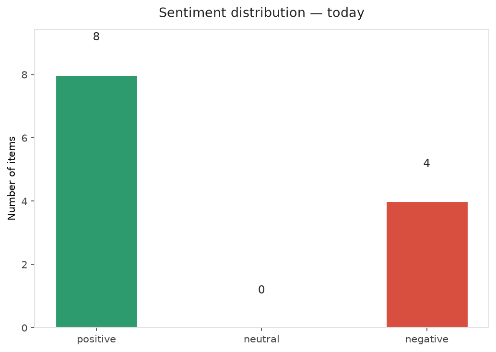
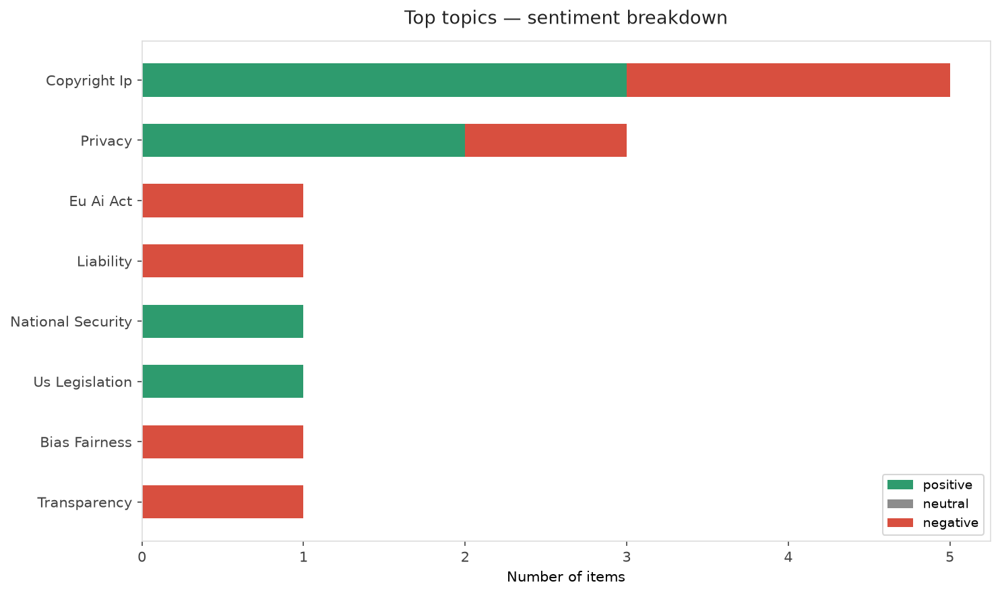
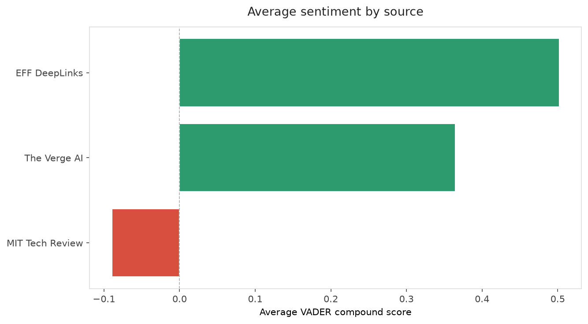
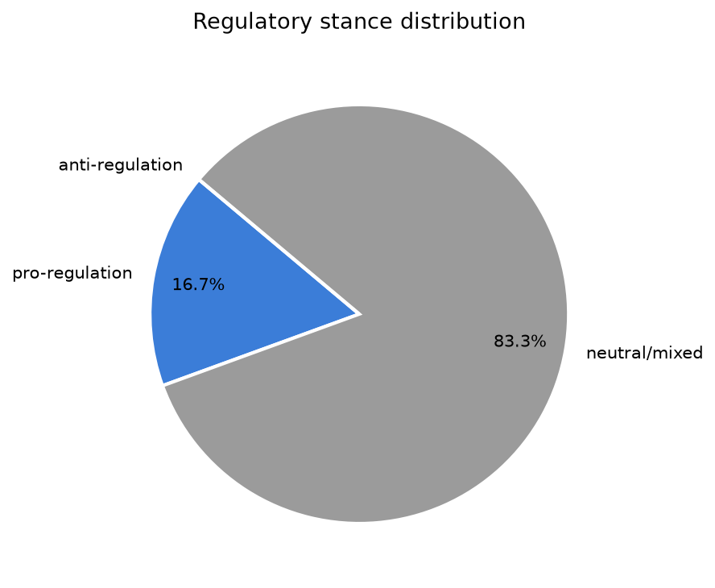
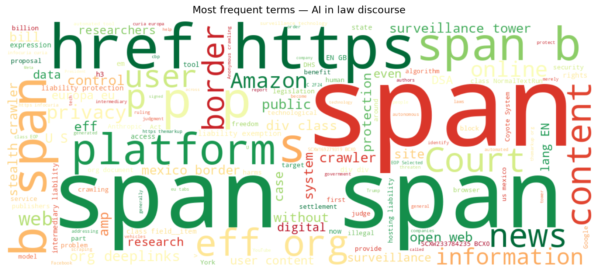
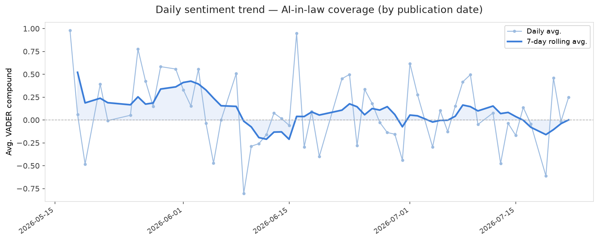
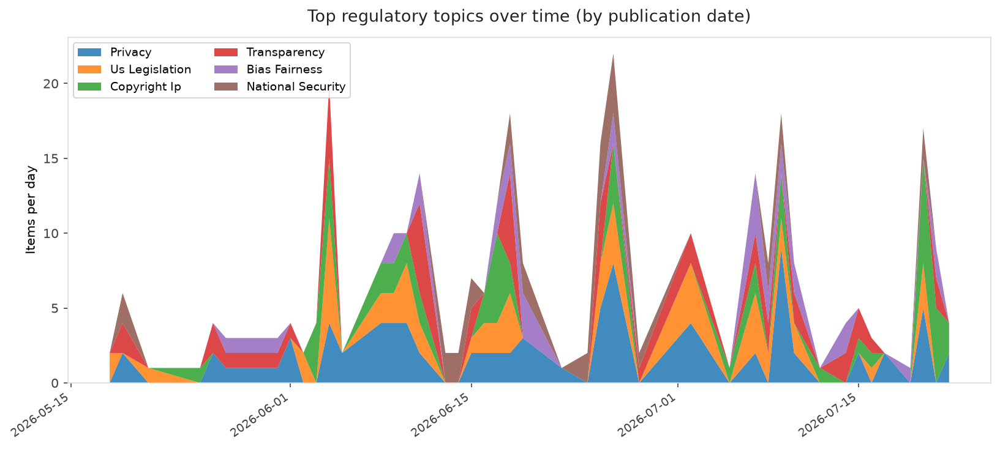
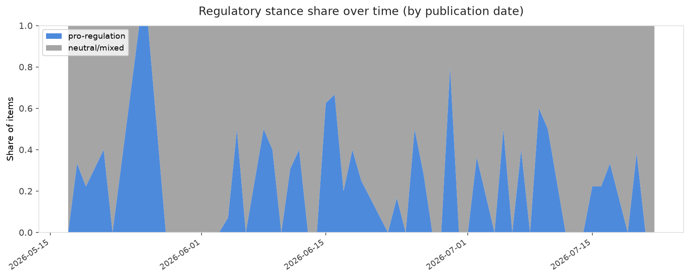

# AI in Law — Daily Sentiment Report
**Run date:** 2026-07-22 | **Items analyzed:** 12 | **Overall:** 🟢 Mildly positive (+0.201)

_Articles in this report were published between **2026-07-20** and **2026-07-22**._

---

## Summary

Today's collection covers **12** items from news outlets, academic preprints, Reddit, and regulatory sources.
Compared to the historical average of **+0.282**, today's sentiment is ↓ **0.081** points lower.

| Metric | Value |
|--------|-------|
| Positive items | 8 (66.7%) |
| Neutral items  | 0 (0.0%) |
| Negative items | 4 (33.3%) |
| Avg. VADER compound | +0.2007 |
| Pro-regulation items | 2 |
| Anti-regulation items | 0 |

---

## Top Topics Today

- **Copyright Ip** — 5 items
- **Privacy** — 3 items
- **Eu Ai Act** — 1 items
- **Liability** — 1 items
- **National Security** — 1 items

---

## Most Positive Coverage

- [“Stealth Crawlers” Are Not a Threat to the Open Web. Bills Targeting Them Would Be.](https://www.eff.org/deeplinks/2026/07/stealth-crawlers-are-not-threat-open-web-bills-targeting-them-would-be)  
  _EFF DeepLinks_ — VADER: `+0.970`
- [An Explosion of Surveillance Towers is Coming to U.S. Borders, Costing Over $1 Billion](https://www.eff.org/deeplinks/2026/07/explosion-surveillance-towers-coming-us-borders-costing-over-1-billion)  
  _EFF DeepLinks_ — VADER: `+0.877`
- [Utility companies promise to spare us from AI’s energy bill](https://www.theverge.com/ai-artificial-intelligence/969137/us-utility-ai-electricty-data-center-rate-pledge-trump)  
  _The Verge AI_ — VADER: `+0.813`

---

## Most Critical / Negative Coverage

- [AI-Powered Browsers Are Broadly Accurate News Summarizers That Reduce Political Bias and Negative Af](https://arxiv.org/abs/2607.18931v1)  
  _arXiv_ — VADER: `-0.968`
- [The Download: Chinese AI divides the White House, and a record copyright payout](https://www.technologyreview.com/2026/07/21/1140685/the-download-chinese-ai-divides-white-house-anthropic-copyright-settlement/)  
  _MIT Tech Review_ — VADER: `-0.772`
- [Here are the 30,000 songs Sony is suing Udio&#8217;s AI music generator over](https://www.theverge.com/tech/968375/sony-udio-lawsuit-songs-ai-copyright)  
  _The Verge AI_ — VADER: `-0.421`

---

## Visualizations — Today

## Visualizations — Trends Over Time

---

## Methodology

- **VADER** (Valence Aware Dictionary and sEntiment Reasoner) — compound score in [-1, 1].
- **Topic tagging** — regex keyword matching across 12 AI-law sub-domains.
- **Stance detection** — keyword-based pro/anti-regulation signal detection.
- **Date filter** — items are kept only if their *publication* date falls within the look-back window (default 2 days).
- Sources: RSS news feeds, arXiv academic API, Reddit (PRAW), Regulations.gov API.

_Generated automatically on 2026-07-22 12:27 UTC._
