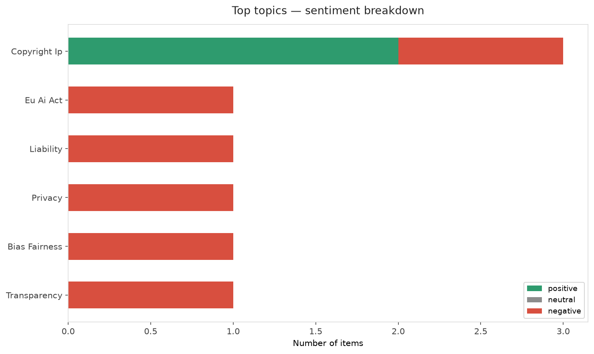
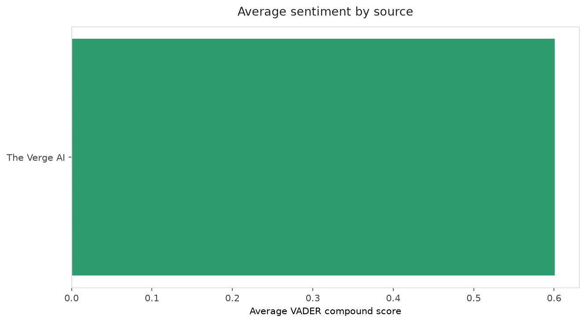
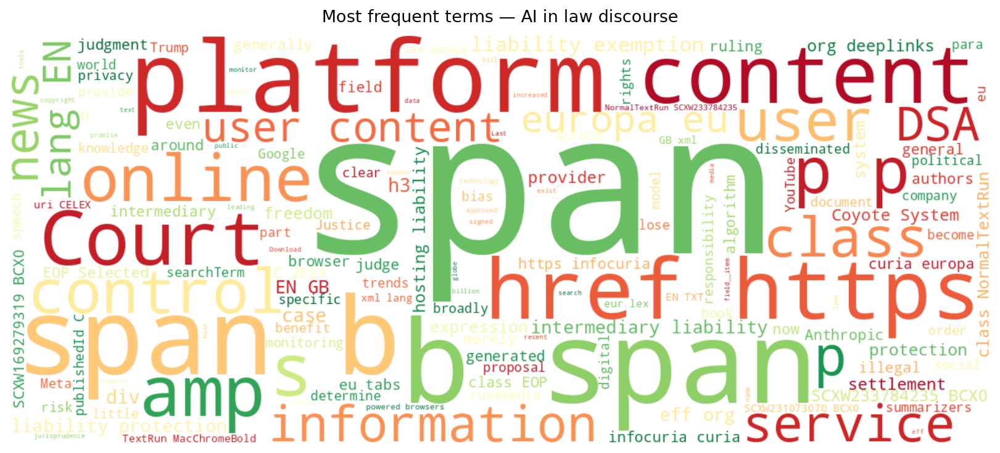
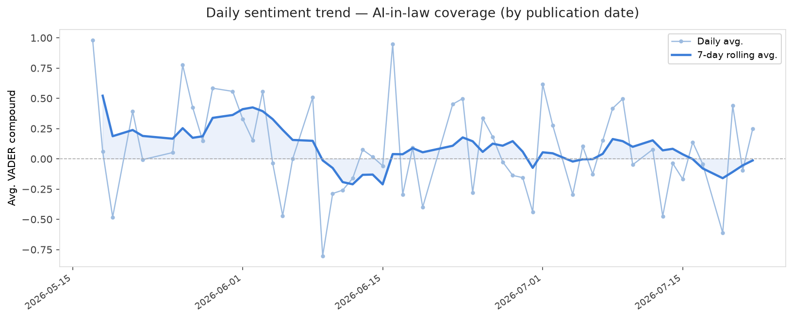
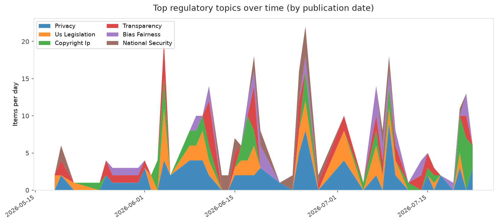
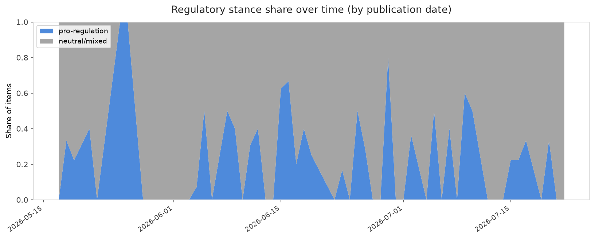

# AI in Law — Daily Sentiment Report
**Run date:** 2026-07-23 | **Items analyzed:** 7 | **Overall:** ⚪ Neutral / mixed (-0.007)

_Articles in this report were published between **2026-07-21** and **2026-07-22**._

---

## Summary

Today's collection covers **7** items from news outlets, academic preprints, Reddit, and regulatory sources.
Compared to the historical average of **+0.279**, today's sentiment is ↓ **0.286** points lower.

| Metric | Value |
|--------|-------|
| Positive items | 4 (57.1%) |
| Neutral items  | 0 (0.0%) |
| Negative items | 3 (42.9%) |
| Avg. VADER compound | -0.0072 |
| Pro-regulation items | 0 |
| Anti-regulation items | 0 |

---

## Top Topics Today

- **Copyright Ip** — 3 items
- **Eu Ai Act** — 1 items
- **Liability** — 1 items
- **Privacy** — 1 items
- **Bias Fairness** — 1 items

---

## Most Positive Coverage

- [Utility companies promise to spare us from AI’s energy bill](https://www.theverge.com/ai-artificial-intelligence/969137/us-utility-ai-electricty-data-center-rate-pledge-trump)  
  _The Verge AI_ — VADER: `+0.813`
- [Anthropic’s $1.5 billion book piracy settlement approved by judge](https://www.theverge.com/ai-artificial-intelligence/968724/anthropic-authors-settlement-ai-copyright-approved)  
  _The Verge AI_ — VADER: `+0.718`
- [Meta made its own AI detection system. It should have just used Google’s](https://www.theverge.com/tech/968680/meta-ai-detection-labeling-content-seal-watermarks-synthid)  
  _The Verge AI_ — VADER: `+0.273`

---

## Most Critical / Negative Coverage

- [AI-Powered Browsers Are Broadly Accurate News Summarizers That Reduce Political Bias and Negative Af](https://arxiv.org/abs/2607.18931v1)  
  _arXiv_ — VADER: `-0.968`
- [The Download: Chinese AI divides the White House, and a record copyright payout](https://www.technologyreview.com/2026/07/21/1140685/the-download-chinese-ai-divides-white-house-anthropic-copyright-settlement/)  
  _MIT Tech Review_ — VADER: `-0.772`
- [New EU Court of Justice Ruling on Platform Liability Could Cause Collateral Damage to Freedom of Exp](https://www.eff.org/deeplinks/2026/07/new-eu-court-justice-ruling-platform-liability-could-cause-collateral-damage)  
  _EFF DeepLinks_ — VADER: `-0.341`

---

## Visualizations — Today

## Visualizations — Trends Over Time

---

## Methodology

- **VADER** (Valence Aware Dictionary and sEntiment Reasoner) — compound score in [-1, 1].
- **Topic tagging** — regex keyword matching across 12 AI-law sub-domains.
- **Stance detection** — keyword-based pro/anti-regulation signal detection.
- **Date filter** — items are kept only if their *publication* date falls within the look-back window (default 2 days).
- Sources: RSS news feeds, arXiv academic API, Reddit (PRAW), Regulations.gov API.

_Generated automatically on 2026-07-23 12:27 UTC._
